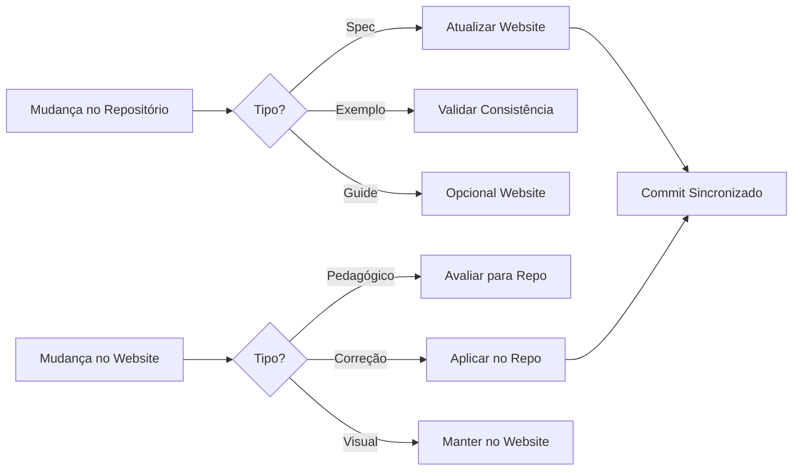

# Plano de Consolidação Website ↔ Repositório

**Data de Criação:** 2025-10-05
**Versão do Plano:** 1.0.0
**Status:** Em Execução
**Objetivo:** Sincronizar e consolidar conteúdo entre website e repositório principal do Matrix Protocol

## Índice

1. [Contexto e Decisões Fundamentais](#contexto-e-decisões-fundamentais)
2. [Fase 1: Correções Urgentes](#fase-1-correções-urgentes)
3. [Fase 2: Integração de Conteúdo](#fase-2-integração-de-conteúdo)
4. [Fase 3: Estratégia de Referências Cruzadas](#fase-3-estratégia-de-referências-cruzadas)
5. [Fase 4: Processo de Sincronização](#fase-4-processo-de-sincronização)
6. [Fase 5: Documentação de Decisões](#fase-5-documentação-de-decisões)
7. [Cronograma e Métricas](#cronograma-e-métricas)
8. [Anexos](#anexos)

---

## Contexto e Decisões Fundamentais

### Decisões Tomadas

| Decisão | Justificativa | Impacto |
|---------|--------------|---------|
| **Versão: v0.0.1 Beta** | Protocolo ainda não foi implementado em produção | Todas as especificações devem usar v0.0.1 Beta |
| **MAL Status: Active** | Especificação está completa, "Draft" foi erro | Corrigir status em MAL_MATRIX_ARBITER_LAYER.md |
| **Repositórios Separados** | Manter website e specs separados (por enquanto) | Necessário estratégia de sincronização |
| **Formato UKI: scope-first** | `uki:[scope_ref]:[type_ref]:[slug]` é correto | Corrigir MEF linha 64 |

### Princípios Guia

1. **Fonte de Verdade Clara**: Repositório para specs técnicas, website para pedagogia
2. **Sincronização Bidirecional**: Melhorias fluem em ambas direções
3. **Preservar o Melhor**: Combinar rigor técnico com acessibilidade
4. **Versionamento Consistente**: Mesma versão em todos os lugares

---

## Fase 1: Correções Urgentes

**Prazo:** Imediato
**Prioridade:** 🔴 CRÍTICA

### 1.1 Atualização de Versões

#### Arquivos a Modificar

| Arquivo | Mudança | Linha |
|---------|---------|-------|
| MATRIX_PROTOCOL.md | v1.0.0 → v0.0.1 | Linha ~3 |
| | Stable → Beta | Linha ~4 |
| MEP_MATRIX_EPISTEMIC_PRINCIPLE.md | v1.0.0 → v0.0.1 | Linha ~3 |
| | Stable → Beta | Linha ~4 |
| MEF_MATRIX_EMBEDDING_FRAMEWORK.md | v1.0.0 → v0.0.1 | Linha ~3 |
| | Stable → Beta | Linha ~4 |
| ZOF_ZION_ORCHESTRATION_FRAMEWORK.md | v1.0.0 → v0.0.1 | Linha ~3 |
| | Stable → Beta | Linha ~4 |
| OIF_OPERATOR_INTELLIGENCE_FRAMEWORK.md | v1.0.0 → v0.0.1 | Linha ~3 |
| | Stable → Beta | Linha ~4 |
| MOC_MATRIX_ONTOLOGY_CATALOG.md | v1.0.0 → v0.0.1 | Linha ~3 |
| | Stable → Beta | Linha ~4 |
| MAL_MATRIX_ARBITER_LAYER.md | v1.0.0 → v0.0.1 | Linha ~3 |
| | Draft → Active | Linha ~4 |
| MATRIX_PROTOCOL_GLOSSARY.md | v1.0.0 → v0.0.1 | Linha ~3 |
| | Stable → Beta | Linha ~4 |
| MATRIX_PROTOCOL_INTEGRATION_DIAGRAM.md | v1.0.0 → v0.0.1 | Linha ~3 |
| | Stable → Beta | Linha ~4 |
| Ontology_MEF_Support.md | Stable → Beta | Linha ~4 |

#### Template de Cabeçalho Padrão

```markdown
# [Nome do Framework]

**Version:** 0.0.1
**Status:** Beta
**Last Updated:** 2025-10-05
```

Exceção para MAL:
```markdown
# Matrix Arbiter Layer (MAL)

**Version:** 0.0.1
**Status:** Active
**Last Updated:** 2025-10-05
```

### 1.2 Correções Técnicas Críticas

#### A. Formato UKI (MEF_MATRIX_EMBEDDING_FRAMEWORK.md)

**Linha 64 - ANTES:**
```yaml
id: Unique identifier in format uki:[domain_ref]:[type_ref]:[slug]
```

**Linha 64 - DEPOIS:**
```yaml
id: Unique identifier in format uki:[scope_ref]:[type_ref]:[slug]
```

**Linha 129 - Atualizar exemplo:**
```yaml
# ANTES
id: uki:technical:pattern:jwt-authentication

# DEPOIS
id: uki:squad-payments:pattern:jwt-authentication
```

#### B. Níveis MOC (examples/knowledge-comparison/MOC_SQUAD_PAYMENTS.yaml)

**Corrigir hierarquia de níveis:**

```yaml
# ANTES (INCORRETO)
- id: "organization"
  level: 0

- id: "tribe-commerce"
  level: 1  # ERRO: mesmo nível que squad
  parent: "organization"

- id: "squad-payments"
  level: 1  # ERRO: mesmo nível que tribe
  parent: "tribe-commerce"

# DEPOIS (CORRETO)
- id: "organization"
  level: 0  # Raiz

- id: "tribe-commerce"
  level: 1  # Nível intermediário
  parent: "organization"

- id: "squad-payments"
  level: 2  # Nível mais específico
  parent: "tribe-commerce"
```

#### C. Clarificar Cross-Scope vs Cross-Domain (ZOF)

**Linha 116 - Título da Seção:**
```markdown
# ANTES
### Multi-scope Cross-domain Enrichment (Normative)

# DEPOIS
### Multi-scope Enrichment with Domain Validation (Normative)
```

### 1.3 Criar Arquivo Faltante

#### MATRIX_PROTOCOL_INTEGRATION_DIAGRAM.md

Se o arquivo não existir, criar com conteúdo básico:

```markdown
# Matrix Protocol Integration Diagram

**Version:** 0.0.1
**Status:** Beta
**Last Updated:** 2025-10-05

## Overview

This document illustrates the integration patterns between all Matrix Protocol frameworks.

## Cross-Framework Integration Flow

[Adicionar diagrama Mermaid do website]

## Framework Dependencies

- MEF ↔ ZOF: Knowledge consumption and enrichment
- ZOF → MAL: Conflict resolution invocation
- MAL → MEF: Decision record persistence
- OIF ↔ All: Archetype interactions
- MOC ← All: Authority validation

[Expandir com detalhes]
```

---

## Fase 2: Integração de Conteúdo

**Prazo:** 1 semana
**Prioridade:** 🟡 ALTA

### 2.1 Website → Repositório

#### A. Criar Estrutura de Diretórios

```bash
matrix-protocol/
├── guides/                           # NOVO
│   ├── QUICK_START.md               # Do website
│   ├── IMPLEMENTATION_ROADMAP.md    # Do website
│   └── COMMON_PITFALLS.md          # Do website
│
├── visualizations/                  # NOVO
│   ├── mal-arbitration-flow.md     # Diagramas do website
│   ├── moc-hierarchies.md          # Diagramas do website
│   ├── oif-access-control.md       # Diagramas do website
│   └── zof-canonical-states.md     # Diagramas do website
│
└── templates/                       # NOVO
    ├── moc/
    │   ├── startup.yaml            # 5-50 funcionários
    │   ├── scaleup.yaml           # 50-200 funcionários
    │   ├── enterprise.yaml        # 200-1000 funcionários
    │   └── corporation.yaml       # 1000+ funcionários
    └── uki/
        └── basic-template.yaml
```

#### B. Conteúdo a Extrair do Website

| Origem (Website) | Destino (Repositório) | Tipo |
|-----------------|----------------------|------|
| `/content/en/quickstart/index.md` | `/guides/QUICK_START.md` | Guia prático |
| `/content/en/implementation/index.md` | `/guides/IMPLEMENTATION_ROADMAP.md` | Roadmap |
| `/public/downloads/MATRIX_PROTOCOL_IMPLEMENTATION_GUIDE_PT.md` | `/guides/IMPLEMENTATION_GUIDE_FULL.md` | Manual completo |
| `/public/downloads/examples/TECHCORP_ORGANIZATIONAL_EXAMPLE.md` | `/examples/organizational/techcorp-case.md` | Case study |
| Diagramas Mermaid diversos | `/visualizations/` | Visualizações |
| `/public/downloads/templates/` | `/templates/` | Templates MOC |

### 2.2 Repositório → Website

#### A. Conteúdo a Adicionar no Website

| Origem (Repositório) | Destino (Website) | Ação |
|---------------------|------------------|------|
| MEF Seção 5 (UKI Lifecycle) | `/content/en/frameworks/mef.md` | Adicionar seção completa |
| ZOF Universal Pattern | `/content/en/frameworks/zof.md` | Adicionar texto do padrão |
| Integration Diagram | `/content/en/integration/index.md` | Sincronizar com novo arquivo |
| Exemplos YAML corretos | `/content/en/examples/` | Atualizar com correções |

#### B. Seções Específicas a Sincronizar

**MEF Section 5 - UKI Lifecycle:**
```yaml
lifecycle_states:
  draft:
    version_pattern: "0.x.x"
    validation_required: false
  in_review:
    version_pattern: "0.x.x"
    validation_required: true
  validated:
    requires: "domain expert approval"
  published:
    version_pattern: "1.x.x+"
    immutable: true
  deprecated:
    replacement_required: true
  archived:
    read_only: true
```

**ZOF Universal Pattern:**
```
EVENT → QUERY ORACLE → DECISION → ACTION → EVALUATE IF WORTH TEACHING → (TEACH)
```

---

## Fase 3: Estratégia de Referências Cruzadas

**Prazo:** 1 semana
**Prioridade:** 🟢 MÉDIA

### 3.1 Padrões de Referência

#### A. No Repositório

```markdown
# Referências internas
See [MEF Specification](./MEF_MATRIX_EMBEDDING_FRAMEWORK.md)

# Referência ao website
<!-- For interactive version, see https://matrix-protocol.org/frameworks/mef -->

# Referência a seções
See [Section 5: UKI Lifecycle](./MEF_MATRIX_EMBEDDING_FRAMEWORK.md#5-uki-lifecycle)
```

#### B. No Website

```markdown
# Referências internas do site
See [MEF Framework](/frameworks/mef)

# Referência ao repositório
View source specification on [GitHub](https://github.com/user/matrix-protocol/blob/main/MEF_MATRIX_EMBEDDING_FRAMEWORK.md)

# Referência a downloads
Download [Complete Implementation Guide](/downloads/implementation-guide)
```

### 3.2 Mapeamento de Correspondências

Criar arquivo `NAVIGATION_MAP.md`:

| Repositório | Website | Tipo |
|------------|---------|------|
| `/MATRIX_PROTOCOL.md` | `/protocol` | Especificação principal |
| `/MEP_MATRIX_EPISTEMIC_PRINCIPLE.md` | `/mep` | Manifesto epistemológico |
| `/MEF_MATRIX_EMBEDDING_FRAMEWORK.md` | `/frameworks/mef` | Framework |
| `/ZOF_ZION_ORCHESTRATION_FRAMEWORK.md` | `/frameworks/zof` | Framework |
| `/OIF_OPERATOR_INTELLIGENCE_FRAMEWORK.md` | `/frameworks/oif` | Framework |
| `/MOC_MATRIX_ONTOLOGY_CATALOG.md` | `/frameworks/moc` | Framework |
| `/MAL_MATRIX_ARBITER_LAYER.md` | `/frameworks/mal` | Framework |
| `/guides/QUICK_START.md` | `/quickstart` | Guia |
| `/examples/` | `/downloads/examples` | Exemplos |

### 3.3 Estratégia de Links

1. **Links Quebrados**: Criar script de validação
2. **Links Relativos**: Preferir sempre que possível
3. **Links Absolutos**: Apenas para referências externas
4. **Âncoras**: Usar IDs consistentes em headers

---

## Fase 4: Processo de Sincronização

**Prazo:** 2 semanas
**Prioridade:** 🟢 MÉDIA

### 4.1 Workflow de Sincronização



### 4.2 Checklist de Sincronização

#### Ao Modificar Especificação (Repositório):

- [ ] Atualizar versão se necessário
- [ ] Verificar cross-references
- [ ] Atualizar website correspondente
- [ ] Testar links no website
- [ ] Documentar mudança no CHANGELOG
- [ ] Criar PR com tag `sync-required`

#### Ao Modificar Website:

- [ ] Verificar se afeta especificação
- [ ] Se sim, criar issue no repositório
- [ ] Atualizar navigation map se necessário
- [ ] Testar build do website
- [ ] Documentar em changelog do website

### 4.3 Arquivo SYNC_GUIDE.md

```markdown
# Guia de Sincronização Website ↔ Repositório

## Arquivos que DEVEM estar sincronizados

### Especificações Core
- Todos os frameworks (MEF, ZOF, OIF, MOC, MAL, MEP)
- Versão e status devem ser idênticos
- Normative sections devem ser idênticas

### Conteúdo que PODE divergir
- Frontmatter (Hugo metadata)
- Exemplos expandidos no website
- Visualizações interativas
- Guias pedagógicos

## Processo de Sincronização

1. **Daily Check**: Verificar divergências
2. **Weekly Sync**: Reunião de sincronização
3. **Monthly Review**: Revisão completa de consistência

## Ferramentas

- Script: `scripts/check-sync.sh`
- CI/CD: GitHub Actions workflow
- Dashboard: Status page no website
```

### 4.4 Responsabilidades

| Papel | Responsabilidade |
|-------|-----------------|
| **Maintainer Specs** | Garantir correção técnica das especificações |
| **Maintainer Website** | Garantir acessibilidade e pedagogia |
| **Sync Coordinator** | Executar sincronizações semanais |
| **Community** | Reportar inconsistências via issues |

---

## Fase 5: Documentação de Decisões

**Prazo:** Paralelo às outras fases
**Prioridade:** 🟡 ALTA

### 5.1 Criar CHANGELOG.md

```markdown
# Changelog

## [0.0.1-beta] - 2025-10-05

### Decisões Fundamentais
- Estabelecida versão v0.0.1 Beta para todo o protocolo
- Justificativa: Protocolo ainda não implementado em produção
- MAL status corrigido de "Draft" para "Active"
- Formato UKI padronizado: `uki:[scope_ref]:[type_ref]:[slug]`

### Correções
- [MEF] Corrigido formato UKI na linha 64
- [MOC] Corrigidos níveis hierárquicos no exemplo squad-payments
- [MAL] Status atualizado para Active
- [ALL] Versões atualizadas para v0.0.1 Beta

### Adições
- Criado CONSOLIDATION_PLAN.md
- Criado SYNC_GUIDE.md
- Criado NAVIGATION_MAP.md
- Adicionado diretório /guides/
- Adicionado diretório /visualizations/
- Adicionado diretório /templates/

### Website
- Sincronizado com versão v0.0.1 Beta
- Adicionada MEF Section 5 (UKI Lifecycle)
- Adicionado ZOF Universal Pattern
```

### 5.2 Atualizar README.md

Adicionar seção sobre sincronização:

```markdown
## Sincronização com Website

Este repositório mantém sincronização com o website oficial em matrix-protocol.org.

- **Especificações**: Fonte de verdade está neste repositório
- **Guias e Tutoriais**: Podem ter versões expandidas no website
- **Versão Atual**: v0.0.1 Beta
- **Status**: Em desenvolvimento ativo

Para detalhes sobre sincronização, veja [SYNC_GUIDE.md](./SYNC_GUIDE.md).
```

### 5.3 Comunicação

#### Issue Template para Inconsistências

```markdown
---
name: Inconsistência Website-Repositório
about: Reportar divergência entre website e repositório
title: '[SYNC] '
labels: 'sync-required'
---

## Descrição da Inconsistência

## Localização
- Repositório: [arquivo e linha]
- Website: [URL e seção]

## Conteúdo Divergente
- Repositório diz:
- Website diz:

## Impacto
- [ ] Crítico - Afeta implementação
- [ ] Alto - Confunde usuários
- [ ] Médio - Inconsistência menor
- [ ] Baixo - Cosmético

## Sugestão de Correção
```

---

## Cronograma e Métricas

### Cronograma

| Fase | Início | Fim | Status |
|------|--------|-----|--------|
| **Fase 1: Correções Urgentes** | 2025-10-05 | 2025-10-06 | 🔴 Em Andamento |
| **Fase 2: Integração Conteúdo** | 2025-10-07 | 2025-10-13 | ⏳ Aguardando |
| **Fase 3: Referências Cruzadas** | 2025-10-14 | 2025-10-20 | ⏳ Aguardando |
| **Fase 4: Processo Sincronização** | 2025-10-21 | 2025-11-03 | ⏳ Aguardando |
| **Fase 5: Documentação** | 2025-10-05 | 2025-11-03 | 🟡 Paralelo |

### Métricas de Sucesso

#### Fase 1 ✓
- [ ] 100% arquivos com v0.0.1 Beta
- [ ] MAL com status Active
- [ ] Formato UKI corrigido
- [ ] Níveis MOC corretos

#### Fase 2 ✓
- [ ] Guias criados em `/guides/`
- [ ] Visualizações em `/visualizations/`
- [ ] Templates em `/templates/`
- [ ] Website com seções faltantes

#### Fase 3 ✓
- [ ] Navigation map completo
- [ ] 0 links quebrados
- [ ] Padrões documentados

#### Fase 4 ✓
- [ ] SYNC_GUIDE.md criado
- [ ] Processo estabelecido
- [ ] Responsabilidades definidas

#### Fase 5 ✓
- [ ] CHANGELOG.md atualizado
- [ ] README.md atualizado
- [ ] Issues templates criados

### Indicadores de Qualidade

| Indicador | Meta | Atual |
|-----------|------|-------|
| Consistência de Versão | 100% | 0% |
| Links Funcionais | 100% | ~70% |
| Seções Sincronizadas | 100% | ~60% |
| Documentação Completa | 100% | ~40% |

---

## Anexos

### Anexo A: Lista de Contradições Encontradas

1. **MAL Status**: Draft (repo) vs Active (website)
2. **Versão**: 1.0.0 (repo) vs 0.0.1 (website)
3. **Formato UKI**: domain-first (MEF) vs scope-first (exemplos)
4. **Níveis MOC**: squad=1, tribe=1 (incorreto)
5. **MEF Lifecycle**: 3 estados (repo) vs 6 estados (mencionado)
6. **Cross-domain vs Cross-scope**: Terminologia inconsistente

### Anexo B: Decisões de Design

| Decisão | Razão | Alternativa Rejeitada |
|---------|-------|---------------------|
| Manter repos separados | Flexibilidade inicial | Unificar imediatamente |
| v0.0.1 Beta | Protocolo não implementado | v1.0.0 prematura |
| Scope-first em UKIs | Alinhamento com MOC | Domain-first confuso |
| MAL Active | Especificação completa | Draft incorreto |

### Anexo C: Arquivos Críticos

#### Especificações Core (10 arquivos)
1. MATRIX_PROTOCOL.md
2. MEP_MATRIX_EPISTEMIC_PRINCIPLE.md
3. MEF_MATRIX_EMBEDDING_FRAMEWORK.md
4. ZOF_ZION_ORCHESTRATION_FRAMEWORK.md
5. OIF_OPERATOR_INTELLIGENCE_FRAMEWORK.md
6. MOC_MATRIX_ONTOLOGY_CATALOG.md
7. MAL_MATRIX_ARBITER_LAYER.md
8. MATRIX_PROTOCOL_GLOSSARY.md
9. MATRIX_PROTOCOL_INTEGRATION_DIAGRAM.md
10. Ontology_MEF_Support.md

#### Exemplos Críticos
- examples/knowledge-comparison/MOC_SQUAD_PAYMENTS.yaml
- examples/knowledge-comparison/structured/*

### Anexo D: Scripts de Validação

```bash
#!/bin/bash
# check-versions.sh
# Verifica se todas as versões estão em v0.0.1 Beta

for file in *.md; do
    version=$(grep "Version:" "$file" | head -1)
    status=$(grep "Status:" "$file" | head -1)

    if [[ ! "$version" =~ "0.0.1" ]]; then
        echo "❌ $file: versão incorreta: $version"
    fi

    if [[ ! "$status" =~ "Beta" ]] && [[ ! "$file" =~ "MAL" ]]; then
        echo "❌ $file: status incorreto: $status"
    fi
done
```

---

## Próximos Passos Imediatos

1. **Executar Fase 1**: Correções urgentes de versão e status
2. **Criar branches**: `consolidation-phase-1`, `consolidation-phase-2`, etc.
3. **Setup CI/CD**: Configurar validação automática
4. **Comunicar mudanças**: Criar announcement para comunidade

## Considerações Futuras

### Possível Unificação de Repositórios

Após sucesso da consolidação, considerar:
- Incorporar website no repositório principal
- Estrutura unificada sob `/website/`
- Build e deploy automáticos
- Simplificação de manutenção

**Decisão pendente para Q1 2026**

---

**Documento mantido por:** Matrix Protocol Core Team
**Última atualização:** 2025-10-05
**Próxima revisão:** 2025-10-13 (após Fase 2)