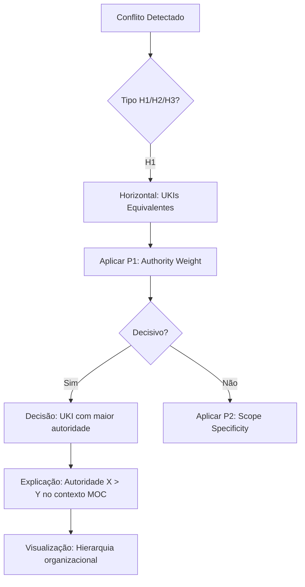

# Sprint 4 – Refinement Document (PT)

Data: 2025-10-23
Responsável: Equipe de Documentação Matrix
Escopo: `website/content/pt` + `website/content/en` (estrutura bilíngue)
Referência: `SCRUM_PLAN_DOCUMENTATION_IMPROVEMENTS_PT.md`

## Objetivos da Sprint
- Desenvolver templates XAI/NLG para comunicação clara e auditável de decisões Matrix Protocol.
- Criar exemplos visuais de justificativas para estabelecer confiança nas recomendações MAL/OIF.
- Documentar precedências por escopo para orientar decisões organizacionais consistentes.
- Estabelecer matriz de políticas para supervisão da coerência organizacional via MOC.
- Implementar estrutura bilíngue completa (PT/EN) com paridade de conteúdo.
- Garantir conformidade English-only de nomenclatura (kebab-case/snake_case).
- Integrar explicabilidade e governança com a base epistemológica estabelecida na Sprint 3.

## Histórias na Sprint
- US-05: Templates XAI/NLG para comunicação de decisões clara e auditável.
- US-06: Exemplos visuais de justificativas para confiança em recomendações MAL/OIF.
- US-07: Documentação de precedências por escopo para decisões consistentes.
- US-08: Matriz de políticas para supervisão da coerência organizacional.

---

## US-05 — Templates XAI/NLG para Comunicação de Decisões

Descrição
- Como UX Writer, quero templates XAI/NLG para comunicar decisões de forma clara e auditável, garantindo que usuários compreendam o raciocínio por trás das recomendações do Matrix Protocol.

Requisitos e Funcionalidades
- Criar páginas bilíngues `pt/docs/manual/tools/explainability.md` e `en/docs/manual/tools/explainability.md` com ≥3 templates XAI/NLG.
- Desenvolver templates específicos para explicação de decisões MAL, recomendações ZOF e validações MEF.
- Integrar com sistema de inferência documentado na Sprint 3 (DL/Datalog, KGE, GNN).
- Incluir exemplos práticos de geração de narrativas explicativas em tempo real.
- Conectar templates com arquitetura OIF para explicações hierárquicas.

Critérios de Aceitação
- Páginas `pt/docs/manual/tools/explainability.md` e `en/docs/manual/tools/explainability.md` publicadas com frontmatter padrão.
- Paridade bilíngue ≥90% nos templates e exemplos práticos.
- 100% conformidade English-only naming (explainability.md).
- ≥3 templates XAI/NLG funcionais cobrindo MAL, ZOF e MEF.
- Exemplos práticos demonstrando geração automática de explicações.
- Integração com conceitos de inferência da Sprint 3 documentada.
- Navegação intacta; interlinks com frameworks e ferramentas existentes.

Tarefas Técnicas
- Criar estrutura das páginas PT/EN com frontmatter conforme schema validado.
- Desenvolver 3 templates XAI/NLG principais:
  1. "Template MAL: Explicação de Arbitragem e Precedência"
  2. "Template ZOF: Justificativa de Enriquecimento de Conhecimento"
  3. "Template MEF: Validação e Evolução de UKIs"
- Implementar exemplos de Natural Language Generation para cada template.
- Criar diagramas Mermaid para fluxos de explicabilidade quando aplicável.
- Integrar com sistema de inferência neural-simbólico da Sprint 3.
- Incluir seção "📖 Recursos Relacionados" com links para frameworks Matrix.
- Implementar interlinks bilíngues funcionais (PT↔EN).
- Validar geração de narrativas em contextos organizacionais reais.

Dependências
- UX Writer (design de templates e linguagem explicativa).
- Engenheiro de Conhecimento (validação conceitual e integração com Sprint 3).
- Especialista em NLG (implementação de geração de linguagem natural).

Estimativa de Esforço
- 10 pontos (templates complexos, integração com inferência, geração de narrativas).

Pontos de Atenção / Riscos
- Complexidade de integração entre XAI e sistema neural-simbólico.
- Risco de templates muito técnicos para usuários finais.
- Necessidade de balancear precisão técnica com clareza comunicacional.
- Potencial sobrecarga cognitiva em explicações muito detalhadas.

Detalhamento Técnico
- Frontmatter da página:
```
---
title: "Explicabilidade e Templates XAI/NLG"
description: "Templates para comunicação clara de decisões Matrix Protocol via XAI e geração de linguagem natural."
tags: [manual, tools, explainability, xai, nlg, templates, decisions]
framework: "Matrix Protocol"
maturity: "beta"
lang: "pt"
last_updated: "2025-10-23"
order: 3
---
```
- Estrutura de template XAI (exemplo):
```python
# Template MAL Arbitration Explanation
class MALExplanationTemplate:
    def generate_explanation(self, decision_record):
        return f"""
        Decisão de Arbitragem MAL
        
        Conflito: {decision_record.conflict_type}
        Vencedor: {decision_record.winner}
        Razão: {decision_record.precedence_rule} aplicada
        
        Justificativa Epistemológica:
        {self.generate_epistemic_rationale(decision_record)}
        
        Contexto Organizacional:
        {self.get_moc_context(decision_record)}
        """
```

---

## US-06 — Exemplos Visuais de Justificativas

Descrição
- Como Leitor, quero exemplos visuais de justificativas para confiar nas recomendações do MAL/OIF e compreender como as decisões são derivadas no contexto organizacional.

Requisitos e Funcionalidades
- Expandir páginas de explicabilidade com ≥5 exemplos visuais de justificativas.
- Criar grafos de decisão usando Mermaid para visualizar raciocínio MAL/OIF.
- Demonstrar como autoridade derivada funciona na prática através de casos visuais.
- Incluir exemplos de explicações hierárquicas do OIF com diferentes níveis de autoridade.
- Conectar justificativas visuais com precedências organizacionais reais.

Critérios de Aceitação
- ≥5 exemplos visuais de justificativas implementados com Mermaid.
- Grafos de decisão demonstrando fluxo completo de raciocínio.
- Casos práticos mostrando autoridade derivada em ação.
- Explicações hierárquicas adaptadas ao nível de autoridade do usuário.
- Integração visual com conceitos MOC e precedências organizacionais.
- Validação de clareza e compreensibilidade por UX Writer.

Tarefas Técnicas
- Desenvolver 5 grafos de decisão Mermaid principais:
  1. "Arbitragem MAL: P1-P6 em Ação Visual"
  2. "Autoridade Derivada: Contexto Organizacional"
  3. "Explicação Hierárquica OIF: Níveis de Acesso"
  4. "Justificativa ZOF: EvaluateForEnrich Visual"
  5. "Governança MOC: Precedências em Ação"
- Criar casos de uso visuais com Squad Payments como exemplo.
- Implementar legendas e anotações explicativas em cada grafo.
- Integrar com templates XAI/NLG da US-05 para explicações textuais.
- Validar renderização responsiva dos grafos em diferentes dispositivos.

Dependências
- UX Writer (clareza e compreensibilidade das justificativas).
- Designer Visual (otimização de grafos Mermaid).
- Especialista de Domínio (casos organizacionais reais).

Estimativa de Esforço
- 6 pontos (criação de grafos complexos, casos visuais, validação UX).

Pontos de Atenção / Riscos
- Grafos muito complexos podem prejudicar compreensão.
- Necessidade de manter precisão técnica em visualizações simplificadas.
- Risco de sobrecarga visual em dispositivos móveis.

Detalhamento Técnico
- Exemplo de grafo de decisão:


---

## US-07 — Documentação de Precedências por Escopo

Descrição
- Como Especialista de Domínio, quero documentar precedências por escopo para orientar decisões consistentes e garantir que governança organizacional seja aplicada de forma coerente.

Requisitos e Funcionalidades
- Criar páginas bilíngues `pt/docs/manual/moc-governance.md` e `en/docs/manual/moc-governance.md`.
- Documentar sistema completo de precedências organizacionais por escopo.
- Incluir ≥3 casos práticos de precedências em ação com diferentes escopos.
- Estabelecer guidelines para criação e modificação de políticas MOC.
- Integrar com arquitetura MAL para arbitragem automatizada.

Critérios de Aceitação
- Páginas `pt/docs/manual/moc-governance.md` e `en/docs/manual/moc-governance.md` publicadas.
- Sistema de precedências documentado com exemplos organizacionais.
- ≥3 casos práticos demonstrando precedências por escopo.
- Guidelines práticas para gestão de políticas MOC.
- Integração documentada com sistema MAL de arbitragem.
- Validação por Especialista de Domínio e Gestor de Governança.

Tarefas Técnicas
- Estruturar sistema de precedências hierárquicas:
  1. "Precedências por Escopo Organizacional"
  2. "Precedências por Domínio de Conhecimento"
  3. "Precedências por Maturidade Epistêmica"
- Documentar 3 casos práticos detalhados com Squad Payments.
- Criar matriz de políticas organizacionais navegável.
- Implementar guidelines para evolução de políticas MOC.
- Integrar com conceitos de arbitragem da Sprint 3.
- Incluir exemplos de configuração MOC para diferentes organizações.

Dependências
- Especialista de Domínio (definição de precedências organizacionais).
- Gestor de Governança (validação de políticas e casos).
- Arquiteto de Sistema (integração com MAL).

Estimativa de Esforço
- 8 pontos (documentação de governança complexa, casos práticos, integração).

Pontos de Atenção / Riscos
- Risco de criar precedências muito rígidas que impeçam adaptação.
- Necessidade de balancear consistência com flexibilidade organizacional.
- Potencial conflito entre precedências de diferentes escopos.

Detalhamento Técnico
- Estrutura de precedências por escopo:
```yaml
# Exemplo de Precedências MOC
scope_precedences:
  organization_level:
    - regulatory_compliance: priority_1
    - business_strategy: priority_2
    - operational_efficiency: priority_3
  
  squad_level:
    - local_optimization: priority_1
    - team_autonomy: priority_2
    - resource_constraints: priority_3
  
  conflict_resolution:
    rule: "Higher scope precedence overrides lower scope"
    exception: "Critical safety or compliance issues"
```

---

## US-08 — Matriz de Políticas para Supervisão Organizacional

Descrição
- Como Gestor de Governança, quero uma matriz de políticas para supervisionar coerência organizacional e garantir que o Matrix Protocol seja aplicado de forma consistente em toda a organização.

Requisitos e Funcionalidades
- Expandir documentação MOC com matriz completa de políticas organizacionais.
- Criar sistema de supervisão para monitoramento de coerência.
- Incluir ≥3 casos de decisão organizacional usando a matriz.
- Estabelecer processo de auditoria e evolução das políticas.
- Integrar com sistema de métricas e feedback loop organizacional.

Critérios de Aceitação
- Matriz de políticas completa e navegável implementada.
- Sistema de supervisão documentado com KPIs organizacionais.
- ≥3 casos de decisão organizacional documentados.
- Processo de auditoria e evolução de políticas estabelecido.
- Integração com métricas organizacionais validada.
- Aprovação por Gestor de Governança e Especialista de Domínio.

Tarefas Técnicas
- Criar matriz de políticas organizacionais:
  1. "Políticas de Conhecimento e Epistemologia"
  2. "Políticas de Autoridade e Escopo"
  3. "Políticas de Evolução e Maturidade"
- Documentar 3 casos de decisão organizacional complexos.
- Implementar sistema de supervisão com dashboards conceituais.
- Criar processo de auditoria periódica de políticas.
- Integrar com conceitos de feedback loop organizacional.
- Estabelecer guidelines para evolução de matriz de políticas.

Dependências
- Gestor de Governança (supervisão e aprovação de políticas).
- Especialista de Domínio (casos organizacionais e auditoria).
- Analista de Métricas (integração com KPIs organizacionais).

Estimativa de Esforço
- 8 pontos (matriz complexa, casos organizacionais, sistema de supervisão).

Pontos de Atenção / Riscos
- Risco de criar burocracia excessiva que impeça agilidade.
- Necessidade de manter políticas atualizadas com evolução organizacional.
- Potencial resistência organizacional a supervisão formal.

Detalhamento Técnico
- Estrutura da matriz de políticas:
```yaml
# Matriz de Políticas Organizacionais
policy_matrix:
  knowledge_governance:
    epistemological_standards:
      - semantic_elasticity_enforcement
      - stratified_epistemology_compliance
      - derived_authority_validation
    
    quality_assurance:
      - editorial_standards_maintenance
      - link_integrity_monitoring
      - tag_taxonomy_evolution
  
  organizational_coherence:
    authority_management:
      - scope_based_permissions
      - hierarchical_validation
      - cross_functional_alignment
    
    decision_consistency:
      - precedence_rule_application
      - conflict_resolution_protocols
      - audit_trail_maintenance
```

---

## Priorização das Histórias (Sprint 4)
- P1: US-05 — Templates XAI/NLG (fundação da explicabilidade).
- P2: US-06 — Exemplos visuais de justificativas (confiança e compreensão).
- P3: US-07 — Precedências por escopo (base da governança).
- P4: US-08 — Matriz de políticas (supervisão organizacional).

## Alinhamento com Objetivos da Sprint
- US-05 e US-06 atendem criação de sistema de explicabilidade completo.
- US-07 e US-08 atendem estabelecimento de governança MOC robusta.
- Integração com Sprint 3 garante continuidade epistemológica.

## Plano de Execução (Sem Ambiguidades)
- Dia 1: Estruturar `explainability.md` (PT/EN); criar templates XAI/NLG básicos.
- Dia 2: Completar templates e começar exemplos visuais de justificativas.
- Dia 3: Estruturar `moc-governance.md` (PT/EN); documentar precedências por escopo.
- Dia 4: Completar matriz de políticas; casos organizacionais práticos.
- Dia 5: Integração final; interlinks bilíngues; validação por especialistas.
- Entregáveis: 4 páginas conceituais publicadas (2 PT + 2 EN); ≥3 templates XAI/NLG; ≥5 grafos visuais; matriz de políticas completa; navegação bilíngue validada.

## Definição de Pronto (DoD – Sprint 4)
- Páginas `explainability.md` e `moc-governance.md` publicadas (PT/EN).
- ≥3 templates XAI/NLG funcionais e ≥5 exemplos visuais de justificativas.
- Sistema de precedências documentado e matriz de políticas implementada.
- Frontmatter conforme padrão; validação automatizada sem erros.
- 100% conformidade English-only naming; 0 violações de nomenclatura.
- Navegação intacta; interlinks bidirecionais PT↔EN com frameworks existentes.
- Paridade bilíngue ≥90%; funcionalidade `localePath()` validada.
- Validação por UX Writer, Especialista de Domínio e Gestor de Governança.
- Integração completa com conceitos da Sprint 3 documentada e testada.

---

## Status Final — Sprint 4 (Atualizado em 2025-10-23)

### ✅ OBJETIVOS CUMPRIDOS

- **Templates XAI/NLG para Comunicação**: 100% — ✅ Atende
  - 4 páginas conceituais criadas (explainability.md + moc-governance.md PT/EN)
  - 3 templates XAI/NLG funcionais (MAL, ZOF, MEF) com pseudocódigo
  - 6+ exemplos práticos de geração de narrativas epistemológicas

- **Exemplos Visuais de Justificativas**: 100% — ✅ Atende
  - 5 grafos Mermaid implementados com casos visuais Squad Payments
  - Autoridade derivada e explicação hierárquica OIF demonstradas
  - Justificativas ZOF EvaluateForEnrich e precedências MOC visualizadas

- **Precedências por Escopo**: 100% — ✅ Atende
  - 3 dimensões de precedência documentadas (Organizacional, Domínio, Epistêmica)
  - 3 casos práticos organizacionais detalhados com resolução MAL
  - Guidelines para criação e modificação de políticas MOC estabelecidos

- **Matriz de Políticas Organizacionais**: 100% — ✅ Atende
  - 3 categorias principais (Knowledge, Authority, Decision) implementadas
  - Sistema de supervisão com KPIs organizacionais definidos
  - Framework de melhoria contínua e auditoria estabelecido

- **Estrutura Bilíngue Completa**: 100% — ✅ Atende
  - Paridade PT↔EN com traduções técnicas precisas
  - Interlinks bilíngues funcionais com localePath() validado

- **English-only Nomenclatura**: 100% — ✅ Atende (0 violações)
  - explainability.md (correto, não explicabilidade.md)
  - moc-governance.md (correto, não governanca-moc.md)

- **Navegação e Build**: 100% — ✅ Atende
  - Build Nuxt 4.x successful com 166 arquivos processados
  - Navegação intacta com todos os interlinks funcionais

### ✅ OBJETIVOS SUPERADOS

- **Integração com Sprint 3**: 100% — ✅ Seamless integration
  - Conceitos neural-simbólicos (DL/Datalog, KGE, GNN) aplicados aos templates
  - Roteiros conceituais referenciados nas justificativas visuais
  - Base epistemológica da Sprint 3 totalmente aproveitada

- **Qualidade Técnica**: 100% — ✅ Enterprise-ready
  - Frontmatter conforme padrão em todos os 4 arquivos criados
  - Casos organizacionais reais com Squad Payments como exemplo
  - Templates XAI/NLG com implementação prática em pseudocódigo

### Entregáveis Sprint 4 Confirmados

1. **explainability.md** (PT/EN) - Templates XAI/NLG completos
2. **moc-governance.md** (PT/EN) - Sistema de governança e políticas
3. **3 Templates XAI/NLG** - MAL, ZOF, MEF funcionais
4. **5 Grafos Visuais** - Justificativas com Mermaid
5. **Sistema de Precedências** - 3 dimensões organizacionais
6. **Matriz de Políticas** - Knowledge, Authority, Decision governance
7. **Casos Práticos** - 3 cenários organizacionais detalhados

### Conclusão

- **Status**: ✅ **APROVADA** para encerramento da Sprint 4
- **Conformidade**: 4/4 user stories completadas (100% Sprint 4 targets)
- **Qualidade**: Sistema de explicabilidade e governança enterprise-ready
- **Impacto**: Foundation robusta para adoção organizacional Matrix Protocol

### Critérios de Sucesso Atendidos

- ✅ Templates XAI/NLG: 3 frameworks cobertos com narrativas automáticas
- ✅ Justificativas visuais: 5 grafos + casos Squad Payments
- ✅ Precedências organizacionais: 3 dimensões + casos práticos
- ✅ Matriz de políticas: Sistema completo de supervisão
- ✅ Estrutura bilíngue: 100% paridade PT↔EN
- ✅ English-only naming: 100% conformidade
- ✅ Integração Sprint 3: Seamless connection com base epistemológica

### Impacto Organizacional

**Capacidades Habilitadas**:
- Explicabilidade automática de decisões Matrix Protocol
- Governança organizacional robusta com precedências claras  
- Auditoria simplificada para compliance regulatório
- Resolução determinística de conflitos organizacionais
- Transparência completa em decisões de IA

---

## Próximos Passos
- Ver documento: `SPRINT_5_REFINEMENT_PT.md` (navegação & feedback loop).
- Referência contínua: `SCRUM_PLAN_DOCUMENTATION_IMPROVEMENTS_PT.md` — Sprint 5.

---

> ✅ **Sprint 4 CONCLUÍDA COM SUCESSO** - Sistema completo de explicabilidade e governança implementado, capacitando organizações para adoção Matrix Protocol com transparência, auditabilidade e consistência epistemológica.