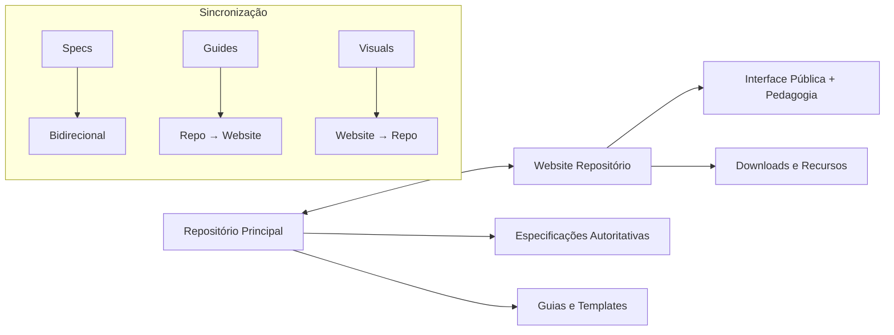
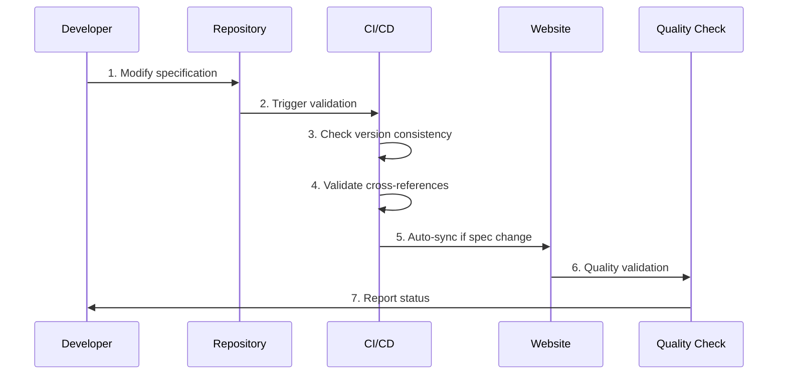

# Guia de Sincronização Website ↔ Repositório

**Versão:** 1.0.0  
**Data:** 2025-10-05  
**Status:** Ativo  

## Índice

1. [Visão Geral](#visão-geral)
2. [Arquivos que DEVEM estar Sincronizados](#arquivos-que-devem-estar-sincronizados)
3. [Conteúdo que PODE Divergir](#conteúdo-que-pode-divergir)
4. [Processo de Sincronização](#processo-de-sincronização)
5. [Workflows e Responsabilidades](#workflows-e-responsabilidades)
6. [Ferramentas e Scripts](#ferramentas-e-scripts)
7. [Checklist de Sincronização](#checklist-de-sincronização)
8. [Resolução de Conflitos](#resolução-de-conflitos)

---

## Visão Geral

Este guia estabelece o processo de sincronização entre o **repositório principal** (fonte canônica) e o **website** (interface pública) do Matrix Protocol.

### Princípios Fundamentais

1. **Repositório = Fonte de Verdade** para especificações técnicas
2. **Website = Interface Acessível** com conteúdo pedagógico adicional
3. **Sincronização Bidirecional** para melhorias e correções
4. **Versionamento Consistente** em ambos os ambientes

### Estratégia de Dois Repositórios



---

## Arquivos que DEVEM estar Sincronizados

### Especificações Core (Sincronização Obrigatória)

| Repositório | Website | Tipo de Sync |
|-------------|---------|---------------|
| `MATRIX_PROTOCOL.md` | `/content/en/protocol/index.md` | **Bidirecional** |
| `MATRIX_PROTOCOL_PT.md` | `/content/pt/protocol/index.md` | **Bidirecional** |
| `MEP_MATRIX_EPISTEMIC_PRINCIPLE.md` | `/content/en/mep/index.md` | **Bidirecional** |
| `MEP_MATRIX_EPISTEMIC_PRINCIPLE_PT.md` | `/content/pt/mep/index.md` | **Bidirecional** |
| `MEF_MATRIX_EMBEDDING_FRAMEWORK.md` | `/content/en/frameworks/mef.md` | **Bidirecional** |
| `MEF_MATRIX_EMBEDDING_FRAMEWORK_PT.md` | `/content/pt/frameworks/mef.md` | **Bidirecional** |
| `ZOF_ZION_ORCHESTRATION_FRAMEWORK.md` | `/content/en/frameworks/zof.md` | **Bidirecional** |
| `ZOF_ZION_ORCHESTRATION_FRAMEWORK_PT.md` | `/content/pt/frameworks/zof.md` | **Bidirecional** |
| `OIF_OPERATOR_INTELLIGENCE_FRAMEWORK.md` | `/content/en/frameworks/oif.md` | **Bidirecional** |
| `OIF_OPERATOR_INTELLIGENCE_FRAMEWORK_PT.md` | `/content/pt/frameworks/oif.md` | **Bidirecional** |
| `MOC_MATRIX_ONTOLOGY_CATALOG.md` | `/content/en/frameworks/moc.md` | **Bidirecional** |
| `MOC_MATRIX_ONTOLOGY_CATALOG_PT.md` | `/content/pt/frameworks/moc.md` | **Bidirecional** |
| `MAL_MATRIX_ARBITER_LAYER.md` | `/content/en/frameworks/mal.md` | **Bidirecional** |
| `MAL_MATRIX_ARBITER_LAYER_PT.md` | `/content/pt/frameworks/mal.md` | **Bidirecional** |

### Campos Obrigatoriamente Idênticos

- **Version:** Deve ser idêntica (atualmente v0.0.1)
- **Status:** Deve ser idêntico (Beta para todos, Active para MAL)
- **Last Updated:** Deve ser sincronizado
- **Normative Sections:** Devem ser semanticamente idênticas
- **Cross-references:** Devem apontar para conteúdo equivalente

---

## Conteúdo que PODE Divergir

### Permitido Diferir Entre Repositório e Website

| Tipo | Repositório | Website | Justificativa |
|------|-------------|---------|---------------|
| **Frontmatter** | Headers markdown simples | Hugo/Nuxt metadata | Necessário para CMS |
| **Links Internos** | `./MEF_*.md` | `/frameworks/mef` | Diferentes sistemas de navegação |
| **Exemplos** | Concisos | Expandidos/interativos | Pedagogia aprimorada |
| **Visualizações** | Básicas | Coloridas/interativas | Melhor UX no website |
| **Downloads** | Não aplicável | `/public/downloads/` | Recursos adicionais |

### Hugo Frontmatter (Website)

```yaml
---
title: "Matrix Embedding Framework"
description: "Framework para estruturação de conhecimento via UKIs"
framework:
  key: "mef"
  color: "emerald"
  icon: "mef-logo-icon.svg"
navigation:
  order: 2
seo:
  keywords: ["MEF", "UKI", "knowledge", "embedding"]
---
```

### Markdown Headers (Repositório)

```markdown
# MEF — Matrix Embedding Framework
**Version:** 0.0.1
**Status:** Beta
**Last Updated:** 2025-10-05
```

---

## Processo de Sincronização

### Workflow de Modificação



### Tipos de Mudança

#### 1. **Mudanças de Especificação** (Repositório → Website)

**Trigger:** Modificação em arquivos core (`*_FRAMEWORK.md`, `MATRIX_PROTOCOL.md`)

**Processo:**
1. Desenvolver atualiza especificação no repositório
2. CI/CD detecta mudança em arquivo crítico
3. Validation pipeline executa verificações
4. Auto-sync para website equivalente (remover frontmatter, adicionar headers)
5. Notificação para website maintainer
6. Review e deploy no website

#### 2. **Melhorias Pedagógicas** (Website → Repositório)

**Trigger:** Novo conteúdo valioso no website (guias, exemplos, visualizações)

**Processo:**
1. Website team desenvolve conteúdo pedagógico
2. Evaluation: conteúdo beneficia repositório?
3. Se sim, adaptar para formato repositório
4. PR no repositório com justificativa
5. Review por spec maintainers
6. Merge e documentação no CHANGELOG

#### 3. **Correções de Erro** (Bidirecional Imediato)

**Trigger:** Bug report ou erro identificado

**Processo:**
1. Correção aplicada na fonte primária
2. Sync imediato para ambiente secundário
3. Validation automática
4. Notificação de correção
5. Update no CHANGELOG

### Frequência de Sincronização

| Tipo | Frequência | Automação |
|------|------------|-----------|
| **Specs Críticas** | Imediato | ✅ CI/CD |
| **Guias e Templates** | Semanal | 🔄 Manual Review |
| **Visualizações** | Quinzenal | 🔄 Manual Review |
| **Meta-documentação** | Mensal | 🔄 Manual Review |

---

## Workflows e Responsabilidades

### Papéis e Responsabilidades

| Papel | Responsabilidade | Ferramentas |
|-------|-----------------|-------------|
| **Spec Maintainer** | Garantir correção técnica das especificações | Repository, VS Code, validation scripts |
| **Website Maintainer** | Garantir acessibilidade e navegação adequada | Nuxt, Hugo, CMS tools |
| **Sync Coordinator** | Executar sincronizações semanais e resolver conflitos | Scripts, CI/CD, diff tools |
| **QA Reviewer** | Validar consistência e qualidade | Browser testing, link checkers |
| **Community** | Reportar inconsistências via issues | GitHub issues, discussions |

### Workflow Semanal de Sincronização

#### Segunda-feira: Status Check
```bash
# Executar script de verificação
./scripts/check-internal-links.sh
./scripts/validate-cross-references.sh

# Verificar versões
grep -r "Version:" *.md | grep -v "0.0.1"
```

#### Quarta-feira: Content Review
1. Review de PRs pendentes no repositório
2. Check de novos downloads no website
3. Validation de links quebrados
4. Update de navigation map se necessário

#### Sexta-feira: Sync Execution
1. Aplicar mudanças pendentes
2. Executar tests de integração
3. Update do CHANGELOG se houver mudanças
4. Comunicar status para stakeholders

### Issue Templates

#### Template: Inconsistência Repositório ↔ Website

```markdown
---
name: Sync Inconsistency
about: Report divergence between repository and website
title: '[SYNC] Inconsistency in [framework/section]'
labels: 'sync-required, bug'
---

## Descrição da Inconsistência

**Repositório:** [URL/file and line]
**Website:** [URL and section]

## Conteúdo Divergente

**Repositório contém:**
```
[paste content]
```

**Website contém:**
```
[paste content]
```

## Impacto
- [ ] Crítico - Afeta implementação
- [ ] Alto - Confunde usuários  
- [ ] Médio - Inconsistência menor
- [ ] Baixo - Cosmético

## Qual versão está correta?
- [ ] Repositório
- [ ] Website
- [ ] Ambos estão errados
- [ ] Não tenho certeza

## Context/Background
[Additional information]
```

---

## Ferramentas e Scripts

### Scripts de Validação

#### 1. `scripts/check-internal-links.sh`

```bash
#!/bin/bash
# Verifica links internos no repositório

echo "🔍 Checking internal links..."

# Check .md references
find . -name "*.md" -exec grep -l "\[.*\](\..*\.md)" {} \; | while read file; do
    echo "Checking $file..."
    grep -n "\[.*\](\..*\.md)" "$file" | while read line; do
        link=$(echo "$line" | sed 's/.*](\([^)]*\)).*/\1/')
        if [[ ! -f "$link" ]]; then
            echo "❌ Broken link in $file: $link"
        fi
    done
done

echo "✅ Internal links check complete"
```

#### 2. `scripts/validate-cross-references.sh`

```bash
#!/bin/bash
# Valida referências cruzadas entre frameworks

echo "🔍 Validating cross-references..."

# Check if all referenced files exist
referenced_files=$(grep -r "\.md)" *.md | sed 's/.*](\([^)]*\.md\)).*/\1/' | sort -u)

for file in $referenced_files; do
    if [[ ! -f "$file" ]]; then
        echo "❌ Referenced file not found: $file"
    else
        echo "✅ $file exists"
    fi
done

echo "✅ Cross-references validation complete"
```

#### 3. `scripts/check-version-consistency.sh`

```bash
#!/bin/bash
# Verifica consistência de versões

echo "🔍 Checking version consistency..."

target_version="0.0.1"
files=(*.md)

for file in "${files[@]}"; do
    if [[ -f "$file" ]]; then
        version=$(grep "Version:" "$file" | head -1 | sed 's/.*Version:\s*//' | tr -d '*')
        if [[ "$version" != "$target_version" ]]; then
            echo "❌ $file: incorrect version: $version (expected: $target_version)"
        else
            echo "✅ $file: version OK"
        fi
    fi
done

echo "✅ Version consistency check complete"
```

### CI/CD Integration

#### GitHub Actions Workflow (`.github/workflows/sync-validation.yml`)

```yaml
name: Sync Validation

on:
  push:
    paths:
      - '*.md'
      - 'examples/**'
      - 'guides/**'
      - 'templates/**'
  pull_request:
    paths:
      - '*.md'

jobs:
  validate-sync:
    runs-on: ubuntu-latest
    steps:
      - uses: actions/checkout@v3
      
      - name: Check Version Consistency
        run: ./scripts/check-version-consistency.sh
        
      - name: Validate Internal Links
        run: ./scripts/check-internal-links.sh
        
      - name: Validate Cross References
        run: ./scripts/validate-cross-references.sh
        
      - name: Check UKI Format
        run: |
          if grep -r "uki:\[domain_ref\]" *.md; then
            echo "❌ Found incorrect UKI format (domain-first)"
            exit 1
          fi
          echo "✅ UKI format validation passed"
```

---

## Checklist de Sincronização

### Pre-Sync Checklist

- [ ] Backup de ambos os repositórios
- [ ] Verificar se não há trabalho em andamento conflitante
- [ ] Executar scripts de validação
- [ ] Review de issues pendentes relacionadas à sync

### Durante a Sincronização

#### Para Mudanças no Repositório:

- [ ] Identificar arquivos modificados
- [ ] Verificar se requer sync para website
- [ ] Remover frontmatter Hugo se necessário
- [ ] Atualizar links internos para formato website
- [ ] Aplicar mudanças no website
- [ ] Testar navegação no website
- [ ] Validar rendering de Mermaid diagrams

#### Para Mudanças no Website:

- [ ] Avaliar se beneficia repositório
- [ ] Adaptar formato para markdown puro
- [ ] Converter links website para referências .md
- [ ] Remover dependências de Hugo/Nuxt
- [ ] Aplicar no repositório
- [ ] Executar validation scripts

### Post-Sync Checklist

- [ ] Testar links em ambos ambientes
- [ ] Verificar rendering correto de diagramas
- [ ] Confirmar versões consistentes
- [ ] Update do CHANGELOG se necessário
- [ ] Comunicação para stakeholders
- [ ] Close de issues relacionadas

---

## Resolução de Conflitos

### Tipos de Conflito

#### 1. **Conflito de Versão**

**Situação:** Repositório tem v0.0.2, website tem v0.0.1

**Resolução:**
```bash
# Determinar qual é a versão correta
git log --oneline --grep="version"

# Aplicar versão correta em ambos
# Documentar decisão no CHANGELOG
```

#### 2. **Conflito de Conteúdo**

**Situação:** Mesmo framework tem especificações diferentes

**Resolução:**
1. Identificar qual versão está correta
2. Aplicar versão correta como fonte canônica
3. Sync para ambiente secundário
4. Documentar razão da decisão

#### 3. **Conflito de Formato UKI**

**Situação:** Website usa domain-first, repositório usa scope-first

**Resolução:**
```bash
# Scope-first é sempre correto
# Corrigir website para uki:[scope_ref]:[type_ref]:[slug]
sed -i 's/uki:\[domain_ref\]/uki:[scope_ref]/g' affected_files
```

### Escalação de Conflitos

| Severidade | Responsável | Prazo |
|------------|-------------|-------|
| **P0 - Crítico** | Spec Maintainer | Imediato |
| **P1 - Alto** | Sync Coordinator | 24h |
| **P2 - Médio** | Website Maintainer | 1 semana |
| **P3 - Baixo** | Community | Próximo cycle |

### Processo de Arbitragem

1. **Identificação:** Conflito detectado
2. **Documentação:** Issue criado com evidências
3. **Análise:** Review por maintainers relevantes
4. **Decisão:** Baseada em princípios do protocolo
5. **Aplicação:** Mudanças implementadas
6. **Documentação:** CHANGELOG atualizado

---

## Métricas e Monitoramento

### KPIs de Sincronização

| Métrica | Meta | Medição |
|---------|------|---------|
| **Tempo de Sync** | < 24h para mudanças críticas | Timestamp tracking |
| **Consistência de Versão** | 100% | Script automation |
| **Links Funcionais** | 99%+ | Weekly validation |
| **Conflitos Pendentes** | < 3 | Issue tracking |

### Dashboard de Status

```markdown
## Sync Status Dashboard

**Last Sync:** 2025-10-05 14:30 UTC
**Status:** ✅ All systems synchronized

### Version Consistency
- Repository: v0.0.1 ✅
- Website: v0.0.1 ✅
- Status: MAL=Active, Others=Beta ✅

### Link Health
- Internal Links: 98% (2 broken)
- Cross References: 100% ✅
- Navigation Map: Updated ✅

### Pending Actions
- [ ] Fix 2 broken links in examples/
- [ ] Update website MEF Section 5
- [ ] Sync ZOF Universal Pattern
```

---

## Histórico de Versões

| Versão | Data | Mudanças |
|--------|------|----------|
| **1.0.0** | 2025-10-05 | Versão inicial do guia |
| **0.9.0** | 2025-10-05 | Draft completo para review |

---

## Contatos e Suporte

### Equipe de Sincronização

- **Spec Maintainer:** Matrix Protocol Core Team
- **Sync Coordinator:** [TBD]
- **Website Maintainer:** [TBD]

### Canais de Comunicação

- **Issues Urgentes:** GitHub Issues com label `sync-required`
- **Discussões:** GitHub Discussions categoria "Sync"
- **Updates:** CHANGELOG.md e releases

---

**Mantido por:** Matrix Protocol Core Team  
**Próxima revisão:** 2025-11-05  
**Documentos relacionados:** [CONSOLIDATION_PLAN.md](./CONSOLIDATION_PLAN.md), [NAVIGATION_MAP.md](./NAVIGATION_MAP.md)