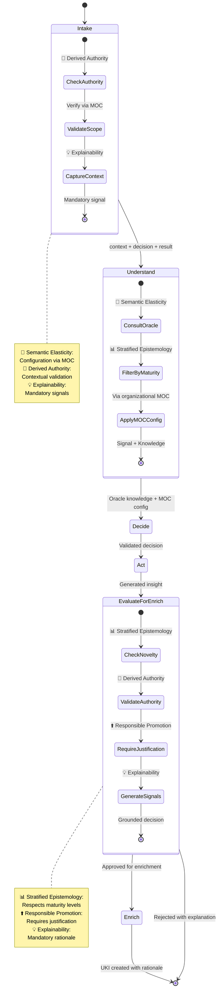
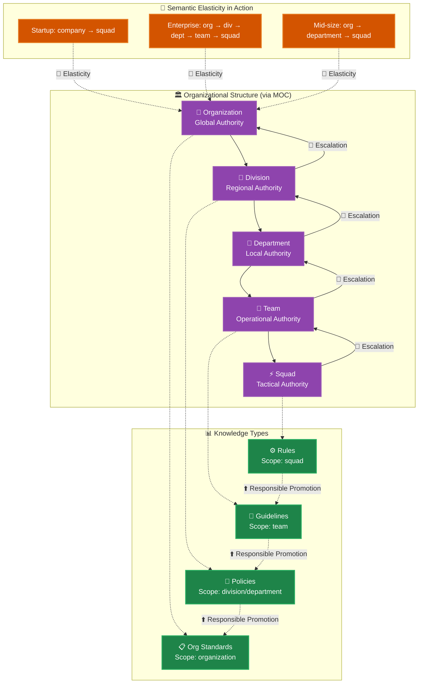
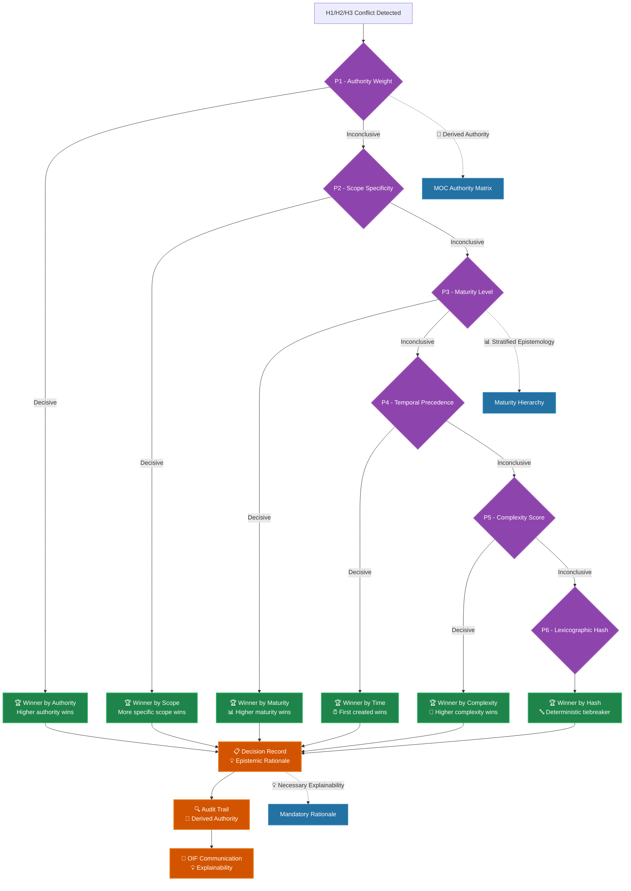

# MEP-Frameworks: Complete Relationship Mapping

The **Matrix Epistemic Principle (MEP)** is the philosophical foundation that guides all Matrix Protocol frameworks. This document maps **how each of the 5 MEP principles manifests concretely** in each framework, ensuring epistemological consistency throughout the architecture.

## 1. Relationship Overview

### MEP-Frameworks Relationship Matrix

| MEP Principle | MEF | ZOF | OIF | MOC | MAL |
|---------------|-----|-----|-----|-----|-----|
| **🔄 Semantic Elasticity** | ⭐⭐⭐ | ⭐⭐ | ⭐ | ⭐⭐⭐ | ⭐⭐ |
| **📊 Stratified Epistemology** | ⭐⭐⭐ | ⭐⭐⭐ | ⭐⭐ | ⭐⭐ | ⭐⭐⭐ |
| **⬆️ Responsible Promotion** | ⭐⭐⭐ | ⭐⭐ | ⭐ | ⭐ | ⭐⭐ |
| **👥 Derived Authority** | ⭐⭐⭐ | ⭐⭐⭐ | ⭐⭐⭐ | ⭐⭐⭐ | ⭐⭐⭐ |
| **💡 Necessary Explainability** | ⭐⭐ | ⭐⭐ | ⭐⭐⭐ | ⭐ | ⭐⭐⭐ |

**Legend**: ⭐ = Weak relationship | ⭐⭐ = Medium relationship | ⭐⭐⭐ = Strong relationship

### Global Epistemological Architecture

```mermaid
graph TB
    subgraph "🔮 MEP - Epistemological Principles"
        P1[🔄 Semantic Elasticity]
        P2[📊 Stratified Epistemology]
        P3[⬆️ Responsible Promotion]
        P4[👥 Derived Authority]
        P5[💡 Necessary Explainability]
    end
    
    subgraph "📊 MEF - Knowledge Structuring"
        MEF1[*_ref Fields]
        MEF2[maturity_ref Field]
        MEF3[promotion_rationale Field]
        MEF4[scope_ref/governance_ref Fields]
        MEF5[Audit Metadata]
    end
    
    subgraph "⚡ ZOF - Workflow Orchestration"
        ZOF1[MOC Configuration]
        ZOF2[EvaluateForEnrich State]
        ZOF3[Authority Validation]
        ZOF4[Mandatory Signals]
    end
    
    subgraph "🧠 OIF - Operator Intelligence"
        OIF1[Contextual Responses]
        OIF2[XAI/NLG Templates]
        OIF3[Maturity Level Respect]
    end
    
    subgraph "🏛️ MOC - Organizational Ontology"
        MOC1[Local Configuration]
        MOC2[Scope Hierarchies]
        MOC3[Authority Definitions]
    end
    
    subgraph "⚖️ MAL - Conflict Arbitration"
        MAL1[Precedence Rules P1-P6]
        MAL2[Decision Records]
        MAL3[Epistemological Justifications]
    end
    
    P1 --> MEF1
    P1 --> ZOF1
    P1 --> MOC1
    
    P2 --> MEF2
    P2 --> ZOF2
    P2 --> OIF3
    P2 --> MAL1
    
    P3 --> MEF3
    P3 --> ZOF2
    
    P4 --> MEF4
    P4 --> ZOF3
    P4 --> OIF1
    P4 --> MOC2
    P4 --> MOC3
    P4 --> MAL1
    
    P5 --> MEF5
    P5 --> ZOF4
    P5 --> OIF2
    P5 --> MAL2
    P5 --> MAL3
    
    %% Matrix Protocol Styling
    classDef mep fill:#8E44AD,stroke:#9B59B6,color:#fff,stroke-width:2px
    classDef mef fill:#1E8449,stroke:#27AE60,color:#fff,stroke-width:2px
    classDef zof fill:#D35400,stroke:#E67E22,color:#fff,stroke-width:2px
    classDef oif fill:#2471A3,stroke:#2980B9,color:#fff,stroke-width:2px
    classDef moc fill:#8E44AD,stroke:#9B59B6,color:#fff,stroke-width:2px
    classDef mal fill:#A93226,stroke:#C0392B,color:#fff,stroke-width:2px
    
    class P1,P2,P3,P4,P5 mep
    class MEF1,MEF2,MEF3,MEF4,MEF5 mef
    class ZOF1,ZOF2,ZOF3,ZOF4 zof
    class OIF1,OIF2,OIF3 oif
    class MOC1,MOC2,MOC3 moc
    class MAL1,MAL2,MAL3 mal
```



## 2. MEP → MEF (Matrix Embedding Framework)

### 🔄 Semantic Elasticity in MEF

**Manifestation**: Reference fields (*_ref) that point to organizational MOC configurations.

**Technical Implementation**:
```yaml
# UKI structure demonstrating semantic elasticity
uki_example:
  scope_ref: "squad-payments"        # Configurable by organization
  domain_ref: "business"             # Defined in local MOC
  type_ref: "business_rule"          # Organizational taxonomy
  maturity_ref: "validated"          # Levels defined in MOC
```

**Applied Principle**: Instead of hardcoded values, MEF uses references that adapt to organizational context defined in MOC.

**Practical Example**: 
- **Startup**: `scope_ref` can be simply "company"
- **Enterprise**: `scope_ref` can have 5 hierarchical levels like "division.department.team.squad.project"

### 📊 Stratified Epistemology in MEF

**Manifestation**: `maturity_ref` field that implements epistemological maturity levels.

**Epistemological Progression**:
```yaml
maturity_progression:
  draft: "Initial knowledge, unvalidated"
  reviewed: "Peer-reviewed but not approved"
  validated: "Technically and operationally validated"
  approved: "Approved for organizational use"
  deprecated: "Marked for discontinuation"
```

**Stratified Rules**:
- `draft` UKI CANNOT override `validated` UKI
- Maturity promotion requires justification via `promotion_rationale`
- Each organization defines criteria via MOC

### ⬆️ Responsible Promotion in MEF

**Manifestation**: Mandatory `promotion_rationale` field for significant changes.

**Promotion Structure**:
```yaml
promotion_example:
  previous_maturity: "reviewed"
  new_maturity: "validated"
  promotion_rationale: |
    Complete validation performed:
    1. Integration tests passed (98% coverage)
    2. Security review approved (security team)
    3. Organizational impact analysis documented
    4. Tech-lead and compliance officer approval
  
  impact_analysis:
    affected_systems: ["payment-gateway", "fraud-detection"]
    business_value: "15% reduction in false positives"
    risk_assessment: "Low - compatible with existing systems"
```

**Applied Principle**: All knowledge evolution must be accompanied by explicit epistemological justification.

### 👥 Derived Authority in MEF

**Manifestation**: `scope_ref` and `governance_ref` fields that contextualize authority.

**Authority Implementation**:
```yaml
authority_context:
  scope_ref: "squad-payments"
  governance_ref: "tech-lead-approval"
  
  # This UKI derives authority from context, it's not absolute authority
  authority_derivation: |
    This business rule is valid within the payments squad context,
    under tech-lead governance. In other organizational contexts,
    different rules may apply.
```

**Applied Principle**: No UKI claims absolute truth - all authority derives from organizational context.

### 💡 Necessary Explainability in MEF

**Manifestation**: Audit metadata and semantic relationships.

**Explainability Trail**:
```yaml
explainability_metadata:
  creation_rationale: "Need identified during incident post-mortem"
  validation_evidence: ["tests/payment-rules.spec.js", "docs/business-analysis.md"]
  relationships:
    - type: "derives_from"
      target: "uki:payments:pattern:gateway-integration-007"
      explanation: "Specializes generic pattern for specific rules"
    - type: "conflicts_with"
      target: "uki:legacy:rule:old-payment-logic-001"
      explanation: "Replaces legacy logic with better error handling"
  
  audit_trail:
    created_by: "tech-lead-alice"
    approved_by: "compliance-officer-bob"
    last_modified: "2025-10-30T14:30:00Z"
    change_history: ["v1.0.0 → v1.1.0: Added PIX support"]
```

## 3. MEP → ZOF (Zion Orchestration Framework)

### 🔄 Semantic Elasticity in ZOF

**Manifestation**: Workflow configuration via organizational MOC, avoiding rigid workflows.

**Elastic Configuration**:
```yaml
zof_workflow_configuration:
  workflow_id: "feature-development"
  
  # Configuration derives from organizational MOC
  moc_configuration:
    scope_validation: "squad.authority_matrix"
    enrichment_criteria: "organization.knowledge_policies"
    escalation_paths: "hierarchy.approval_chains"
  
  # Mandatory states (universal)
  canonical_states: [intake, understand, decide, act, evaluate_for_enrich, review, enrich]
  
  # Local configurations (elastic)
  local_adaptations:
    understand_timeout: "organization_defined"  # Via MOC
    enrichment_thresholds: "squad_configured"   # Via MOC
    approval_requirements: "context_dependent"   # Via MOC
```

**Applied Principle**: ZOF provides universal structure (7 canonical states) but allows local configuration via MOC.

#### Canonical States with MEP Principles



### 📊 Stratified Epistemology in ZOF

**Manifestation**: `EvaluateForEnrich` state that respects epistemological maturity levels.

**Stratified Evaluation**:
```yaml
evaluate_for_enrich_logic:
  inputs:
    current_knowledge: "Knowledge base consulted in Understand state"
    new_insight: "Knowledge generated during Act"
    user_authority: "User authority context"
  
  stratified_evaluation:
    semantic_novelty:
      check: "Is the knowledge genuinely new?"
      threshold: "Configured via MOC"
      
    epistemic_value:
      check: "Does the knowledge have sustainable epistemological value?"
      criteria: "Relevance + Reusability + Impact"
      
    authority_compatibility:
      check: "Does user have authority to create knowledge in this scope?"
      validation: "Via MOC governance rules"
      
    maturity_alignment:
      check: "Is new knowledge compatible with existing maturity?"
      rule: "Draft doesn't override Validated"
```

### ⬆️ Responsible Promotion in ZOF

**Manifestation**: Promotion workflows that require justification before UKI creation.

**Promotion Workflow**:
```yaml
promotion_workflow:
  trigger: "EvaluateForEnrich approved for enrichment"
  
  promotion_validation:
    justification_required: true
    fields_validated:
      - epistemic_rationale: "Why should this knowledge exist?"
      - impact_analysis: "What's the impact on knowledge base?"
      - evidence_provided: "What evidence supports this knowledge?"
  
  states_involved:
    evaluate_for_enrich: "Evaluates if promotion is worthwhile"
    enrich: "Actually creates new UKI with justification"
    review: "Validates quality of performed promotion"
```

### 👥 Derived Authority in ZOF

**Manifestation**: Authority validation in each workflow state, based on MOC context.

**Contextual Authority Validation**:
```yaml
authority_validation_per_state:
  intake:
    validation: "Can user initiate workflow in this scope?"
    source: "MOC hierarchy definitions"
    
  understand:
    validation: "Can user consult Oracle with these filters?"
    source: "MOC visibility rules"
    
  decide:
    validation: "Can user make decisions in this domain?"
    source: "MOC decision authority matrix"
    
  act:
    validation: "Can user execute actions in this context?"
    source: "MOC operational permissions"
    
  evaluate_for_enrich:
    validation: "Can user enrich knowledge in this scope?"
    source: "MOC knowledge creation policies"
```

### 💡 Necessary Explainability in ZOF

**Manifestation**: Mandatory signals (context, decision, result) in each state transition.

**Explainability Structure**:
```yaml
explainability_signals:
  state_transition: "understand → decide"
  
  required_signals:
    context: "Oracle returned 12 related UKIs about payments"
    decision: "Use existing gateway pattern with PIX adaptations"
    result: "Strategy defined: Stripe integration + PIX adapter"
  
  audit_generation:
    timestamp: "2025-10-30T14:45:00Z"
    workflow_id: "feature-pix-integration-001"
    user_context: "tech-lead-alice@squad-payments"
    state_duration: "00:05:23"
    
  explanation_template: |
    During the Understand state, I consulted the Oracle about payment
    integrations and identified 12 relevant UKIs. Based on this
    knowledge, I decided to use the existing gateway pattern (UKI-007)
    adapted for Brazilian PIX. This decision derives from tech-lead
    authority in the squad-payments scope.
```

## 4. MEP → OIF (Operator Intelligence Framework)

### 👥 Derived Authority in OIF

**Manifestation**: Archetypes NEVER make absolute statements - always contextualize responses.

**Contextual Response Pattern**:
```yaml
knowledge_agent_response:
  user_query: "What's the best payment gateway?"
  
  # ❌ ABSOLUTE RESPONSE (MEP Violation)
  absolute_response: "Stripe is the best payment gateway."
  
  # ✅ RESPONSE WITH DERIVED AUTHORITY (MEP Compliant)
  contextual_response: |
    Based on knowledge from your organizational context (squad-payments),
    our knowledge base indicates that Stripe has been effective for:
    
    - Similar use cases documented in UKI-007
    - PCI compliance per your context requirements
    - PIX support per mapped Brazilian needs
    
    This recommendation derives from knowledge specific to your
    organizational scope. Other contexts may have different recommendations.
    
    References: 
    - UKI: uki:payments:pattern:gateway-integration-007
    - Scope: squad-payments  
    - Last updated: 2025-10-15
```

### 📊 Stratified Epistemology in OIF

**Manifestation**: Archetypes respect maturity levels when providing knowledge.

**Maturity-Aware Filtering**:
```yaml
maturity_aware_response:
  user_authority: "developer"  # Basic level
  
  knowledge_filtering:
    include:
      - maturity: ["validated", "approved"]
        rationale: "Stable knowledge for operational use"
        
    exclude:
      - maturity: ["draft"]
        rationale: "Developer shouldn't use unvalidated knowledge"
        
    conditional:
      - maturity: ["reviewed"]
        condition: "if user.experience_level >= senior"
        rationale: "Only seniors can use knowledge under review"

  response_structure:
    primary_recommendations: "Based on validated/approved UKIs"
    experimental_notes: "Mentioned only if user.role permits"
    maturity_transparency: "Always indicate source maturity level"
```

### 💡 Necessary Explainability in OIF

**Manifestation**: XAI/NLG templates that ensure structured and auditable explanations.

**Hierarchical Explanation Template**:
```yaml
hierarchical_explanation_template:
  decision_context:
    user_query: "Why was my UKI rejected?"
    decision_type: "enrichment_rejection"
    
  explanation_layers:
    summary: |
      Your UKI was rejected during enrichment evaluation for 
      not meeting organizational criteria for semantic novelty.
      
    detailed_rationale: |
      Detailed analysis:
      1. Semantic Novelty: 35% (threshold: 60%)
         - Concept already covered by UKI-005 and UKI-012
         - Insufficient differentiation identified
         
      2. Practical Value: 85% (threshold: 70%) ✓
         - Clear applicability identified
         - Valid use cases documented
         
      3. Authority: Valid ✓
         - Scope: squad-payments (authorized)
         - Level: tech-lead (sufficient)
    
    evidence_provided:
      similar_ukis: ["uki:payments:rule:discount-logic-001", "uki:payments:rule:fee-calculation-005"]
      evaluation_criteria: "organization.knowledge_policies.enrichment_criteria"
      authority_validation: "moc.hierarchy.squad-payments.permissions"
      
    actionable_guidance: |
      For future approval, consider:
      - Clearly differentiate from UKI-005 (focus on edge cases)
      - Document use cases not covered by existing UKIs
      - Provide evidence of specific practical value
      
    audit_trail:
      evaluated_by: "ZOF.evaluate_for_enrich"
      timestamp: "2025-10-30T15:00:00Z"
      decision_id: "eval-rejection-20251030-001"
```

## 5. MEP → MOC (Matrix Ontology Catalog)

### 🔄 Semantic Elasticity in MOC

**Manifestation**: MOC allows complete organizational configuration of taxonomies and hierarchies.

**Elastic Organizational Configuration**:
```yaml
# Startup Configuration
startup_moc:
  hierarchies:
    scope:
      - company
    domain:
      - business
      - technical
    maturity:
      - draft
      - validated

---

# Enterprise Configuration  
enterprise_moc:
  hierarchies:
    scope:
      - organization
        - division
          - department
            - team
              - squad
                - project
    domain:
      - business
        - strategy
        - operations
        - compliance
      - technical
        - architecture
        - infrastructure
        - security
    maturity:
      - draft
      - reviewed
      - validated
      - approved
      - deprecated
```

**Applied Principle**: Same conceptual structure (hierarchies), completely different configuration per organization.

#### Contextual Authority Hierarchy



### 👥 Derived Authority in MOC

**Manifestation**: Authority definition based on hierarchical and organizational context.

**Contextual Authority Matrix**:
```yaml
authority_matrix:
  scope_permissions:
    organization:
      can_modify: ["cto", "architect", "principal-engineer"]
      can_view: ["all_authenticated"]
      
    division:
      can_modify: ["division-lead", "principal-engineer"]
      can_view: ["division_members", "organization_leaders"]
      
    team:
      can_modify: ["tech-lead", "team-lead"]
      can_view: ["team_members", "division_leads", "organization_leaders"]
      
    squad:
      can_modify: ["squad_members"]
      can_view: ["squad_members", "team_leads", "organization_leaders"]

  domain_authority:
    business:
      decision_makers: ["product-manager", "business-analyst"]
      technical_validators: ["tech-lead", "architect"]
      
    technical:
      decision_makers: ["tech-lead", "architect", "principal-engineer"]
      business_validators: ["product-manager"]

  cross_scope_operations:
    requires_escalation: true
    escalation_path: ["team-lead", "division-lead", "cto"]
    exception_handlers: ["security-officer", "compliance-officer"]
```

## 6. MEP → MAL (Matrix Arbiter Layer)

### 📊 Stratified Epistemology in MAL

**Manifestation**: Precedence rules P1-P6 that respect epistemological maturity levels.

**P3 Precedence - Maturity Level**:
```yaml
p3_maturity_precedence:
  rule: "Higher epistemic maturity supersedes lower maturity"
  
  hierarchy:
    approved: 4      # Maximum epistemological authority
    validated: 3     # High reliability
    reviewed: 2      # Medium reliability
    draft: 1         # Minimum reliability
    
  conflict_resolution:
    scenario: "validated UKI vs draft UKI"
    decision: "validated UKI always wins"
    rationale: "Superior epistemological maturity"
    
    scenario: "approved UKI vs validated UKI"  
    decision: "approved UKI always wins"
    rationale: "Formal organizational approval"

  exception_handling:
    critical_safety: "Draft can block Approved if critical safety"
    compliance_override: "Compliance rules supersede maturity hierarchy"
```

### 👥 Derived Authority in MAL

**Manifestation**: All precedence rules consider organizational context.

**P1 Precedence - Authority Weight**:
```yaml
p1_authority_weight:
  principle: "Authority is always organizational context-derived"
  
  weight_calculation:
    base_authority: "user.role defined in MOC"
    scope_modifier: "Authority increases in smaller scopes"
    domain_expertise: "Specialization in relevant domain"
    
  examples:
    scenario_1:
      user: "tech-lead@squad-payments"
      scope: "squad-payments"
      domain: "technical"
      weight: 100  # Maximum authority in context
      
    scenario_2:
      user: "tech-lead@squad-payments"  
      scope: "organization"
      domain: "technical"
      weight: 30   # Limited authority outside scope
      
    scenario_3:
      user: "tech-lead@squad-payments"
      scope: "squad-payments"
      domain: "business"
      weight: 60   # Medium authority outside domain
```

### ⬆️ Responsible Promotion in MAL

**Manifestation**: Arbitration decisions that require epistemological justification.

**Decision Record with Justification**:
```yaml
mal_decision_record:
  decision_id: "mal-arb-20251030-001"
  conflict_type: "H1 - Horizontal UKIs"
  
  candidates:
    winner: "uki:payments:rule:data-retention-30d"
    loser: "uki:payments:rule:data-retention-7d"
    
  precedence_applied: "P3 - Maturity Level"
  
  epistemic_rationale: |
    Decision based on epistemological superiority of winning UKI:
    
    1. Epistemological Maturity:
       - Winner: validated (superior maturity)
       - Loser: endorsed (inferior maturity)
       
    2. Organizational Context:
       - Scope: squad-payments (compliance-critical)
       - Domain: business (regulatory requirements)
       
    3. Precedence Justification:
       - LGPD compliance requires rigorous validation
       - Data retention policies have legal implications
       - Validated UKI passed compliance review
       
    4. Derived Authority:
       - Winner: tech-lead + compliance-officer
       - Loser: developer (insufficient authority for compliance)
       
    This decision derives from organizational MOC configuration for
    squad-payments and does not constitute absolute truth applicable 
    to other organizational contexts.
  
  audit_trail:
    arbitrated_by: "MAL.engine"
    timestamp: "2025-10-30T15:30:00Z"
    moc_context: "organization.squad-payments.policies"
    precedence_source: "organization.arbitration.rules.p1_to_p6"
```

### 💡 Necessary Explainability in MAL

**Manifestation**: All arbitration processes generate detailed and auditable explanations.

#### Visual Precedence Flow



**MAL Explanation Template**:
```yaml
mal_explanation_template:
  decision_summary: "Conflict resolved via P3 - Maturity Level precedence"
  
  step_by_step_explanation:
    step_1:
      action: "Conflict detected between equivalent UKIs"
      details: "H1 horizontal conflict in squad-payments scope"
      
    step_2:
      action: "Applied P1 - Authority Weight"
      result: "Inconclusive (both have valid authority)"
      
    step_3:
      action: "Applied P2 - Scope Specificity" 
      result: "Inconclusive (same scope: squad-payments)"
      
    step_4:
      action: "Applied P3 - Maturity Level"
      result: "Decisive (validated > endorsed)"
      winner: "uki:payments:rule:data-retention-30d"
      
  organizational_context:
    moc_policies_applied:
      - "compliance.data_retention.requires_validation"
      - "squad.payments.regulatory_compliance_mandatory"
      - "maturity.progression.draft_to_validated_to_approved"
      
  transparency_notes: |
    This arbitration followed organizational policies defined in MOC.
    Different organizations may have different precedence policies.
    The decision is not universally applicable - derives from specific context.
```

## 7. Cross-Framework Practical Cases

### Case 1: Complete UKI Journey with All MEP Principles

#### Cross-Framework Visual Timeline

```mermaid
graph LR
    subgraph "👤 User Context"
        U[Squad Payments Developer<br/>Authority: tech-lead<br/>Scope: squad-payments]
    end
    
    subgraph "📊 T1: MEF - UKI Creation"
        MEF1[🔄 Semantic Elasticity<br/>scope_ref='squad-payments']
        MEF2[📊 Stratified Epistemology<br/>maturity_ref='draft']
        MEF3[👥 Derived Authority<br/>governance_ref='tech-lead']
    end
    
    subgraph "⚡ T2: ZOF - Workflow Processing"
        ZOF1[🔄 EvaluateForEnrich<br/>Configuration via MOC]
        ZOF2[💡 Mandatory Signals<br/>context + decision + result]
        ZOF3[👥 Authority Validation<br/>Via MOC governance rules]
    end
    
    subgraph "⚖️ T3: MAL - Arbitration (if conflict)"
        MAL1[📊 P3 - Maturity Level<br/>draft vs validated]
        MAL2[💡 Decision Record<br/>epistemic_rationale]
        MAL3[👥 Contextual Authority<br/>P1 - Authority Weight]
    end
    
    subgraph "🧠 T4: OIF - Communication"
        OIF1[👥 Contextual Response<br/>In your squad-payments context...]
        OIF2[💡 XAI/NLG Template<br/>Structured explanation]
        OIF3[📊 Maturity Awareness<br/>Filter by authorized level]
    end
    
    U --> MEF1
    MEF1 --> MEF2
    MEF2 --> MEF3
    MEF3 --> ZOF1
    ZOF1 --> ZOF2
    ZOF2 --> ZOF3
    ZOF3 --> MAL1
    MAL1 --> MAL2
    MAL2 --> MAL3
    MAL3 --> OIF1
    OIF1 --> OIF2
    OIF2 --> OIF3
    OIF3 --> U
    
    %% Matrix Protocol Styling
    classDef user fill:#34495E,stroke:#2C3E50,color:#fff,stroke-width:2px
    classDef mef fill:#1E8449,stroke:#27AE60,color:#fff,stroke-width:2px
    classDef zof fill:#D35400,stroke:#E67E22,color:#fff,stroke-width:2px
    classDef mal fill:#A93226,stroke:#C0392B,color:#fff,stroke-width:2px
    classDef oif fill:#2471A3,stroke:#2980B9,color:#fff,stroke-width:2px
    
    class U user
    class MEF1,MEF2,MEF3 mef
    class ZOF1,ZOF2,ZOF3 zof
    class MAL1,MAL2,MAL3 mal
    class OIF1,OIF2,OIF3 oif
```



#### Technical Detail

```yaml
cross_framework_journey:
  scenario: "Creating new business rule for PIX payments"
  
  mep_principles_applied:
    
    # 🔄 SEMANTIC ELASTICITY
    elasticity_manifestation:
      mef: "UKI uses scope_ref='squad-payments' (configurable via MOC)"
      zof: "Workflow uses organizational criteria for evaluation"
      moc: "Organization-specific hierarchy applied"
      
    # 📊 STRATIFIED EPISTEMOLOGY  
    stratification_manifestation:
      mef: "UKI created with maturity_ref='draft'"
      zof: "EvaluateForEnrich considers maturity in evaluation"
      mal: "P3 rule will respect maturity if conflict occurs"
      oif: "Knowledge Agent only shows UKIs of appropriate maturity"
      
    # ⬆️ RESPONSIBLE PROMOTION
    promotion_manifestation:
      mef: "promotion_rationale field mandatory for v1.0→v2.0"
      zof: "Enrichment only occurs after epistemological justification"
      mal: "Decision records document arbitration rationale"
      
    # 👥 DERIVED AUTHORITY
    authority_manifestation:
      mef: "UKI cites scope_ref and governance_ref (never absolute truth)"
      zof: "Each state validates authority via MOC"
      oif: "Responses always contextualize authority"
      moc: "Defines organizational authority matrix"
      mal: "P1 rule considers contextual authority weight"
      
    # 💡 NECESSARY EXPLAINABILITY
    explainability_manifestation:
      mef: "Audit metadata and semantic relationships"
      zof: "Mandatory signals in each state transition"
      oif: "XAI/NLG templates for clear communication"
      mal: "Decision records with complete epistemological rationale"

  timeline_example:
    t1_creation:
      framework: "MEF"
      action: "UKI created with all MEP-compliant fields"
      mep_compliance: "Derived authority (scope_ref), Stratification (maturity_ref)"
      
    t2_workflow:
      framework: "ZOF" 
      action: "Workflow processes via EvaluateForEnrich"
      mep_compliance: "Explainability (signals), Authority (validation), Responsibility (criteria)"
      
    t3_conflict:
      framework: "MAL"
      action: "Conflict with existing UKI detected"
      mep_compliance: "Stratification (P3), Authority (P1), Explainability (decision record)"
      
    t4_communication:
      framework: "OIF"
      action: "Result communicated to user"
      mep_compliance: "Derived authority (contextual response), Explainability (structured template)"
```

### Case 2: Cross-Framework Knowledge Evolution

```yaml
knowledge_evolution_scenario:
  initial_state: "Draft UKI about PIX integration"
  target_state: "Validated organizational policy"
  
  mep_principles_journey:
    
    stage_1_draft_creation:
      frameworks_involved: ["MEF", "ZOF"]
      mep_principles:
        derived_authority: "UKI created in squad scope, not org"
        stratified_epistemology: "Maturity = draft"
        explainability: "Creation rationale documented"
        
    stage_2_validation:
      frameworks_involved: ["ZOF", "OIF", "MOC"]
      mep_principles:
        responsible_promotion: "promotion_rationale for draft→validated"
        derived_authority: "Validation by appropriate squad authority"
        semantic_elasticity: "Criteria defined in organizational MOC"
        
    stage_3_conflict_resolution:
      frameworks_involved: ["MAL", "OIF"]
      mep_principles:
        stratified_epistemology: "Validated supersedes Draft in conflicts"
        explainability: "Decision record with complete justification"
        derived_authority: "Arbitration considers organizational context"
        
    stage_4_organizational_promotion:
      frameworks_involved: ["MEF", "MOC", "ZOF"]
      mep_principles:
        responsible_promotion: "Squad rule → Org policy requires special justification"
        derived_authority: "Promotion requires organizational authority"
        semantic_elasticity: "New MOC configuration for org scope"
        
    stage_5_final_state:
      result: "Established organizational policy"
      mep_compliance_summary:
        - "Derived authority: Policy valid only in this org context"
        - "Stratification: Progression draft→validated→policy maintained"
        - "Responsible promotion: Each change epistemologically justified"
        - "Elasticity: Configuration via MOC preserved"
        - "Explainability: Complete auditable trail available"
```

## 8. Executive Summary

### Final Relationship Matrix

| Framework | MEP Principles Implemented | Epistemological Role |
|-----------|------------------------------|----------------------|
| **MEF** | All 5 principles | **Technical materialization** of principles in fields and structures |
| **ZOF** | Stratification + Authority + Explainability | **Epistemological orchestration** via conscious workflows |
| **OIF** | Authority + Explainability + Stratification | **Epistemological interface** between system and users |
| **MOC** | Elasticity + Authority | **Epistemological configuration** organizational |
| **MAL** | All 5 principles | **Epistemological arbitration** in conflicts |

### MEP Compliance Validation

To verify if an implementation is MEP-compliant, check:

1. **🔄 Semantic Elasticity**: Uses MOC configuration instead of hardcoded values?
2. **📊 Stratified Epistemology**: Respects maturity levels in decisions?
3. **⬆️ Responsible Promotion**: Requires justification for significant changes?
4. **👥 Derived Authority**: Contextualizes authority, avoids absolute truths?
5. **💡 Necessary Explainability**: Generates auditable trails and clear explanations?

### MEP-Framework Architecture Benefits

- **Epistemological Consistency**: All frameworks follow the same principles
- **Organizational Flexibility**: Configuration via MOC preserves elasticity
- **Complete Auditability**: Traceable epistemological trail
- **Contextual Authority**: Avoids absolute impositions
- **Controlled Evolution**: Changes always epistemologically justified

---

## 📖 Related Resources

### Core Documentation
- **[MEP - Matrix Epistemic Principle](../mep)** - Fundamental epistemological principles
- **[MEF - Matrix Embedding Framework](./mef)** - Technical knowledge structuring
- **[ZOF - Zion Orchestration Framework](./zof)** - Epistemologically conscious workflows
- **[OIF - Operator Intelligence Framework](./oif)** - Contextual intelligence interface
- **[MOC - Matrix Ontology Catalog](./moc)** - Organizational configuration
- **[MAL - Matrix Arbiter Layer](./mal)** - Epistemological arbitration

### Practical Implementation
- **[Implementation Guide](../implementation)** - How to implement MEP-compliant frameworks
- **[MOC Templates](../manual/templates)** - Example organizational configurations
- **[Use Cases](../examples)** - Real MEP application examples

### Validation Tools
- **[Validation Checklists](../manual/tools/validation-checklists)** - MEP compliance verification
- **[Explainability](../manual/tools/explainability)** - XAI/NLG templates
- **[Content Audit](../manual/tools/content-audit)** - Automated verification tools

---

> 🎯 **Synthesis**: MEP is not just philosophy - it manifests concretely in each framework, ensuring the Matrix Protocol is epistemologically consistent, organizationally flexible, and completely auditable.