# Matrix Protocol JSON Schemas

**Complete technical documentation of JSON schemas for validation and implementation of the 5 Matrix Protocol frameworks**

> 🎯 **Objective**: Provide comprehensive documentation of the **24 JSON schemas** that implement **238 validation patterns** distributed across the MEF, ZOF, OIF, MOC, and MAL frameworks.

---

## 📋 Overview

Matrix Protocol JSON schemas ensure **consistency, integrity, and interoperability** throughout the ecosystem. Each framework has specific schemas with rigorous validation patterns.

### 🏗️ Schema Architecture

```mermaid
graph TD
    A[Matrix Protocol Schemas] --> B[MEF - 6 schemas]
    A --> C[ZOF - 5 schemas]
    A --> D[OIF - 4 schemas]
    A --> E[MOC - 5 schemas]
    A --> F[MAL - 4 schemas]
    
    B --> B1[UKI Schema]
    B --> B2[Relationship Schema]
    B --> B3[Context Schema]
    
    C --> C1[Workflow Schema]
    C --> C2[State Schema]
    C --> C3[Transition Schema]
    
    D --> D1[Archetype Schema]
    D --> D2[Capability Schema]
    
    E --> E1[Hierarchy Schema]
    E --> E2[Node Schema]
    
    F --> F1[Decision Schema]
    F --> F2[Rule Schema]

    classDef mef fill:#1E8449,stroke:#2ECC71,color:#fff,stroke-width:2px
    classDef zof fill:#D35400,stroke:#E67E22,color:#fff,stroke-width:2px
    classDef oif fill:#2471A3,stroke:#2980B9,color:#fff,stroke-width:2px
    classDef moc fill:#8E44AD,stroke:#9B59B6,color:#fff,stroke-width:2px
    classDef mal fill:#A93226,stroke:#C0392B,color:#fff,stroke-width:2px

    class B,B1,B2,B3 mef
    class C,C1,C2,C3 zof
    class D,D1,D2 oif
    class E,E1,E2 moc
    class F,F1,F2 mal
```



### 📊 Schema Metrics

| Framework | Schemas | Patterns | Main Validations |
|-----------|---------|----------|------------------|
| **MEF** | 6 | 85 patterns | UKI IDs, versioning, relationships |
| **ZOF** | 5 | 62 patterns | Workflow IDs, state transitions |
| **OIF** | 4 | 41 patterns | Archetype IDs, capabilities |
| **MOC** | 5 | 28 patterns | Hierarchy nodes, relationships |
| **MAL** | 4 | 22 patterns | Decision IDs, precedence rules |
| **Total** | **24** | **238** | Complete ecosystem validation |

---

## 🚀 Getting Started

### Recommended Workflow

#### 1. **Understand the Concepts** 📖
```bash
# Start by reading the base documentation
📄 Schema Usage Guide    # Practical implementation
📄 Patterns Reference   # Technical pattern details
```

#### 2. **Explore Examples** 🔍
```bash
# See practical validation cases
📄 Test Cases          # Valid and invalid examples
```

#### 3. **Implement Validation** ⚙️
```javascript
// Basic validation example
import Ajv from 'ajv'
import addFormats from 'ajv-formats'

const ajv = new Ajv({ allErrors: true })
addFormats(ajv)

// Load and compile schema
const ukiSchema = await fetch('/schemas/mef/uki/1.0.0').then(r => r.json())
const validate = ajv.compile(ukiSchema)

// Validate data
const isValid = validate(ukiData)
if (!isValid) {
  console.log('Errors:', validate.errors)
}
```

#### 4. **Customize for Organization** 🏢
```bash
# If you need to extend schemas
📄 Customization Guide  # Extension strategies
```

---

## 📚 Available Documentation

### 🎯 [Usage Guide](./schema-usage-guide)
**Practical schema implementation**
- Integration in JavaScript, Python, Go, Rust
- Validation examples by framework
- Error handling and debugging
- Performance optimizations

### 🧪 [Test Cases](./test-cases)
**Practical validation cases**
- 238 patterns tested with examples
- Valid and invalid scenarios by framework
- Edge cases and special situations
- Regression tests

### 🔍 [Patterns Reference](./patterns-reference)
**Detailed technical documentation**
- Explanation of each regex pattern
- Design and architecture justifications
- Identifier components and structures
- Debugging and troubleshooting

### ⚙️ [Customization Guide](./customization-guide)
**Organizational schema extension**
- Extension strategies without breaking compatibility
- Inheritance and composition patterns
- Governance and version control
- Advanced use cases (multi-tenant, compliance)

---

## 🔧 Schemas by Framework

### MEF (Matrix Embedding Framework) <span style="color: #2ECC71">●</span>

**Specialty**: Knowledge structuring and versioning

**Main schemas:**
- **UKI Schema** - Units of Knowledge Interlinked validation
- **Relationship Schema** - Links and dependencies between UKIs
- **Context Schema** - Contextual metadata
- **Versioning Schema** - Evolution control
- **Persistence Schema** - Storage and retrieval
- **Format Schema** - Content structures

**Critical patterns:**
```regex
^uki:[a-z0-9-]+:[a-z0-9_]+:[a-z0-9-]+$     # UKI IDs
^(0|[1-9]\d*)\.(0|[1-9]\d*)\.(0|[1-9]\d*)$ # Semantic versioning
^mef-dr-[0-9]{8}-[a-z0-9]{8}$              # Decision records
```

### ZOF (Zion Orchestration Framework) <span style="color: #E67E22">●</span>

**Specialty**: Workflow orchestration and automation

**Main schemas:**
- **Workflow Schema** - Process definitions
- **State Schema** - States and transitions
- **Step Schema** - Individual steps
- **Automation Schema** - Automation configurations
- **Integration Schema** - External connectors

**Critical patterns:**
```regex
^zof-wf-[a-z0-9-]+-v[0-9]+$               # Workflow IDs
^[a-z0-9_]+$                              # Step IDs
^[a-z0-9-]+\.[a-z0-9-]+$                  # Service references
```

### OIF (Operator Intelligence Framework) <span style="color: #2980B9">●</span>

**Specialty**: AI archetypes and cognitive capabilities

**Main schemas:**
- **Archetype Schema** - Archetype definitions
- **Capability Schema** - Capabilities and skills
- **Tool Schema** - Tools and interfaces
- **Context Schema** - Operational context

**Critical patterns:**
```regex
^oif-arch-[a-z0-9-]+$                     # Archetype IDs
^[a-z0-9_]+$                              # Capability IDs
^[a-z0-9-]+(\.[a-z0-9-]+)*$               # Tool references
```

### MOC (Matrix Ontology Catalog) <span style="color: #9B59B6">●</span>

**Specialty**: Organizational hierarchies and taxonomies

**Main schemas:**
- **Hierarchy Schema** - Hierarchical structures
- **Node Schema** - Organizational nodes
- **Relationship Schema** - Node relationships
- **Scope Schema** - Scopes and contexts
- **Permission Schema** - Access control

**Critical patterns:**
```regex
^[a-z0-9-]+$                              # Scope references
^moc-[a-z0-9-]+$                          # Node IDs
^(parent|child|sibling|related)$          # Relationship types
```

### MAL (Matrix Arbiter Layer) <span style="color: #C0392B">●</span>

**Specialty**: Conflict arbitration and precedence resolution

**Main schemas:**
- **Decision Schema** - Arbitration decisions
- **Rule Schema** - Precedence rules
- **Event Schema** - Arbitration events
- **Conflict Schema** - Conflict types

**Critical patterns:**
```regex
^mal-dec-[0-9]{8}-[a-z0-9]+-[0-9]+$       # Decision IDs
^mal-evt-[0-9]{8}-[0-9]+$                 # Event references
^mal-v[0-9]+\.[0-9]+\.[0-9]+$             # MAL versioning
```

---

## ⚡ Quick Integration

### JavaScript/TypeScript Validation

```javascript
import Ajv from 'ajv'
import addFormats from 'ajv-formats'

// Basic setup
const ajv = new Ajv({ 
  allErrors: true,
  verbose: true,
  strict: false 
})
addFormats(ajv)

// Helper function to validate any schema
async function validateData(schemaUrl, data) {
  const schema = await fetch(schemaUrl).then(r => r.json())
  const validate = ajv.compile(schema)
  
  const isValid = validate(data)
  return {
    valid: isValid,
    errors: validate.errors || []
  }
}

// Usage example
const result = await validateData(
  'https://matrix-protocol.org/schemas/mef/uki/1.0.0',
  {
    id: 'uki:squad-payments:business_rule:discount-001',
    title: 'Volume and Coupon Discount Rules',
    version: '1.0.0'
  }
)

console.log('Valid:', result.valid)
```

### Python Validation

```python
import jsonschema
import requests

def validate_data(schema_url, data):
    """Validate data against Matrix Protocol schema"""
    schema = requests.get(schema_url).json()
    
    try:
        jsonschema.validate(data, schema)
        return {"valid": True, "errors": []}
    except jsonschema.ValidationError as e:
        return {"valid": False, "errors": [str(e)]}

# Usage example
result = validate_data(
    'https://matrix-protocol.org/schemas/mef/uki/1.0.0',
    {
        'id': 'uki:squad-payments:business_rule:discount-001',
        'title': 'Volume and Coupon Discount Rules',
        'version': '1.0.0'
    }
)

print(f"Valid: {result['valid']}")
```

---

## 🔗 Schema URLs

### Production Environment
```
https://matrix-protocol.org/schemas/{framework}/{type}/{version}
```

### Development Environment
```
http://localhost:3000/api/schemas/{framework}/{type}/{version}
```

### URL Examples
```bash
# MEF UKI Schema v1.0.0
/api/schemas/mef/uki/1.0.0

# ZOF Workflow Schema v1.0.0
/api/schemas/zof/workflow/1.0.0

# MAL Decision Schema v1.0.0
/api/schemas/mal/decision/1.0.0
```

---

## 🛡️ Validation and Quality

### Validation Levels

#### 1. **Syntactic** (JSON Schema)
- Data structure and types
- Mandatory regex patterns
- Required vs optional fields

#### 2. **Semantic** (Business Rules)
- Valid references between entities
- Versioning consistency
- Relational integrity

#### 3. **Contextual** (Organizational)
- Organizational policies
- Scope-based access control
- Compliance and auditing

### Performance and Optimization

**Target metrics:**
- ✅ Validation < 10ms for simple UKIs
- ✅ Batch validation < 100ms for 50 items
- ✅ Schema loading < 50ms (with cache)
- ✅ Memory usage < 50MB for all schemas

---

## 📖 Next Steps

### For Implementers
1. **Read**: [Schema Usage Guide](./schema-usage-guide) for practical integration
2. **Test**: [Test Cases](./test-cases) to validate implementation
3. **Customize**: [Customization Guide](./customization-guide) for specific needs

### For Architects
1. **Understand**: [Patterns Reference](./patterns-reference) for technical details
2. **Extend**: [Customization Guide](./customization-guide) for governance
3. **Monitor**: Performance and organizational compliance

### For Product Owners
1. **Evaluate**: Use cases and business value
2. **Define**: Organizational customization requirements
3. **Approve**: Extension strategies and governance

---

**💡 Tip**: Matrix Protocol schemas are designed for evolution. Start with basic validations and evolve gradually as organizational implementation maturity grows.

**🔗 Useful links:**
- [Main documentation](../index) - Framework overview
- [MEF](../mef) - Matrix Embedding Framework
- [ZOF](../zof) - Zion Orchestration Framework  
- [OIF](../oif) - Operator Intelligence Framework
- [MOC](../moc) - Matrix Ontology Catalog
- [MAL](../mal) - Matrix Arbiter Layer