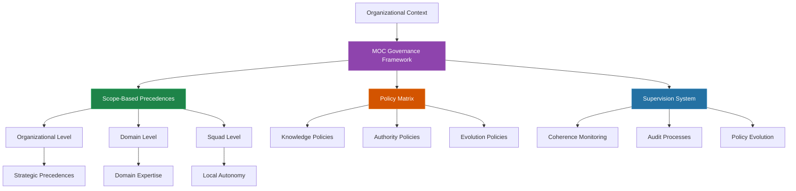
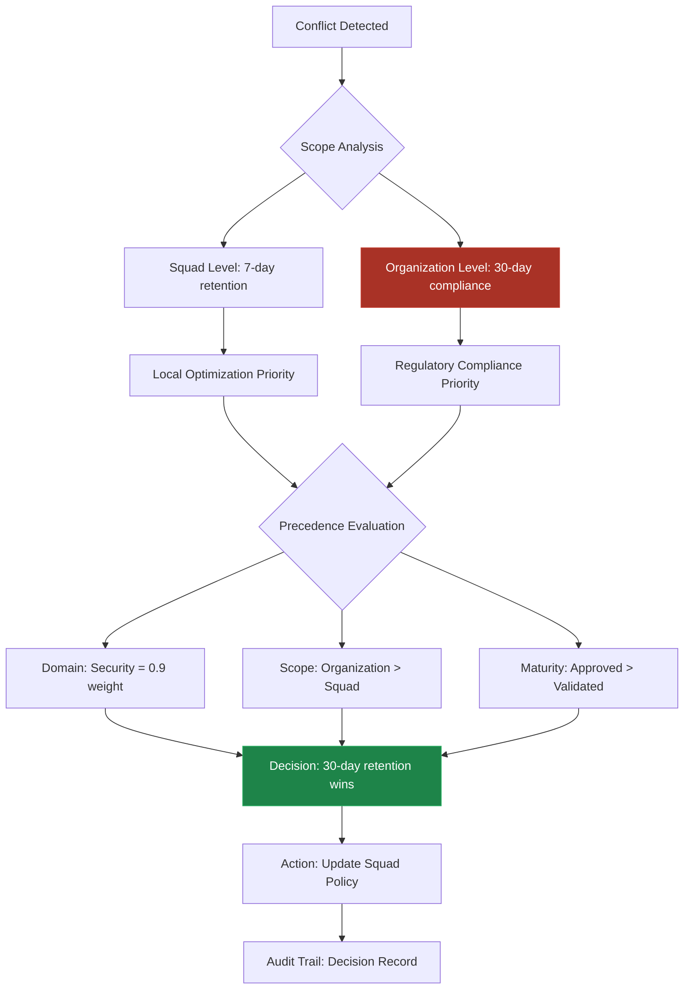
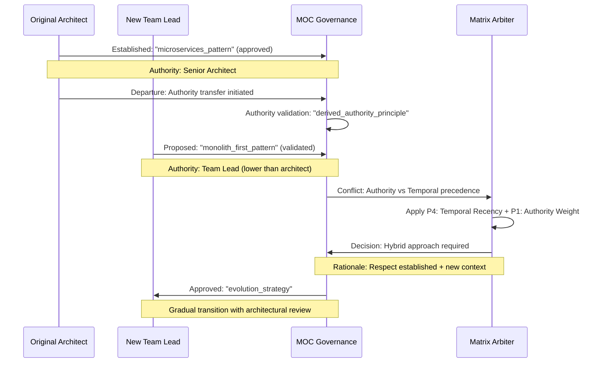
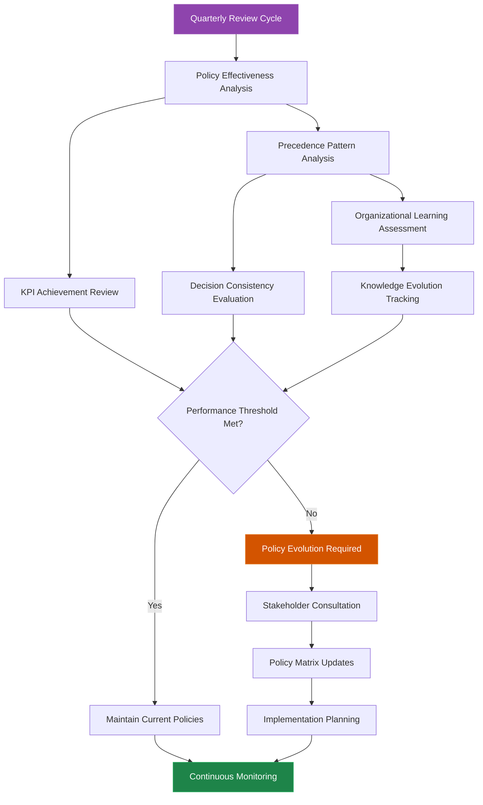

# MOC Governance and Policy Matrix

The **Matrix Ontology Catalog (MOC)** governance system establishes comprehensive organizational coherence through scope-based precedences and policy supervision. This framework ensures consistent decision-making while maintaining semantic elasticity and derived authority principles.

## Governance Architecture Overview



## Scope-Based Precedence System

### Hierarchical Precedence Framework

The MOC governance operates through three fundamental precedence dimensions:

#### 1. **Organizational Scope Precedences**

```yaml
organizational_precedences:
  scope_hierarchy:
    - level: "enterprise"
      priority: 1
      governance_rules:
        - regulatory_compliance: "mandatory"
        - strategic_alignment: "required"
        - risk_management: "critical"
        
    - level: "business_unit"
      priority: 2
      governance_rules:
        - market_adaptation: "flexible"
        - resource_optimization: "balanced"
        - customer_focus: "priority"
        
    - level: "squad"
      priority: 3
      governance_rules:
        - operational_efficiency: "local"
        - technical_excellence: "autonomous"
        - delivery_speed: "optimized"
```

#### 2. **Domain Knowledge Precedences**

```yaml
domain_precedences:
  expertise_hierarchy:
    - domain: "security"
      precedence_weight: 0.9
      escalation_required: true
      authority_validation: "mandatory"
      
    - domain: "compliance"
      precedence_weight: 0.85
      escalation_required: true
      authority_validation: "mandatory"
      
    - domain: "business"
      precedence_weight: 0.7
      escalation_required: false
      authority_validation: "recommended"
      
    - domain: "technical"
      precedence_weight: 0.6
      escalation_required: false
      authority_validation: "local"
```

#### 3. **Epistemic Maturity Precedences**

```yaml
maturity_precedences:
  validation_hierarchy:
    - maturity: "approved"
      precedence_score: 10
      change_authority: "committee"
      impact_assessment: "mandatory"
      
    - maturity: "validated"
      precedence_score: 7
      change_authority: "domain_expert"
      impact_assessment: "recommended"
      
    - maturity: "endorsed"
      precedence_score: 4
      change_authority: "peer_review"
      impact_assessment: "optional"
      
    - maturity: "draft"
      precedence_score: 1
      change_authority: "author"
      impact_assessment: "none"
```

## Practical Organizational Cases

### Case 1: Cross-Squad Security Policy Conflict

**Scenario**: Payment Squad implements 7-day data retention while Security Policy mandates 30-day retention for audit compliance.

**MOC Governance Resolution**:



**Governance Resolution**:
- **Winner**: 30-day retention policy (organizational level)
- **Precedence Applied**: P1 (Authority Weight) + P2 (Scope Specificity)
- **Rationale**: Security domain precedence (0.9) + organizational scope override
- **Action**: Squad policy automatically updated with compliance justification

### Case 2: Multi-Domain Knowledge Enhancement

**Scenario**: Technical and Business teams propose conflicting API versioning strategies during product evolution.

**MOC Governance Process**:

```yaml
conflict_resolution:
  participants:
    - squad: "backend_engineering"
      proposal: "semantic_versioning_strict"
      domain_ref: "technical"
      maturity_ref: "validated"
      
    - squad: "product_management"
      proposal: "marketing_versioning_strategy"
      domain_ref: "business"
      maturity_ref: "endorsed"
      
  governance_evaluation:
    domain_precedence:
      technical: 0.6
      business: 0.7
      result: "business_domain_advantage"
      
    scope_analysis:
      both_squads: "equal_level"
      escalation_required: true
      
    maturity_comparison:
      validated_vs_endorsed: "technical_advantage"
      
  resolution_matrix:
    business_domain: +0.7
    validated_maturity: +0.3
    cross_squad_impact: +0.5
    total_score_business: 1.5
    total_score_technical: 0.9
    
  decision:
    winner: "marketing_versioning_strategy"
    implementation: "hybrid_approach"
    governance_note: "Technical constraints as guardrails"
```

### Case 3: Temporal Precedence with Authority Evolution

**Scenario**: Original architect leaves organization; new team lead proposes architecture changes to established patterns.

**Governance Dynamics**:



## Organizational Policy Matrix

### Knowledge Governance Policies

```yaml
knowledge_governance:
  epistemological_standards:
    semantic_elasticity_enforcement:
      description: "Maintain organizational adaptability while preserving conceptual integrity"
      application_scope: "all_domains"
      validation_criteria:
        - local_taxonomy_flexibility: "required"
        - core_concept_preservation: "mandatory"
        - semantic_consistency: "monitored"
        
    stratified_epistemology_compliance:
      description: "Enforce maturity-based knowledge hierarchy across organization"
      application_scope: "all_ukis"
      validation_criteria:
        - maturity_progression_logic: "validated"
        - promotion_justification: "mandatory"
        - epistemological_audit_trail: "complete"
        
    derived_authority_validation:
      description: "Ensure all authority claims reference organizational context"
      application_scope: "all_decisions"
      validation_criteria:
        - moc_node_citation: "required"
        - absolute_statement_prohibition: "enforced"
        - contextual_authority_mapping: "validated"
```

### Authority Management Policies

```yaml
authority_management:
  scope_based_permissions:
    description: "Define decision-making authority based on MOC scope hierarchy"
    implementation:
      squad_level:
        authority_scope: "local_optimization"
        decision_autonomy: "high"
        escalation_triggers: ["cross_squad_impact", "security_implications"]
        
      tribe_level:
        authority_scope: "strategic_alignment"
        decision_autonomy: "medium"
        escalation_triggers: ["regulatory_impact", "organizational_policy"]
        
      enterprise_level:
        authority_scope: "organizational_coherence"
        decision_autonomy: "absolute"
        escalation_triggers: ["external_compliance"]
        
  hierarchical_validation:
    description: "Multi-level authority validation for critical decisions"
    validation_matrix:
      low_impact_decisions:
        required_levels: 1
        validation_speed: "immediate"
        
      medium_impact_decisions:
        required_levels: 2
        validation_speed: "24_hours"
        
      high_impact_decisions:
        required_levels: 3
        validation_speed: "72_hours"
        escalation_committee: true
```

### Decision Consistency Policies

```yaml
decision_consistency:
  precedence_rule_application:
    description: "Systematic application of MAL precedence rules P1-P6"
    enforcement_mechanism:
      automated_conflict_detection: true
      precedence_rule_validation: "mandatory"
      decision_record_generation: "automatic"
      
    consistency_monitoring:
      similar_case_analysis: "ai_assisted"
      precedence_drift_detection: "quarterly"
      organizational_learning: "continuous"
      
  conflict_resolution_protocols:
    description: "Standardized approaches for organizational conflict resolution"
    escalation_matrix:
      horizontal_conflicts:
        resolution_timeframe: "48_hours"
        required_stakeholders: "domain_experts"
        documentation_level: "detailed"
        
      vertical_conflicts:
        resolution_timeframe: "72_hours"
        required_stakeholders: "authority_hierarchy"
        documentation_level: "comprehensive"
        
      cross_functional_conflicts:
        resolution_timeframe: "1_week"
        required_stakeholders: "committee_review"
        documentation_level: "strategic"
```

## Supervision and Monitoring System

### Organizational Coherence KPIs

```yaml
coherence_monitoring:
  knowledge_consistency_metrics:
    uki_relationship_integrity:
      target: "≥95%"
      measurement: "automated_validation"
      frequency: "daily"
      
    semantic_alignment_score:
      target: "≥85%"
      measurement: "nlp_analysis"
      frequency: "weekly"
      
    authority_validation_compliance:
      target: "100%"
      measurement: "governance_audit"
      frequency: "monthly"
      
  decision_quality_indicators:
    precedence_rule_consistency:
      target: "≥98%"
      measurement: "mal_decision_analysis"
      frequency: "daily"
      
    escalation_resolution_time:
      target: "≤72_hours"
      measurement: "workflow_tracking"
      frequency: "realtime"
      
    organizational_learning_rate:
      target: "≥70%"
      measurement: "knowledge_evolution_analysis"
      frequency: "quarterly"
```

### Audit and Evolution Processes

#### Quarterly Governance Review



#### Continuous Improvement Framework

```yaml
improvement_framework:
  feedback_collection:
    stakeholder_input:
      frequency: "monthly"
      participants: ["domain_experts", "squad_leads", "governance_committee"]
      focus_areas: ["policy_effectiveness", "process_efficiency", "organizational_impact"]
      
    automated_analysis:
      conflict_pattern_detection: "daily"
      decision_quality_assessment: "weekly"
      organizational_coherence_measurement: "monthly"
      
  policy_evolution_triggers:
    performance_degradation:
      threshold: "≤80% target achievement"
      response_time: "immediate"
      escalation_level: "governance_committee"
      
    organizational_change:
      triggers: ["structure_modification", "strategic_shift", "domain_expansion"]
      response_time: "2_weeks"
      escalation_level: "leadership_team"
      
    regulatory_updates:
      triggers: ["compliance_requirement_change", "industry_standard_evolution"]
      response_time: "1_week"
      escalation_level: "compliance_committee"
```

## Implementation Guidelines

### Setting Up MOC Governance

1. **Organizational Assessment**
   - Map current authority structures
   - Identify domain expertise distribution
   - Analyze existing decision-making patterns

2. **Policy Matrix Configuration**
   - Customize precedence weights for organizational context
   - Define domain-specific governance rules
   - Establish escalation paths and authority levels

3. **Monitoring System Deployment**
   - Implement automated conflict detection
   - Set up KPI dashboards and alerting
   - Configure audit trail collection

4. **Stakeholder Training**
   - MOC governance principles education
   - Precedence rule application training
   - Escalation process familiarization

### Governance Evolution Strategy

```yaml
evolution_strategy:
  phase_1_foundation:
    duration: "3_months"
    focus: "basic_precedence_establishment"
    success_criteria: ["conflict_resolution_automation", "authority_mapping_completion"]
    
  phase_2_optimization:
    duration: "6_months"
    focus: "policy_refinement_and_monitoring"
    success_criteria: ["kpi_target_achievement", "stakeholder_satisfaction_≥80%"]
    
  phase_3_maturation:
    duration: "ongoing"
    focus: "continuous_improvement_and_learning"
    success_criteria: ["organizational_coherence_≥95%", "governance_efficiency_optimization"]
```

## 📖 Related Resources

### Core Matrix Protocol Frameworks
- [Matrix Embedding Framework (MEF)](/docs/frameworks/mef) - Knowledge structuring foundation
- [Zion Orchestration Framework (ZOF)](/docs/frameworks/zof) - Workflow coordination
- [Matrix Arbiter Layer (MAL)](/docs/frameworks/mal) - Conflict arbitration engine
- [Operator Intelligence Framework (OIF)](/docs/frameworks/oif) - AI archetype system

### Implementation Guides
- [Explainability Templates](/docs/manual/tools/explainability) - XAI/NLG decision communication
- [Quick Start Guide](/docs/quickstart) - Getting started with Matrix Protocol
- [Implementation Guide](/docs/implementation) - Complete deployment strategy

### Examples and Case Studies
- [Knowledge Comparison Examples](/docs/examples/knowledge) - Structured vs unstructured knowledge
- [Conceptual Roadmaps](/docs/examples/conceptual-roadmaps) - Framework integration flows
- [Business Rules Examples](/docs/examples/knowledge/structured/business-rules) - Real-world governance scenarios

---

**Matrix Protocol Beta** - Advanced governance for human-AI collaboration through epistemological frameworks.