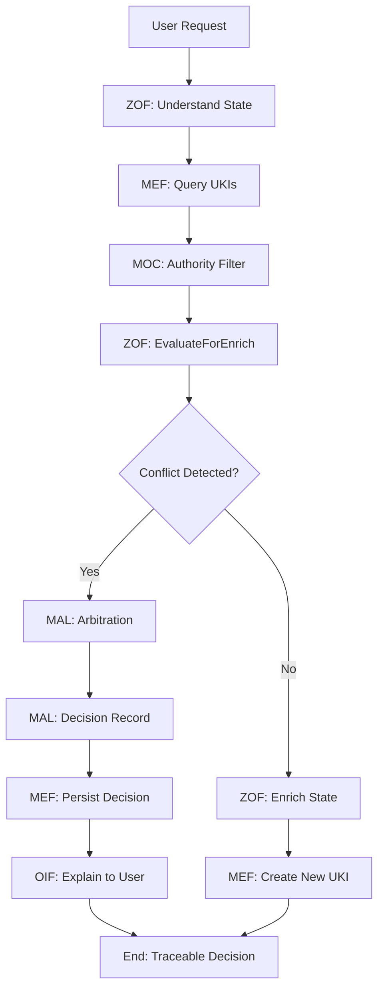

# Matrix Protocol — Human-AI Collaboration Protocol
**Acronym:** Matrix Protocol  
**Version:** 0.0.1-beta  
**Last Update:** 2025-10-05  

> ⚠️ **IMPORTANT**: This document is an informative translation. The authoritative version is MATRIX_PROTOCOL.md.

> 🚨 **IMPORTANT**: This document contains illustrative examples that are **NOT mandatory taxonomies**. All taxonomies are configurable via organizational MOC.

> "There are moments when a choice presents itself, silent, at the edge of the unknown. Some doors invite us to cross them — and in doing so, nothing is ever the same again." — Morpheus

---

## 1. Introduction

The **Matrix Protocol** is an integrated ecosystem that connects humans and AI through three interdependent layers: **Oracle**, **Zion**, and **Operator**.

Each layer plays a unique role in the strategic, technical, and operational flow, ensuring that guidelines are transformed into practical actions with efficiency and intelligence.

Matrix Protocol establishes the conceptual and technical foundation for structured collaboration between humans and artificial intelligence, providing governance, traceability, and organizational adaptability.

---

## 2. Terms and Definitions

### 2.1 Core Components

**Matrix Protocol**: Integrated framework for human-AI collaboration consisting of Oracle, Zion, and Operator layers with cross-cutting governance.

**UKI (Universal Knowledge Identifier)**: Structured knowledge unit following MEF standards with unique identification, versioning, and semantic relationships.

**MOC (Matrix Ontology Catalog)**: Organizational ontological catalog that defines taxonomies, governance rules, and authority structures.

**MEF (Matrix Embedding Framework)**: Knowledge structuring framework for creating, versioning, and managing UKIs.

**ZOF (Zion Orchestration Framework)**: Workflow orchestration framework with canonical states and AI integration checkpoints.

**OIF (Operator Intelligence Framework)**: AI archetype framework for configuring intelligent agents with organizational context.

**MAL (Matrix Arbiter Layer)**: Deterministic conflict arbitration layer using precedence rules and organizational policies.

**MEP (Matrix Epistemic Principle)**: Epistemological manifesto establishing principles for knowledge treatment and evaluation.

### 2.2 Architectural Concepts

**Oracle Layer**: Strategic governance level responsible for knowledge management, policies, and long-term decision making.

**Zion Layer**: Conceptual orchestration level that coordinates workflows, processes, and AI-human interactions.

**Operator Layer**: Practical execution level where AI agents and human operators implement concrete actions.

**Cross-cutting Layers**: Transversal components (MOC, MAL) that provide governance and arbitration across all architectural levels.

---

## 3. Protocol Architecture

### 3.1 Three-Layer Architecture

The Matrix Protocol operates through three interdependent architectural layers:

#### 🔮 **Oracle Layer** (Strategic)
- **Purpose**: Strategic governance and knowledge base management
- **Main Framework**: MEF (Matrix Embedding Framework)
- **Responsibilities**: Knowledge structuring, version control, semantic relationships
- **Users**: Domain specialists, knowledge architects, business analysts

#### ⚡ **Zion Layer** (Orchestration)
- **Purpose**: Conceptual workflow framework for AI-oriented teams
- **Main Framework**: ZOF (Zion Orchestration Framework)  
- **Responsibilities**: Workflow orchestration, AI-human coordination, decision checkpoints
- **Users**: Technical leaders, process architects, AI coordinators

#### 🧠 **Operator Layer** (Execution)
- **Purpose**: Practical execution and implementation by development teams
- **Main Framework**: OIF (Operator Intelligence Framework)
- **Responsibilities**: AI agent configuration, task execution, operational intelligence
- **Users**: Developers, AI engineers, operations teams

### 3.2 Cross-cutting Components

#### 🏛️ **MOC (Matrix Ontology Catalog)**
- **Purpose**: Foundational organizational taxonomy and governance
- **Scope**: All layers and frameworks
- **Capabilities**: Authority validation, taxonomic evolution, governance policies

#### ⚖️ **MAL (Matrix Arbiter Layer)**
- **Purpose**: Deterministic conflict arbitration and resolution
- **Scope**: Cross-framework conflict resolution
- **Capabilities**: Precedence rules application, decision auditing, escalation management

---

## 4. Integration Flow

### 4.1 Typical Integration Sequence

### 4.2 Framework Interdependencies

**MOC → All Frameworks**: Provides taxonomic foundation and governance rules
**MEF → ZOF**: Structured knowledge feeds workflow decisions
**ZOF → OIF**: Orchestration results configure AI agents
**ZOF → MAL**: Conflicts trigger arbitration processes
**MAL → MEF**: Arbitration decisions become persistent knowledge

---

## 5. Implementation Guidelines

### 5.1 Implementation Phases

**Phase 1: Foundation (Months 1-2)**
1. Define organizational MOC
2. Implement basic MEF structure
3. Create initial UKI templates

**Phase 2: Workflow Integration (Months 3-4)**
1. Implement ZOF canonical states
2. Configure EvaluateForEnrich checkpoints
3. Establish Oracle consultation patterns

**Phase 3: AI Integration (Months 5-6)**
1. Configure OIF archetypes
2. Implement AI agent governance
3. Establish hierarchical explainability

**Phase 4: Advanced Governance (Months 7-9)**
1. Implement MAL arbitration
2. Configure conflict resolution policies
3. Establish escalation procedures

### 5.2 Success Criteria

**Organizational Maturity Indicators:**
- 80%+ knowledge structured as UKIs
- <2 minutes average knowledge retrieval time
- 95%+ conflict resolution without escalation
- Measurable ROI from knowledge reuse

**Technical Implementation Indicators:**
- Complete MOC implementation with governance
- All workflows follow ZOF canonical states
- AI agents demonstrate consistent behavior
- Audit trail available for all decisions

---

## 6. Conclusion

Matrix Protocol provides a comprehensive framework for human-AI collaboration through structured knowledge management, workflow orchestration, and intelligent automation. Its three-layer architecture with cross-cutting governance ensures scalable, auditable, and organizationally-aligned implementation.

The protocol's strength lies in its epistemological foundation (MEP), allowing organizations to maintain local flexibility while ensuring global coherence through shared structural principles.

---

> **💡 Implementation Tip**: Start with MOC and MEF implementation, then gradually expand to ZOF and OIF as organizational maturity increases. MAL should be implemented last, after conflict patterns are well understood.