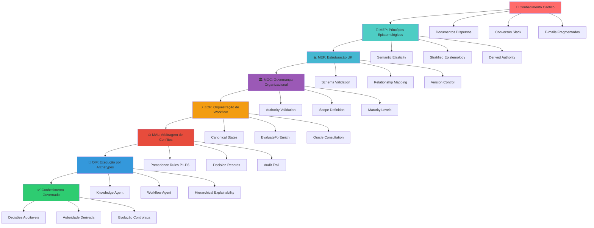
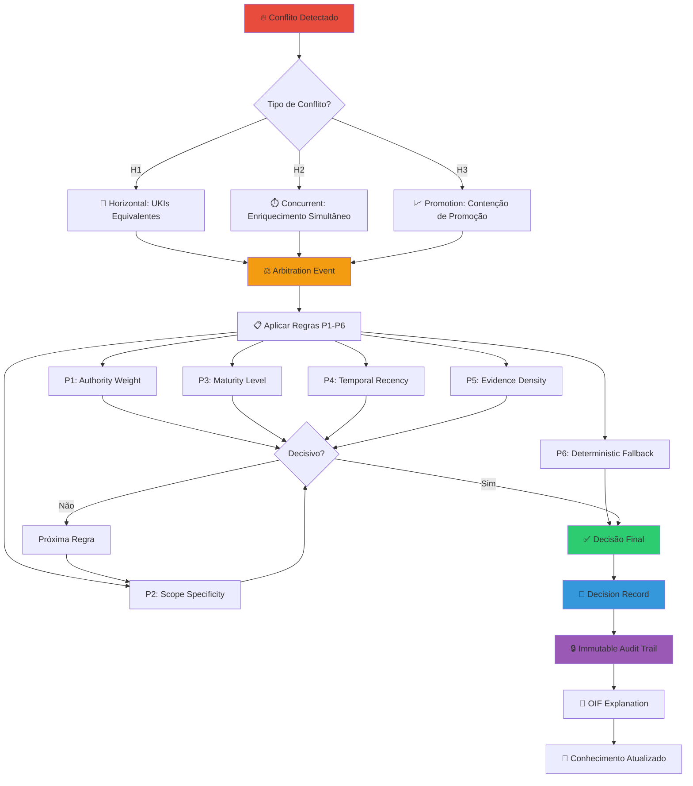
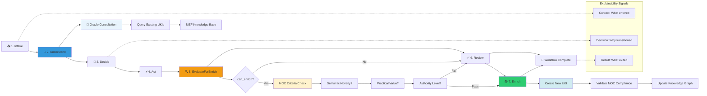

# Roteiros Conceituais da UKI

Esta página apresenta os fluxos epistemológicos fundamentais do Matrix Protocol, demonstrando como o conhecimento evolui da teoria à prática através dos frameworks MEP→MEF→ZOF→OIF. Os diagramas a seguir ilustram jornadas conceituais completas que conectam os princípios filosóficos aos resultados práticos.

## 1. Jornada da UKI: Do Conhecimento Caótico ao Estruturado

O primeiro fluxograma demonstra como o conhecimento organizacional não estruturado é transformado sistematicamente em conhecimento governado através dos frameworks Matrix Protocol.



### Exemplo Prático: Squad Payments

Utilizando o exemplo real do `moc-squad-payments.yaml`:

1. **Conhecimento Caótico**: 12 documentos dispersos sobre pagamentos
2. **MEP**: Aplicação dos princípios de elasticidade semântica
3. **MEF**: Criação de 17 UKIs estruturadas com relacionamentos
4. **MOC**: Governança via `scope_ref: squad-payments`
5. **ZOF**: Workflows de validação e enriquecimento
6. **MAL**: Arbitragem de conflitos de regras de desconto
7. **OIF**: Archetypes executando decisões contextualizadas

## 2. Fluxo de Arbitragem: MAL em Ação

Este diagrama detalha como o Matrix Arbiter Layer resolve conflitos de conhecimento usando as 6 regras de precedência determinísticas.



### Exemplo Real: Conflito de Retenção de Dados

```yaml
# Cenário: Duas UKIs conflitantes sobre retenção de dados
candidates:
  - uki:squad-x:rule:data-retention-30d (validated, tech-lead)
  - uki:squad-x:rule:data-retention-7d (endorsed, developer)

# MAL Decision:
winner: data-retention-30d
precedence: P3_maturity (validated > endorsed)
rationale: "Regulatory compliance supersedes data minimization"
```

## 3. Orquestração ZOF: Estados Canônicos e EvaluateForEnrich

O terceiro fluxograma apresenta como ZOF orquestra workflows de conhecimento através dos 7 estados canônicos obrigatórios.



### Exemplo Prático: Seleção de Gateway de Pagamento

```yaml
# ZOF Workflow: Escolha de gateway para novo mercado
flow_id: "payment-gateway-selection-brazil"

states:
  intake:
    context: "Necessidade de gateway para mercado brasileiro"
    
  understand:
    oracle_consultation:
      - uki:squad-payments:business_rule:fee-calculation-005
      - uki:squad-payments:technical_pattern:gateway-integration-007
    result: "Conhecimento base sobre gateways existentes"
    
  evaluate_for_enrich:
    moc_criteria: ["business_impact", "reusability", "authority"]
    can_enrich: true
    rationale: "Especificidades do mercado brasileiro são novel"
    
  enrich:
    new_uki: "uki:squad-payments:business_rule:brazil-gateway-rules-019"
    moc_compliance: "validated via scope_ref: squad-payments"
```

## 📖 Recursos Relacionados

### Frameworks Matrix Protocol
- [MEF - Matrix Embedding Framework](/pt/docs/frameworks/mef) - Estruturação de conhecimento via UKIs
- [ZOF - Zion Orchestration Framework](/pt/docs/frameworks/zof) - Orquestração de workflows AI-oriented
- [OIF - Operator Intelligence Framework](/pt/docs/frameworks/oif) - Archetypes e execução inteligente
- [MOC - Matrix Ontology Catalog](/pt/docs/frameworks/moc) - Governança organizacional
- [MAL - Matrix Arbiter Layer](/pt/docs/frameworks/mal) - Arbitragem determinística

### Exemplos Práticos
- [Comparação de Conhecimento](/pt/docs/examples) - Estruturado vs Não-estruturado
- [UKI Examples](/pt/docs/examples/knowledge/structured) - Exemplos reais de UKIs
- [Pilots Organizacionais](/pt/docs/examples/pilots) - Casos de implementação

### Manual de Implementação
- [Guia de Implementação](/pt/docs/implementation) - Passos práticos de adoção
- [Templates por Organização](/pt/docs/manual/templates) - Modelos específicos por tamanho
- [Ferramentas e Validação](/pt/docs/manual/tools) - Utilitários de suporte

### Quickstart
- [Início Rápido](/pt/docs/quickstart) - Primeiros passos com Matrix Protocol
- [Templates Quickstart](/pt/docs/quickstart/templates) - Modelos para início rápido