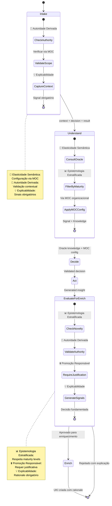
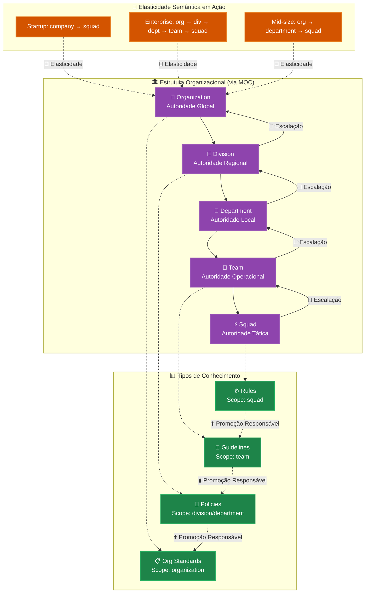
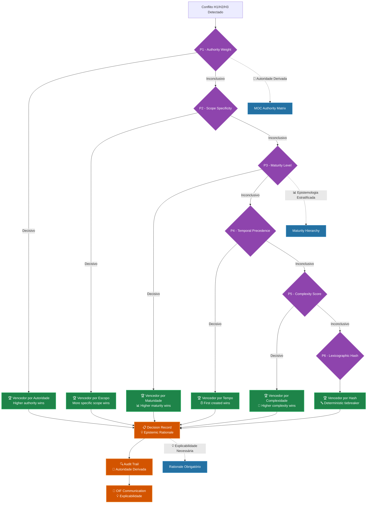

# MEP-Frameworks: Mapeamento Completo de Relacionamentos

O **Matrix Epistemic Principle (MEP)** é o fundamento filosófico que orienta todos os frameworks do Matrix Protocol. Este documento mapeia **como cada um dos 5 princípios MEP se manifesta concretamente** em cada framework, garantindo consistência epistemológica em toda a arquitetura.

## 1. Visão Geral dos Relacionamentos

### Matriz de Relacionamentos MEP-Frameworks

| Princípio MEP | MEF | ZOF | OIF | MOC | MAL |
|---------------|-----|-----|-----|-----|-----|
| **🔄 Elasticidade Semântica** | ⭐⭐⭐ | ⭐⭐ | ⭐ | ⭐⭐⭐ | ⭐⭐ |
| **📊 Epistemologia Estratificada** | ⭐⭐⭐ | ⭐⭐⭐ | ⭐⭐ | ⭐⭐ | ⭐⭐⭐ |
| **⬆️ Promoção Responsável** | ⭐⭐⭐ | ⭐⭐ | ⭐ | ⭐ | ⭐⭐ |
| **👥 Autoridade Derivada** | ⭐⭐⭐ | ⭐⭐⭐ | ⭐⭐⭐ | ⭐⭐⭐ | ⭐⭐⭐ |
| **💡 Explicabilidade Necessária** | ⭐⭐ | ⭐⭐ | ⭐⭐⭐ | ⭐ | ⭐⭐⭐ |

**Legenda**: ⭐ = Relacionamento fraco | ⭐⭐ = Relacionamento médio | ⭐⭐⭐ = Relacionamento forte

### Arquitetura Epistemológica Global

```mermaid
graph TB
    subgraph "🔮 MEP - Princípios Epistemológicos"
        P1[🔄 Elasticidade Semântica]
        P2[📊 Epistemologia Estratificada]
        P3[⬆️ Promoção Responsável]
        P4[👥 Autoridade Derivada]
        P5[💡 Explicabilidade Necessária]
    end
    
    subgraph "📊 MEF - Estruturação de Conhecimento"
        MEF1[Campos *_ref]
        MEF2[Campo maturity_ref]
        MEF3[Campo promotion_rationale]
        MEF4[Campos scope_ref/governance_ref]
        MEF5[Metadados de auditoria]
    end
    
    subgraph "⚡ ZOF - Orquestração de Workflows"
        ZOF1[Configuração MOC]
        ZOF2[Estado EvaluateForEnrich]
        ZOF3[Validação de autoridade]
        ZOF4[Sinais obrigatórios]
    end
    
    subgraph "🧠 OIF - Inteligência de Operadores"
        OIF1[Responses contextuais]
        OIF2[Templates XAI/NLG]
        OIF3[Respeito a maturity levels]
    end
    
    subgraph "🏛️ MOC - Ontologia Organizacional"
        MOC1[Configuração local]
        MOC2[Hierarquias de escopo]
        MOC3[Definições de autoridade]
    end
    
    subgraph "⚖️ MAL - Arbitragem de Conflitos"
        MAL1[Regras de precedência P1-P6]
        MAL2[Decision records]
        MAL3[Justificativas epistemológicas]
    end
    
    P1 --> MEF1
    P1 --> ZOF1
    P1 --> MOC1
    
    P2 --> MEF2
    P2 --> ZOF2
    P2 --> OIF3
    P2 --> MAL1
    
    P3 --> MEF3
    P3 --> ZOF2
    
    P4 --> MEF4
    P4 --> ZOF3
    P4 --> OIF1
    P4 --> MOC2
    P4 --> MOC3
    P4 --> MAL1
    
    P5 --> MEF5
    P5 --> ZOF4
    P5 --> OIF2
    P5 --> MAL2
    P5 --> MAL3
    
    %% Estilização Matrix Protocol
    classDef mep fill:#8E44AD,stroke:#9B59B6,color:#fff,stroke-width:2px
    classDef mef fill:#1E8449,stroke:#27AE60,color:#fff,stroke-width:2px
    classDef zof fill:#D35400,stroke:#E67E22,color:#fff,stroke-width:2px
    classDef oif fill:#2471A3,stroke:#2980B9,color:#fff,stroke-width:2px
    classDef moc fill:#8E44AD,stroke:#9B59B6,color:#fff,stroke-width:2px
    classDef mal fill:#A93226,stroke:#C0392B,color:#fff,stroke-width:2px
    
    class P1,P2,P3,P4,P5 mep
    class MEF1,MEF2,MEF3,MEF4,MEF5 mef
    class ZOF1,ZOF2,ZOF3,ZOF4 zof
    class OIF1,OIF2,OIF3 oif
    class MOC1,MOC2,MOC3 moc
    class MAL1,MAL2,MAL3 mal
```



## 2. MEP → MEF (Matrix Embedding Framework)

### 🔄 Elasticidade Semântica no MEF

**Manifestação**: Campos de referência (*_ref) que apontam para configurações MOC organizacionais.

**Implementação Técnica**:
```yaml
# Estrutura UKI demonstrando elasticidade semântica
uki_example:
  scope_ref: "squad-payments"        # Configurável por organização
  domain_ref: "business"             # Definido no MOC local
  type_ref: "business_rule"          # Taxonomia organizacional
  maturity_ref: "validated"          # Níveis definidos no MOC
```

**Princípio Aplicado**: Ao invés de valores fixos (hardcoded), o MEF usa referências que se adaptam ao contexto organizacional definido no MOC.

**Exemplo Prático**: 
- **Startup**: `scope_ref` pode ser simplesmente "company"
- **Enterprise**: `scope_ref` pode ter 5 níveis hierárquicos como "division.department.team.squad.project"

### 📊 Epistemologia Estratificada no MEF

**Manifestação**: Campo `maturity_ref` que implementa níveis de maturidade epistemológica.

**Progressão Epistemológica**:
```yaml
maturity_progression:
  draft: "Conhecimento inicial, não validado"
  reviewed: "Revisado por pares, mas não aprovado"
  validated: "Validado tecnicamente e operacionalmente"
  approved: "Aprovado para uso organizacional"
  deprecated: "Marcado para descontinuação"
```

**Regras Estratificadas**:
- UKI `draft` NÃO pode sobrescrever UKI `validated`
- Promoção de maturidade requer justificativa via `promotion_rationale`
- Cada organização define critérios via MOC

### ⬆️ Promoção Responsável no MEF

**Manifestação**: Campo obrigatório `promotion_rationale` para mudanças significativas.

**Estrutura de Promoção**:
```yaml
promotion_example:
  previous_maturity: "reviewed"
  new_maturity: "validated"
  promotion_rationale: |
    Validação completa realizada:
    1. Testes de integração passaram (98% coverage)
    2. Review de segurança aprovado (security team)
    3. Análise de impacto organizacional documentada
    4. Aprovação de tech-lead e compliance officer
  
  impact_analysis:
    affected_systems: ["payment-gateway", "fraud-detection"]
    business_value: "Redução de 15% em falsos positivos"
    risk_assessment: "Baixo - compatível com sistemas existentes"
```

**Princípio Aplicado**: Toda evolução de conhecimento deve ser acompanhada de justificativa epistemológica explícita.

### 👥 Autoridade Derivada no MEF

**Manifestação**: Campos `scope_ref` e `governance_ref` que contextualizam autoridade.

**Implementação de Autoridade**:
```yaml
authority_context:
  scope_ref: "squad-payments"
  governance_ref: "tech-lead-approval"
  
  # Esta UKI deriva autoridade do contexto, não é autoridade absoluta
  authority_derivation: |
    Esta regra de negócio é válida no contexto do squad de pagamentos,
    sob governança de tech-lead. Em outros contextos organizacionais,
    diferentes regras podem se aplicar.
```

**Princípio Aplicado**: Nenhuma UKI afirma verdade absoluta - toda autoridade deriva do contexto organizacional.

### 💡 Explicabilidade Necessária no MEF

**Manifestação**: Metadados de auditoria e relacionamentos semânticos.

**Trilha de Explicabilidade**:
```yaml
explainability_metadata:
  creation_rationale: "Necessidade identificada durante incident post-mortem"
  validation_evidence: ["tests/payment-rules.spec.js", "docs/business-analysis.md"]
  relationships:
    - type: "derives_from"
      target: "uki:payments:pattern:gateway-integration-007"
      explanation: "Especializa padrão genérico para regras específicas"
    - type: "conflicts_with"
      target: "uki:legacy:rule:old-payment-logic-001"
      explanation: "Substitui lógica legada com melhor tratamento de erros"
  
  audit_trail:
    created_by: "tech-lead-alice"
    approved_by: "compliance-officer-bob"
    last_modified: "2025-10-30T14:30:00Z"
    change_history: ["v1.0.0 → v1.1.0: Adicionado suporte PIX"]
```

## 3. MEP → ZOF (Zion Orchestration Framework)

### 🔄 Elasticidade Semântica no ZOF

**Manifestação**: Configuração de workflows via MOC organizacional, evitando workflows rígidos.

**Configuração Elástica**:
```yaml
zof_workflow_configuration:
  workflow_id: "feature-development"
  
  # Configuração deriva do MOC organizacional
  moc_configuration:
    scope_validation: "squad.authority_matrix"
    enrichment_criteria: "organization.knowledge_policies"
    escalation_paths: "hierarchy.approval_chains"
  
  # Estados obrigatórios (universais)
  canonical_states: [intake, understand, decide, act, evaluate_for_enrich, review, enrich]
  
  # Configurações locais (elásticas)
  local_adaptations:
    understand_timeout: "organization_defined"  # Via MOC
    enrichment_thresholds: "squad_configured"   # Via MOC
    approval_requirements: "context_dependent"   # Via MOC
```

**Princípio Aplicado**: ZOF fornece estrutura universal (7 estados canônicos) mas permite configuração local via MOC.

#### Estados Canônicos com Princípios MEP



### 📊 Epistemologia Estratificada no ZOF

**Manifestação**: Estado `EvaluateForEnrich` que respeita níveis de maturidade epistemológica.

**Avaliação Estratificada**:
```yaml
evaluate_for_enrich_logic:
  inputs:
    current_knowledge: "Knowledge base consultado no estado Understand"
    new_insight: "Conhecimento gerado durante Act"
    user_authority: "Contexto de autoridade do usuário"
  
  stratified_evaluation:
    semantic_novelty:
      check: "O conhecimento é genuinamente novo?"
      threshold: "Configurado via MOC"
      
    epistemic_value:
      check: "O conhecimento tem valor epistemológico sustentável?"
      criteria: "Relevância + Reusabilidade + Impacto"
      
    authority_compatibility:
      check: "Usuário tem autoridade para criar conhecimento neste escopo?"
      validation: "Via MOC governance rules"
      
    maturity_alignment:
      check: "Novo conhecimento é compatível com maturidade existente?"
      rule: "Draft não sobrescreve Validated"
```

### ⬆️ Promoção Responsável no ZOF

**Manifestação**: Workflows de promoção que exigem justificativa antes de criação de UKI.

**Workflow de Promoção**:
```yaml
promotion_workflow:
  trigger: "EvaluateForEnrich aprovado para enriquecimento"
  
  promotion_validation:
    justification_required: true
    fields_validated:
      - epistemic_rationale: "Por que este conhecimento deve existir?"
      - impact_analysis: "Qual o impacto na base de conhecimento?"
      - evidence_provided: "Quais evidências suportam este conhecimento?"
  
  states_involved:
    evaluate_for_enrich: "Avalia se vale a pena promover"
    enrich: "Efetivamente cria nova UKI com justificativa"
    review: "Valida qualidade da promoção realizada"
```

### 👥 Autoridade Derivada no ZOF

**Manifestação**: Validação de autoridade em cada estado de workflow, baseada em contexto MOC.

**Validação Contextual de Autoridade**:
```yaml
authority_validation_per_state:
  intake:
    validation: "Usuário pode iniciar workflow neste escopo?"
    source: "MOC hierarchy definitions"
    
  understand:
    validation: "Usuário pode consultar Oracle com estes filtros?"
    source: "MOC visibility rules"
    
  decide:
    validation: "Usuário pode tomar decisões neste domínio?"
    source: "MOC decision authority matrix"
    
  act:
    validation: "Usuário pode executar ações neste contexto?"
    source: "MOC operational permissions"
    
  evaluate_for_enrich:
    validation: "Usuário pode enriquecer conhecimento neste escopo?"
    source: "MOC knowledge creation policies"
```

### 💡 Explicabilidade Necessária no ZOF

**Manifestação**: Sinais obrigatórios (context, decision, result) em cada transição de estado.

**Estrutura de Explicabilidade**:
```yaml
explainability_signals:
  state_transition: "understand → decide"
  
  required_signals:
    context: "Oracle retornou 12 UKIs relacionadas sobre pagamentos"
    decision: "Usar padrão gateway existente com adaptações para PIX"
    result: "Estratégia definida: integração Stripe + adaptador PIX"
  
  audit_generation:
    timestamp: "2025-10-30T14:45:00Z"
    workflow_id: "feature-pix-integration-001"
    user_context: "tech-lead-alice@squad-payments"
    state_duration: "00:05:23"
    
  explanation_template: |
    Durante o estado Understand, consultei o Oracle sobre integrações
    de pagamento e identifiquei 12 UKIs relevantes. Com base neste
    conhecimento, decidi usar o padrão gateway existente (UKI-007)
    adaptado para PIX brasileiro. Esta decisão deriva da autoridade
    de tech-lead no escopo squad-payments.
```

## 4. MEP → OIF (Operator Intelligence Framework)

### 👥 Autoridade Derivada no OIF

**Manifestação**: Archetypes NUNCA fazem afirmações absolutas - sempre contextualizam respostas.

**Padrão de Response Contextual**:
```yaml
knowledge_agent_response:
  user_query: "Qual é o melhor gateway de pagamento?"
  
  # ❌ RESPOSTA ABSOLUTA (Violação MEP)
  absolute_response: "Stripe é o melhor gateway de pagamento."
  
  # ✅ RESPOSTA COM AUTORIDADE DERIVADA (Conforme MEP)
  contextual_response: |
    Baseado no conhecimento do seu contexto organizacional (squad-payments),
    nossa base de conhecimento indica que Stripe tem sido efetivo para:
    
    - Casos de uso similares documentados em UKI-007
    - Conformidade com requisitos PCI do seu contexto
    - Suporte PIX conforme necessidades brasileiras mapeadas
    
    Esta recomendação deriva do conhecimento específico do seu escopo
    organizacional. Outros contextos podem ter recomendações diferentes.
    
    Referências: 
    - UKI: uki:payments:pattern:gateway-integration-007
    - Escopo: squad-payments  
    - Última atualização: 2025-10-15
```

### 📊 Epistemologia Estratificada no OIF

**Manifestação**: Archetypes respeitam níveis de maturidade ao fornecer conhecimento.

**Filtragem por Maturidade**:
```yaml
maturity_aware_response:
  user_authority: "developer"  # Nível básico
  
  knowledge_filtering:
    include:
      - maturity: ["validated", "approved"]
        rationale: "Conhecimento estável para uso operacional"
        
    exclude:
      - maturity: ["draft"]
        rationale: "Developer não deve usar conhecimento não validado"
        
    conditional:
      - maturity: ["reviewed"]
        condition: "if user.experience_level >= senior"
        rationale: "Apenas seniors podem usar conhecimento em review"

  response_structure:
    primary_recommendations: "Baseados em UKIs validated/approved"
    experimental_notes: "Mencionados apenas se user.role permite"
    maturity_transparency: "Sempre indicar nível de maturidade das fontes"
```

### 💡 Explicabilidade Necessária no OIF

**Manifestação**: Templates XAI/NLG que garantem explicações estruturadas e auditáveis.

**Template de Explicação Hierárquica**:
```yaml
hierarchical_explanation_template:
  decision_context:
    user_query: "Por que minha UKI foi rejeitada?"
    decision_type: "enrichment_rejection"
    
  explanation_layers:
    summary: |
      Sua UKI foi rejeitada durante avaliação de enriquecimento por 
      não atender critérios organizacionais de novidade semântica.
      
    detailed_rationale: |
      Análise detalhada:
      1. Novidade Semântica: 35% (threshold: 60%)
         - Conceito já coberto por UKI-005 e UKI-012
         - Diferenciação insuficiente identificada
         
      2. Valor Prático: 85% (threshold: 70%) ✓
         - Aplicabilidade clara identificada
         - Casos de uso válidos documentados
         
      3. Autoridade: Válida ✓
         - Escopo: squad-payments (autorizado)
         - Nível: tech-lead (suficiente)
    
    evidence_provided:
      similar_ukis: ["uki:payments:rule:discount-logic-001", "uki:payments:rule:fee-calculation-005"]
      evaluation_criteria: "organization.knowledge_policies.enrichment_criteria"
      authority_validation: "moc.hierarchy.squad-payments.permissions"
      
    actionable_guidance: |
      Para aprovação futura, considere:
      - Diferenciar claramente de UKI-005 (foco em edge cases)
      - Documentar casos de uso não cobertos pelas UKIs existentes
      - Fornecer evidências de valor prático específico
      
    audit_trail:
      evaluated_by: "ZOF.evaluate_for_enrich"
      timestamp: "2025-10-30T15:00:00Z"
      decision_id: "eval-rejection-20251030-001"
```

## 5. MEP → MOC (Matrix Ontology Catalog)

### 🔄 Elasticidade Semântica no MOC

**Manifestação**: MOC permite configuração organizacional completa de taxonomias e hierarquias.

**Configuração Organizacional Elástica**:
```yaml
# Startup Configuration
startup_moc:
  hierarchies:
    scope:
      - company
    domain:
      - business
      - technical
    maturity:
      - draft
      - validated

---

# Enterprise Configuration  
enterprise_moc:
  hierarchies:
    scope:
      - organization
        - division
          - department
            - team
              - squad
                - project
    domain:
      - business
        - strategy
        - operations
        - compliance
      - technical
        - architecture
        - infrastructure
        - security
    maturity:
      - draft
      - reviewed
      - validated
      - approved
      - deprecated
```

**Princípio Aplicado**: Mesma estrutura conceitual (hierarquias), configuração totalmente diferente por organização.

#### Hierarquia de Autoridade Contextual



### 👥 Autoridade Derivada no MOC

**Manifestação**: Definição de autoridade baseada em contexto hierárquico e organizacional.

**Matriz de Autoridade Contextual**:
```yaml
authority_matrix:
  scope_permissions:
    organization:
      can_modify: ["cto", "architect", "principal-engineer"]
      can_view: ["all_authenticated"]
      
    division:
      can_modify: ["division-lead", "principal-engineer"]
      can_view: ["division_members", "organization_leaders"]
      
    team:
      can_modify: ["tech-lead", "team-lead"]
      can_view: ["team_members", "division_leads", "organization_leaders"]
      
    squad:
      can_modify: ["squad_members"]
      can_view: ["squad_members", "team_leads", "organization_leaders"]

  domain_authority:
    business:
      decision_makers: ["product-manager", "business-analyst"]
      technical_validators: ["tech-lead", "architect"]
      
    technical:
      decision_makers: ["tech-lead", "architect", "principal-engineer"]
      business_validators: ["product-manager"]

  cross_scope_operations:
    requires_escalation: true
    escalation_path: ["team-lead", "division-lead", "cto"]
    exception_handlers: ["security-officer", "compliance-officer"]
```

## 6. MEP → MAL (Matrix Arbiter Layer)

### 📊 Epistemologia Estratificada no MAL

**Manifestação**: Regras de precedência P1-P6 que respeitam níveis de maturidade epistemológica.

**Precedência P3 - Maturity Level**:
```yaml
p3_maturity_precedence:
  rule: "Higher epistemic maturity supersedes lower maturity"
  
  hierarchy:
    approved: 4      # Máxima autoridade epistemológica
    validated: 3     # Alta confiabilidade
    reviewed: 2      # Confiabilidade média
    draft: 1         # Confiabilidade mínima
    
  conflict_resolution:
    scenario: "UKI validated vs UKI draft"
    decision: "UKI validated sempre vence"
    rationale: "Maturidade epistemológica superior"
    
    scenario: "UKI approved vs UKI validated"  
    decision: "UKI approved sempre vence"
    rationale: "Aprovação organizacional formal"

  exception_handling:
    critical_safety: "Draft pode bloquear Approved se segurança crítica"
    compliance_override: "Compliance rules supersede maturity hierarchy"
```

### 👥 Autoridade Derivada no MAL

**Manifestação**: Todas as regras de precedência consideram contexto organizacional.

**Precedência P1 - Authority Weight**:
```yaml
p1_authority_weight:
  principle: "Authority is always organizational context-derived"
  
  weight_calculation:
    base_authority: "user.role definido no MOC"
    scope_modifier: "Autoridade aumenta em escopos menores"
    domain_expertise: "Especialização no domínio relevante"
    
  examples:
    scenario_1:
      user: "tech-lead@squad-payments"
      scope: "squad-payments"
      domain: "technical"
      weight: 100  # Máxima autoridade no contexto
      
    scenario_2:
      user: "tech-lead@squad-payments"  
      scope: "organization"
      domain: "technical"
      weight: 30   # Autoridade limitada fora do escopo
      
    scenario_3:
      user: "tech-lead@squad-payments"
      scope: "squad-payments"
      domain: "business"
      weight: 60   # Autoridade média fora do domínio
```

### ⬆️ Promoção Responsável no MAL

**Manifestação**: Decisões de arbitragem que exigem justificativa epistemológica.

**Decision Record com Justificativa**:
```yaml
mal_decision_record:
  decision_id: "mal-arb-20251030-001"
  conflict_type: "H1 - Horizontal UKIs"
  
  candidates:
    winner: "uki:payments:rule:data-retention-30d"
    loser: "uki:payments:rule:data-retention-7d"
    
  precedence_applied: "P3 - Maturity Level"
  
  epistemic_rationale: |
    Decisão baseada em superioridade epistemológica da UKI vencedora:
    
    1. Maturidade Epistemológica:
       - Winner: validated (maturidade superior)
       - Loser: endorsed (maturidade inferior)
       
    2. Contexto Organizacional:
       - Escopo: squad-payments (compliance-critical)
       - Domínio: business (regulatory requirements)
       
    3. Justificativa da Precedência:
       - LGPD compliance requer validação rigorosa
       - Data retention policies têm implicações legais
       - UKI validated passou por compliance review
       
    4. Autoridade Derivada:
       - Winner: tech-lead + compliance-officer
       - Loser: developer (autoridade insuficiente para compliance)
       
    Esta decisão deriva da configuração organizacional MOC para
    squad-payments e não constitui verdade absoluta aplicável 
    a outros contextos organizacionais.
  
  audit_trail:
    arbitrated_by: "MAL.engine"
    timestamp: "2025-10-30T15:30:00Z"
    moc_context: "organization.squad-payments.policies"
    precedence_source: "organization.arbitration.rules.p1_to_p6"
```

### 💡 Explicabilidade Necessária no MAL

**Manifestação**: Todo processo de arbitragem gera explicação detalhada e auditável.

#### Fluxo de Precedência Visual



**Template de Explicação MAL**:
```yaml
mal_explanation_template:
  decision_summary: "Conflict resolved via P3 - Maturity Level precedence"
  
  step_by_step_explanation:
    step_1:
      action: "Conflict detected between equivalent UKIs"
      details: "H1 horizontal conflict in squad-payments scope"
      
    step_2:
      action: "Applied P1 - Authority Weight"
      result: "Inconclusive (both have valid authority)"
      
    step_3:
      action: "Applied P2 - Scope Specificity" 
      result: "Inconclusive (same scope: squad-payments)"
      
    step_4:
      action: "Applied P3 - Maturity Level"
      result: "Decisive (validated > endorsed)"
      winner: "uki:payments:rule:data-retention-30d"
      
  organizational_context:
    moc_policies_applied:
      - "compliance.data_retention.requires_validation"
      - "squad.payments.regulatory_compliance_mandatory"
      - "maturity.progression.draft_to_validated_to_approved"
      
  transparency_notes: |
    Esta arbitragem seguiu políticas organizacionais definidas no MOC.
    Diferentes organizações podem ter diferentes políticas de precedência.
    A decisão não é universalmente aplicável - deriva do contexto específico.
```

## 7. Casos Práticos Cross-Framework

### Caso 1: Jornada Completa de UKI com Todos os Princípios MEP

#### Timeline Visual Cross-Framework

```mermaid
graph LR
    subgraph "👤 Contexto Usuário"
        U[Desenvolvedor Squad Payments<br/>Autoridade: tech-lead<br/>Escopo: squad-payments]
    end
    
    subgraph "📊 T1: MEF - Criação UKI"
        MEF1[🔄 Elasticidade Semântica<br/>scope_ref='squad-payments']
        MEF2[📊 Epistemologia Estratificada<br/>maturity_ref='draft']
        MEF3[👥 Autoridade Derivada<br/>governance_ref='tech-lead']
    end
    
    subgraph "⚡ T2: ZOF - Workflow Processing"
        ZOF1[🔄 EvaluateForEnrich<br/>Configuração via MOC]
        ZOF2[💡 Sinais Obrigatórios<br/>context + decision + result]
        ZOF3[👥 Validação Autoridade<br/>Via MOC governance rules]
    end
    
    subgraph "⚖️ T3: MAL - Arbitragem (se conflito)"
        MAL1[📊 P3 - Maturity Level<br/>draft vs validated]
        MAL2[💡 Decision Record<br/>epistemic_rationale]
        MAL3[👥 Autoridade Contextual<br/>P1 - Authority Weight]
    end
    
    subgraph "🧠 T4: OIF - Comunicação"
        OIF1[👥 Response Contextual<br/>No seu contexto squad-payments...]
        OIF2[💡 Template XAI/NLG<br/>Explicação estruturada]
        OIF3[📊 Maturity Awareness<br/>Filtra por nível autorizado]
    end
    
    U --> MEF1
    MEF1 --> MEF2
    MEF2 --> MEF3
    MEF3 --> ZOF1
    ZOF1 --> ZOF2
    ZOF2 --> ZOF3
    ZOF3 --> MAL1
    MAL1 --> MAL2
    MAL2 --> MAL3
    MAL3 --> OIF1
    OIF1 --> OIF2
    OIF2 --> OIF3
    OIF3 --> U
    
    %% Estilização Matrix Protocol
    classDef user fill:#34495E,stroke:#2C3E50,color:#fff,stroke-width:2px
    classDef mef fill:#1E8449,stroke:#27AE60,color:#fff,stroke-width:2px
    classDef zof fill:#D35400,stroke:#E67E22,color:#fff,stroke-width:2px
    classDef mal fill:#A93226,stroke:#C0392B,color:#fff,stroke-width:2px
    classDef oif fill:#2471A3,stroke:#2980B9,color:#fff,stroke-width:2px
    
    class U user
    class MEF1,MEF2,MEF3 mef
    class ZOF1,ZOF2,ZOF3 zof
    class MAL1,MAL2,MAL3 mal
    class OIF1,OIF2,OIF3 oif
```



#### Detalhamento Técnico

```yaml
cross_framework_journey:
  scenario: "Criação de nova regra de negócio para pagamentos PIX"
  
  mep_principles_applied:
    
    # 🔄 ELASTICIDADE SEMÂNTICA
    elasticity_manifestation:
      mef: "UKI usa scope_ref='squad-payments' (configurável via MOC)"
      zof: "Workflow usa critérios organizacionais para avaliação"
      moc: "Hierarquia específica da organização aplicada"
      
    # 📊 EPISTEMOLOGIA ESTRATIFICADA  
    stratification_manifestation:
      mef: "UKI criada com maturity_ref='draft'"
      zof: "EvaluateForEnrich considera maturity na avaliação"
      mal: "P3 rule respeitará maturity se houver conflito"
      oif: "Knowledge Agent só mostra UKIs de maturity apropriada"
      
    # ⬆️ PROMOÇÃO RESPONSÁVEL
    promotion_manifestation:
      mef: "Campo promotion_rationale obrigatório para v1.0→v2.0"
      zof: "Enriquecimento só ocorre após justificativa epistemológica"
      mal: "Decision records documentam rationale de arbitragem"
      
    # 👥 AUTORIDADE DERIVADA
    authority_manifestation:
      mef: "UKI cita scope_ref e governance_ref (nunca verdade absoluta)"
      zof: "Cada estado valida autoridade via MOC"
      oif: "Responses sempre contextualizam autoridade"
      moc: "Define matriz de autoridade organizacional"
      mal: "P1 rule considera peso de autoridade contextual"
      
    # 💡 EXPLICABILIDADE NECESSÁRIA
    explainability_manifestation:
      mef: "Metadados de auditoria e relacionamentos semânticos"
      zof: "Sinais obrigatórios em cada transição de estado"
      oif: "Templates XAI/NLG para comunicação clara"
      mal: "Decision records com rationale epistemológico completo"

  timeline_example:
    t1_creation:
      framework: "MEF"
      action: "UKI criada com todos os campos MEP-compliant"
      mep_compliance: "Autoridade derivada (scope_ref), Estratificação (maturity_ref)"
      
    t2_workflow:
      framework: "ZOF" 
      action: "Workflow processa via EvaluateForEnrich"
      mep_compliance: "Explicabilidade (sinais), Autoridade (validação), Responsabilidade (critérios)"
      
    t3_conflict:
      framework: "MAL"
      action: "Conflito com UKI existente detectado"
      mep_compliance: "Estratificação (P3), Autoridade (P1), Explicabilidade (decision record)"
      
    t4_communication:
      framework: "OIF"
      action: "Resultado comunicado ao usuário"
      mep_compliance: "Autoridade derivada (resposta contextual), Explicabilidade (template estruturado)"
```

### Caso 2: Evolução de Conhecimento Cross-Framework

```yaml
knowledge_evolution_scenario:
  initial_state: "UKI draft sobre integração PIX"
  target_state: "Policy organizacional validada"
  
  mep_principles_journey:
    
    stage_1_draft_creation:
      frameworks_involved: ["MEF", "ZOF"]
      mep_principles:
        authority_derived: "UKI criada em escopo squad, não org"
        epistemic_stratification: "Maturity = draft"
        explainability: "Rationale de criação documentado"
        
    stage_2_validation:
      frameworks_involved: ["ZOF", "OIF", "MOC"]
      mep_principles:
        responsible_promotion: "promotion_rationale para draft→validated"
        authority_derived: "Validação por autoridade squad apropriada"
        semantic_elasticity: "Critérios definidos no MOC organizacional"
        
    stage_3_conflict_resolution:
      frameworks_involved: ["MAL", "OIF"]
      mep_principles:
        epistemic_stratification: "Validated supera Draft em conflitos"
        explainability: "Decision record com justificativa completa"
        authority_derived: "Arbitragem considera contexto organizacional"
        
    stage_4_organizational_promotion:
      frameworks_involved: ["MEF", "MOC", "ZOF"]
      mep_principles:
        responsible_promotion: "Squad rule → Org policy requer justificativa especial"
        authority_derived: "Promoção requer autoridade organizacional"
        semantic_elasticity: "Nova configuração MOC para escopo org"
        
    stage_5_final_state:
      result: "Policy organizacional estabelecida"
      mep_compliance_summary:
        - "Autoridade derivada: Policy válida apenas neste contexto org"
        - "Estratificação: Progression draft→validated→policy mantida"
        - "Promoção responsável: Cada mudança justificada epistemicamente"
        - "Elasticidade: Configuração via MOC preservada"
        - "Explicabilidade: Trilha auditável completa disponível"
```

## 8. Resumo Executivo

### Matriz Final de Relacionamentos

| Framework | Princípios MEP Implementados | Papel Epistemológico |
|-----------|------------------------------|----------------------|
| **MEF** | Todos os 5 princípios | **Materialização técnica** dos princípios em campos e estruturas |
| **ZOF** | Estratificação + Autoridade + Explicabilidade | **Orquestração epistemológica** via workflows conscientes |
| **OIF** | Autoridade + Explicabilidade + Estratificação | **Interface epistemológica** entre sistema e usuários |
| **MOC** | Elasticidade + Autoridade | **Configuração epistemológica** organizacional |
| **MAL** | Todos os 5 princípios | **Arbitragem epistemológica** em conflitos |

### Validação de Conformidade MEP

Para verificar se uma implementação está MEP-compliant, verifique:

1. **🔄 Elasticidade Semântica**: Usa configuração MOC ao invés de valores hardcoded?
2. **📊 Epistemologia Estratificada**: Respeita níveis de maturidade em decisões?
3. **⬆️ Promoção Responsável**: Exige justificativa para mudanças significativas?
4. **👥 Autoridade Derivada**: Contextualiza autoridade, evita verdades absolutas?
5. **💡 Explicabilidade Necessária**: Gera trilhas auditáveis e explicações claras?

### Benefícios da Arquitetura MEP-Framework

- **Consistência Epistemológica**: Todos os frameworks seguem os mesmos princípios
- **Flexibilidade Organizacional**: Configuração via MOC preserva elasticidade
- **Auditabilidade Completa**: Trilha epistemológica rastreável
- **Autoridade Contextual**: Evita imposições absolutas
- **Evolução Controlada**: Mudanças sempre justificadas epistemicamente

---

## 📖 Recursos Relacionados

### Documentação Core
- **[MEP - Matrix Epistemic Principle](../mep)** - Princípios epistemológicos fundamentais
- **[MEF - Matrix Embedding Framework](./mef)** - Estruturação técnica de conhecimento
- **[ZOF - Zion Orchestration Framework](./zof)** - Workflows epistemologicamente conscientes
- **[OIF - Operator Intelligence Framework](./oif)** - Interface de inteligência contextual
- **[MOC - Matrix Ontology Catalog](./moc)** - Configuração organizacional
- **[MAL - Matrix Arbiter Layer](./mal)** - Arbitragem epistemológica

### Implementação Prática
- **[Guia de Implementação](../implementation)** - Como implementar frameworks MEP-compliant
- **[Templates MOC](../manual/templates)** - Configurações organizacionais exemplo
- **[Casos de Uso](../examples)** - Exemplos reais de aplicação MEP

### Ferramentas de Validação
- **[Checklists de Validação](../manual/tools/validation-checklists)** - Verificação de conformidade MEP
- **[Explicabilidade](../manual/tools/explainability)** - Templates XAI/NLG
- **[Auditoria de Conteúdo](../manual/tools/content-audit)** - Ferramentas de verificação

---

> 🎯 **Síntese**: O MEP não é apenas filosofia - ele se manifesta concretamente em cada framework, garantindo que o Matrix Protocol seja epistemologicamente consistente, organizacionalmente flexível e completamente auditável.