# Schemas JSON Matrix Protocol

**Documentação técnica completa dos schemas JSON para validação e implementação dos 5 frameworks Matrix Protocol**

> 🎯 **Objetivo**: Fornecer documentação abrangente dos **24 schemas JSON** que implementam **238 patterns de validação** distribuídos pelos frameworks MEF, ZOF, OIF, MOC e MAL.

---

## 📋 Visão Geral

Os schemas JSON do Matrix Protocol garantem **consistência, integridade e interoperabilidade** em todo o ecossistema. Cada framework possui schemas específicos com padrões rigorosos de validação.

### 🏗️ Arquitetura de Schemas

```mermaid
graph TD
    A[Matrix Protocol Schemas] --> B[MEF - 6 schemas]
    A --> C[ZOF - 5 schemas]
    A --> D[OIF - 4 schemas]
    A --> E[MOC - 5 schemas]
    A --> F[MAL - 4 schemas]
    
    B --> B1[UKI Schema]
    B --> B2[Relationship Schema]
    B --> B3[Context Schema]
    
    C --> C1[Workflow Schema]
    C --> C2[State Schema]
    C --> C3[Transition Schema]
    
    D --> D1[Archetype Schema]
    D --> D2[Capability Schema]
    
    E --> E1[Hierarchy Schema]
    E --> E2[Node Schema]
    
    F --> F1[Decision Schema]
    F --> F2[Rule Schema]

    classDef mef fill:#1E8449,stroke:#2ECC71,color:#fff,stroke-width:2px
    classDef zof fill:#D35400,stroke:#E67E22,color:#fff,stroke-width:2px
    classDef oif fill:#2471A3,stroke:#2980B9,color:#fff,stroke-width:2px
    classDef moc fill:#8E44AD,stroke:#9B59B6,color:#fff,stroke-width:2px
    classDef mal fill:#A93226,stroke:#C0392B,color:#fff,stroke-width:2px

    class B,B1,B2,B3 mef
    class C,C1,C2,C3 zof
    class D,D1,D2 oif
    class E,E1,E2 moc
    class F,F1,F2 mal
```



### 📊 Métricas dos Schemas

| Framework | Schemas | Patterns | Principais Validações |
|-----------|---------|----------|----------------------|
| **MEF** | 6 | 85 patterns | UKI IDs, versioning, relationships |
| **ZOF** | 5 | 62 patterns | Workflow IDs, state transitions |
| **OIF** | 4 | 41 patterns | Archetype IDs, capabilities |
| **MOC** | 5 | 28 patterns | Hierarchy nodes, relationships |
| **MAL** | 4 | 22 patterns | Decision IDs, precedence rules |
| **Total** | **24** | **238** | Validação completa do ecossistema |

---

## 🚀 Como Começar

### Workflow Recomendado

#### 1. **Entender os Conceitos** 📖
```bash
# Comece lendo a documentação base
📄 Schema Usage Guide    # Implementação prática
📄 Patterns Reference   # Detalhes técnicos dos patterns
```

#### 2. **Explorar Exemplos** 🔍
```bash
# Veja casos práticos de validação
📄 Test Cases          # Exemplos válidos e inválidos
```

#### 3. **Implementar Validação** ⚙️
```javascript
// Exemplo básico de validação
import Ajv from 'ajv'
import addFormats from 'ajv-formats'

const ajv = new Ajv({ allErrors: true })
addFormats(ajv)

// Carregar e compilar schema
const ukiSchema = await fetch('/schemas/mef/uki/1.0.0').then(r => r.json())
const validate = ajv.compile(ukiSchema)

// Validar dados
const isValid = validate(ukiData)
if (!isValid) {
  console.log('Erros:', validate.errors)
}
```

#### 4. **Customizar para Organização** 🏢
```bash
# Se precisar estender schemas
📄 Customization Guide  # Estratégias de extensão
```

---

## 📚 Documentação Disponível

### 🎯 [Guia de Uso](./schema-usage-guide)
**Implementação prática dos schemas**
- Integração em JavaScript, Python, Go, Rust
- Exemplos de validação por framework
- Tratamento de erros e debugging
- Otimizações de performance

### 🧪 [Casos de Teste](./test-cases)
**Casos práticos de validação**
- 238 patterns testados com exemplos
- Cenários válidos e inválidos por framework
- Edge cases e situações especiais
- Testes de regressão

### 🔍 [Referência de Patterns](./patterns-reference)
**Documentação técnica detalhada**
- Explicação de cada pattern regex
- Justificativas de design e arquitetura
- Componentes e estruturas dos identificadores
- Debugging e troubleshooting

### ⚙️ [Guia de Customização](./customization-guide)
**Extensão organizacional dos schemas**
- Estratégias de extensão sem quebrar compatibilidade
- Padrões de herança e composição
- Governança e controle de versões
- Casos de uso avançados (multi-tenant, compliance)

---

## 🔧 Schemas por Framework

### MEF (Matrix Embedding Framework) <span style="color: #2ECC71">●</span>

**Especialidade**: Estruturação e versionamento de conhecimento

**Schemas principais:**
- **UKI Schema** - Validação de Units of Knowledge Interlinked
- **Relationship Schema** - Links e dependências entre UKIs
- **Context Schema** - Metadados contextuais
- **Versioning Schema** - Controle de evolução
- **Persistence Schema** - Armazenamento e retrieval
- **Format Schema** - Estruturas de conteúdo

**Patterns críticos:**
```regex
^uki:[a-z0-9-]+:[a-z0-9_]+:[a-z0-9-]+$     # UKI IDs
^(0|[1-9]\d*)\.(0|[1-9]\d*)\.(0|[1-9]\d*)$ # Semantic versioning
^mef-dr-[0-9]{8}-[a-z0-9]{8}$              # Decision records
```

### ZOF (Zion Orchestration Framework) <span style="color: #E67E22">●</span>

**Especialidade**: Orquestração de workflows e automação

**Schemas principais:**
- **Workflow Schema** - Definição de processos
- **State Schema** - Estados e transições
- **Step Schema** - Etapas individuais
- **Automation Schema** - Configurações de automação
- **Integration Schema** - Conectores externos

**Patterns críticos:**
```regex
^zof-wf-[a-z0-9-]+-v[0-9]+$               # Workflow IDs
^[a-z0-9_]+$                              # Step IDs
^[a-z0-9-]+\.[a-z0-9-]+$                  # Service references
```

### OIF (Operator Intelligence Framework) <span style="color: #2980B9">●</span>

**Especialidade**: Archetypes de IA e capacidades cognitivas

**Schemas principais:**
- **Archetype Schema** - Definição de archetypes
- **Capability Schema** - Capacidades e habilidades
- **Tool Schema** - Ferramentas e interfaces
- **Context Schema** - Contexto operacional

**Patterns críticos:**
```regex
^oif-arch-[a-z0-9-]+$                     # Archetype IDs
^[a-z0-9_]+$                              # Capability IDs
^[a-z0-9-]+(\.[a-z0-9-]+)*$               # Tool references
```

### MOC (Matrix Ontology Catalog) <span style="color: #9B59B6">●</span>

**Especialidade**: Hierarquias organizacionais e taxonomias

**Schemas principais:**
- **Hierarchy Schema** - Estruturas hierárquicas
- **Node Schema** - Nós organizacionais
- **Relationship Schema** - Relacionamentos entre nós
- **Scope Schema** - Escopos e contextos
- **Permission Schema** - Controle de acesso

**Patterns críticos:**
```regex
^[a-z0-9-]+$                              # Scope references
^moc-[a-z0-9-]+$                          # Node IDs
^(parent|child|sibling|related)$          # Relationship types
```

### MAL (Matrix Arbiter Layer) <span style="color: #C0392B">●</span>

**Especialidade**: Arbitragem de conflitos e resolução de precedência

**Schemas principais:**
- **Decision Schema** - Decisões de arbitragem
- **Rule Schema** - Regras de precedência
- **Event Schema** - Eventos de arbitragem
- **Conflict Schema** - Tipos de conflito

**Patterns críticos:**
```regex
^mal-dec-[0-9]{8}-[a-z0-9]+-[0-9]+$       # Decision IDs
^mal-evt-[0-9]{8}-[0-9]+$                 # Event references
^mal-v[0-9]+\.[0-9]+\.[0-9]+$             # MAL versioning
```

---

## ⚡ Integração Rápida

### Validação JavaScript/TypeScript

```javascript
import Ajv from 'ajv'
import addFormats from 'ajv-formats'

// Setup básico
const ajv = new Ajv({ 
  allErrors: true,
  verbose: true,
  strict: false 
})
addFormats(ajv)

// Função helper para validar qualquer schema
async function validateData(schemaUrl, data) {
  const schema = await fetch(schemaUrl).then(r => r.json())
  const validate = ajv.compile(schema)
  
  const isValid = validate(data)
  return {
    valid: isValid,
    errors: validate.errors || []
  }
}

// Exemplo de uso
const result = await validateData(
  'https://matrix-protocol.org/schemas/mef/uki/1.0.0',
  {
    id: 'uki:squad-payments:business_rule:discount-001',
    title: 'Volume and Coupon Discount Rules',
    version: '1.0.0'
  }
)

console.log('Valid:', result.valid)
```

### Validação Python

```python
import jsonschema
import requests

def validate_data(schema_url, data):
    """Valida dados contra schema Matrix Protocol"""
    schema = requests.get(schema_url).json()
    
    try:
        jsonschema.validate(data, schema)
        return {"valid": True, "errors": []}
    except jsonschema.ValidationError as e:
        return {"valid": False, "errors": [str(e)]}

# Exemplo de uso
result = validate_data(
    'https://matrix-protocol.org/schemas/mef/uki/1.0.0',
    {
        'id': 'uki:squad-payments:business_rule:discount-001',
        'title': 'Volume and Coupon Discount Rules',
        'version': '1.0.0'
    }
)

print(f"Valid: {result['valid']}")
```

---

## 🔗 URLs dos Schemas

### Ambiente de Produção
```
https://matrix-protocol.org/schemas/{framework}/{type}/{version}
```

### Ambiente de Desenvolvimento
```
http://localhost:3000/api/schemas/{framework}/{type}/{version}
```

### Exemplos de URLs
```bash
# MEF UKI Schema v1.0.0
/api/schemas/mef/uki/1.0.0

# ZOF Workflow Schema v1.0.0
/api/schemas/zof/workflow/1.0.0

# MAL Decision Schema v1.0.0
/api/schemas/mal/decision/1.0.0
```

---

## 🛡️ Validação e Qualidade

### Níveis de Validação

#### 1. **Sintática** (Schema JSON)
- Estrutura e tipos de dados
- Patterns regex obrigatórios
- Campos requeridos vs opcionais

#### 2. **Semântica** (Business Rules)
- Referências válidas entre entidades
- Consistência de versionamento
- Integridade relacional

#### 3. **Contextual** (Organizational)
- Políticas organizacionais
- Controle de acesso por escopo
- Compliance e auditoria

### Performance e Otimização

**Métricas alvo:**
- ✅ Validação < 10ms para UKIs simples
- ✅ Batch validation < 100ms para 50 items
- ✅ Schema loading < 50ms (com cache)
- ✅ Memory usage < 50MB para todos os schemas

---

## 📖 Próximos Passos

### Para Implementadores
1. **Leia**: [Schema Usage Guide](./schema-usage-guide) para integração prática
2. **Teste**: [Test Cases](./test-cases) para validar implementação
3. **Customize**: [Customization Guide](./customization-guide) para necessidades específicas

### Para Arquitetos
1. **Entenda**: [Patterns Reference](./patterns-reference) para detalhes técnicos
2. **Estenda**: [Customization Guide](./customization-guide) para governance
3. **Monitore**: Performance e compliance organizacional

### Para Product Owners
1. **Avalie**: Casos de uso e valor de negócio
2. **Defina**: Requisitos de customização organizacional
3. **Aprove**: Estratégias de extensão e governance

---

**💡 Dica**: Os schemas Matrix Protocol são projetados para evolução. Comece com validações básicas e evolua gradualmente conforme a maturidade da implementação organizacional.

**🔗 Links úteis:**
- [Documentação principal](../index) - Visão geral dos frameworks
- [MEF](../mef) - Matrix Embedding Framework
- [ZOF](../zof) - Zion Orchestration Framework  
- [OIF](../oif) - Operator Intelligence Framework
- [MOC](../moc) - Matrix Ontology Catalog
- [MAL](../mal) - Matrix Arbiter Layer