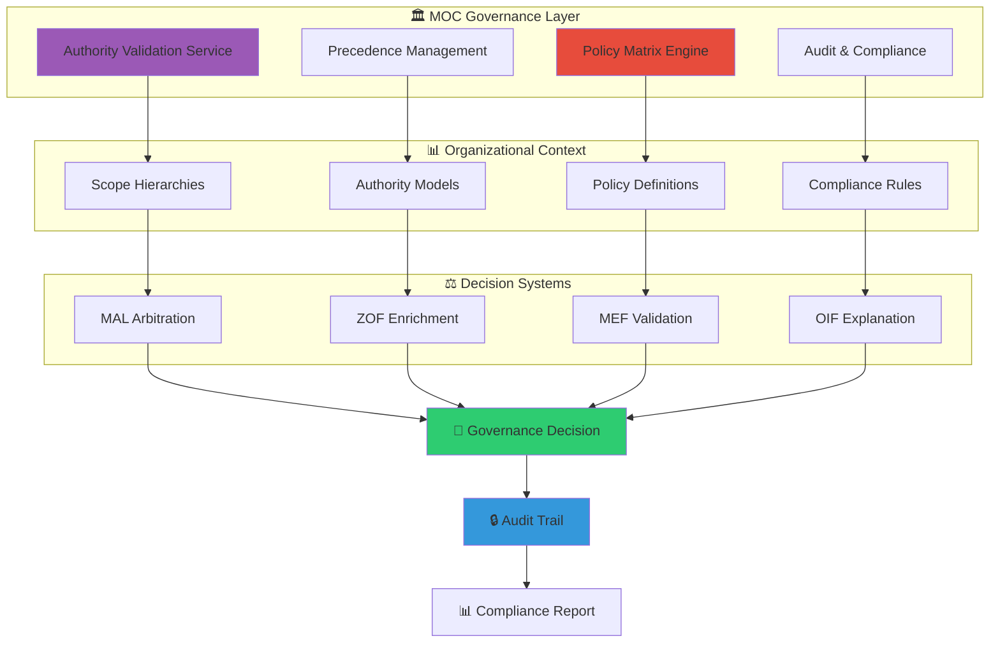
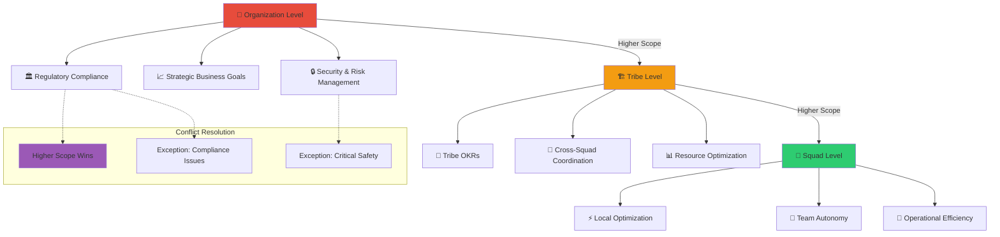
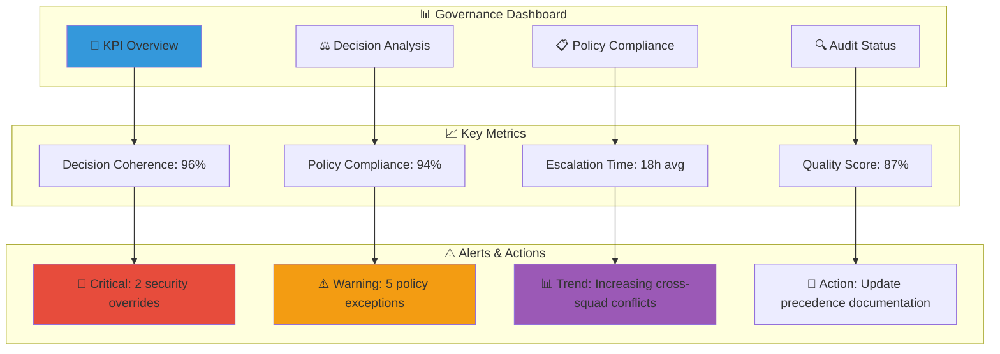
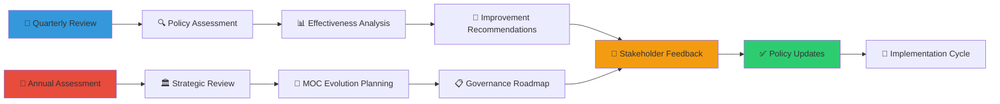

# Governança MOC e Matriz de Políticas

O Matrix Ontology Catalog (MOC) funciona como a espinha dorsal da governança organizacional no Matrix Protocol, definindo autoridade, precedências e políticas que garantem coerência epistêmica em escala. Esta página apresenta o sistema completo de governança MOC, incluindo precedências por escopo, matriz de políticas organizacionais e processos de supervisão.

## Visão Geral da Governança MOC

### Arquitetura de Governança



### Princípios da Governança MOC

#### 1. **Autoridade Derivada Organizacional**
Toda autoridade deriva do contexto organizacional específico, não de verdades universais.

#### 2. **Precedências Determinísticas**
Sistema de precedências claras e determinísticas para resolução de conflitos.

#### 3. **Elasticidade Semântica Controlada**
Flexibilidade organizacional dentro de frameworks de governança consistentes.

#### 4. **Auditabilidade Total**
Todas as decisões de governança são completamente auditáveis e rastreáveis.

## Sistema de Precedências por Escopo

### Hierarquia de Precedências Organizacionais



### Precedências por Domínio de Conhecimento

#### Domínio Business
```yaml
business_domain_precedences:
  priority_1: regulatory_compliance
    description: "Conformidade regulatória supera otimizações locais"
    examples:
      - LGPD/GDPR compliance vs. data minimization
      - Financial regulations vs. operational efficiency
    
  priority_2: customer_safety
    description: "Segurança do cliente tem precedência sobre conveniência"
    examples:
      - Security protocols vs. user experience
      - Data protection vs. personalization
    
  priority_3: business_strategy
    description: "Estratégia de negócio direciona decisões operacionais"
    examples:
      - Market expansion vs. current optimization
      - Long-term vision vs. short-term gains
    
  priority_4: operational_efficiency
    description: "Eficiência operacional em contexto local"
    examples:
      - Squad-specific optimizations
      - Team productivity improvements
```

#### Domínio Technical
```yaml
technical_domain_precedences:
  priority_1: security_standards
    description: "Padrões de segurança não são negociáveis"
    examples:
      - Security protocols vs. development speed
      - Encryption requirements vs. performance
    
  priority_2: architectural_coherence
    description: "Coerência arquitetural supera conveniência local"
    examples:
      - System-wide patterns vs. squad preferences
      - API consistency vs. local optimization
    
  priority_3: performance_requirements
    description: "Requisitos de performance críticos"
    examples:
      - SLA compliance vs. feature complexity
      - Scalability vs. development speed
    
  priority_4: development_velocity
    description: "Velocidade de desenvolvimento em contexto"
    examples:
      - Squad-specific tooling choices
      - Local development optimizations
```

### Casos Práticos de Precedências

#### Caso 1: Conflito de Retenção de Dados
```yaml
scenario: "Data Retention Conflict"
conflict_type: "H1 - Horizontal UKIs"
participants:
  - uki:squad-payments:rule:data-retention-30d
    scope: squad-payments
    domain: business
    maturity: validated
    authority: tech-lead + compliance-officer
    justification: "LGPD compliance requires 30-day retention"
    
  - uki:squad-payments:rule:data-retention-7d  
    scope: squad-payments
    domain: business
    maturity: endorsed
    authority: developer
    justification: "Data minimization principle"

precedence_analysis:
  scope_level: "Same (squad-payments) - No precedence"
  domain_level: "Same (business) - Apply domain precedences"
  domain_precedence: "regulatory_compliance > operational_efficiency"
  
mal_decision:
  winner: uki:squad-payments:rule:data-retention-30d
  rule_applied: "P3 - Maturity Level (validated > endorsed)"
  secondary_factor: "Business domain precedence (compliance > efficiency)"
  
governance_rationale: |
  No contexto Squad Payments, conformidade regulatória (LGPD)
  tem precedência sobre otimizações operacionais (data minimization).
  A UKI com maturidade 'validated' e autoridade compliance-officer
  supera a UKI 'endorsed' com autoridade developer.
```

#### Caso 2: Precedência Cross-Squad
```yaml
scenario: "Cross-Squad API Standard Conflict"
conflict_type: "H2 - Concurrent Enrichment"
participants:
  - enrichment_1:
    scope: squad-payments
    domain: technical
    authority: tech-lead
    proposal: "Custom payment API format for optimization"
    
  - enrichment_2:
    scope: tribe-commerce
    domain: technical  
    authority: principal-engineer
    proposal: "Standard REST API format for consistency"

precedence_analysis:
  scope_precedence: "tribe-commerce > squad-payments"
  authority_precedence: "principal-engineer > tech-lead"
  domain_precedence: "architectural_coherence > local_optimization"
  
mal_decision:
  winner: enrichment_2 (tribe-commerce standard)
  rule_applied: "P2 - Scope Specificity (higher scope wins)"
  
governance_rationale: |
  Coerência arquitetural no nível tribe supera otimizações
  locais no nível squad. Principal-engineer tem autoridade
  transversal para definir padrões técnicos.
```

#### Caso 3: Exceção de Segurança Crítica
```yaml
scenario: "Critical Security Override"
conflict_type: "H3 - Promotion Contention"
participants:
  - promotion_business:
    scope: organization
    domain: business
    authority: cto
    proposal: "Acelerar feature para deadline cliente"
    
  - security_block:
    scope: squad-security
    domain: technical
    authority: security-engineer
    concern: "Vulnerabilidade crítica não resolvida"

precedence_analysis:
  normal_precedence: "organization > squad (CTO authority)"
  exception_triggered: "Critical security issue"
  security_override: "Security concerns block business decisions"
  
mal_decision:
  winner: security_block
  rule_applied: "Exception - Critical Safety Override"
  
governance_rationale: |
  Apesar da autoridade organizacional do CTO, vulnerabilidades
  críticas de segurança têm precedência absoluta conforme
  políticas de exceção MOC. Feature deve ser bloqueada até
  resolução da vulnerabilidade.
```

## Matriz de Políticas Organizacionais

### Estrutura da Matriz de Políticas

```yaml
policy_matrix:
  knowledge_governance:
    epistemological_standards:
      semantic_elasticity:
        policy: "Organizações podem adaptar taxonomias localmente"
        constraints: "Deve manter compatibilidade com frameworks core"
        enforcement: "Validação automática via MOC schema"
        
      stratified_epistemology:
        policy: "Todo conhecimento deve ter nível de maturidade"
        constraints: "Progressão deve ser justificada epistemicamente"
        enforcement: "Validação obrigatória em promoções"
        
      derived_authority:
        policy: "Autoridade sempre deriva de contexto organizacional"
        constraints: "Nunca afirmações absolutas sem MOC reference"
        enforcement: "OIF validation em todas as explicações"
        
      necessary_explainability:
        policy: "Toda decisão deve ser explicável e auditável"
        constraints: "Templates XAI/NLG obrigatórios para decisões críticas"
        enforcement: "Audit trail completo em todas as operações"
    
    quality_assurance:
      editorial_standards:
        policy: "Conformidade com checklist editorial obrigatória"
        constraints: "≥80% score para publicação"
        enforcement: "Gates automatizados no processo de validação"
        
      link_integrity:
        policy: "≥98% dos links devem ser válidos"
        constraints: "Broken links bloqueiam publicação"
        enforcement: "Validação automática pré-deploy"
        
      tag_taxonomy:
        policy: "Tags devem seguir taxonomia Matrix Protocol"
        constraints: "≥70% conformidade com glossário aprovado"
        enforcement: "Validação semântica automatizada"
        
      naming_conventions:
        policy: "100% English-only para nomes de arquivos/diretórios"
        constraints: "kebab-case para diretórios, snake_case para arquivos"
        enforcement: "Validação automática no commit"

  organizational_coherence:
    authority_management:
      scope_permissions:
        policy: "Autoridade limitada por escopo MOC"
        enforcement_rules:
          - organization_level: "Pode modificar qualquer escopo"
          - tribe_level: "Pode modificar squads dentro da tribe"
          - squad_level: "Pode modificar apenas escopo próprio"
        escalation_path: ["tech-lead", "principal-engineer", "architect", "cto"]
        
      hierarchical_validation:
        policy: "Operações validadas contra hierarquia MOC"
        rules:
          - cross_scope_operations: "Requer autoridade do escopo superior"
          - policy_changes: "Requer aprovação architecture committee"
          - exception_handling: "Escalação automática para níveis superiores"
        
      cross_functional_alignment:
        policy: "Decisões cross-funcionais requerem consenso"
        requirements:
          - business_technical: "Business analyst + Tech lead"
          - security_product: "Security engineer + Product manager"
          - compliance_operations: "Compliance officer + Operations lead"
    
    decision_consistency:
      precedence_application:
        policy: "Regras P1-P6 aplicadas deterministicamente"
        automation: "MAL engine para resolução automática"
        human_override: "Apenas em casos excepcionais documentados"
        
      conflict_resolution:
        policy: "Todos os conflitos resolvidos via MAL"
        escalation_triggers:
          - unresolvable_conflicts: "Múltiplas regras P1-P6 empatadas"
          - policy_violations: "Tentativa de bypass das precedências"
          - safety_concerns: "Questões críticas de segurança/compliance"
        
      audit_trail_maintenance:
        policy: "Trilha auditável completa obrigatória"
        retention: "7 anos para compliance"
        accessibility: "Auditoria deve ser self-service para stakeholders"
        
  supervision_monitoring:
    governance_kpis:
      consistency_metrics:
        - decision_coherence_rate: "≥95% decisões consistentes com precedências"
        - policy_compliance_rate: "≥98% aderência às políticas MOC"
        - escalation_resolution_time: "≤24h para escalações críticas"
        
      quality_metrics:
        - editorial_compliance: "≥80% score médio"
        - link_validity: "≥98% links funcionais"
        - tag_conformity: "≥70% taxonomia Matrix Protocol"
        
      evolution_metrics:
        - knowledge_growth_rate: "Crescimento sustentável do grafo"
        - relationship_density: "Conexões semânticas adequadas"
        - maturity_progression: "Evolução epistêmica documentada"
    
    periodic_audits:
      quarterly_reviews:
        scope: "Políticas e precedências organizacionais"
        participants: ["architecture_committee", "governance_board"]
        deliverables: ["Policy update recommendations", "Precedence adjustments"]
        
      annual_assessments:
        scope: "Efetividade geral do sistema de governança"
        participants: ["executive_team", "principal_engineers", "compliance_team"]
        deliverables: ["Strategic governance adjustments", "MOC evolution plan"]
        
    continuous_improvement:
      feedback_loops:
        - user_satisfaction: "Surveys periódicas sobre usabilidade da governança"
        - decision_quality: "Análise retrospectiva de decisões MAL"
        - policy_effectiveness: "Métricas de aderência e exceções"
        
      adaptation_mechanisms:
        - policy_evolution: "Processo formal para mudanças de política"
        - precedence_adjustment: "Refinamento baseado em casos práticos"
        - exception_analysis: "Análise de padrões em exceções para melhoria"
```

### Dashboard de Supervisão Conceitual



## Casos de Decisão Organizacional

### Caso Organizacional 1: Reestruturação de Tribe

```yaml
organizational_decision: "Commerce Tribe Restructuring"
context: |
  A Tribe Commerce precisa ser reestruturada de 4 squads para 6 squads
  devido ao crescimento do negócio e novas linhas de produto.

stakeholders:
  - cto: "Aprova reestruturação por necessidade estratégica"
  - tribe_lead_commerce: "Propõe nova estrutura organizacional"
  - principal_engineer: "Analisa impacto técnico e dependências"
  - squads_affected: "4 squads existentes + 2 novos"

moc_impact_analysis:
  scope_changes:
    - create: "squad-checkout, squad-marketplace"
    - modify: "squad-payments (reduzir escopo)"
    - deprecate: "squad-commerce-general (divisão)"
    
  authority_redistribution:
    - new_tech_leads: "2 posições (checkout + marketplace)"
    - authority_scope: "Novos squads herdam sub-escopos de commerce"
    - cross_dependencies: "Definir interfaces entre squads"
    
  policy_implications:
    - knowledge_migration: "UKIs de commerce-general para novos squads"
    - precedence_updates: "Hierarquia squad → tribe mantida"
    - governance_continuity: "Políticas tribe aplicam-se a novos squads"

implementation_plan:
  phase_1_preparation:
    - moc_schema_update: "Adicionar novos scope_refs"
    - authority_validation: "Configurar permissões novos tech-leads"
    - knowledge_audit: "Mapear UKIs para migração"
    
  phase_2_migration:
    - uki_reassignment: "Migrar UKIs para novos escopos"
    - relationship_updates: "Atualizar relacionamentos cross-squad"
    - validation_testing: "Testar autoridade e precedências"
    
  phase_3_validation:
    - governance_testing: "Validar decisões MAL com nova estrutura"
    - policy_compliance: "Verificar aderência às políticas"
    - stakeholder_training: "Treinar novos tech-leads em governança MOC"

success_criteria:
  - zero_knowledge_loss: "100% UKIs migradas sem perda"
  - authority_clarity: "0 ambiguidades de autoridade"
  - decision_consistency: "Decisões MAL funcionam corretamente"
  - policy_compliance: "≥95% aderência em 30 dias"
```

### Caso Organizacional 2: Implementação de Nova Política de Compliance

```yaml
organizational_decision: "LGPD Enhanced Compliance Policy"
context: |
  Nova política de compliance LGPD mais rigorosa deve ser implementada
  devido a mudanças regulatórias e auditoria externa.

regulatory_requirements:
  data_retention:
    - customer_data: "Máximo 24 meses"
    - transaction_logs: "Mínimo 60 meses (financial regulation)"
    - analytics_data: "Máximo 12 meses"
    
  consent_management:
    - explicit_consent: "Obrigatório para todas as coletas"
    - consent_withdrawal: "Processo automatizado ≤72h"
    - purpose_limitation: "Dados apenas para finalidade consentida"
    
  data_subject_rights:
    - access_requests: "Resposta ≤15 dias"
    - deletion_requests: "Execução ≤30 dias"
    - portability_requests: "Formato estruturado ≤15 dias"

moc_governance_integration:
  policy_hierarchy:
    priority_1: "Regulatory compliance (LGPD)"
    priority_2: "Business optimization"
    priority_3: "Operational efficiency"
    
  scope_application:
    organization_level: "Política aplicável a todos os squads"
    enforcement_authority: "Compliance officer + Legal team"
    technical_implementation: "Principal engineers"
    
  precedence_updates:
    - compliance_override: "LGPD supera performance optimization"
    - retention_precedence: "Financial regulation > LGPD > efficiency"
    - consent_precedence: "User consent > business analytics needs"

implementation_strategy:
  knowledge_updates:
    create_ukis:
      - uki:organization:policy:lgpd-enhanced-compliance-001
      - uki:organization:procedure:data-retention-lgpd-002
      - uki:organization:procedure:consent-management-003
      
    update_existing:
      - squad-payments: "Atualizar retenção de dados de pagamento"
      - squad-analytics: "Implementar purpose limitation"
      - squad-customer: "Atualizar consent flows"
      
    deprecate_conflicting:
      - uki:squad-analytics:rule:indefinite-retention-001
      - uki:squad-marketing:rule:implied-consent-002

  validation_framework:
    automated_checks:
      - retention_compliance: "Validação automática de períodos"
      - consent_verification: "Auditoria de consent flows"
      - deletion_monitoring: "Tracking de deletion requests"
      
    manual_audits:
      - quarterly_reviews: "Compliance officer + External auditor"
      - squad_assessments: "Principal engineer + Compliance team"
      - policy_effectiveness: "Legal team + Architecture committee"

success_metrics:
  compliance_kpis:
    - retention_compliance: "100% aderência aos períodos"
    - consent_coverage: "100% operações com consent válido"
    - response_time: "≥95% requests dentro do prazo"
    
  governance_kpis:
    - policy_integration: "100% squads com políticas atualizadas"
    - precedence_clarity: "0 conflitos de interpretação"
    - audit_readiness: "≤48h para preparar evidências"
```

### Caso Organizacional 3: Resolução de Conflito Cross-Functional

```yaml
organizational_decision: "Product vs Engineering Priority Conflict"
context: |
  Conflito entre Product Team (foco em features) e Engineering Team
  (foco em tech debt) sobre priorização de sprint.

conflict_participants:
  product_team:
    authority: "Product manager + Business analyst"
    scope: "organization (product strategy)"
    position: "Priorizar feature X para deadline cliente"
    justification: "Revenue impact $2M + competitive advantage"
    
  engineering_team:
    authority: "Principal engineer + Tech leads"
    scope: "tribe-commerce (technical coherence)"
    position: "Priorizar tech debt reduction"
    justification: "Performance degradation + maintenance overhead"

governance_analysis:
  scope_precedence:
    product_scope: "organization (highest)"
    engineering_scope: "tribe-commerce (lower)"
    initial_winner: "Product team (higher scope)"
    
  domain_precedence:
    product_domain: "business"
    engineering_domain: "technical"
    business_precedence: "revenue_impact > technical_optimization"
    
  exception_evaluation:
    technical_risk: "Performance degradation affecting SLA"
    business_risk: "Client deadline + competitive pressure"
    safety_assessment: "No critical security/safety issues"

moc_mediation_process:
  step_1_stakeholder_alignment:
    facilitated_by: "Architecture committee"
    participants: "Product manager + Principal engineer + CTO"
    outcome: "Shared understanding of trade-offs"
    
  step_2_precedence_application:
    primary_rule: "P2 - Scope Specificity (organization > tribe)"
    secondary_factor: "Business domain precedence (revenue > optimization)"
    tentative_decision: "Prioritize product feature"
    
  step_3_risk_mitigation:
    compromise_solution: "Hybrid approach with risk mitigation"
    feature_implementation: "Proceed with feature (80% effort)"
    tech_debt_mitigation: "Critical performance fixes (20% effort)"
    
  step_4_governance_documentation:
    decision_record: "Document precedence application + compromise"
    policy_update: "Update cross-functional conflict resolution process"
    success_metrics: "Define monitoring for both product + technical goals"

resolution_outcome:
  final_decision: "Hybrid prioritization with monitoring"
  
  implementation_plan:
    week_1_2: "Feature development with performance monitoring"
    week_3: "Critical tech debt fixes identified during feature work"
    week_4: "Feature completion + performance validation"
    
  governance_learnings:
    precedence_clarity: "Organization scope precedence confirmed"
    exception_criteria: "Performance SLA breach as escalation trigger"
    process_improvement: "Proactive cross-functional planning recommended"
    
  monitoring_requirements:
    product_metrics: "Feature delivery + client satisfaction"
    technical_metrics: "Performance SLA + tech debt trends"
    governance_metrics: "Cross-functional conflict resolution time"
```

## Processo de Auditoria e Evolução

### Auditoria Periódica das Políticas



### Evolução Contínua da Governança

#### Feedback Loops Organizacionais
- **User Satisfaction Surveys**: Avaliação trimestral da usabilidade da governança
- **Decision Quality Analysis**: Análise retrospectiva de decisões MAL
- **Policy Effectiveness Metrics**: Medição de aderência e análise de exceções

#### Mecanismos de Adaptação
- **Policy Evolution Process**: Processo formal para mudanças de política
- **Precedence Adjustment**: Refinamento baseado em casos práticos
- **Exception Pattern Analysis**: Análise de padrões em exceções para melhoria sistêmica

## 📖 Recursos Relacionados

### Frameworks Matrix Protocol
- [MEP - Matrix Epistemic Principle](/pt/docs/frameworks/mep) - Princípios epistemológicos fundamentais
- [MEF - Matrix Embedding Framework](/pt/docs/frameworks/mef) - Estruturação de conhecimento governado
- [ZOF - Zion Orchestration Framework](/pt/docs/frameworks/zof) - Workflows com governança integrada
- [OIF - Operator Intelligence Framework](/pt/docs/frameworks/oif) - Archetypes respeitando autoridade
- [MOC - Matrix Ontology Catalog](/pt/docs/frameworks/moc) - Governança organizacional central
- [MAL - Matrix Arbiter Layer](/pt/docs/frameworks/mal) - Arbitragem com precedências MOC

### Ferramentas e Implementação
- [Explicabilidade XAI/NLG](/pt/docs/manual/tools/explainability) - Templates para decisões governadas
- [Roteiros Conceituais](/pt/docs/examples/conceptual-roadmaps) - Jornadas epistemológicas
- [Inferência & Raciocínio](/pt/docs/frameworks/inference-reasoning) - Base neural-simbólica

### Guias Práticos
- [Guia de Implementação](/pt/docs/implementation) - Passos práticos de adoção
- [Templates Organizacionais](/pt/docs/manual/templates) - Modelos por tipo de organização
- [Ferramentas de Validação](/pt/docs/manual/tools) - Utilitários de governança

### Casos e Exemplos
- [Exemplos de UKI](/pt/docs/examples/knowledge/structured) - Casos governados
- [Pilots Organizacionais](/pt/docs/examples/pilots) - Implementações reais
- [Comparação de Conhecimento](/pt/docs/examples) - Governado vs não-governado