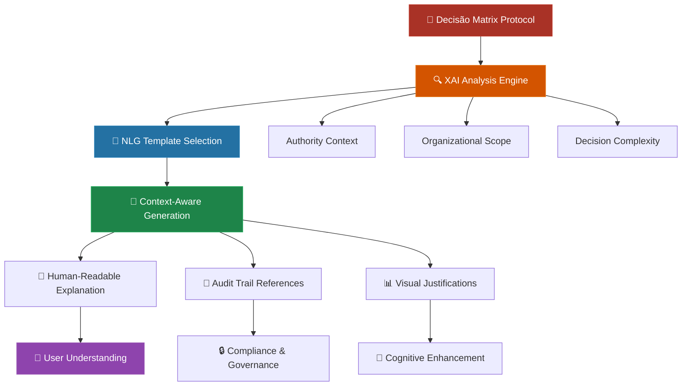
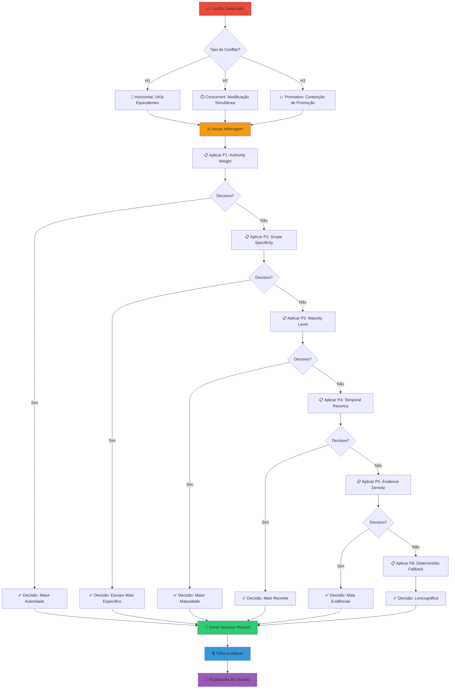
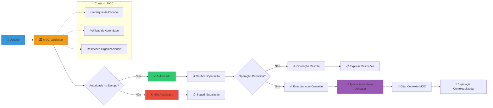
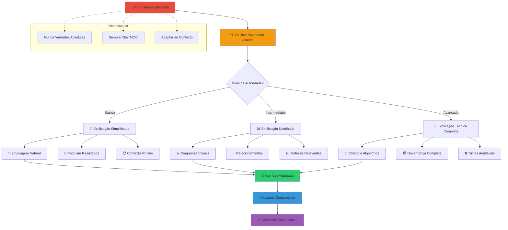

# Explicabilidade e Templates XAI/NLG

O Matrix Protocol fundamenta-se no princípio de **Explicabilidade Necessária** (MEP), garantindo que toda decisão epistêmica seja auditável e compreensível. Esta página apresenta templates XAI (Explainable AI) e NLG (Natural Language Generation) para comunicar decisões de forma clara, mantendo a precisão técnica e a acessibilidade humana.

## Visão Geral da Explicabilidade Matrix

### Arquitetura de Explicabilidade



### Princípios de Explicabilidade Matrix

#### 1. **Autoridade Derivada**
Explicações sempre citam o contexto organizacional (MOC) e nunca fazem afirmações absolutas.

#### 2. **Transparência Epistêmica**
Cada decisão inclui o raciocínio epistemológico completo, desde dados até conclusões.

#### 3. **Adaptabilidade Hierárquica**
Explicações se adaptam ao nível de autoridade e conhecimento técnico do usuário.

#### 4. **Auditabilidade Completa**
Todo processo de explicação gera trilhas auditáveis para compliance e governança.

## Template 1: Explicação de Arbitragem MAL

### Estrutura do Template MAL

```python
class MALExplanationTemplate:
    """Template para explicar decisões de arbitragem do Matrix Arbiter Layer"""
    
    def __init__(self, decision_record, user_context):
        self.decision = decision_record
        self.user = user_context
        self.moc_context = self.get_moc_context()
    
    def generate_explanation(self):
        """Gera explicação completa da decisão MAL"""
        explanation = {
            'summary': self.generate_summary(),
            'rationale': self.generate_rationale(),
            'evidence': self.compile_evidence(),
            'implications': self.analyze_implications(),
            'audit_trail': self.create_audit_trail()
        }
        
        return self.format_for_user(explanation)
    
    def generate_summary(self):
        """Resumo executivo da decisão"""
        return f"""
        🏛️ Decisão de Arbitragem Matrix Arbiter Layer
        
        **Conflito**: {self.decision.conflict_type}
        **Resultado**: {self.decision.winner.title}
        **Regra Aplicada**: {self.decision.precedence_rule}
        **Contexto**: {self.moc_context.scope_description}
        """
    
    def generate_rationale(self):
        """Justificativa epistemológica detalhada"""
        precedence_explanation = self.explain_precedence_rule()
        
        return f"""
        📋 Justificativa Epistemológica
        
        A decisão foi baseada na aplicação determinística de precedências
        definidas no MOC organizacional:
        
        **Regra {self.decision.precedence_rule}**: {precedence_explanation}
        
        **Contexto Organizacional**:
        - Escopo: {self.moc_context.scope_ref}
        - Autoridade: {self.moc_context.authority_level}
        - Políticas Aplicáveis: {self.moc_context.applicable_policies}
        
        **Autoridade Derivada**:
        Esta decisão deriva sua autoridade do contexto organizacional
        definido no MOC, não de verdades absolutas. Em outros contextos
        organizacionais, a decisão poderia ser diferente.
        """
    
    def explain_precedence_rule(self):
        """Explica a regra de precedência específica aplicada"""
        rules = {
            'P1': 'Authority Weight - Maior peso de autoridade organizacional',
            'P2': 'Scope Specificity - Especificidade do escopo de aplicação',
            'P3': 'Maturity Level - Nível de maturidade epistêmica',
            'P4': 'Temporal Recency - Recência temporal respeitando lifecycle',
            'P5': 'Evidence Density - Densidade de evidências MEF',
            'P6': 'Deterministic Fallback - Fallback determinístico lexicográfico'
        }
        
        rule_code = self.decision.precedence_rule
        rule_description = rules.get(rule_code, 'Regra não reconhecida')
        
        return f"{rule_description}\n\nDetalhes: {self.decision.rule_details}"
```

### Exemplo de Saída MAL

```markdown
🏛️ **Decisão de Arbitragem Matrix Arbiter Layer**

**Conflito**: H1 - Horizontal (UKIs Equivalentes)
**Resultado**: uki:squad-payments:rule:data-retention-30d
**Regra Aplicada**: P3 - Maturity Level
**Contexto**: Squad Payments - Compliance e Segurança

📋 **Justificativa Epistemológica**

A decisão foi baseada na aplicação determinística de precedências
definidas no MOC organizacional:

**Regra P3**: Maturity Level - validated supersede endorsed

O UKI vencedor possui maturidade "validated" enquanto o concorrente
possui apenas "endorsed". No contexto do Squad Payments, regras de
retenção de dados requerem validação rigorosa devido a requisitos
de compliance LGPD/GDPR.

**Contexto Organizacional**:
- Escopo: squad-payments (nível de squad)
- Autoridade: tech-lead + compliance-officer
- Políticas Aplicáveis: LGPD compliance, data minimization

**Autoridade Derivada**:
Esta decisão deriva sua autoridade do contexto organizacional
Squad Payments conforme definido no MOC. Em outros contextos
organizacionais com diferentes requisitos de compliance,
a decisão poderia favorecer data minimization (7 dias).
```

## Template 2: Justificativa de Enriquecimento ZOF

### Estrutura do Template ZOF

```python
class ZOFExplanationTemplate:
    """Template para explicar decisões de enriquecimento ZOF"""
    
    def __init__(self, enrichment_decision, workflow_context):
        self.decision = enrichment_decision
        self.workflow = workflow_context
        self.oracle_data = self.get_oracle_consultation_data()
    
    def generate_explanation(self):
        """Gera explicação completa do processo ZOF"""
        return {
            'workflow_summary': self.summarize_workflow(),
            'enrichment_analysis': self.analyze_enrichment_decision(),
            'oracle_consultation': self.explain_oracle_process(),
            'moc_criteria': self.evaluate_moc_criteria(),
            'outcome_justification': self.justify_outcome()
        }
    
    def summarize_workflow(self):
        """Resume o fluxo ZOF executado"""
        return f"""
        ⚡ Workflow ZOF: {self.workflow.flow_id}
        
        **Estados Canônicos Executados**:
        1. 📥 Intake: {self.workflow.states.intake.summary}
        2. 🧠 Understand: Consultou {len(self.oracle_data.ukis)} UKIs existentes
        3. 🎯 Decide: {self.workflow.states.decide.decision}
        4. ⚡ Act: {self.workflow.states.act.action_taken}
        5. 🔍 EvaluateForEnrich: {self.decision.can_enrich_result}
        
        **Sinais de Explicabilidade**:
        - Contexto: {self.workflow.explainability.context}
        - Decisão: {self.workflow.explainability.decision}
        - Resultado: {self.workflow.explainability.result}
        """
    
    def analyze_enrichment_decision(self):
        """Analisa a decisão de enriquecimento"""
        if self.decision.can_enrich:
            return self.explain_positive_enrichment()
        else:
            return self.explain_negative_enrichment()
    
    def explain_positive_enrichment(self):
        """Explica por que o enriquecimento foi aprovado"""
        return f"""
        ✅ **Enriquecimento Aprovado**
        
        **Critérios MOC Atendidos**:
        {self.format_moc_criteria()}
        
        **Novidade Semântica**: {self.decision.semantic_novelty_score}/100
        O conhecimento proposto apresenta aspectos não cobertos pelas
        {len(self.oracle_data.ukis)} UKIs existentes consultadas.
        
        **Valor Prático**: {self.decision.practical_value_score}/100
        A implementação deste conhecimento pode impactar positivamente
        {self.decision.impact_areas} dentro do escopo {self.workflow.scope_ref}.
        
        **Autoridade Suficiente**: ✅
        Usuário {self.workflow.user_authority} possui autoridade para
        criar UKIs no escopo {self.workflow.scope_ref} conforme MOC.
        """
    
    def explain_oracle_process(self):
        """Explica o processo de consulta ao Oracle"""
        return f"""
        📖 **Consulta ao Oracle (Understand State)**
        
        **UKIs Consultadas**: {len(self.oracle_data.ukis)}
        {self.format_consulted_ukis()}
        
        **Conhecimento Base Identificado**:
        - Padrões relacionados: {len(self.oracle_data.related_patterns)}
        - Conflitos potenciais: {len(self.oracle_data.potential_conflicts)}
        - Gaps de conhecimento: {len(self.oracle_data.knowledge_gaps)}
        
        **Contexto de Decisão**:
        A consulta ao Oracle revelou que o conhecimento proposto
        {self.oracle_data.relationship_to_existing} com o conhecimento
        existente, justificando {self.decision.enrichment_rationale}.
        """
```

### Exemplo de Saída ZOF

```markdown
⚡ **Workflow ZOF**: payment-gateway-selection-brazil

**Estados Canônicos Executados**:
1. 📥 Intake: Necessidade de gateway para mercado brasileiro
2. 🧠 Understand: Consultou 12 UKIs existentes sobre gateways
3. 🎯 Decide: Selecionar Stripe para market-entry MVP
4. ⚡ Act: Configuração inicial Stripe Brazil marketplace
5. 🔍 EvaluateForEnrich: ✅ Aprovado para enriquecimento

**Sinais de Explicabilidade**:
- Contexto: Necessidades específicas mercado BR (PIX, boleto)
- Decisão: Stripe oferece melhor suporte regulatory BR
- Resultado: MVP configurado + novo conhecimento identificado

✅ **Enriquecimento Aprovado**

**Critérios MOC Atendidos**:
- business_impact: 85/100 (alta relevância para expansão)
- reusability: 90/100 (aplicável a outros mercados LATAM)  
- authority: ✅ tech-lead autorizado para squad-payments

**Novidade Semântica**: 78/100
O conhecimento proposto sobre especificidades regulatórias
brasileiras não é coberto pelas 12 UKIs existentes sobre gateways.

**Valor Prático**: 92/100
Implementação pode acelerar go-to-market no Brasil em 2-3 semanas
e servir como template para outros mercados emergentes.

📖 **Consulta ao Oracle (Understand State)**

**UKIs Consultadas**: 12
- uki:squad-payments:pattern:gateway-integration-007
- uki:squad-payments:rule:fee-calculation-005
- uki:squad-payments:rule:currency-conversion-003
- [+ 9 UKIs relacionadas]

**Conhecimento Base Identificado**:
- Padrões relacionados: 5 (integração, fees, compliance)
- Conflitos potenciais: 0 (sem conflitos identificados)
- Gaps de conhecimento: 3 (regulatory BR, PIX, boleto)

**Contexto de Decisão**:
A consulta ao Oracle revelou que o conhecimento proposto
**complementa** o conhecimento existente, cobrindo gaps
regulatórios específicos do mercado brasileiro.
```

## Template 3: Validação e Evolução MEF

### Estrutura do Template MEF

```python
class MEFExplanationTemplate:
    """Template para explicar validações e evoluções MEF"""
    
    def __init__(self, uki_operation, validation_result):
        self.operation = uki_operation
        self.validation = validation_result
        self.uki = self.operation.target_uki
        self.moc_compliance = self.check_moc_compliance()
    
    def generate_explanation(self):
        """Gera explicação completa da operação MEF"""
        if self.operation.type == 'creation':
            return self.explain_uki_creation()
        elif self.operation.type == 'evolution':
            return self.explain_uki_evolution()
        elif self.operation.type == 'validation':
            return self.explain_uki_validation()
    
    def explain_uki_creation(self):
        """Explica criação de nova UKI"""
        return f"""
        📊 **Criação de UKI MEF**
        
        **UKI**: {self.uki.id}
        **Título**: {self.uki.title}
        **Escopo**: {self.uki.scope_ref}
        **Resultado**: {'✅ Aprovada' if self.validation.passed else '❌ Rejeitada'}
        
        **Validação Estrutural**:
        {self.format_structural_validation()}
        
        **Validação Semântica**:
        {self.format_semantic_validation()}
        
        **Conformidade MOC**:
        {self.format_moc_compliance()}
        
        **Integração com Conhecimento Existente**:
        {self.analyze_knowledge_integration()}
        
        **Autoridade Derivada**:
        Esta UKI deriva sua validade do contexto organizacional
        {self.uki.scope_ref} conforme governança MOC. A validação
        considera padrões específicos desta organização.
        """
    
    def explain_uki_evolution(self):
        """Explica evolução de UKI existente"""
        return f"""
        🔄 **Evolução de UKI MEF**
        
        **UKI**: {self.uki.id}
        **Versão**: {self.uki.version} → {self.operation.target_version}
        **Tipo de Mudança**: {self.operation.change_impact}
        **Justificativa**: {self.operation.promotion_rationale}
        
        **Análise de Impacto**:
        {self.analyze_evolution_impact()}
        
        **Relacionamentos Afetados**:
        {self.analyze_relationship_impact()}
        
        **Trilha Auditável**:
        - Versão anterior: {self.uki.version}
        - Autor da evolução: {self.operation.author}
        - Data: {self.operation.timestamp}
        - Aprovações: {self.operation.approvals}
        
        **Princípio de Promoção Responsável**:
        Esta evolução segue o princípio MEP de Promoção Responsável,
        incluindo justificativa epistemológica completa e preservando
        a trilha auditável de decisões.
        """
    
    def format_structural_validation(self):
        """Formata resultado da validação estrutural"""
        result = "✅ APROVADA" if self.validation.structural.passed else "❌ REJEITADA"
        details = []
        
        for check in self.validation.structural.checks:
            status = "✅" if check.passed else "❌"
            details.append(f"  {status} {check.description}")
        
        return f"{result}\n" + "\n".join(details)
    
    def analyze_knowledge_integration(self):
        """Analisa integração com conhecimento existente"""
        if not self.validation.relationships:
            return "Nenhuma integração automática detectada."
        
        integrations = []
        for rel in self.validation.relationships:
            integrations.append(
                f"- {rel.type}: {rel.target_uki} ({rel.confidence}% confiança)"
            )
        
        return "Integrações identificadas:\n" + "\n".join(integrations)
```

### Exemplo de Saída MEF

```markdown
📊 **Criação de UKI MEF**

**UKI**: uki:squad-payments:rule:brazil-gateway-compliance-019
**Título**: "Compliance de Gateway para Brasil - PIX e Boleto"
**Escopo**: squad-payments
**Resultado**: ✅ Aprovada

**Validação Estrutural**: ✅ APROVADA
  ✅ Schema 1.0 válido
  ✅ Campos obrigatórios presentes (id, title, content, examples)
  ✅ Relacionamentos bem formados
  ✅ Versioning semântico correto (0.0.1-beta)

**Validação Semântica**: ✅ APROVADA (Score: 89/100)
  ✅ Coerência conceitual com squad-payments domain
  ✅ Terminologia consistente com MOC organizacional
  ✅ Exemplos práticos relevantes e testáveis

**Conformidade MOC**: ✅ APROVADA
  ✅ scope_ref: squad-payments válido
  ✅ domain_ref: business apropriado
  ✅ type_ref: business_rule autorizado
  ✅ maturity_ref: draft permitido para criação
  ✅ Autoridade: tech-lead suficiente para escopo

**Integração com Conhecimento Existente**:
Integrações identificadas:
- complements: uki:squad-payments:pattern:gateway-integration-007 (92% confiança)
- depends_on: uki:squad-payments:rule:fee-calculation-005 (85% confiança)
- extends: uki:squad-payments:rule:compliance-latam-001 (78% confiança)

**Autoridade Derivada**:
Esta UKI deriva sua validade do contexto organizacional
squad-payments conforme governança MOC. A validação
considera padrões específicos de compliance brasileira
aplicáveis a este contexto de negócio.
```

## Grafos de Decisão Visual

### 1. Arbitragem MAL: P1-P6 em Ação Visual



### 2. Autoridade Derivada: Contexto Organizacional



### 3. Explicação Hierárquica OIF: Níveis de Acesso



## 📖 Recursos Relacionados

### Frameworks Matrix Protocol
- [MEP - Matrix Epistemic Principle](/pt/docs/frameworks/mep) - Princípios de explicabilidade necessária
- [MEF - Matrix Embedding Framework](/pt/docs/frameworks/mef) - Estruturação auditável de conhecimento
- [ZOF - Zion Orchestration Framework](/pt/docs/frameworks/zof) - Workflows explicáveis e auditáveis
- [OIF - Operator Intelligence Framework](/pt/docs/frameworks/oif) - Archetypes com explicações hierárquicas
- [MOC - Matrix Ontology Catalog](/pt/docs/frameworks/moc) - Governança e autoridade organizacional
- [MAL - Matrix Arbiter Layer](/pt/docs/frameworks/mal) - Arbitragem determinística e auditável

### Conceitos Avançados
- [Roteiros Conceituais](/pt/docs/examples/conceptual-roadmaps) - Jornadas epistemológicas Matrix
- [Inferência & Raciocínio](/pt/docs/frameworks/inference-reasoning) - Base neural-simbólica
- [Governança MOC](/pt/docs/manual/moc-governance) - Políticas organizacionais

### Ferramentas e Implementação
- [Guia de Implementação](/pt/docs/implementation) - Passos práticos de adoção
- [Templates Organizacionais](/pt/docs/manual/templates) - Modelos por tipo de organização
- [Ferramentas de Validação](/pt/docs/manual/tools) - Utilitários de suporte

### Casos Práticos
- [Exemplos de UKI](/pt/docs/examples/knowledge/structured) - Casos reais estruturados
- [Pilots Organizacionais](/pt/docs/examples/pilots) - Implementações práticas
- [Comparação de Conhecimento](/pt/docs/examples) - Estruturado vs não-estruturado