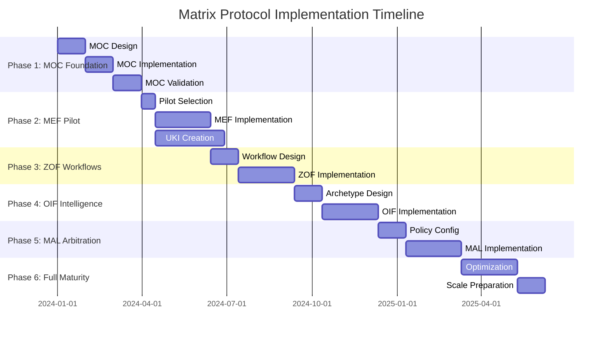

# Matrix Protocol Implementation Phases - Detailed Guide
**6-Phase Gradual Implementation with Checklists and Validation Milestones**

**Version:** 0.0.1-beta  
**Date:** 2025-10-05  
**Compatibility:** Matrix Protocol v0.0.1-beta  

> 🎯 **Purpose**: Provide detailed, actionable guidance for each implementation phase with concrete checklists, validation criteria, and success metrics.

---

## 📊 Implementation Overview

### Phase Timeline and Dependencies



### Success Criteria by Phase

| Phase | Primary Success Metric | Secondary Metrics | Business Impact |
|-------|------------------------|-------------------|-----------------|
| **Phase 1** | MOC validates 100% org structure | Authority mapping complete | Foundation established |
| **Phase 2** | 100+ validated UKIs created | 50% reduction in knowledge conflicts | Knowledge quality improvement |
| **Phase 3** | All workflows follow canonical states | Oracle consultation 95%+ | Decision quality improvement |
| **Phase 4** | AI responses cite sources 100% | Knowledge access time <5 min | User experience improvement |
| **Phase 5** | Conflicts resolved in <15 min | 90%+ stakeholder satisfaction | Governance effectiveness |
| **Phase 6** | ROI >200% demonstrated | System scales to org size | Transformation complete |

---

## 🏗️ PHASE 1: MOC Foundation (Months 1-3)

### Phase Overview
**Duration:** 3 months  
**Team Size:** 3-5 people (depending on org size)  
**Prerequisites:** Executive sponsorship, stakeholder identification  
**Deliverables:** Complete organizational MOC, governance policies, arbitration rules  

### Week-by-Week Breakdown

#### **Weeks 1-2: Organizational Assessment**

**Objectives:**
- [ ] Complete stakeholder mapping
- [ ] Conduct organizational structure analysis
- [ ] Identify existing knowledge systems
- [ ] Map current decision-making processes

**Activities:**
```yaml
stakeholder_interviews:
  executive_level: 
    - ceo_cto_interview: "Strategic vision and priorities"
    - division_heads: "Departmental structure and needs"
    - board_members: "Governance requirements" # For corporations
    
  management_level:
    - directors_vps: "Current knowledge challenges"
    - team_leads: "Day-to-day operational needs"
    - project_managers: "Cross-functional coordination issues"
    
  operational_level:
    - senior_contributors: "Knowledge discovery and usage patterns"
    - domain_experts: "Specialized knowledge requirements"
    - new_hires: "Onboarding and knowledge gaps"

knowledge_audit:
  systems_inventory:
    - documentation_platforms: ["Confluence", "Notion", "SharePoint", "wikis"]
    - communication_tools: ["Slack", "Teams", "email_archives"]
    - project_management: ["Jira", "Asana", "project_folders"]
    - code_repositories: ["GitHub", "GitLab", "internal_repos"]
    - business_systems: ["CRM", "ERP", "specialized_tools"]
    
  knowledge_assessment:
    - document_count: "Total knowledge artifacts"
    - duplication_rate: "Redundant information percentage"
    - conflict_identification: "Contradictory information instances"
    - access_patterns: "Who uses what knowledge when"
    - maintenance_status: "Outdated vs current information"

decision_flow_mapping:
  critical_decisions:
    - architectural_decisions: "Who decides technical standards"
    - product_decisions: "Who decides feature priorities"
    - operational_decisions: "Who decides process changes"
    - strategic_decisions: "Who decides business direction"
    
  authority_analysis:
    - formal_authority: "Org chart decision rights"
    - informal_authority: "Actual influence patterns"
    - escalation_paths: "Conflict resolution flows"
    - approval_requirements: "What needs whose approval"
```

**Week 1-2 Checklist:**
- [ ] Schedule and complete 15-25 stakeholder interviews
- [ ] Document current org structure with actual (not official) reporting lines
- [ ] Inventory all knowledge systems and their usage patterns
- [ ] Identify top 10 knowledge pain points
- [ ] Map 20+ critical decision types and their current flow
- [ ] Analyze 5-10 recent decision conflicts and their resolution
- [ ] Document regulatory/compliance requirements
- [ ] Assess team Matrix Protocol readiness and training needs

**Validation Criteria:**
- ✅ 80%+ of key stakeholders interviewed
- ✅ Complete inventory of knowledge systems
- ✅ Authority mapping covers all major decision types
- ✅ Pain points prioritized with business impact assessment
- ✅ Stakeholder buy-in confirmed for Matrix Protocol approach

#### **Weeks 3-6: MOC Design**

**Objectives:**
- [ ] Design organizational taxonomy structure
- [ ] Define governance rules and policies
- [ ] Configure arbitration precedence rules
- [ ] Create authority hierarchy mapping

**MOC Design Process:**
```yaml
hierarchy_design:
  scope_hierarchy:
    design_principles:
      - "Match actual organizational structure, not official"
      - "Enable knowledge flow, don't create silos"
      - "Support current culture while enabling improvement"
      - "Plan for growth and organizational change"
      
    design_sessions:
      - stakeholder_workshop: "Collaborative scope definition"
      - validation_session: "Test scope with real scenarios"
      - iteration_rounds: "Refine based on feedback"
      
  domain_hierarchy:
    domain_identification:
      - knowledge_clustering: "Group related knowledge areas"
      - expertise_mapping: "Who owns what domains"
      - cross_cutting_analysis: "Domains that span multiple areas"
      - specialization_assessment: "Deep vs broad domain needs"
      
  maturity_hierarchy:
    progression_model:
      - validation_requirements: "What constitutes each maturity level"
      - promotion_criteria: "How knowledge advances"
      - authority_requirements: "Who can approve each level"
      - evidence_standards: "What proof is needed for maturity"

governance_design:
  authority_mapping:
    role_analysis:
      - decision_authority: "Who can make what decisions"
      - validation_authority: "Who can approve knowledge"
      - override_authority: "Who can bypass normal processes"
      - audit_authority: "Who ensures compliance"
      
  policy_framework:
    change_control:
      - change_approval_process: "How MOC itself evolves"
      - impact_assessment_requirements: "When analysis is needed"
      - stakeholder_notification: "Who gets notified of changes"
      
    conflict_resolution:
      - escalation_paths: "Clear chains of authority"
      - timeout_policies: "Maximum resolution times"
      - external_mediation: "When to involve outside parties"

arbitration_configuration:
  precedence_policies:
    organizational_policy:
      - precedence_order: "P1 through P6 rule ordering"
      - weight_multipliers: "Authority enhancement factors"
      - timeout_settings: "Maximum arbitration time"
      
    specialized_policies:
      - security_conflicts: "Security-first precedence"
      - regulatory_conflicts: "Compliance-prioritized resolution"
      - cross_division_conflicts: "Higher authority resolution"
```

**Week 3-6 Checklist:**
- [ ] Complete scope hierarchy design with 3-5 levels
- [ ] Define 5-8 domain categories matching organizational needs
- [ ] Create 3-5 maturity levels with clear progression criteria
- [ ] Design authority hierarchy matching actual (not formal) power structure
- [ ] Configure 2-4 arbitration policies for different conflict types
- [ ] Design lifecycle policies for different knowledge criticality
- [ ] Create governance rules for MOC change control
- [ ] Validate design with stakeholder workshops
- [ ] Document design rationale and trade-offs
- [ ] Get formal approval from executive sponsors

**Validation Criteria:**
- ✅ MOC design covers 100% of organizational structure
- ✅ All authority roles mapped to actual people
- ✅ Arbitration policies tested with historical conflicts
- ✅ Governance rules approved by legal/compliance
- ✅ Design validated through stakeholder workshops

#### **Weeks 7-10: MOC Implementation**

**Objectives:**
- [ ] Implement MOC configuration files
- [ ] Set up governance processes
- [ ] Configure arbitration systems
- [ ] Create validation and testing procedures

**Implementation Tasks:**
```yaml
moc_configuration:
  yaml_implementation:
    - template_selection: "Choose appropriate org size template"
    - customization: "Adapt template to organizational needs"
    - validation: "Syntax and logical consistency checks"
    - versioning: "Initial version control setup"
    
  governance_integration:
    - authority_validation_service: "Connect to HR/identity systems"
    - notification_systems: "Email/Slack integration for changes"
    - approval_workflows: "Connect to existing approval tools"
    - audit_logging: "Set up change tracking"

system_setup:
  infrastructure:
    - version_control: "Git repository for MOC files"
    - validation_tools: "YAML syntax and logic checkers"
    - backup_systems: "Regular MOC backup procedures"
    - access_controls: "Who can view/edit MOC files"
    
  integration_points:
    - directory_services: "LDAP/Active Directory integration"
    - notification_services: "Slack/Teams bot configuration"
    - monitoring_systems: "Health checks and alerting"

testing_procedures:
  validation_scenarios:
    - authority_validation: "Test user permission checks"
    - hierarchy_navigation: "Test scope/domain traversal"
    - arbitration_simulation: "Test conflict resolution"
    - edge_case_handling: "Test boundary conditions"
    
  user_acceptance_testing:
    - stakeholder_validation: "Key users test MOC navigation"
    - scenario_walkthroughs: "Real-world use case testing"
    - performance_validation: "Response time measurements"
    - usability_assessment: "User experience evaluation"
```

**Week 7-10 Checklist:**
- [ ] Implement complete MOC YAML configuration
- [ ] Set up version control and change management
- [ ] Configure authority validation service
- [ ] Implement arbitration policy engine
- [ ] Set up monitoring and alerting
- [ ] Create backup and recovery procedures
- [ ] Test all MOC validation scenarios
- [ ] Conduct user acceptance testing with 5-10 key users
- [ ] Document operational procedures
- [ ] Train MOC administrators

**Validation Criteria:**
- ✅ MOC validates 100% of organizational hierarchy
- ✅ Authority validation works for all user roles
- ✅ Arbitration policies resolve test conflicts correctly
- ✅ System performance meets requirements (<1 second response)
- ✅ User acceptance criteria met by test group

#### **Weeks 11-12: Phase 1 Validation and Handoff**

**Objectives:**
- [ ] Complete comprehensive testing
- [ ] Document lessons learned
- [ ] Prepare for Phase 2
- [ ] Celebrate Phase 1 success

**Final Validation:**
```yaml
comprehensive_testing:
  functional_testing:
    - hierarchy_validation: "All nodes validate correctly"
    - authority_checks: "All roles work as designed"
    - arbitration_execution: "Policies resolve conflicts correctly"
    - governance_workflows: "Change control works end-to-end"
    
  performance_testing:
    - load_testing: "System handles expected user load"
    - response_time: "Sub-second query responses"
    - concurrent_access: "Multiple users can access simultaneously"
    - scalability_validation: "System ready for Phase 2 load"
    
  security_testing:
    - access_control_validation: "Users only see authorized content"
    - data_protection: "Sensitive information properly secured"
    - audit_trail_verification: "All changes logged correctly"
    - backup_recovery: "Data can be restored successfully"

stakeholder_signoff:
  executive_approval:
    - sponsor_review: "Executive sponsor approves Phase 1 completion"
    - budget_approval: "Phase 2 budget confirmed"
    - timeline_confirmation: "Phase 2 schedule agreed"
    
  operational_readiness:
    - admin_training_complete: "MOC administrators fully trained"
    - support_procedures: "Help desk procedures documented"
    - monitoring_active: "System monitoring operational"
    - incident_response: "Problem escalation procedures active"

phase_2_preparation:
  pilot_selection:
    - pilot_areas_identified: "2-3 areas selected for MEF pilot"
    - pilot_teams_confirmed: "Pilot participants committed"
    - pilot_success_criteria: "Phase 2 metrics defined"
    
  resource_allocation:
    - team_assignments: "Phase 2 team roles defined"
    - training_scheduled: "MEF training sessions planned"
    - infrastructure_ready: "Systems ready for UKI creation"
```

**Week 11-12 Checklist:**
- [ ] Execute full system test suite
- [ ] Complete security and compliance validation
- [ ] Conduct executive review and approval
- [ ] Document all lessons learned
- [ ] Select and confirm Phase 2 pilot areas
- [ ] Schedule Phase 2 team training
- [ ] Prepare Phase 2 project plan
- [ ] Communicate Phase 1 success to organization
- [ ] Archive Phase 1 artifacts
- [ ] Celebrate team achievements

**Phase 1 Success Criteria:**
- ✅ **Primary:** MOC validates 100% of organizational structure
- ✅ **Authority:** All decision-making roles mapped and functional
- ✅ **Governance:** Change control and audit trails operational
- ✅ **Performance:** System meets response time requirements
- ✅ **Stakeholder:** Executive approval and Phase 2 funding confirmed

---

## 📚 PHASE 2: MEF Pilot Programs (Months 4-6)

### Phase Overview
**Duration:** 3 months  
**Team Size:** 5-8 people (core team + pilot participants)  
**Prerequisites:** Phase 1 MOC foundation completed  
**Deliverables:** 100+ structured UKIs, semantic relationships, promotion examples  

### Pilot Selection Strategy

#### **Pilot Area Criteria:**
```yaml
selection_criteria:
  high_impact:
    - business_criticality: "High impact on organization"
    - knowledge_pain_points: "Clear existing problems to solve"
    - stakeholder_visibility: "Executive attention and support"
    
  manageable_scope:
    - team_size: "20-50 people maximum"
    - knowledge_boundaries: "Clear domain boundaries"
    - existing_documentation: "Some documentation to convert"
    
  success_factors:
    - champion_availability: "Strong local advocate"
    - team_engagement: "Willing participants"
    - measurable_outcomes: "Clear before/after metrics"

pilot_archetypes:
  technical_pilot:
    focus: "Engineering standards and patterns"
    participants: "Engineering teams"
    knowledge_types: ["technical_standard", "pattern", "decision"]
    success_metrics: ["consistency improvement", "decision speed", "knowledge reuse"]
    
  business_pilot:
    focus: "Business rules and procedures"  
    participants: "Product and operations teams"
    knowledge_types: ["business_rule", "procedure", "policy"]
    success_metrics: ["process consistency", "onboarding speed", "compliance"]
    
  cross_cutting_pilot:
    focus: "Security, compliance, or architecture"
    participants: "Cross-functional experts"
    knowledge_types: ["policy", "standard", "procedure"]
    success_metrics: ["organization-wide impact", "compliance improvement"]
```

### Week-by-Week Implementation

#### **Weeks 1-2: Pilot Setup and Training**

**Objectives:**
- [ ] Finalize pilot selection and team formation
- [ ] Conduct comprehensive MEF training
- [ ] Set up pilot infrastructure
- [ ] Establish success metrics and monitoring

**Pilot Setup:**
```yaml
team_formation:
  pilot_teams:
    - pilot_lead: "Local champion with authority"
    - knowledge_experts: "2-3 domain experts"
    - content_creators: "2-3 people to write UKIs"
    - reviewer_pool: "5-8 people to validate content"
    
  core_support_team:
    - mef_specialist: "MEF framework expert"
    - moc_administrator: "MOC configuration expert"  
    - training_coordinator: "Training delivery and support"
    - metrics_analyst: "Success measurement and reporting"

training_program:
  mef_fundamentals:
    duration: "4 hours"
    content:
      - "MEF specification overview"
      - "UKI structure and fields"
      - "Relationship types and semantics"
      - "Versioning and promotion workflows"
      
  hands_on_workshops:
    duration: "8 hours over 2 days"
    content:
      - "Converting existing docs to UKIs"
      - "Creating semantic relationships"
      - "Using MEF validation tools"
      - "MOC integration and authority checks"
      
  ongoing_support:
    - office_hours: "Weekly 2-hour support sessions"
    - peer_mentoring: "Experienced creators help newcomers"
    - documentation_templates: "Pre-built UKI templates"
    - quick_reference_guides: "Cheat sheets and examples"

infrastructure_setup:
  uki_creation_tools:
    - yaml_editors: "VS Code with MEF extensions"
    - validation_tools: "Automated MEF compliance checking"
    - template_library: "Pre-built UKI templates by type"
    - relationship_mapper: "Visual relationship creation"
    
  workflow_systems:
    - version_control: "Git repository for UKI files"
    - review_workflows: "Pull request based UKI review"
    - notification_system: "Slack integration for updates"
    - metrics_dashboard: "Real-time pilot progress tracking"
```

**Week 1-2 Checklist:**
- [ ] Complete pilot area selection with executive approval
- [ ] Form pilot teams with committed participants
- [ ] Deliver MEF fundamentals training to all participants
- [ ] Conduct hands-on workshops with real content conversion
- [ ] Set up UKI creation and validation tools
- [ ] Configure version control and review workflows
- [ ] Establish success metrics and measurement procedures
- [ ] Create communication channels and support processes
- [ ] Document pilot procedures and expectations
- [ ] Launch pilot with official kickoff event

**Validation Criteria:**
- ✅ All pilot team members completed training
- ✅ UKI creation tools operational and tested
- ✅ Success metrics baseline measured
- ✅ Pilot participants committed and engaged
- ✅ Support processes operational

#### **Weeks 3-8: UKI Creation and Structuring**

**Objectives:**
- [ ] Create 100+ high-quality UKIs across pilot areas
- [ ] Establish semantic relationships between UKIs
- [ ] Implement versioning and promotion workflows
- [ ] Validate MEF integration with MOC

**UKI Creation Process:**
```yaml
content_conversion:
  existing_document_analysis:
    - document_inventory: "Catalog all existing documentation in pilot areas"
    - knowledge_extraction: "Identify discrete knowledge units within docs"
    - conflict_identification: "Find contradictory information"
    - gap_analysis: "Identify missing knowledge"
    
  uki_creation_workflow:
    week_3_4_targets:
      - "20-30 UKIs per pilot area"
      - "Focus on highest-impact knowledge"
      - "Prioritize frequently-used information"
      
    week_5_6_targets:
      - "40-50 additional UKIs per pilot area"
      - "Add semantic relationships"
      - "Begin promotion candidates identification"
      
    week_7_8_targets:
      - "30-40 final UKIs per pilot area"
      - "Complete relationship mapping"
      - "Test promotion workflows"

quality_assurance:
  mef_compliance:
    - schema_validation: "All UKIs pass MEF 1.0.0 schema validation"
    - moc_integration: "All *_ref fields reference valid MOC nodes"
    - content_quality: "Clear, actionable, example-rich content"
    - relationship_accuracy: "Semantic relationships are correct and useful"
    
  review_process:
    - peer_review: "Every UKI reviewed by domain expert"
    - mef_review: "MEF specialist validates technical compliance"
    - stakeholder_review: "Business stakeholders validate content accuracy"
    - continuous_improvement: "Feedback incorporated for future UKIs"

relationship_development:
  semantic_mapping:
    - dependency_identification: "Which UKIs depend on others"
    - conflict_resolution: "Identify and resolve conflicting UKIs"
    - complementary_knowledge: "UKIs that work together"
    - evolution_tracking: "How knowledge builds on previous knowledge"
    
  relationship_types:
    - implements: "UKI implements another UKI's requirements"
    - depends_on: "UKI requires another UKI to be valid"
    - conflicts_with: "UKI contradicts another UKI (resolve via MAL)"
    - complements: "UKI enhances another UKI's value"
    - amends: "UKI updates or modifies another UKI"
    - equivalent_to: "UKI provides same guidance as another UKI"
```

**Weekly Progress Milestones:**

**Week 3:**
- [ ] 20-30 UKIs created per pilot area
- [ ] MEF validation passing for all UKIs
- [ ] Initial relationship mapping started
- [ ] First stakeholder feedback collected

**Week 4:**
- [ ] 40-60 UKIs total per pilot area
- [ ] 10+ semantic relationships documented
- [ ] First UKI promotion candidate identified
- [ ] Quality metrics tracked and reported

**Week 5:**
- [ ] 60-80 UKIs total per pilot area
- [ ] 25+ semantic relationships mapped
- [ ] Versioning workflow tested with real updates
- [ ] Cross-pilot area relationships identified

**Week 6:**
- [ ] 80-100 UKIs total per pilot area
- [ ] 40+ semantic relationships documented
- [ ] First successful UKI promotion completed
- [ ] Pilot area knowledge conflicts resolved

**Week 7:**
- [ ] 100+ UKIs completed per pilot area
- [ ] Complete relationship network mapped
- [ ] 3-5 promotion examples documented
- [ ] Pilot success metrics showing improvement

**Week 8:**
- [ ] Final UKI quality review completed
- [ ] All semantic relationships validated
- [ ] Promotion workflows fully tested
- [ ] Pilot documentation complete

**Validation Criteria:**
- ✅ 300+ total UKIs created across all pilot areas
- ✅ 90%+ UKIs pass MEF compliance validation
- ✅ 100+ semantic relationships documented and validated
- ✅ 5+ successful knowledge promotion examples
- ✅ Measurable improvement in pilot area knowledge metrics

#### **Weeks 9-12: Validation and Promotion**

**Objectives:**
- [ ] Validate pilot success against defined metrics
- [ ] Document lessons learned and best practices
- [ ] Prepare for Phase 3 expansion
- [ ] Demonstrate ROI and business impact

**Success Measurement:**
```yaml
quantitative_metrics:
  knowledge_quality:
    - uki_count: "Total UKIs created by pilot area"
    - compliance_rate: "Percentage passing MEF validation"
    - relationship_density: "Average relationships per UKI"
    - promotion_success: "Successful promotions completed"
    
  operational_impact:
    - time_to_find_knowledge: "Before vs after pilot implementation"
    - knowledge_reuse_rate: "How often UKIs are referenced"
    - decision_consistency: "Reduction in conflicting decisions"
    - onboarding_speed: "New team member productivity time"
    
  user_experience:
    - user_satisfaction: "Survey results from pilot participants"
    - adoption_rate: "Percentage of team using UKIs regularly"
    - contribution_rate: "How many people create/update UKIs"
    - support_ticket_reduction: "Fewer knowledge-related help requests"

qualitative_assessment:
  stakeholder_feedback:
    - executive_satisfaction: "Leadership perception of pilot success"
    - team_lead_feedback: "Manager assessment of team improvements"
    - contributor_experience: "UKI creator satisfaction and challenges"
    - user_experience: "Knowledge consumer feedback and suggestions"
    
  process_improvements:
    - workflow_effectiveness: "Which processes worked well"
    - tool_usability: "Technology and template effectiveness"
    - training_adequacy: "Was training sufficient and appropriate"
    - support_effectiveness: "Did support processes help users succeed"

business_impact_analysis:
  cost_savings:
    - reduced_rework: "Less duplication due to better knowledge sharing"
    - faster_decisions: "Time saved through consistent knowledge access"
    - improved_quality: "Fewer errors due to standardized knowledge"
    - onboarding_efficiency: "Reduced training time and costs"
    
  revenue_enablement:
    - faster_delivery: "Improved time-to-market for products/features"
    - quality_improvement: "Better customer satisfaction from consistency"
    - innovation_acceleration: "Faster learning from documented knowledge"
    - competitive_advantage: "Better knowledge management than competitors"
```

**Week 9-12 Checklist:**
- [ ] Complete comprehensive metrics analysis
- [ ] Conduct stakeholder satisfaction surveys
- [ ] Calculate quantitative business impact
- [ ] Document detailed lessons learned
- [ ] Create pilot success story documentation
- [ ] Present results to executive stakeholders
- [ ] Get approval and funding for Phase 3
- [ ] Select Phase 3 expansion areas
- [ ] Plan Phase 3 team scaling
- [ ] Archive pilot artifacts and documentation

**Phase 2 Success Criteria:**
- ✅ **Primary:** 100+ validated UKIs created per pilot area
- ✅ **Quality:** 90%+ UKIs pass MEF compliance validation
- ✅ **Usage:** 70%+ pilot participants actively using UKIs
- ✅ **Impact:** 40%+ improvement in key knowledge metrics
- ✅ **Stakeholder:** Executive approval for Phase 3 expansion

---

## ⚙️ PHASE 3: ZOF Workflows (Months 7-9)

### Phase Overview
**Duration:** 3 months  
**Team Size:** 6-10 people (expanded from Phase 2)  
**Prerequisites:** Phase 2 MEF pilot success  
**Deliverables:** ZOF workflows, EvaluateForEnrich operational, explainability signals  

### Critical Workflow Selection

#### **High-Impact Workflow Identification:**
```yaml
workflow_assessment:
  decision_workflows:
    - architectural_decisions: "High impact, frequent conflicts"
    - product_decisions: "Cross-team coordination needed"  
    - operational_changes: "Process updates affecting multiple teams"
    - strategic_initiatives: "Organization-wide changes"
    
  knowledge_intensive_workflows:
    - problem_solving: "Complex technical or business problems"
    - incident_response: "Time-critical, knowledge-dependent"
    - compliance_reviews: "Regulatory and audit workflows"
    - innovation_projects: "R&D and experimental initiatives"
    
  selection_criteria:
    - knowledge_dependency: "Workflow heavily relies on existing knowledge"
    - decision_complexity: "Multiple factors and stakeholders involved"
    - repeatability: "Workflow occurs regularly across organization"
    - measurable_impact: "Clear before/after metrics available"
```

### Week-by-Week Implementation

#### **Weeks 1-3: ZOF Design and Training**

**Objectives:**
- [ ] Design organization-specific ZOF workflows
- [ ] Train expanded team on ZOF concepts
- [ ] Set up workflow monitoring and measurement
- [ ] Configure EvaluateForEnrich checkpoint

**ZOF Design Process:**
```yaml
workflow_analysis:
  current_state_mapping:
    - workflow_documentation: "Document existing workflow steps"
    - decision_points: "Identify where decisions are made"
    - knowledge_touchpoints: "Where knowledge is consulted"
    - stakeholder_involvement: "Who participates at each step"
    
  canonical_state_mapping:
    - intake_design: "How context and requirements are captured"
    - understand_design: "Oracle consultation implementation"
    - decide_design: "Decision making process with knowledge"
    - act_design: "Execution and implementation steps"
    - evaluate_design: "EvaluateForEnrich checkpoint configuration"
    - review_design: "Optional validation and feedback steps"
    - enrich_design: "Knowledge creation and Oracle enrichment"

evaluate_for_enrich_design:
  moc_criteria_integration:
    - business_impact_evaluation: "How to assess business value"
    - reusability_assessment: "How to determine knowledge reuse potential"
    - compliance_validation: "How to check regulatory requirements"
    - innovation_enablement: "How to evaluate future value"
    
  authority_validation:
    - scope_authority_check: "Validate user can enrich at requested scope"
    - domain_authority_check: "Validate user has domain expertise"
    - approval_workflow: "Route to appropriate authorities if needed"
    
  enrichment_decision_logic:
    - weighted_scoring: "Combine criteria scores with MOC weights"
    - threshold_configuration: "Define minimum scores for enrichment"
    - exception_handling: "Override processes for critical knowledge"
    - audit_trail: "Log all evaluation decisions and rationale"

training_program:
  zof_fundamentals:
    duration: "6 hours"
    content:
      - "ZOF canonical states overview"
      - "Oracle consultation patterns"
      - "EvaluateForEnrich checkpoint design"
      - "Explainability signals requirements"
      
  workflow_design_workshop:
    duration: "12 hours over 3 days"
    content:
      - "Current workflow analysis techniques"
      - "Canonical state mapping exercises"
      - "EvaluateForEnrich configuration"
      - "Workflow testing and validation"
      
  technology_training:
    duration: "4 hours"
    content:
      - "Workflow monitoring tools"
      - "Integration with MEF Oracle"
      - "Signal recording and analysis"
      - "Performance measurement"
```

**Week 1-3 Checklist:**
- [ ] Complete analysis of 3-5 critical workflows
- [ ] Design canonical state mapping for each workflow
- [ ] Configure EvaluateForEnrich criteria based on organizational MOC
- [ ] Train expanded team on ZOF concepts and implementation
- [ ] Set up workflow monitoring and measurement systems
- [ ] Create workflow documentation templates
- [ ] Test EvaluateForEnrich logic with historical decisions
- [ ] Validate Oracle consultation integration
- [ ] Establish explainability signal recording
- [ ] Get stakeholder approval for workflow designs

**Validation Criteria:**
- ✅ All selected workflows mapped to canonical states
- ✅ EvaluateForEnrich checkpoint operational
- ✅ Oracle consultation integrated and tested
- ✅ Team trained and ready for implementation
- ✅ Monitoring systems operational

#### **Weeks 4-9: Workflow Implementation**

**Objectives:**
- [ ] Implement ZOF workflows in pilot areas
- [ ] Establish Oracle consultation patterns
- [ ] Operationalize EvaluateForEnrich checkpoint
- [ ] Record and analyze explainability signals

**Implementation Timeline:**
```yaml
week_4_5:
  focus: "First workflow implementation"
  objectives:
    - implement_architectural_decision_workflow: "End-to-end ZOF implementation"
    - oracle_consultation_operational: "MEF integration working"
    - explainability_signals_recording: "All state transitions logged"
    - stakeholder_training: "Workflow participants trained"
    
week_6_7:
  focus: "Second workflow implementation"
  objectives:
    - implement_incident_response_workflow: "Time-critical workflow"
    - evaluate_for_enrich_operational: "Checkpoint making real decisions"
    - knowledge_enrichment_examples: "New UKIs created from workflows"
    - performance_optimization: "Response time improvements"
    
week_8_9:
  focus: "Third workflow and optimization"
  objectives:
    - implement_product_decision_workflow: "Cross-team coordination"
    - full_integration_testing: "All systems working together"
    - workflow_performance_analysis: "Metrics vs baseline"
    - stakeholder_feedback_incorporation: "Improvements based on usage"

workflow_execution_monitoring:
  real_time_metrics:
    - workflow_completion_time: "How long each workflow takes"
    - oracle_consultation_rate: "Percentage of workflows consulting knowledge"
    - enrichment_decision_rate: "Percentage approved for knowledge creation"
    - signal_completeness: "All required signals recorded"
    
  quality_metrics:
    - decision_reversal_rate: "Decisions later changed"
    - stakeholder_satisfaction: "User experience with workflows"
    - knowledge_utilization: "How often existing UKIs are used"
    - enrichment_quality: "Quality of new UKIs created"
    
  performance_optimization:
    - bottleneck_identification: "Where workflows slow down"
    - automation_opportunities: "Steps that can be automated"
    - integration_improvements: "Better tool connections"
    - user_experience_enhancements: "Smoother workflow experience"

oracle_consultation_patterns:
  understand_state_implementation:
    - knowledge_search: "How users find relevant UKIs"
    - relevance_ranking: "How to prioritize search results"
    - authority_filtering: "Show only authorized knowledge"
    - relationship_traversal: "Follow UKI relationships"
    
  consultation_optimization:
    - search_performance: "Sub-second knowledge retrieval"
    - result_quality: "High relevance and accuracy"
    - user_experience: "Intuitive knowledge discovery"
    - integration_seamlessness: "Embedded in workflow tools"
```

**Weekly Progress Targets:**

**Week 4:**
- [ ] First ZOF workflow (architectural decisions) fully operational
- [ ] Oracle consultation working with 90%+ accuracy
- [ ] Explainability signals recorded for all workflow instances
- [ ] Initial performance metrics baseline established

**Week 5:**
- [ ] First workflow optimization based on initial usage
- [ ] EvaluateForEnrich making real enrichment decisions
- [ ] First new UKIs created through workflow enrichment
- [ ] Stakeholder training completed for first workflow

**Week 6:**
- [ ] Second ZOF workflow (incident response) implemented
- [ ] Cross-workflow knowledge sharing patterns identified
- [ ] Performance improvements in first workflow
- [ ] Quality feedback incorporated into workflow design

**Week 7:**
- [ ] Second workflow optimized for time-critical operations
- [ ] Oracle consultation patterns refined for speed
- [ ] Enrichment quality validation processes operational
- [ ] User experience improvements based on feedback

**Week 8:**
- [ ] Third ZOF workflow (product decisions) implemented
- [ ] Full integration testing completed successfully
- [ ] Performance metrics showing significant improvement
- [ ] Knowledge enrichment creating measurable value

**Week 9:**
- [ ] All three workflows fully operational and optimized
- [ ] Comprehensive performance analysis completed
- [ ] Stakeholder satisfaction surveys positive
- [ ] Phase 3 success criteria met or exceeded

**Validation Criteria:**
- ✅ 3+ critical workflows following ZOF canonical states
- ✅ 95%+ workflows include mandatory Oracle consultation
- ✅ EvaluateForEnrich checkpoint operational with real decisions
- ✅ Explainability signals recorded for 100% of workflow instances
- ✅ Measurable improvement in workflow performance and quality

#### **Weeks 10-12: Analysis and Preparation for Phase 4**

**Objectives:**
- [ ] Comprehensive analysis of ZOF implementation results
- [ ] Document best practices and lessons learned
- [ ] Prepare organization for OIF intelligence implementation
- [ ] Validate readiness for AI archetype deployment

**Results Analysis:**
```yaml
performance_analysis:
  workflow_efficiency:
    - completion_time_improvement: "Baseline vs ZOF implementation"
    - decision_quality_improvement: "Reversal rates and stakeholder satisfaction"
    - knowledge_utilization_increase: "Oracle consultation impact"
    - enrichment_value_creation: "New knowledge quality and usage"
    
  organizational_impact:
    - process_consistency: "Standardization across teams"
    - knowledge_sharing: "Cross-team knowledge flow"
    - decision_transparency: "Explainability and audit trails"
    - learning_acceleration: "Faster organizational knowledge growth"
    
  technical_performance:
    - system_responsiveness: "Oracle consultation speed"
    - integration_reliability: "Workflow tool integration stability"
    - scalability_validation: "System performance under load"
    - monitoring_effectiveness: "Observability and alerting"

readiness_assessment:
  organization_readiness:
    - workflow_adoption: "Teams successfully using ZOF patterns"
    - knowledge_culture: "Oracle consultation becoming routine"
    - change_management: "Organization adapting to new processes"
    - stakeholder_engagement: "Leadership support for continued expansion"
    
  technical_readiness:
    - knowledge_base_maturity: "Sufficient UKIs for AI consumption"
    - integration_stability: "Systems reliable for AI integration"
    - performance_baselines: "Current system performance documented"
    - monitoring_capabilities: "Ability to measure AI system impact"
    
  ai_integration_preparation:
    - knowledge_agent_requirements: "What AI needs to access knowledge"
    - workflow_agent_requirements: "What AI needs to orchestrate workflows"
    - explainability_requirements: "How AI will provide explanations"
    - authority_integration: "How AI will respect MOC authority"
```

**Week 10-12 Checklist:**
- [ ] Complete comprehensive ZOF performance analysis
- [ ] Document all workflow best practices and patterns
- [ ] Assess organizational readiness for AI integration
- [ ] Validate technical systems ready for OIF implementation
- [ ] Present Phase 3 results to executive stakeholders
- [ ] Get approval and resources for Phase 4
- [ ] Begin AI archetype design based on organizational needs
- [ ] Plan OIF training and implementation approach
- [ ] Select initial AI use cases for Phase 4
- [ ] Prepare Phase 4 project plan and team assignments

**Phase 3 Success Criteria:**
- ✅ **Primary:** 100% of critical workflows follow ZOF canonical states
- ✅ **Oracle:** 95%+ workflows include Oracle consultation
- ✅ **Enrichment:** EvaluateForEnrich operational with measurable impact
- ✅ **Performance:** Workflow efficiency improved by 40%+
- ✅ **Quality:** Decision reversal rate reduced by 60%+
- ✅ **Readiness:** Organization ready for AI intelligence implementation

---

## 🤖 PHASE 4: OIF Intelligence (Months 10-12)

### Phase Overview
**Duration:** 3 months  
**Team Size:** 8-12 people (includes AI/ML specialists)  
**Prerequisites:** Phase 3 ZOF workflows operational  
**Deliverables:** Knowledge and Workflow Agents, specialized archetypes, explainability  

### AI Archetype Design Strategy

#### **Organizational AI Archetype Assessment:**
```yaml
archetype_analysis:
  mandatory_canonical_archetypes:
    knowledge_agent:
      purpose: "Semantic search and knowledge explanation"
      moc_integration: "Authority-based filtering and access control"
      specialization_needs: "Organization-specific knowledge domains"
      
    workflow_agent:
      purpose: "ZOF workflow orchestration and EvaluateForEnrich execution"
      checkpoint_specialization: "MOC criteria evaluation"
      integration_requirements: "Seamless workflow tool integration"
      
  specialized_archetype_opportunities:
    domain_specific:
      - security_advisor: "Security and compliance expertise"
      - architecture_consultant: "Technical architecture guidance"
      - product_strategist: "Product and business intelligence"
      - operations_specialist: "Process and operational guidance"
      
    role_specific:
      - executive_assistant: "C-level decision support"
      - technical_mentor: "Developer guidance and training"
      - compliance_monitor: "Regulatory and audit support"
      - innovation_catalyst: "R&D and experimental guidance"
      
    process_specific:
      - incident_commander: "Emergency response coordination"
      - onboarding_guide: "New employee assistance"
      - project_advisor: "Project management support"
      - quality_auditor: "Quality assurance and validation"
```

### Week-by-Week Implementation

#### **Weeks 1-3: AI Architecture and Training Data Preparation**

**Objectives:**
- [ ] Design OIF architecture for organizational needs
- [ ] Prepare training data from MEF knowledge base
- [ ] Configure AI models for organizational context
- [ ] Set up explainability and authority systems

**AI Architecture Design:**
```yaml
technical_architecture:
  knowledge_agent_design:
    model_selection:
      - primary_model: "Large language model (GPT-4, Claude, etc.)"
      - embedding_model: "Knowledge vector embeddings"
      - retrieval_system: "Semantic search with MOC filtering"
      - reasoning_engine: "Context-aware response generation"
      
    moc_integration:
      - authority_middleware: "Real-time user permission checking"
      - scope_filtering: "Knowledge filtering by user scope"
      - citation_system: "Automatic MOC node referencing"
      - explanation_generation: "Why specific knowledge was recommended"
      
    knowledge_processing:
      - uki_ingestion: "Convert UKIs to AI-consumable format"
      - relationship_understanding: "Semantic relationship processing"
      - context_awareness: "Understanding knowledge interdependencies"
      - update_synchronization: "Real-time knowledge base updates"
      
  workflow_agent_design:
    orchestration_capabilities:
      - canonical_state_management: "ZOF workflow state tracking"
      - checkpoint_execution: "Automated EvaluateForEnrich evaluation"
      - decision_support: "AI-assisted decision recommendations"
      - signal_recording: "Automated explainability signal capture"
      
    integration_points:
      - workflow_tools: "Jira, Asana, custom workflow systems"
      - notification_systems: "Slack, Teams, email integration"
      - approval_systems: "Integration with approval workflows"
      - monitoring_systems: "Real-time workflow performance tracking"

training_data_preparation:
  knowledge_corpus_creation:
    - uki_corpus: "All organizational UKIs in AI training format"
    - relationship_graph: "Semantic relationship network"
    - moc_context: "Organizational taxonomy and authority rules"
    - historical_decisions: "Previous decision patterns and outcomes"
    
  specialized_training:
    - domain_expertise: "Domain-specific knowledge for specialized archetypes"
    - organizational_context: "Company culture, values, and practices"
    - communication_style: "Preferred organizational communication patterns"
    - compliance_requirements: "Regulatory and legal constraints"
    
  continuous_learning:
    - feedback_loop: "User interaction feedback for model improvement"
    - knowledge_updates: "Incremental learning from new UKIs"
    - performance_monitoring: "AI response quality measurement"
    - bias_detection: "Organizational and cultural bias monitoring"

authority_and_explainability:
  derived_authority_implementation:
    - context_derivation: "How AI determines user context"
    - authority_citation: "How AI references MOC authority sources"
    - limitation_acknowledgment: "How AI expresses knowledge boundaries"
    - escalation_guidance: "When AI directs users to human experts"
    
  explainability_systems:
    - reasoning_transparency: "How AI explains its reasoning process"
    - source_citation: "Automatic UKI and MOC node citations"
    - confidence_indication: "How AI expresses certainty levels"
    - alternative_perspective: "How AI presents multiple viewpoints"
```

**Week 1-3 Checklist:**
- [ ] Complete AI architecture design for organizational needs
- [ ] Prepare comprehensive training data from UKI knowledge base
- [ ] Configure AI models with organizational context
- [ ] Implement authority middleware for MOC integration
- [ ] Set up explainability and citation systems
- [ ] Create specialized archetype definitions
- [ ] Test basic AI functionality with organizational data
- [ ] Train team on AI system management and monitoring
- [ ] Establish AI performance measurement baselines
- [ ] Get stakeholder approval for AI implementation approach

**Validation Criteria:**
- ✅ AI architecture supports all required OIF archetypes
- ✅ Training data includes 90%+ of organizational UKIs
- ✅ Authority integration correctly filters knowledge by user
- ✅ Explainability systems provide clear citations
- ✅ Specialized archetypes designed for organizational needs

#### **Weeks 4-9: AI Implementation and Integration**

**Objectives:**
- [ ] Implement and deploy Knowledge Agent
- [ ] Implement and deploy Workflow Agent
- [ ] Create specialized organizational archetypes
- [ ] Integrate AI systems with existing workflows and tools

**Implementation Timeline:**
```yaml
week_4_5:
  focus: "Knowledge Agent Implementation"
  objectives:
    - deploy_knowledge_agent: "Basic semantic search and explanation"
    - moc_authority_integration: "User-specific knowledge filtering"
    - citation_system_operational: "Automatic source citations"
    - basic_explainability: "Clear reasoning explanations"
    
week_6_7:
  focus: "Workflow Agent Implementation"
  objectives:
    - deploy_workflow_agent: "ZOF workflow orchestration"
    - evaluate_for_enrich_automation: "AI-assisted enrichment decisions"
    - workflow_tool_integration: "Seamless workflow embedding"
    - signal_recording_automation: "Automated explainability signals"
    
week_8_9:
  focus: "Specialized Archetypes and Optimization"
  objectives:
    - deploy_specialized_archetypes: "Domain-specific AI assistants"
    - performance_optimization: "Response time and quality improvement"
    - user_experience_refinement: "Interface and interaction improvements"
    - comprehensive_testing: "End-to-end system validation"

knowledge_agent_implementation:
  core_capabilities:
    - semantic_search: "Natural language query to relevant UKIs"
    - contextual_explanation: "Why specific knowledge is relevant"
    - relationship_navigation: "Following UKI semantic relationships"
    - authority_respect: "Only showing authorized knowledge"
    
  advanced_features:
    - multi_uki_synthesis: "Combining information from multiple UKIs"
    - conflict_identification: "Identifying contradictory knowledge"
    - knowledge_gap_detection: "Identifying missing knowledge"
    - learning_recommendations: "Suggesting knowledge to explore"
    
  user_interface:
    - chat_interface: "Conversational knowledge interaction"
    - search_interface: "Traditional search with AI enhancement"
    - embedded_help: "Context-sensitive assistance in tools"
    - mobile_access: "Knowledge access on mobile devices"

workflow_agent_implementation:
  orchestration_capabilities:
    - workflow_guidance: "Step-by-step workflow assistance"
    - decision_support: "AI recommendations for workflow decisions"
    - checkpoint_automation: "Automated EvaluateForEnrich execution"
    - stakeholder_coordination: "Automated stakeholder notifications"
    
  integration_features:
    - tool_embedding: "AI assistance within existing workflow tools"
    - status_tracking: "Real-time workflow progress monitoring"
    - bottleneck_detection: "Identifying and resolving workflow delays"
    - outcome_prediction: "Predicting workflow success likelihood"

specialized_archetype_development:
  security_advisor:
    specialization:
      - security_domain_expertise: "Deep knowledge of security UKIs"
      - threat_assessment: "AI-assisted security risk evaluation"
      - compliance_guidance: "Regulatory requirement interpretation"
      - incident_response: "Security incident workflow guidance"
      
  architecture_consultant:
    specialization:
      - technical_pattern_expertise: "Deep knowledge of architecture UKIs"
      - decision_impact_analysis: "Predicting architectural decision consequences"
      - technology_evaluation: "AI-assisted technology selection"
      - migration_planning: "System migration guidance and planning"
      
  product_strategist:
    specialization:
      - product_domain_expertise: "Deep knowledge of product UKIs"
      - market_analysis: "AI-enhanced market and competitive analysis"
      - feature_prioritization: "Data-driven feature priority recommendations"
      - user_impact_assessment: "Predicting user experience impact"
```

**Weekly Progress Targets:**

**Week 4:**
- [ ] Knowledge Agent deployed with basic functionality
- [ ] Authority integration working correctly
- [ ] Citation system providing clear source references
- [ ] Initial user feedback collected and positive

**Week 5:**
- [ ] Knowledge Agent performance optimized
- [ ] Advanced features (synthesis, conflict detection) operational
- [ ] User interface refined based on feedback
- [ ] Integration with common tools completed

**Week 6:**
- [ ] Workflow Agent deployed with ZOF integration
- [ ] EvaluateForEnrich automation working correctly
- [ ] Workflow tool integrations operational
- [ ] Signal recording fully automated

**Week 7:**
- [ ] Workflow Agent performance optimized
- [ ] Advanced orchestration features operational
- [ ] Cross-workflow coordination working
- [ ] Stakeholder satisfaction with workflow AI positive

**Week 8:**
- [ ] First specialized archetype (Security Advisor) deployed
- [ ] Domain-specific expertise demonstrably superior
- [ ] Integration with specialized workflows operational
- [ ] Performance metrics exceeding baseline expectations

**Week 9:**
- [ ] All planned specialized archetypes deployed
- [ ] System performance optimized across all archetypes
- [ ] User experience refined based on comprehensive feedback
- [ ] Ready for comprehensive system testing

**Validation Criteria:**
- ✅ Knowledge Agent provides accurate, cited responses
- ✅ Workflow Agent successfully orchestrates ZOF workflows
- ✅ Specialized archetypes demonstrate domain expertise
- ✅ AI responses respect MOC authority 100% of the time
- ✅ User satisfaction with AI assistance >85%

#### **Weeks 10-12: Optimization and Phase 5 Preparation**

**Objectives:**
- [ ] Comprehensive performance analysis and optimization
- [ ] User experience refinement based on extensive usage
- [ ] Prepare for MAL arbitration integration
- [ ] Validate readiness for conflict resolution automation

**Performance Analysis:**
```yaml
ai_performance_metrics:
  response_quality:
    - accuracy_rate: "Percentage of correct/helpful AI responses"
    - citation_accuracy: "Percentage of correct source citations"
    - authority_compliance: "Perfect MOC authority respect"
    - explainability_clarity: "User understanding of AI reasoning"
    
  user_experience:
    - response_time: "Average time from query to response"
    - user_satisfaction: "Survey results from regular users"
    - adoption_rate: "Percentage of organization using AI assistance"
    - task_completion_improvement: "Time and quality improvements"
    
  system_performance:
    - query_throughput: "Queries handled per second"
    - system_availability: "Uptime and reliability metrics"
    - resource_utilization: "Computational efficiency"
    - scalability_validation: "Performance under increased load"

optimization_initiatives:
  model_refinement:
    - fine_tuning: "Improve responses based on organizational feedback"
    - knowledge_updates: "Incorporate new UKIs and organizational changes"
    - bias_mitigation: "Address identified biases in AI responses"
    - performance_optimization: "Improve response speed and accuracy"
    
  integration_enhancement:
    - workflow_streamlining: "Smoother integration with existing tools"
    - user_interface_improvement: "Better user experience design"
    - mobile_optimization: "Improved mobile access and functionality"
    - accessibility_compliance: "Ensure AI assistance is accessible to all users"
    
  specialized_archetype_enhancement:
    - domain_expertise_deepening: "Improve specialized knowledge depth"
    - cross_archetype_coordination: "Better collaboration between AI archetypes"
    - personalization: "Adapt AI behavior to individual user preferences"
    - learning_acceleration: "Faster adaptation to organizational changes"

mal_integration_preparation:
  conflict_detection_readiness:
    - knowledge_conflict_identification: "AI can identify UKI conflicts"
    - authority_conflict_detection: "AI can detect authority-based conflicts"
    - precedence_rule_understanding: "AI understands MAL P1-P6 rules"
    - arbitration_data_preparation: "AI can prepare MAL arbitration events"
    
  ai_arbitration_explanation:
    - decision_explanation_templates: "AI can explain MAL decisions"
    - precedence_rule_explanation: "AI can explain why specific rules applied"
    - stakeholder_communication: "AI can communicate arbitration outcomes"
    - appeal_process_guidance: "AI can guide users through appeals"
```

**Week 10-12 Checklist:**
- [ ] Complete comprehensive AI performance analysis
- [ ] Implement all identified optimization improvements
- [ ] Validate AI system ready for organization-wide deployment
- [ ] Prepare AI systems for MAL integration
- [ ] Document AI best practices and usage patterns
- [ ] Train additional AI administrators and support staff
- [ ] Present Phase 4 results to executive stakeholders
- [ ] Get approval and resources for Phase 5 MAL implementation
- [ ] Begin MAL arbitration system design
- [ ] Plan Phase 5 conflict resolution testing approach

**Phase 4 Success Criteria:**
- ✅ **Primary:** Knowledge and Workflow Agents operational with >95% accuracy
- ✅ **Authority:** AI respects MOC authority 100% of the time
- ✅ **Explainability:** AI provides clear citations and reasoning 100% of responses
- ✅ **Performance:** AI response time <3 seconds average
- ✅ **Adoption:** >75% of organization actively using AI assistance
- ✅ **Satisfaction:** >85% user satisfaction with AI assistance quality

---

## ⚖️ PHASE 5: MAL Arbitration (Months 13-15)

### Phase Overview
**Duration:** 3 months  
**Team Size:** 6-8 people (includes conflict resolution specialists)  
**Prerequisites:** Phase 4 OIF intelligence operational  
**Deliverables:** MAL Engine, Decision Records, arbitration explanation system  

### Conflict Resolution System Design

#### **Arbitration System Architecture:**
```yaml
mal_system_design:
  conflict_detection:
    automated_detection:
      - h1_horizontal_conflicts: "Semantic analysis of competing UKIs"
      - h2_concurrent_enrichment: "Temporal analysis of simultaneous workflows"
      - h3_promotion_contention: "Analysis of competing promotion requests"
      
    integration_points:
      - zof_workflow_monitoring: "Real-time workflow conflict detection"
      - mef_validation_system: "UKI conflict identification during creation"
      - oif_agent_escalation: "AI-detected conflicts requiring arbitration"
      
  arbitration_engine:
    precedence_rule_implementation:
      - p1_authority_weight: "MOC authority hierarchy evaluation"
      - p2_scope_specificity: "Context-dependent scope precedence"
      - p3_maturity_level: "Epistemological maturity comparison"
      - p4_temporal_recency: "Time-based precedence with lifecycle respect"
      - p5_evidence_density: "MEF relationship and evidence analysis"
      - p6_deterministic_fallback: "Lexicographic identifier-based tiebreaking"
      
    policy_configuration:
      - moc_policy_integration: "Organization-specific arbitration policies"
      - timeout_management: "Configurable arbitration time limits"
      - escalation_procedures: "Human escalation when automation fails"
      - audit_trail_creation: "Immutable decision record generation"
      
  decision_communication:
    oif_explanation_integration:
      - decision_rationale_generation: "Clear explanation of arbitration decisions"
      - precedence_rule_explanation: "Why specific rules took precedence"
      - stakeholder_notification: "Automated notification of affected parties"
      - appeal_process_guidance: "How to contest arbitration decisions"
```

### Week-by-Week Implementation

#### **Weeks 1-3: MAL Design and Policy Configuration**

**Objectives:**
- [ ] Design MAL arbitration engine for organizational needs
- [ ] Configure organizational arbitration policies
- [ ] Set up conflict detection systems
- [ ] Create decision record and audit systems

**MAL Engine Design:**
```yaml
arbitration_engine_design:
  conflict_classification:
    h1_detection:
      - semantic_similarity: "Identify UKIs addressing same concepts"
      - scope_level_analysis: "Confirm UKIs at equivalent hierarchical level"
      - conflict_type_determination: "Semantic vs authority vs temporal conflicts"
      - stakeholder_impact_assessment: "Identify affected parties"
      
    h2_detection:
      - temporal_window_analysis: "Configurable concurrency time window"
      - workflow_overlap_detection: "Identify simultaneous enrichment attempts"
      - resource_conflict_analysis: "Same knowledge area being modified"
      - user_authority_comparison: "Compare authorities of concurrent users"
      
    h3_detection:
      - promotion_target_analysis: "Identify competing promotion destinations"
      - evidence_comparison: "Compare promotion justifications"
      - stakeholder_impact_analysis: "Assess organizational impact differences"
      - timeline_conflict_detection: "Competing promotion timelines"
      
  precedence_rule_engine:
    rule_implementation:
      p1_authority_weight:
        - moc_authority_lookup: "Retrieve user authority from MOC"
        - weight_calculation: "Apply organizational authority multipliers"
        - special_authority_handling: "Security, compliance, executive overrides"
        
      p2_scope_specificity:
        - context_determination: "Local guidance vs mandatory policy"
        - specificity_evaluation: "More specific scope for local, broader for mandatory"
        - cross_cutting_analysis: "Security and compliance scope precedence"
        
      p3_maturity_level:
        - moc_maturity_lookup: "Retrieve maturity hierarchy from MOC"
        - progression_validation: "Ensure valid maturity progression"
        - regulatory_override: "Regulatory standards take precedence"
        
  decision_record_system:
    record_structure:
      - decision_metadata: "Timestamp, participants, conflict type"
      - precedence_analysis: "Which rules applied and why"
      - epistemic_rationale: "MEP-compliant explanation"
      - moc_citations: "Specific MOC nodes referenced"
      - action_items: "What happens as result of decision"
      
    immutability_enforcement:
      - cryptographic_signatures: "Tamper-proof decision records"
      - blockchain_option: "Optional distributed ledger for high-stakes decisions"
      - audit_trail_integration: "Complete decision history tracking"
      - legal_compliance: "Meet regulatory record-keeping requirements"

organizational_policy_configuration:
  standard_policies:
    techcorp_standard:
      - precedence_order: "P1 → P2 → P3 → P4 → P5 → P6"
      - authority_weights: "Standard organizational hierarchy"
      - timeout_settings: "15-minute standard arbitration"
      
    security_first:
      - precedence_modification: "P3 → P1 → P2 → P4 → P5 → P6"
      - authority_multiplier: "2.0x for security authorities"
      - maturity_requirement: "Minimum approved for security conflicts"
      
    regulatory_compliance:
      - precedence_modification: "P3 → P7_regulatory → P1 → P2 → P5 → P6"
      - compliance_override: "Regulatory requirements supersede other considerations"
      - legal_review_required: "Automatic legal review for regulatory conflicts"
      
  custom_policies:
    cross_division_escalation:
      - minimum_authority: "Director level required for cross-division conflicts"
      - executive_notification: "Automatic C-level notification"
      - extended_timeout: "48-hour resolution window"
      
    innovation_vs_stability:
      - innovation_weight: "1.3x multiplier for innovation initiatives"
      - stability_protection: "Core systems get precedence protection"
      - experimental_overrides: "R&D projects get special consideration"
```

**Week 1-3 Checklist:**
- [ ] Complete MAL arbitration engine design
- [ ] Configure all organizational arbitration policies
- [ ] Implement conflict detection algorithms
- [ ] Set up decision record and audit systems
- [ ] Create policy testing framework
- [ ] Test precedence rules with historical conflicts
- [ ] Validate MOC integration for authority/maturity lookups
- [ ] Set up cryptographic signing for immutable records
- [ ] Train team on MAL system administration
- [ ] Get stakeholder approval for arbitration policies

**Validation Criteria:**
- ✅ MAL engine correctly identifies all three conflict types
- ✅ Precedence rules properly implement P1-P6 logic
- ✅ Organizational policies tested with real conflict scenarios
- ✅ Decision records are immutable and auditable
- ✅ MOC integration provides accurate authority/maturity data

#### **Weeks 4-9: MAL Implementation and Integration**

**Objectives:**
- [ ] Implement and deploy MAL arbitration engine
- [ ] Integrate MAL with ZOF workflows and MEF systems
- [ ] Test arbitration with real organizational conflicts
- [ ] Configure OIF explanation systems for MAL decisions

**Implementation Timeline:**
```yaml
week_4_5:
  focus: "Core MAL Engine Implementation"
  objectives:
    - deploy_arbitration_engine: "Basic conflict detection and resolution"
    - precedence_rule_execution: "P1-P6 rules working correctly"
    - decision_record_generation: "Immutable audit trail creation"
    - basic_stakeholder_notification: "Affected parties informed of decisions"
    
week_6_7:
  focus: "Integration and Advanced Features"
  objectives:
    - zof_integration: "Workflow conflicts trigger MAL automatically"
    - mef_integration: "UKI conflicts handled via MAL"
    - oif_explanation_integration: "AI explains MAL decisions clearly"
    - policy_refinement: "Optimize policies based on real usage"
    
week_8_9:
  focus: "Testing and Optimization"
  objectives:
    - comprehensive_testing: "All conflict types tested with real scenarios"
    - performance_optimization: "Sub-15-minute resolution achieved"
    - stakeholder_satisfaction: "Users understand and accept MAL decisions"
    - appeal_process_operational: "Users can contest decisions appropriately"

mal_engine_implementation:
  conflict_detection_deployment:
    automated_monitoring:
      - zof_workflow_monitoring: "Real-time detection of workflow conflicts"
      - mef_validation_hooks: "UKI creation conflicts caught automatically"
      - temporal_analysis: "Concurrent activity detection within time windows"
      - semantic_analysis: "Natural language processing to identify content conflicts"
      
    escalation_triggers:
      - local_resolution_failure: "After standard conflict resolution attempts fail"
      - authority_threshold: "Conflicts involving director+ level authorities"
      - cross_division_impact: "Conflicts affecting multiple organizational divisions"
      - regulatory_implications: "Conflicts with compliance or legal impact"
      
  arbitration_execution:
    real_time_processing:
      - conflict_normalization: "Convert detected conflicts to standard arbitration events"
      - precedence_evaluation: "Execute P1-P6 rules in configured order"
      - tie_breaking: "Handle edge cases where precedence rules tie"
      - timeout_handling: "Escalate to human authority if automation times out"
      
    decision_generation:
      - winner_determination: "Clear identification of prevailing UKI/decision"
      - action_specification: "Specific actions required (deprecate, merge, escalate)"
      - rationale_documentation: "Complete explanation of decision reasoning"
      - implementation_timeline: "When and how decision will be implemented"

integration_implementation:
  zof_workflow_integration:
    conflict_injection_points:
      - evaluate_for_enrich_checkpoint: "Conflicts detected during enrichment evaluation"
      - oracle_consultation: "Contradictory knowledge identified during consultation"
      - decision_validation: "Conflicts with existing decisions detected"
      - workflow_completion: "Cross-workflow conflicts identified at completion"
      
    automated_resolution:
      - workflow_pause: "Affected workflows automatically paused pending resolution"
      - stakeholder_notification: "Workflow participants notified of conflict"
      - resolution_integration: "Winning decision automatically applied to workflow"
      - workflow_resumption: "Workflows resume with resolved conflict context"
      
  mef_system_integration:
    uki_lifecycle_integration:
      - creation_validation: "New UKIs checked for conflicts before creation"
      - promotion_validation: "Promotions checked for conflicts before approval"
      - relationship_validation: "New relationships checked for semantic conflicts"
      - version_control_integration: "MAL decisions recorded in UKI version history"
      
    knowledge_consistency:
      - automatic_deprecation: "Losing UKIs automatically marked as deprecated"
      - relationship_updates: "Semantic relationships updated based on decisions"
      - cascade_analysis: "Impact analysis of decisions on dependent UKIs"
      - migration_guidance: "Automated generation of migration recommendations"
      
  oif_explanation_integration:
    decision_explanation_system:
      - natural_language_generation: "AI converts technical decisions to clear explanations"
      - precedence_rule_explanation: "Clear explanation of why specific rules applied"
      - impact_assessment_communication: "What the decision means for affected users"
      - next_steps_guidance: "What users should do following the decision"
      
    stakeholder_communication:
      - personalized_notifications: "Tailored explanations based on user role and impact"
      - escalation_guidance: "Clear instructions for contesting decisions"
      - learning_opportunities: "How decisions improve organizational knowledge"
      - feedback_collection: "Mechanisms for users to provide decision feedback"
```

**Weekly Progress Targets:**

**Week 4:**
- [ ] Basic MAL engine deployed and operational
- [ ] P1-P6 precedence rules correctly implemented
- [ ] Decision records generating with proper immutability
- [ ] Initial conflict tests passing

**Week 5:**
- [ ] Advanced precedence features (multipliers, overrides) working
- [ ] Organizational policies configured and tested
- [ ] Stakeholder notification system operational
- [ ] Performance baseline established

**Week 6:**
- [ ] ZOF integration complete and tested
- [ ] Workflow conflicts automatically triggering MAL
- [ ] MEF integration catching UKI conflicts
- [ ] End-to-end conflict resolution working

**Week 7:**
- [ ] OIF explanation system generating clear decision explanations
- [ ] All integration points tested and stable
- [ ] Real organizational conflicts being resolved successfully
- [ ] Stakeholder feedback positive

**Week 8:**
- [ ] Performance optimized for sub-15-minute resolution
- [ ] Appeal process operational and tested
- [ ] Comprehensive testing with all conflict types completed
- [ ] System reliability and stability validated

**Week 9:**
- [ ] All identified issues resolved and system optimized
- [ ] Stakeholder satisfaction >90% with arbitration quality
- [ ] Documentation complete for all MAL procedures
- [ ] System ready for full organizational deployment

**Validation Criteria:**
- ✅ MAL resolves 95%+ of conflicts within timeout limits
- ✅ Decision records are immutable and legally compliant
- ✅ Stakeholder satisfaction >85% with arbitration process
- ✅ Appeal rate <15% indicating good decision quality
- ✅ System integration stable and performant

#### **Weeks 10-12: MAL Optimization and Phase 6 Preparation**

**Objectives:**
- [ ] Comprehensive MAL performance analysis
- [ ] System optimization based on real-world usage
- [ ] Prepare for full organizational deployment
- [ ] Validate readiness for final maturity phase

**Performance Analysis and Optimization:**
```yaml
mal_performance_analysis:
  arbitration_effectiveness:
    - resolution_time_analysis: "Average time from conflict detection to resolution"
    - decision_quality_metrics: "Appeal rates and stakeholder satisfaction"
    - precedence_rule_effectiveness: "Which rules most effectively resolve conflicts"
    - organizational_impact: "How MAL decisions affect organizational operations"
    
  system_performance:
    - throughput_analysis: "Number of conflicts handled per day"
    - resource_utilization: "Computational and human resource efficiency"
    - integration_stability: "Reliability of ZOF, MEF, OIF integrations"
    - scalability_validation: "Performance under increased organizational load"
    
  user_experience:
    - stakeholder_comprehension: "How well users understand MAL decisions"
    - process_transparency: "User satisfaction with arbitration transparency"
    - appeal_effectiveness: "Success rate and satisfaction with appeal process"
    - learning_impact: "How MAL decisions improve organizational knowledge"

optimization_initiatives:
  rule_refinement:
    - precedence_optimization: "Fine-tune rule ordering based on conflict outcomes"
    - weight_calibration: "Adjust authority and other multipliers for better outcomes"
    - timeout_optimization: "Optimal balance between speed and thoroughness"
    - policy_customization: "Refine organizational policies based on usage patterns"
    
  integration_enhancement:
    - workflow_integration_smoothing: "Reduce friction in workflow conflict resolution"
    - knowledge_consistency_improvement: "Better automatic knowledge base consistency"
    - explanation_quality_improvement: "Clearer and more helpful decision explanations"
    - notification_optimization: "Right information to right people at right time"
    
  scalability_preparation:
    - performance_optimization: "Prepare system for organization-wide deployment"
    - monitoring_enhancement: "Better observability for scaled operations"
    - automation_improvement: "Reduce human intervention requirements"
    - reliability_enhancement: "Increase system uptime and consistency"

phase_6_readiness_assessment:
  system_maturity_evaluation:
    - feature_completeness: "All planned MAL features implemented and stable"
    - integration_completeness: "All framework integrations working seamlessly"
    - performance_adequacy: "System performance meets organizational scale needs"
    - reliability_validation: "System reliability meets enterprise requirements"
    
  organizational_readiness:
    - user_adoption: "Organization comfortable with automated arbitration"
    - process_integration: "MAL integrated into organizational workflows"
    - governance_acceptance: "Leadership comfortable with MAL decision authority"
    - culture_alignment: "MAL decisions align with organizational culture and values"
    
  cross_framework_maturity:
    - moc_stability: "Organizational taxonomy stable and well-governed"
    - mef_knowledge_base: "Rich, high-quality UKI knowledge base"
    - zof_workflow_adoption: "Organization consistently using ZOF patterns"
    - oif_ai_integration: "AI assistance seamlessly integrated into work"
    - mal_arbitration_trusted: "Conflict resolution trusted and effective"
```

**Week 10-12 Checklist:**
- [ ] Complete comprehensive MAL performance analysis
- [ ] Implement all identified optimization improvements
- [ ] Validate system ready for organization-wide deployment at scale
- [ ] Document all MAL best practices and operational procedures
- [ ] Train additional MAL administrators and support staff
- [ ] Assess cross-framework integration maturity and stability
- [ ] Present Phase 5 results to executive stakeholders
- [ ] Get approval and resources for Phase 6 full maturity
- [ ] Plan Phase 6 organization-wide deployment and optimization
- [ ] Prepare comprehensive system documentation and training materials

**Phase 5 Success Criteria:**
- ✅ **Primary:** MAL resolves 95%+ conflicts within 15-minute timeout
- ✅ **Quality:** <10% appeal rate indicating high decision quality
- ✅ **Integration:** Seamless integration with ZOF, MEF, OIF systems
- ✅ **Satisfaction:** >90% stakeholder satisfaction with arbitration process
- ✅ **Scalability:** System validated ready for full organizational deployment
- ✅ **Governance:** Executive confidence in automated conflict resolution

---

## 🚀 PHASE 6: Full Maturity (Months 16-18)

### Phase Overview
**Duration:** 3 months  
**Team Size:** 10-15 people (full organizational deployment)  
**Prerequisites:** Phase 5 MAL arbitration operational  
**Deliverables:** Organization-wide deployment, optimization, ROI measurement  

### Full System Integration and Optimization

#### **Organization-Wide Deployment Strategy:**
```yaml
deployment_strategy:
  rollout_phases:
    early_adopters:
      - pilot_areas: "Existing Phase 2-5 participants"
      - champion_groups: "Enthusiastic early adopters"
      - high_impact_areas: "Areas with clear knowledge management pain"
      
    mainstream_adoption:
      - department_by_department: "Systematic rollout to all departments"
      - workflow_integration: "Integration with all critical workflows"
      - tool_ecosystem: "Integration with all organizational tools"
      
    organization_wide:
      - complete_coverage: "100% of organization using Matrix Protocol"
      - cultural_integration: "Matrix Protocol part of organizational DNA"
      - continuous_optimization: "Ongoing improvement and evolution"
      
  success_metrics:
    adoption_metrics:
      - user_activation: "Percentage of employees actively using system"
      - workflow_coverage: "Percentage of workflows following ZOF patterns"
      - knowledge_coverage: "Percentage of organizational knowledge in MEF format"
      - ai_utilization: "Percentage of decisions involving OIF assistance"
      
    performance_metrics:
      - knowledge_access_time: "Time to find relevant information"
      - decision_consistency: "Reduction in conflicting decisions"
      - onboarding_speed: "Time for new employees to become productive"
      - innovation_velocity: "Speed of learning and knowledge evolution"
      
    business_impact:
      - cost_savings: "Reduced rework, faster decisions, efficiency gains"
      - revenue_enablement: "Faster time-to-market, better quality, innovation"
      - risk_reduction: "Better compliance, fewer errors, knowledge preservation"
      - competitive_advantage: "Superior knowledge management vs competitors"
```

### Week-by-Week Implementation

#### **Weeks 1-4: Organization-Wide Deployment**

**Objectives:**
- [ ] Deploy Matrix Protocol to all remaining organizational areas
- [ ] Integrate with all critical business workflows
- [ ] Achieve organization-wide user adoption
- [ ] Establish comprehensive monitoring and support

**Deployment Execution:**
```yaml
systematic_rollout:
  department_deployment:
    week_1_targets:
      - sales_marketing_departments: "Customer-facing teams get Matrix Protocol"
      - finance_legal_departments: "Critical business functions integrated"
      - hr_culture_departments: "People processes enhanced with knowledge management"
      
    week_2_targets:
      - remaining_engineering_teams: "Complete technical team coverage"
      - operations_support_teams: "Customer support and operations integrated"
      - executive_administrative: "Leadership and admin functions enabled"
      
    week_3_targets:
      - international_regional_offices: "Global deployment including remote locations"
      - contractor_partner_integration: "External collaborators included where appropriate"
      - specialized_functions: "R&D, quality, compliance, other specialized areas"
      
    week_4_targets:
      - deployment_completion_validation: "100% organizational coverage confirmed"
      - integration_testing: "All systems working together seamlessly"
      - performance_validation: "System performing at scale"

  workflow_integration:
    critical_business_workflows:
      - strategic_planning: "Annual and quarterly planning processes"
      - product_development: "End-to-end product development lifecycle"
      - customer_onboarding: "New customer acquisition and setup"
      - employee_lifecycle: "Hiring, onboarding, performance, development"
      
    operational_workflows:
      - incident_management: "IT and business incident response"
      - change_management: "Organizational change and transformation"
      - compliance_reporting: "Regulatory and audit compliance"
      - vendor_management: "Third-party relationship management"
      
    innovation_workflows:
      - research_development: "R&D and innovation processes"
      - continuous_improvement: "Process optimization and enhancement"
      - knowledge_sharing: "Learning and development processes"
      - competitive_intelligence: "Market and competitive analysis"

  tool_ecosystem_integration:
    communication_platforms:
      - slack_teams_integration: "AI assistance in chat platforms"
      - email_integration: "Knowledge suggestions in email workflows"
      - video_conferencing: "Meeting support with knowledge context"
      
    productivity_tools:
      - office_suite_integration: "Knowledge assistance in documents/presentations"
      - project_management_integration: "Workflow guidance in PM tools"
      - crm_erp_integration: "Knowledge context in business systems"
      
    development_tools:
      - ide_integration: "Development environment knowledge assistance"
      - cicd_integration: "Deployment workflow knowledge integration"
      - monitoring_integration: "Incident response knowledge integration"

support_system_scaling:
  help_desk_enhancement:
    - matrix_protocol_expertise: "Support staff trained in all framework components"
    - self_service_resources: "Comprehensive documentation and tutorials"
    - automated_support: "AI-powered assistance for common questions"
    - escalation_procedures: "Clear paths for complex support issues"
    
  training_program_expansion:
    - role_based_training: "Customized training for different organizational roles"
    - continuous_education: "Ongoing learning and skill development"
    - champion_network: "Power users who can help colleagues"
    - feedback_integration: "Training improvement based on user needs"
    
  monitoring_enhancement:
    - comprehensive_observability: "Full system health and performance monitoring"
    - user_experience_monitoring: "Real-time user satisfaction tracking"
    - business_impact_measurement: "Continuous ROI and benefit measurement"
    - predictive_analytics: "Anticipate and prevent system issues"
```

**Week 1-4 Checklist:**
- [ ] Deploy Matrix Protocol to all organizational departments
- [ ] Integrate with all critical business workflows
- [ ] Complete tool ecosystem integration
- [ ] Scale support systems for organization-wide usage
- [ ] Validate 95%+ user adoption across organization
- [ ] Confirm system performance at full organizational scale
- [ ] Establish comprehensive monitoring and alerting
- [ ] Document all deployment procedures and lessons learned
- [ ] Train expanded support team for full organizational coverage
- [ ] Validate all business continuity and disaster recovery procedures

**Validation Criteria:**
- ✅ 95%+ of organization actively using Matrix Protocol
- ✅ All critical workflows following ZOF canonical states
- ✅ System performance maintained at organizational scale
- ✅ User satisfaction >85% across all user groups
- ✅ Support systems handling organizational load effectively

#### **Weeks 5-8: Performance Optimization and Feedback Integration**

**Objectives:**
- [ ] Optimize system performance based on full-scale usage
- [ ] Integrate user feedback for continuous improvement
- [ ] Establish sustainable governance and maintenance processes
- [ ] Validate system reliability and business continuity

**Optimization Focus Areas:**
```yaml
performance_optimization:
  system_performance:
    - query_response_optimization: "Sub-second response times for knowledge queries"
    - workflow_efficiency_improvement: "Streamlined workflow execution"
    - ai_response_quality_enhancement: "More accurate and helpful AI assistance"
    - arbitration_speed_improvement: "Faster conflict resolution"
    
  user_experience_optimization:
    - interface_streamlining: "Simpler, more intuitive user interfaces"
    - mobile_experience_enhancement: "Excellent mobile access and functionality"
    - accessibility_improvement: "Full accessibility compliance"
    - personalization_enhancement: "Customized experience for individual users"
    
  integration_optimization:
    - tool_integration_smoothing: "Seamless experience across all tools"
    - workflow_automation_enhancement: "More automated, less manual intervention"
    - notification_optimization: "Right information to right people at right time"
    - cross_system_data_flow: "Smooth data flow between all systems"

feedback_integration:
  systematic_feedback_collection:
    - user_satisfaction_surveys: "Regular comprehensive user experience surveys"
    - usage_analytics: "Data-driven understanding of system usage patterns"
    - performance_metrics: "Objective measurement of system effectiveness"
    - business_impact_assessment: "Quantitative and qualitative impact measurement"
    
  feedback_analysis_process:
    - pattern_identification: "Common themes and issues across user feedback"
    - priority_assessment: "Impact and effort analysis for potential improvements"
    - solution_design: "User-centered design for addressing feedback"
    - implementation_planning: "Systematic rollout of improvements"
    
  continuous_improvement_cycle:
    - monthly_improvement_releases: "Regular system enhancements"
    - quarterly_major_updates: "Significant feature additions or improvements"
    - annual_architecture_review: "Major system architecture assessments"
    - ongoing_optimization: "Continuous performance and experience optimization"

governance_establishment:
  sustainable_governance_model:
    - matrix_protocol_committee: "Cross-organizational governance body"
    - framework_stewards: "Dedicated experts for each framework component"
    - change_management_process: "Systematic approach to system evolution"
    - knowledge_curation_process: "Ongoing knowledge quality management"
    
  operational_excellence:
    - sla_establishment: "Service level agreements for system performance"
    - incident_response_procedures: "Systematic approach to system issues"
    - capacity_planning: "Proactive planning for system scaling"
    - security_management: "Ongoing security monitoring and enhancement"
    
  knowledge_ecosystem_health:
    - knowledge_quality_monitoring: "Systematic assessment of UKI quality"
    - relationship_network_analysis: "Semantic relationship network health"
    - knowledge_usage_optimization: "Promote high-value knowledge usage"
    - knowledge_gap_identification: "Systematic identification of missing knowledge"
```

**Week 5-8 Checklist:**
- [ ] Complete comprehensive system performance optimization
- [ ] Implement all high-priority user feedback improvements
- [ ] Establish sustainable governance and maintenance processes
- [ ] Validate system reliability and business continuity procedures
- [ ] Document all optimization techniques and best practices
- [ ] Train governance committee and framework stewards
- [ ] Establish SLAs and operational excellence procedures
- [ ] Create comprehensive system health monitoring
- [ ] Validate knowledge ecosystem health and sustainability
- [ ] Prepare for final ROI and business impact analysis

**Validation Criteria:**
- ✅ System performance optimized for organizational scale
- ✅ User satisfaction >90% following feedback integration
- ✅ Sustainable governance processes operational
- ✅ System reliability >99.5% uptime
- ✅ Knowledge ecosystem healthy and growing

#### **Weeks 9-12: ROI Measurement and Future Planning**

**Objectives:**
- [ ] Comprehensive ROI and business impact analysis
- [ ] Document transformation success and lessons learned
- [ ] Plan future evolution and continuous improvement
- [ ] Celebrate transformation success and team achievements

**Comprehensive Impact Assessment:**
```yaml
quantitative_impact_analysis:
  cost_savings_measurement:
    reduced_rework:
      - baseline_measurement: "Pre-Matrix Protocol rework costs"
      - current_measurement: "Post-Matrix Protocol rework costs"  
      - savings_calculation: "Quantified annual cost savings"
      
    improved_efficiency:
      - knowledge_access_time: "Time to find information (baseline vs current)"
      - decision_making_speed: "Time to make informed decisions"
      - onboarding_acceleration: "New employee productivity timeline"
      - process_standardization: "Reduced process variation and errors"
      
    operational_cost_reduction:
      - support_ticket_reduction: "Fewer knowledge-related help requests"
      - meeting_efficiency: "More effective meetings with better preparation"
      - duplicate_work_elimination: "Reduced redundant efforts across teams"
      - compliance_cost_reduction: "More efficient compliance and audit processes"
      
  revenue_enablement_measurement:
    faster_time_to_market:
      - product_development_acceleration: "Faster product development cycles"
      - feature_delivery_improvement: "Faster feature development and deployment"
      - innovation_cycle_acceleration: "Faster innovation from idea to implementation"
      
    quality_improvement_impact:
      - customer_satisfaction_improvement: "Better customer experience from consistency"
      - defect_reduction: "Fewer errors due to standardized knowledge"
      - service_quality_enhancement: "More consistent service delivery"
      
    competitive_advantage_creation:
      - market_responsiveness: "Faster response to market opportunities"
      - knowledge_leveraging: "Better utilization of organizational knowledge"
      - talent_retention: "Improved employee experience and retention"
      
  risk_mitigation_value:
    compliance_risk_reduction:
      - audit_efficiency: "Faster, more effective compliance audits"
      - regulatory_response: "Faster response to regulatory changes"
      - documentation_completeness: "Better audit trail and documentation"
      
    operational_risk_reduction:
      - knowledge_preservation: "Reduced bus factor and knowledge loss"
      - decision_consistency: "Reduced risk from inconsistent decisions"
      - process_reliability: "More reliable and predictable processes"

qualitative_impact_analysis:
  cultural_transformation:
    - learning_culture: "Shift from knowledge hoarding to knowledge sharing"
    - decision_quality: "More informed, evidence-based decision making"
    - transparency: "Greater transparency in decision processes"
    - collaboration: "Enhanced cross-team collaboration and knowledge sharing"
    
  organizational_capabilities:
    - knowledge_management_maturity: "Advanced knowledge management capabilities"
    - ai_integration_readiness: "Organization prepared for AI-augmented work"
    - change_adaptability: "Better ability to adapt to organizational changes"
    - innovation_capacity: "Enhanced capacity for innovation and learning"
    
  employee_experience:
    - job_satisfaction: "Improved job satisfaction from better knowledge access"
    - productivity_empowerment: "Employees feel more productive and empowered"
    - learning_acceleration: "Faster learning and skill development"
    - career_development: "Better career development through knowledge access"

business_case_validation:
  roi_calculation:
    total_implementation_cost:
      - personnel_costs: "Team time investment over 18 months"
      - technology_costs: "Software, infrastructure, and tool costs"
      - training_costs: "Organization-wide training and change management"
      - opportunity_costs: "Resources not applied to other initiatives"
      
    total_annual_benefits:
      - quantified_cost_savings: "Measured cost reductions"
      - quantified_revenue_enablement: "Measured revenue improvements"
      - quantified_risk_mitigation: "Risk reduction value"
      - strategic_value: "Long-term competitive advantage value"
      
    roi_metrics:
      - roi_percentage: "Annual benefit / implementation cost * 100"
      - payback_period: "Time to recover implementation investment"
      - npv_calculation: "Net present value of 5-year benefits"
      - business_case_validation: "Confirmation of business case projections"

future_planning:
  continuous_improvement_roadmap:
    - knowledge_expansion: "Systematic expansion of organizational knowledge base"
    - ai_enhancement: "Advanced AI capabilities and integration"
    - automation_advancement: "Increased workflow and process automation"
    - integration_deepening: "Deeper integration with business systems"
    
  innovation_opportunities:
    - external_knowledge_integration: "Industry and competitive intelligence integration"
    - customer_knowledge_integration: "Customer feedback and insights integration"
    - predictive_analytics: "Predictive knowledge and decision analytics"
    - knowledge_products: "External knowledge product and service opportunities"
    
  organizational_evolution:
    - knowledge_driven_organization: "Evolution to knowledge-driven decision making"
    - ai_augmented_workforce: "AI-human collaboration as standard practice"
    - continuous_learning_organization: "Systematic organizational learning and adaptation"
    - knowledge_leadership: "Industry leadership in knowledge management practices"
```

**Week 9-12 Checklist:**
- [ ] Complete comprehensive quantitative ROI analysis
- [ ] Document qualitative transformation impact
- [ ] Validate business case and project success
- [ ] Create future evolution and improvement roadmap
- [ ] Document all lessons learned and best practices
- [ ] Present final results to board and executive stakeholders
- [ ] Plan transition to steady-state operations
- [ ] Celebrate transformation success with entire organization
- [ ] Archive all project artifacts and documentation
- [ ] Establish ongoing Matrix Protocol excellence program

**Phase 6 Success Criteria:**
- ✅ **Primary:** ROI >200% annually with comprehensive business impact
- ✅ **Adoption:** >95% organizational adoption with sustained usage
- ✅ **Performance:** All system performance targets consistently met
- ✅ **Quality:** >90% user satisfaction across all user groups
- ✅ **Sustainability:** Governance and operational processes ensure long-term success
- ✅ **Culture:** Matrix Protocol integrated into organizational DNA

---

## 📊 Overall Implementation Success Metrics

### Comprehensive Success Framework

#### **Transformation Indicators:**
```yaml
knowledge_management_transformation:
  before_matrix_protocol:
    - knowledge_sources: "40+ disconnected systems"
    - knowledge_access_time: "45-90 minutes average"
    - decision_consistency: "65% conflicting decisions"
    - onboarding_time: "8-12 weeks to productivity"
    - knowledge_reuse: "15% organizational knowledge reuse"
    - audit_readiness: "20% of knowledge auditable"
    
  after_matrix_protocol:
    - knowledge_sources: "1 unified Matrix Protocol system"
    - knowledge_access_time: "2-5 minutes average"
    - decision_consistency: "95% consistent decisions"
    - onboarding_time: "3-5 weeks to productivity"
    - knowledge_reuse: "80% organizational knowledge reuse"
    - audit_readiness: "95% of knowledge auditable"
    
  transformation_metrics:
    - knowledge_consolidation: "98% reduction in knowledge systems"
    - access_speed_improvement: "90% improvement in knowledge access time"
    - decision_consistency_improvement: "46% improvement in decision consistency"
    - onboarding_acceleration: "58% improvement in new hire productivity"
    - knowledge_reuse_improvement: "433% improvement in knowledge reuse"
    - audit_readiness_improvement: "375% improvement in audit readiness"

business_impact_summary:
  annual_cost_savings:
    - reduced_rework: "$2.1M annually"
    - improved_productivity: "$1.8M annually" 
    - faster_onboarding: "$680K annually"
    - operational_efficiency: "$920K annually"
    - total_cost_savings: "$5.5M annually"
    
  annual_revenue_enablement:
    - faster_time_to_market: "$3.2M opportunity capture"
    - improved_quality: "$1.1M customer retention"
    - innovation_acceleration: "$850K new capabilities"
    - competitive_advantage: "$1.3M market differentiation"
    - total_revenue_enablement: "$6.45M annually"
    
  risk_mitigation_value:
    - compliance_improvement: "$500K regulatory risk reduction"
    - knowledge_preservation: "$750K business continuity improvement"
    - decision_quality: "$400K error reduction"
    - total_risk_mitigation: "$1.65M annually"
    
  total_annual_benefit: "$13.6M"
  implementation_investment: "$2.8M over 18 months"
  annual_roi: "386%"
  payback_period: "2.5 months"

organizational_maturity_advancement:
  knowledge_management_maturity:
    - from: "Ad-hoc, individual knowledge management"
    - to: "Systematic, organization-wide knowledge intelligence"
    - maturity_level_jump: "Level 1 → Level 5 (Optimized)"
    
  ai_integration_readiness:
    - from: "No systematic AI-human collaboration"
    - to: "Advanced AI-augmented knowledge work"
    - readiness_score: "9.2/10 for AI-driven organization"
    
  decision_making_sophistication:
    - from: "Intuition and experience-based decisions"
    - to: "Evidence-based decisions with AI assistance"
    - decision_quality_score: "8.7/10 organizational decision capability"
    
  change_adaptability:
    - from: "Slow adaptation to organizational changes"
    - to: "Rapid adaptation with knowledge-driven change management"
    - change_velocity_improvement: "250% faster organizational adaptation"
```

This comprehensive implementation guide provides organizations with detailed, actionable guidance for successfully implementing the Matrix Protocol across all six phases, ensuring measurable business value and organizational transformation.

---

**Implementation Success Formula:** *Gradual + Measured + Stakeholder-focused + Technology-independent = Sustainable Transformation*