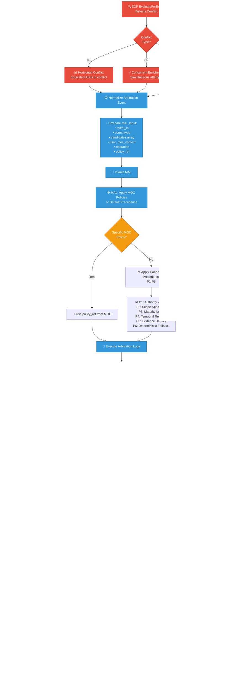

# MAL - Matrix Arbiter Layer - Arbitration Flow
**Complete Arbitration Process Diagram**

## MAL Arbitration Flow - Complete Process

## Description

This diagram shows the complete MAL (Matrix Arbiter Layer) arbitration process from conflict detection to final action application.

### Key Stages:

1. **Conflict Detection**: ZOF EvaluateForEnrich detects H1, H2, or H3 conflicts
2. **Event Normalization**: Standardize conflict data for MAL processing  
3. **Policy Application**: Apply MOC-specific policies or canonical precedence rules
4. **Decision Making**: Determine winner, coexistence, rejection, or deferral
5. **Persistence**: Store immutable Decision Record in MEF
6. **Communication**: OIF explains decision to user with cited MOC nodes
7. **Action Application**: ZOF applies the arbitration decision

### Conflict Types:
- **H1 (Horizontal)**: Equivalent UKIs that conflict semantically
- **H2 (Concurrent)**: Simultaneous enrichment attempts  
- **H3 (Promotion)**: Competing promotion proposals

### Precedence Rules (P1-P6):
- **P1**: Authority Weight (higher MOC authority wins)
- **P2**: Scope Specificity (context-dependent precedence)
- **P3**: Maturity Level (validated > endorsed > draft)
- **P4**: Temporal Recency (more recent wins, respecting lifecycle)
- **P5**: Evidence Density (more MEF references wins)
- **P6**: Deterministic Fallback (lexicographic UKI identifier)

## Integration Points

- **ZOF**: Detects conflicts and applies MAL decisions
- **MOC**: Provides arbitration policies and precedence rules
- **MEF**: Persists Decision Records as immutable audit trail
- **OIF**: Explains arbitration outcomes to users
- **MEP**: Guides epistemic rationale generation