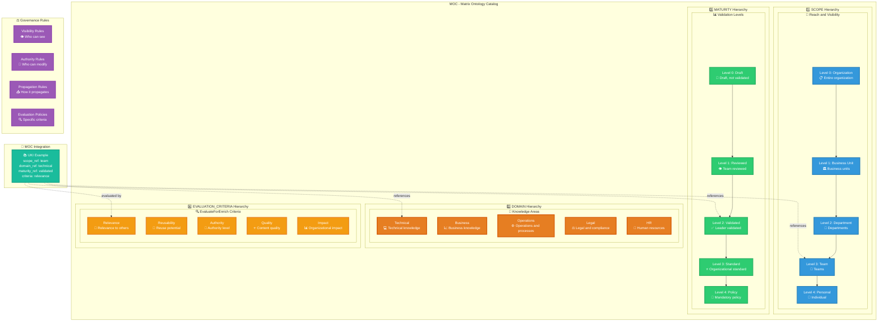
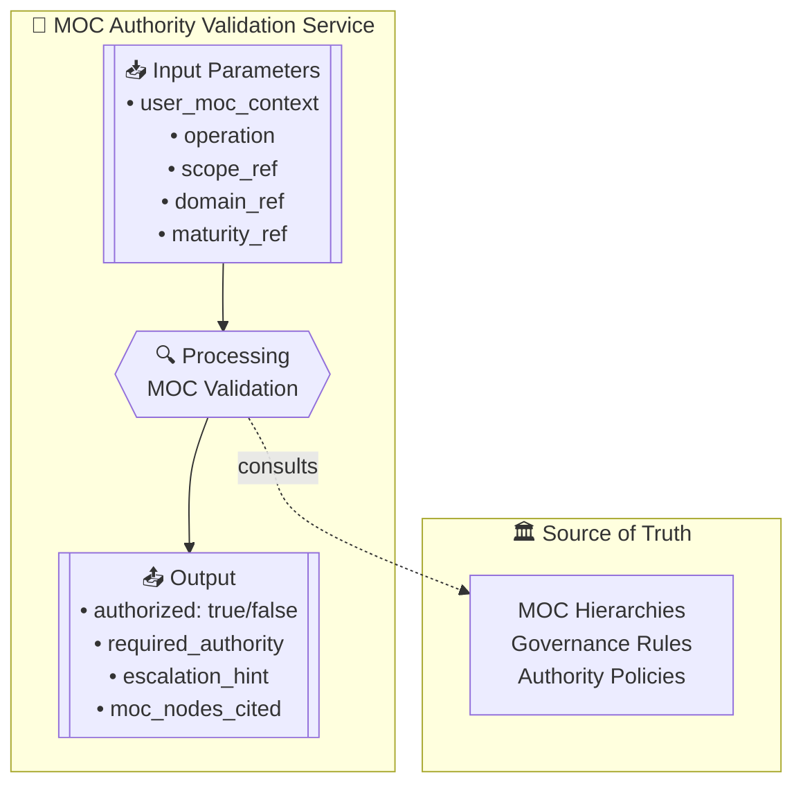

# MOC - Matrix Ontology Catalog - Hierarchical Structure
**Organizational Taxonomy Visualization**

## Structure of the Four MOC Hierarchies

## MOC Authority Validation Service

## Description

The MOC (Matrix Ontology Catalog) provides the foundational taxonomy system that enables organizational adaptation while maintaining protocol coherence.

### Four Required Hierarchies:

#### 1. SCOPE Hierarchy 🏢
- **Purpose**: Define knowledge reach and visibility
- **Levels**: Organization → Business Unit → Department → Team → Personal
- **Governance**: Controls who can see and access knowledge

#### 2. DOMAIN Hierarchy 🎯  
- **Purpose**: Define knowledge specialization areas
- **Examples**: Technical, Business, Operations, Legal, HR
- **Flexibility**: Each organization defines their own domains

#### 3. MATURITY Hierarchy 📊
- **Purpose**: Define validation and reliability levels
- **Progression**: Draft → Reviewed → Validated → Standard → Policy
- **Authority**: Higher maturity requires higher authority

#### 4. EVALUATION_CRITERIA Hierarchy 🔍
- **Purpose**: Define criteria for ZOF EvaluateForEnrich checkpoint
- **Examples**: Relevance, Reusability, Authority, Quality, Impact
- **Usage**: Determines if knowledge should enrich the Oracle

### Key Features:

- **Organizational Flexibility**: Each organization defines their own specific taxonomies
- **Universal Structure**: All organizations use the same four hierarchy types
- **Authority Integration**: Controls permissions and access across frameworks
- **Semantic Elasticity**: Local adaptation without losing global coherence

### Integration Points:

- **MEF**: UKIs reference MOC nodes via *_ref fields
- **ZOF**: Uses MOC criteria for EvaluateForEnrich decisions
- **MAL**: Consults MOC policies for arbitration precedence
- **OIF**: Filters responses based on user's MOC context

## Warning

⚠️ **IMPORTANT**: The examples shown (technical, business, draft, etc.) are **illustrative only**. Each organization must define their own hierarchies based on their specific needs and structure. The MOC specification provides the framework, not the content.