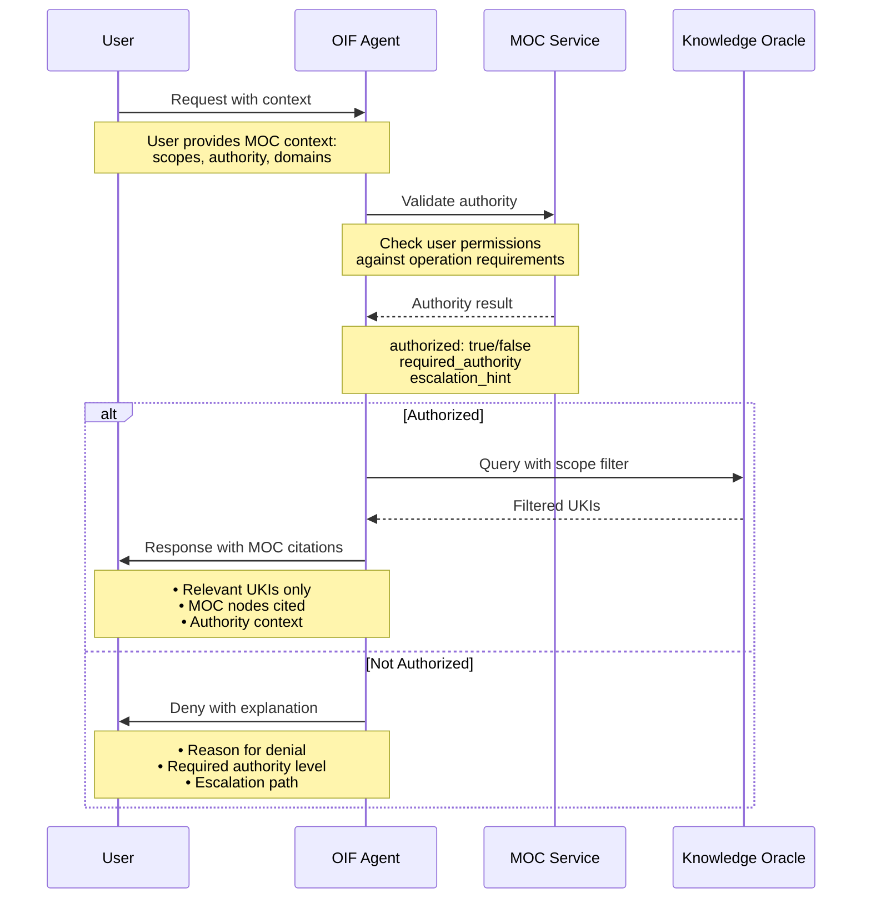

# OIF - Operator Intelligence Framework - Access Control
**AI Agent Authority Validation and MOC Integration**

## OIF Access Control Flow

```mermaid
flowchart LR
    subgraph "🤖 OIF Agents"
        KAgent[Knowledge Agent<br/>📚 MEF Specialist]
        WAgent[Workflow Agent<br/>🔄 ZOF Specialist]
        SAgent[Specialized Agent<br/>🎯 Domain-Specific]
    end
    
    subgraph "🔐 MOC Service"
        MOCService{{"MOC Authority<br/>Validation"}}
        AuthCheck[Authority Check]
        ScopeFilter[Scope Filtering]
        DomainFilter[Domain Filtering]
    end
    
    subgraph "👤 User Interaction"
        User[User Request]
        UserContext[User MOC Context<br/>• scopes<br/>• authority_level<br/>• domain_access]
    end
    
    User --> UserContext
    UserContext --> KAgent
    UserContext --> WAgent  
    UserContext --> SAgent
    
    KAgent -->|query authority| MOCService
    WAgent -->|query authority| MOCService
    SAgent -->|query authority| MOCService
    
    MOCService --> AuthCheck
    AuthCheck --> ScopeFilter
    ScopeFilter --> DomainFilter
    
    DomainFilter -->|authorized| Execute[✅ Execute Operation<br/>with Filtered Results]
    DomainFilter -->|not authorized| Escalate[📤 Escalate or Deny<br/>with MOC Explanation]
    
    Execute --> Result[📋 Return Result<br/>• Cited MOC nodes<br/>• Filtered UKIs<br/>• Authority context]
    Escalate --> Result
    
    %% Styles
    classDef agent fill:#3498db,stroke:#2980b9,stroke-width:2px,color:#fff
    classDef moc fill:#9b59b6,stroke:#8e44ad,stroke-width:2px,color:#fff
    classDef user fill:#1abc9c,stroke:#16a085,stroke-width:2px,color:#fff
    classDef outcome fill:#27ae60,stroke:#229954,stroke-width:2px,color:#fff
    classDef escalation fill:#e74c3c,stroke:#c0392b,stroke-width:2px,color:#fff
    
    class KAgent,WAgent,SAgent agent
    class MOCService,AuthCheck,ScopeFilter,DomainFilter moc
    class User,UserContext user
    class Execute,Result outcome
    class Escalate escalation
```



## Detailed Access Control Process



## Agent Archetypes and Capabilities

### Knowledge Agent 📚
**Specialization**: MEF (Matrix Embedding Framework)
- **Primary Function**: UKI search, organization, and explanation
- **MOC Integration**: 
  - Filters UKIs by user's scope_ref and domain_ref
  - Respects maturity_ref permissions
  - Cites specific MOC nodes in explanations
- **Capabilities**:
  - Semantic search across authorized knowledge
  - UKI relationship navigation  
  - Knowledge gap identification
  - Citation and reference management

### Workflow Agent 🔄
**Specialization**: ZOF (Zion Orchestration Framework)
- **Primary Function**: Workflow orchestration and EvaluateForEnrich execution
- **MOC Integration**:
  - Validates enrichment authority before UKI creation
  - Applies MOC evaluation criteria for enrichment decisions
  - Manages scope propagation rules
- **Capabilities**:
  - Canonical state management
  - Oracle consultation orchestration
  - Conflict detection (H1/H2/H3)
  - Enrichment evaluation

### Specialized Agents 🎯
**Specialization**: Domain or organization-specific
- **Primary Function**: Customized intelligence for specific domains
- **MOC Integration**:
  - Domain-specific authority validation
  - Specialized taxonomy understanding
  - Context-aware response filtering
- **Examples**:
  - Security Agent (security domain expertise)
  - Compliance Agent (regulatory knowledge)
  - Technical Agent (engineering practices)

## Authority Validation Rules

### Mandatory Validations
All OIF agents MUST:
1. **Authority Check**: Verify user has required authority for operation
2. **Scope Filtering**: Only show UKIs within user's scope access
3. **Domain Filtering**: Limit responses to user's domain permissions
4. **Maturity Respect**: Honor maturity-based access restrictions

### Response Requirements
All agent responses MUST include:
1. **MOC Citations**: Reference specific MOC nodes used in filtering
2. **Authority Context**: Explain why certain information is/isn't shown  
3. **Escalation Paths**: Provide next steps if higher authority needed
4. **Derived Authority**: Avoid absolute statements, cite organizational context

## Integration with Other Frameworks

### MEF Integration
- **UKI Access**: Filter UKIs based on MOC permissions
- **Creation Authority**: Validate user can create UKIs in target scope/domain
- **Version Control**: Respect maturity progression rules

### ZOF Integration  
- **Workflow Authority**: Validate user can execute workflow operations
- **Enrichment Decisions**: Apply MOC criteria in EvaluateForEnrich
- **Conflict Resolution**: Coordinate with MAL when conflicts detected

### MAL Integration
- **Decision Explanation**: Explain arbitration outcomes using templates
- **Authority Precedence**: Support MAL P1 (Authority Weight) evaluations
- **Escalation Support**: Handle MAL defer outcomes appropriately

## Example Interactions

### Authorized Knowledge Query
```
User: "Show me authentication patterns for our API"
Knowledge Agent: 
- Queries MOC: scope=team-backend, domain=technical
- Filters UKIs: Returns 3 relevant authentication UKIs
- Response: "Based on your team-backend scope, here are 3 authentication 
  patterns (citing moc:scope:team-backend, moc:domain:technical)"
```

### Unauthorized Operation Attempt
```
User: "Create organization-wide security policy"
Workflow Agent:
- Queries MOC: scope=organization, domain=security, operation=create
- MOC Response: unauthorized (user=team_member, required=security_lead)
- Response: "You need security_lead authority for organization-wide policies. 
  Contact [escalation_path] to request this operation."
```

## Key Principles

1. **Hierarchical Explainability**: All responses cite specific MOC nodes
2. **Derived Authority**: No absolute statements, always contextual
3. **Contextual Filtering**: Show only what user has authority to see
4. **Transparent Governance**: Clear explanations of permission decisions
5. **Escalation Support**: Provide paths for higher authority when needed