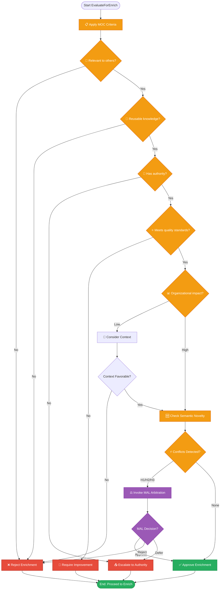

# ZOF - Zion Orchestration Framework - Canonical States
**Technology-Independent Workflow State Machine**

## ZOF Canonical States - Complete Flow

```mermaid

stateDiagram-v2
    [*] --> Intake
    
    state "📥 Intake" as Intake {
        [*] --> CaptureContext
        CaptureContext --> OrganizeRequirements
        OrganizeRequirements --> [*]
        --
        CaptureContext : Capture context and requirements
        OrganizeRequirements : Organize input information
    }
    
    state "🧠 Understand" as Understand {
        [*] --> ConsultOracle
        ConsultOracle --> FilterByMOC
        FilterByMOC --> ProcessUKIs
        ProcessUKIs --> [*]
        --
        ConsultOracle : Mandatory Oracle consultation
        FilterByMOC : Filter by authority/scope
        ProcessUKIs : Process returned UKIs
    }
    
    state "⚖️ Decide" as Decide {
        [*] --> AnalyzeKnowledge
        AnalyzeKnowledge --> MakeDecision
        MakeDecision --> [*]
        --
        AnalyzeKnowledge : Analyze existing knowledge
        MakeDecision : Make decision based on UKIs
    }
    
    state "⚡ Act" as Act {
        [*] --> ExecutePlan
        ExecutePlan --> CaptureResults
        CaptureResults --> [*]
        --
        ExecutePlan : Execute planned action
        CaptureResults : Capture execution results
    }
    
    state "🔍 EvaluateForEnrich" as EvaluateForEnrich {
        [*] --> ApplyMOCCriteria
        ApplyMOCCriteria --> CheckNovelty
        CheckNovelty --> ValidateAuthority
        ValidateAuthority --> ConflictDetection
        ConflictDetection --> DecisionPoint
        DecisionPoint --> [*] : Approved
        DecisionPoint --> InvokeMAL : Conflict detected
        InvokeMAL --> ApplyMALDecision
        ApplyMALDecision --> [*]
        --
        ApplyMOCCriteria : Apply organizational criteria
        CheckNovelty : Check semantic novelty
        ValidateAuthority : Validate authority via MOC
        ConflictDetection : Detect H1/H2/H3 conflicts
        DecisionPoint : Decide enrichment
        InvokeMAL : Invoke Matrix Arbiter Layer
        ApplyMALDecision : Apply MAL decision
    }
    
    state "👀 Review" as Review {
        [*] --> ValidateResult
        ValidateResult --> QualityCheck
        QualityCheck --> [*]
        --
        ValidateResult : Validate obtained result
        QualityCheck : Quality assessment
    }
    
    state "📚 Enrich" as Enrich {
        [*] --> CreateUKI
        CreateUKI --> EstablishRelationships
        EstablishRelationships --> PersistKnowledge
        PersistKnowledge --> [*]
        --
        CreateUKI : Create new UKI structure
        EstablishRelationships : Link to existing UKIs
        PersistKnowledge : Persist in Oracle
    }
    
    %% State transitions
    Intake --> Understand : context_ready
    Understand --> Decide : oracle_consulted
    Decide --> Act : decision_made
    Act --> EvaluateForEnrich : action_completed
    EvaluateForEnrich --> Review : no_enrichment
    EvaluateForEnrich --> Enrich : enrichment_approved
    Review --> [*] : workflow_complete
    Enrich --> Review : knowledge_persisted
    
    %% Optional paths
    Review --> Decide : iteration_needed
    Decide --> Understand : more_context_needed
```




## Explainability Signals Framework

Each state transition MUST record explainability signals:

```mermaid

graph LR
    subgraph "State Transition"
        Input[📥 Context<br/>What entered state]
        Process[⚙️ Processing<br/>What happens in state]
        Decision[⚖️ Decision<br/>Why transition occurred]
        Output[📤 Result<br/>What exits state]
    end
    
    Input --> Process
    Process --> Decision  
    Decision --> Output
    
    subgraph "Signal Types"
        Context[🎯 Context Signal<br/>"Requirements clarified<br/>with stakeholders"]
        DecisionLog[📋 Decision Signal<br/>"Sufficient info gathered<br/>to make decision"]
        Result[📊 Result Signal<br/>"Clear action plan<br/>with success criteria"]
    end
```


## EvaluateForEnrich - Detailed Process




## State Descriptions

### 📥 Intake
**Purpose**: Capture and organize workflow context and requirements
- **Duration**: Variable (minutes to hours)
- **Key Activities**: 
  - Capture user requirements and context
  - Organize input information
  - Prepare for Oracle consultation
- **Success Criteria**: Clear, structured context ready for processing

### 🧠 Understand (Mandatory Oracle Consultation)
**Purpose**: Consult existing knowledge before making decisions
- **Duration**: Seconds to minutes
- **Key Activities**:
  - Query Oracle for relevant UKIs
  - Filter results by MOC authority/scope
  - Process and contextualize existing knowledge
- **Success Criteria**: Comprehensive understanding of existing knowledge
- **Mandatory**: Cannot skip this state - Oracle consultation required

### ⚖️ Decide  
**Purpose**: Make informed decisions based on Oracle knowledge + new context
- **Duration**: Minutes to hours
- **Key Activities**:
  - Analyze existing UKIs against current context
  - Identify knowledge gaps or conflicts
  - Make decision with full information
- **Success Criteria**: Clear decision with rationale

### ⚡ Act
**Purpose**: Execute the planned action
- **Duration**: Variable (minutes to weeks)
- **Key Activities**:
  - Execute planned action or solution
  - Capture execution results and learnings
  - Document outcomes and insights
- **Success Criteria**: Action completed with documented results

### 🔍 EvaluateForEnrich (Mandatory Checkpoint)
**Purpose**: Determine if new knowledge should enrich the Oracle
- **Duration**: Seconds to minutes  
- **Key Activities**:
  - Apply MOC-defined evaluation criteria
  - Check semantic novelty and quality
  - Validate authority and detect conflicts
  - Invoke MAL if conflicts detected
- **Success Criteria**: Clear enrichment decision with rationale
- **Mandatory**: Cannot skip this checkpoint

### 👀 Review (Optional)
**Purpose**: Validate and assess workflow results
- **Duration**: Minutes to hours
- **Key Activities**:
  - Validate achieved results
  - Quality assessment and learning capture
  - Determine if iteration needed
- **Success Criteria**: Confirmed quality and completeness

### 📚 Enrich (Conditional)
**Purpose**: Create and persist new UKIs in the Oracle
- **Duration**: Minutes to hours
- **Key Activities**:
  - Structure new knowledge as UKIs
  - Establish semantic relationships
  - Persist knowledge with proper metadata
- **Success Criteria**: New UKIs successfully integrated into Oracle

## Framework Integration

### MOC Integration
- **Authority Validation**: Each state respects MOC-defined permissions
- **Evaluation Criteria**: EvaluateForEnrich uses MOC-configured criteria
- **Scope Management**: All operations respect scope propagation rules

### MAL Integration  
- **Conflict Detection**: EvaluateForEnrich detects H1/H2/H3 conflicts
- **Arbitration Invocation**: Seamless handoff to MAL for resolution
- **Decision Application**: Apply MAL decisions in workflow context

### OIF Integration
- **State Explanation**: OIF agents explain state transitions to users
- **Authority Context**: Provide MOC-based explanations for restrictions
- **Workflow Guidance**: Help users navigate canonical states effectively

### MEF Integration
- **Oracle Consultation**: Query existing UKIs during Understand state
- **Knowledge Persistence**: Create new UKIs during Enrich state
- **Relationship Management**: Establish semantic links between UKIs

## Key Principles

1. **Technology Independence**: Describes "how to think", not "how to implement"
2. **Oracle-Centric**: Always consult existing knowledge before deciding
3. **Mandatory Checkpoints**: Understand and EvaluateForEnrich cannot be skipped
4. **Explainable Transitions**: Every state change has clear context/decision/result
5. **Governance Aware**: All operations respect MOC authority and scope rules