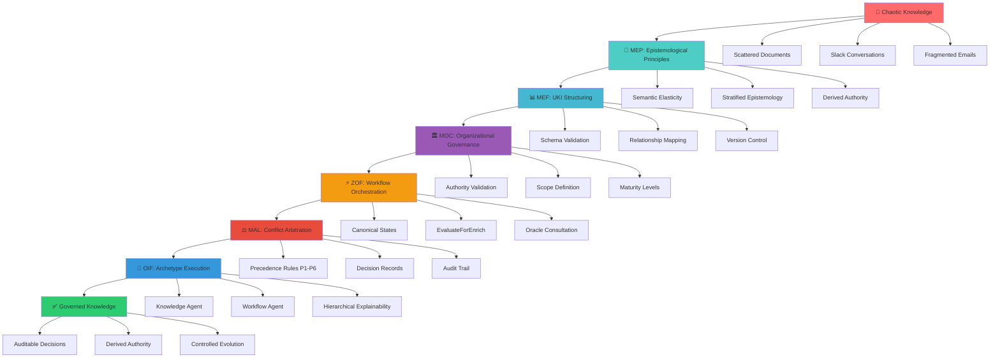
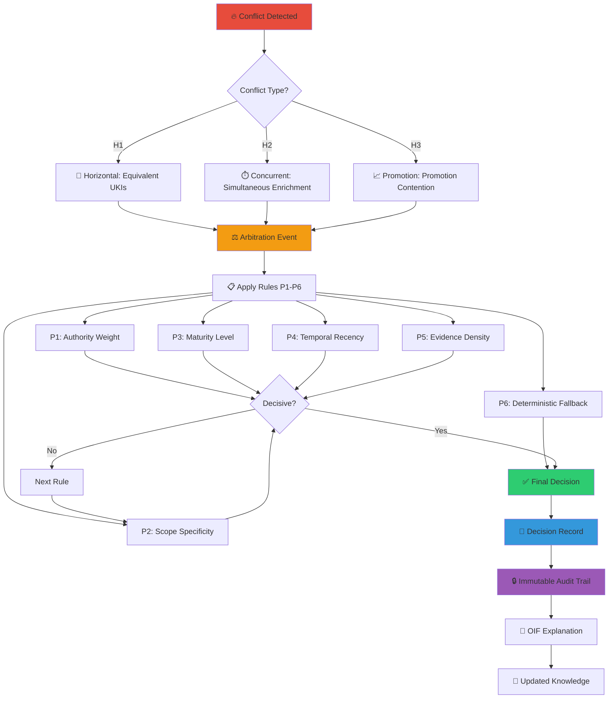
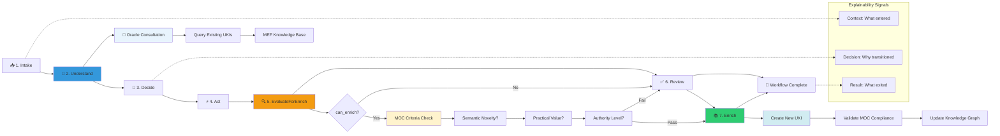

# UKI Conceptual Roadmaps

This page presents the fundamental epistemological flows of Matrix Protocol, demonstrating how knowledge evolves from theory to practice through the MEP→MEF→ZOF→OIF frameworks. The following diagrams illustrate complete conceptual journeys that connect philosophical principles to practical results.

## 1. UKI Journey: From Chaotic to Structured Knowledge

The first flowchart demonstrates how unstructured organizational knowledge is systematically transformed into governed knowledge through Matrix Protocol frameworks.



### Practical Example: Squad Payments

Using the real example from `moc-squad-payments.yaml`:

1. **Chaotic Knowledge**: 12 scattered documents about payments
2. **MEP**: Application of semantic elasticity principles
3. **MEF**: Creation of 17 structured UKIs with relationships
4. **MOC**: Governance via `scope_ref: squad-payments`
5. **ZOF**: Validation and enrichment workflows
6. **MAL**: Arbitration of discount rule conflicts
7. **OIF**: Archetypes executing contextualized decisions

## 2. Arbitration Flow: MAL in Action

This diagram details how the Matrix Arbiter Layer resolves knowledge conflicts using the 6 deterministic precedence rules.



### Real Example: Data Retention Conflict

```yaml
# Scenario: Two conflicting UKIs about data retention
candidates:
  - uki:squad-x:rule:data-retention-30d (validated, tech-lead)
  - uki:squad-x:rule:data-retention-7d (endorsed, developer)

# MAL Decision:
winner: data-retention-30d
precedence: P3_maturity (validated > endorsed)
rationale: "Regulatory compliance supersedes data minimization"
```

## 3. ZOF Orchestration: Canonical States and EvaluateForEnrich

The third flowchart presents how ZOF orchestrates knowledge workflows through the 7 mandatory canonical states.



### Practical Example: Payment Gateway Selection

```yaml
# ZOF Workflow: Gateway choice for new market
flow_id: "payment-gateway-selection-brazil"

states:
  intake:
    context: "Need for gateway in Brazilian market"
    
  understand:
    oracle_consultation:
      - uki:squad-payments:business_rule:fee-calculation-005
      - uki:squad-payments:technical_pattern:gateway-integration-007
    result: "Base knowledge about existing gateways"
    
  evaluate_for_enrich:
    moc_criteria: ["business_impact", "reusability", "authority"]
    can_enrich: true
    rationale: "Brazilian market specificities are novel"
    
  enrich:
    new_uki: "uki:squad-payments:business_rule:brazil-gateway-rules-019"
    moc_compliance: "validated via scope_ref: squad-payments"
```

## 📖 Related Resources

### Matrix Protocol Frameworks
- [MEF - Matrix Embedding Framework](/en/docs/frameworks/mef) - Knowledge structuring via UKIs
- [ZOF - Zion Orchestration Framework](/en/docs/frameworks/zof) - AI-oriented workflow orchestration
- [OIF - Operator Intelligence Framework](/en/docs/frameworks/oif) - Archetypes and intelligent execution
- [MOC - Matrix Ontology Catalog](/en/docs/frameworks/moc) - Organizational governance
- [MAL - Matrix Arbiter Layer](/en/docs/frameworks/mal) - Deterministic arbitration

### Practical Examples
- [Knowledge Comparison](/en/docs/examples) - Structured vs Unstructured
- [UKI Examples](/en/docs/examples/knowledge/structured) - Real UKI examples
- [Organizational Pilots](/en/docs/examples/pilots) - Implementation cases

### Implementation Manual
- [Implementation Guide](/en/docs/implementation) - Practical adoption steps
- [Templates by Organization](/en/docs/manual/templates) - Size-specific models
- [Tools and Validation](/en/docs/manual/tools) - Support utilities

### Quickstart
- [Quick Start](/en/docs/quickstart) - First steps with Matrix Protocol
- [Quickstart Templates](/en/docs/quickstart/templates) - Quick start models