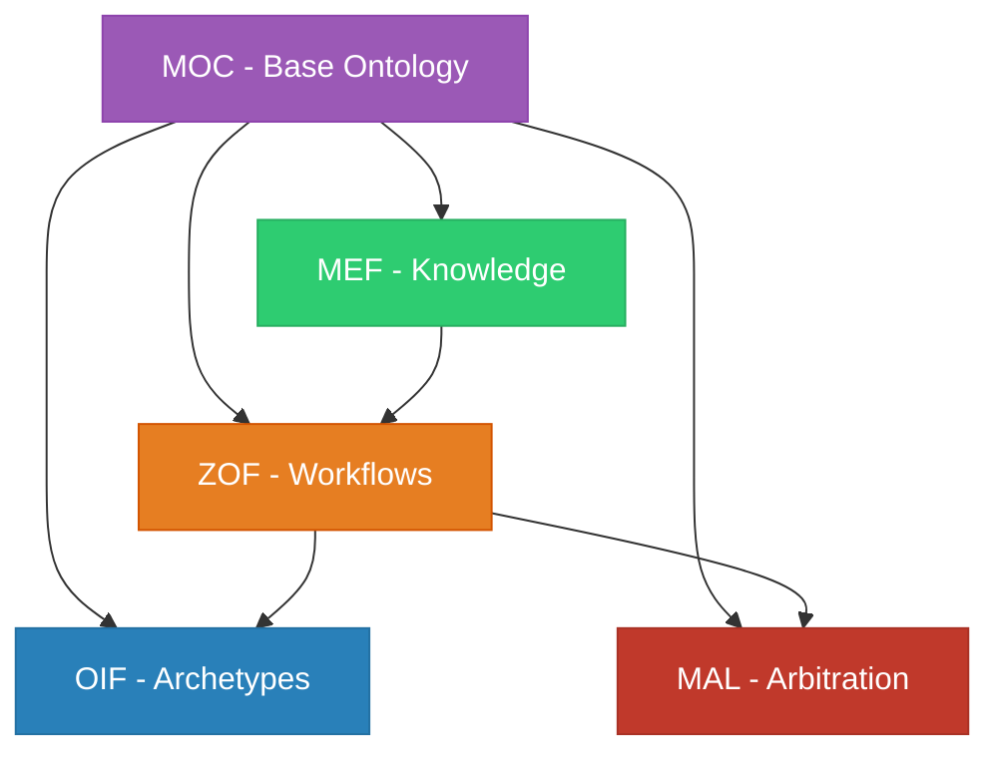

# Matrix Protocol Frameworks

The Matrix Protocol consists of **5 interdependent frameworks** that work together to create a robust human-AI collaboration system. Each framework has its specialization and integrates with the others.

## 🏛️ Framework Architecture

### Oracle Layer (Strategic)
- **[MEF - Matrix Embedding Framework](/docs/frameworks/mef)** - Versioned knowledge structuring
- **[MEF Ontology](/docs/frameworks/mef-ontology)** - MEF-specific ontology

### Zion Layer (Orchestration)  
- **[ZOF - Zion Orchestration Framework](/docs/frameworks/zof)** - AI-oriented workflows

### Operator Layer (Execution)
- **[OIF - Operator Intelligence Framework](/docs/frameworks/oif)** - AI agent archetypes

### Transversal Layers
- **[MOC - Matrix Ontology Catalog](/docs/frameworks/moc)** - Organizational ontological catalog
- **[MAL - Matrix Arbiter Layer](/docs/frameworks/mal)** - Arbitration and conflict resolution

## 📊 Comparative Overview

| Framework | Main Focus | Typical Users | Complexity |
|-----------|------------|---------------|------------|
| **MEF** | Knowledge structuring | Domain experts | ⭐⭐⭐ |
| **ZOF** | Workflow orchestration | Technical leaders | ⭐⭐⭐⭐ |
| **OIF** | AI archetypes | Developers | ⭐⭐⭐⭐⭐ |
| **MOC** | Organizational governance | Architects | ⭐⭐ |
| **MAL** | Conflict resolution | Administrators | ⭐⭐⭐⭐ |

## 🎯 Where to Start?

### For Beginners
1. **[MOC](/docs/frameworks/moc)** - Start by defining your organizational ontology
2. **[MEF](/docs/frameworks/mef)** - Learn to structure knowledge
3. **[ZOF](/docs/frameworks/zof)** - Implement basic workflows

### For Advanced Implementation
1. **[OIF](/docs/frameworks/oif)** - Configure AI archetypes
2. **[MAL](/docs/frameworks/mal)** - Set up arbitration and governance

### For Theoretical Understanding
1. **[MEF Ontology](/docs/frameworks/mef-ontology)** - MEF ontological foundations

## 🔗 Interdependencies

## 📖 Detailed Documentation

### MEF - Matrix Embedding Framework
- **[Complete Specification](/docs/frameworks/mef)** - UKI structuring
- **[MEF Ontology](/docs/frameworks/mef-ontology)** - Theoretical foundations

### ZOF - Zion Orchestration Framework  
- **[Complete Specification](/docs/frameworks/zof)** - Canonical states and workflows

### OIF - Operator Intelligence Framework
- **[Complete Specification](/docs/frameworks/oif)** - Archetypes and AI agents

### MOC - Matrix Ontology Catalog
- **[Complete Specification](/docs/frameworks/moc)** - Ontological catalog

### MAL - Matrix Arbiter Layer
- **[Complete Specification](/docs/frameworks/mal)** - Deterministic arbitration

## 🚀 Practical Resources

- **[Implementation Guide](/docs/implementation)** - How to implement all frameworks
- **[Templates](/docs/manual/templates)** - Ready-to-use templates for each framework
- **[Examples](/docs/manual/examples)** - Real use cases
- **[Tools](/docs/manual/tools)** - Validation checklists

---

> **💡 Tip**: The frameworks are designed to be implemented gradually. Start with MOC and MEF, then expand to the others as your organization matures.