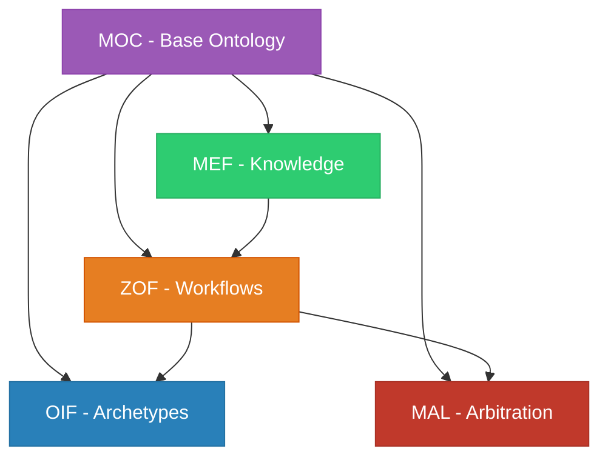

# Matrix Protocol Frameworks

Matrix Protocol consists of **5 interdependent frameworks** that work together to create a robust human-AI collaboration system. Each framework has its specialty and integrates with the others.

## 🏛️ Framework Architecture

### Oracle Layer (Strategic)
- **[MEF - Matrix Embedding Framework](./mef)** - Versioned knowledge structuring
- **[MEF Ontology](./mef-ontology)** - MEF-specific ontology

### Zion Layer (Orchestration)  
- **[ZOF - Zion Orchestration Framework](./zof)** - AI-oriented workflows

### Operator Layer (Execution)
- **[OIF - Operator Intelligence Framework](./oif)** - AI agent archetypes

### Cross-cutting Layers
- **[MOC - Matrix Ontology Catalog](./moc)** - Organizational ontological catalog
- **[MAL - Matrix Arbiter Layer](./mal)** - Arbitration and conflict resolution

## 📊 Comparative Overview

| Framework | Main Focus                   | Typical Users            | Complexity   |
|-----------|------------------------------|--------------------------|--------------|
| **MEF**   | Knowledge structuring        | Domain specialists       | ⭐⭐⭐          |
| **ZOF**   | Workflow orchestration       | Technical leaders        | ⭐⭐⭐⭐         |
| **OIF**   | AI archetypes                | Developers               | ⭐⭐⭐⭐⭐        |
| **MOC**   | Organizational governance    | Architects               | ⭐⭐           |
| **MAL**   | Conflict resolution          | Administrators           | ⭐⭐⭐⭐         |

## 🎯 Where to Start?

### For Beginners
1. **[MOC - Matrix Ontology Catalog](./moc)** - Start by defining your organizational ontology
2. **[MEF - Matrix Embedding Framework](./mef)** - Learn to structure knowledge
3. **[ZOF - Zion Orchestration Framework](./zof)** - Implement basic workflows

### For Advanced Implementation
1. **[OIF - Operator Intelligence Framework](./oif)** - Configure AI archetypes
2. **[MAL - Matrix Arbiter Layer](./mal)** - Configure arbitration and governance

### For Theoretical Understanding
1. **[MEF Ontology](./mef-ontology)** - MEF ontological foundations

## 🔗 Interdependencies

## 📖 Detailed Documentation

### MEF - Matrix Embedding Framework
- **[MEF - Matrix Embedding Framework](./mef)** - UKI structuring
- **[MEF Ontology](./mef-ontology)** - Theoretical foundations

### ZOF - Zion Orchestration Framework  
- **[ZOF - Zion Orchestration Framework](./zof)** - Canonical states and workflows

### OIF - Operator Intelligence Framework
- **[OIF - Operator Intelligence Framework](./oif)** - Archetypes and AI agents

### MOC - Matrix Ontology Catalog
- **[MOC - Matrix Ontology Catalog](./moc)** - Ontological catalog

### MAL - Matrix Arbiter Layer
- **[MAL - Matrix Arbiter Layer](./mal)** - Deterministic arbitration

## 🚀 Practical Resources

- **[Implementation Guide](../implementation)** - How to implement all frameworks
- **[Templates](../manual/templates)** - Ready-to-use templates for each framework
- **[Examples](../manual/examples)** - Real use cases
- **[Tools](../manual/tools)** - Validation checklists

---

> **💡 Tip**: The frameworks are designed to be implemented gradually. Start with MOC and MEF, then expand to the others as your organization matures.