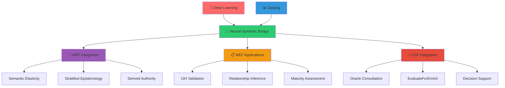
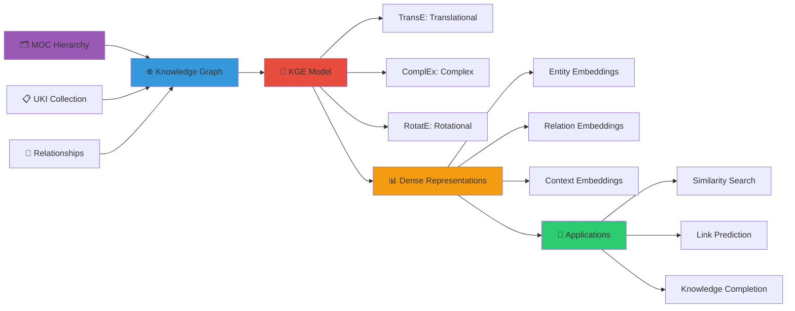

# Inference & Reasoning in Matrix Protocol

Matrix Protocol is built upon advanced inference and reasoning technologies to ensure robust and auditable epistemological decisions. This page explores how Deep Learning/Datalog, Knowledge Graph Embeddings (KGE), and Graph Neural Networks (GNN) integrate with Matrix frameworks, creating a distributed reasoning system that respects MEP principles.

## 1. Deep Learning & Datalog: Epistemological Reasoning

### Conceptual Foundation

The integration between Deep Learning and Datalog in Matrix Protocol represents an innovative synthesis between symbolic and subsymbolic reasoning, allowing structured knowledge (UKIs) and unstructured knowledge to coexist in epistemological harmony.

#### Integration Principles



### Conceptual Example 1: Automatic UKI Validation

```python
# Pseudocode: Neural-Datalog Validation Engine
class UKIValidator:
    def __init__(self, moc_schema, dl_model):
        self.datalog_rules = self.load_moc_rules(moc_schema)
        self.neural_embedder = dl_model
        
    def validate_uki(self, uki_content):
        # 1. Datalog: Structural validation
        structural_valid = self.datalog_rules.check(uki_content)
        
        # 2. Deep Learning: Semantic coherence
        embedding = self.neural_embedder.encode(uki_content)
        semantic_score = self.assess_coherence(embedding)
        
        # 3. MEP Principle: Derived Authority
        return {
            'structural': structural_valid,
            'semantic': semantic_score,
            'authority_context': self.get_moc_context(uki_content),
            'epistemic_rationale': self.generate_explanation()
        }
```

### Conceptual Example 2: Relationship Inference

The system combines explicit Datalog rules with neural embeddings to infer implicit relationships between UKIs:

```datalog
% Datalog Rules for UKI Relationships
conflicts_with(UKI1, UKI2) :- 
    same_scope(UKI1, UKI2),
    contradictory_conclusions(UKI1, UKI2),
    overlapping_domain(UKI1, UKI2).

complements(UKI1, UKI2) :-
    semantic_similarity(UKI1, UKI2, Score),
    Score > 0.7,
    different_aspects(UKI1, UKI2).

% Neural embeddings for semantic_similarity
semantic_similarity(UKI1, UKI2, Score) :-
    neural_embedding(UKI1, E1),
    neural_embedding(UKI2, E2),
    cosine_similarity(E1, E2, Score).
```

### Conceptual Example 3: Intelligent MAL Arbitration

```python
# MAL Decision Engine with DL/Datalog
class MALDecisionEngine:
    def resolve_conflict(self, conflict_event):
        # Datalog: Apply P1-P6 precedence rules
        datalog_decision = self.apply_precedence_rules(conflict_event)
        
        # Deep Learning: Context understanding
        context_embedding = self.encode_organizational_context(conflict_event)
        historical_patterns = self.retrieve_similar_decisions(context_embedding)
        
        # Neural-Symbolic Synthesis
        final_decision = self.synthesize_decision(
            datalog_decision, 
            historical_patterns,
            context_embedding
        )
        
        return {
            'winner': final_decision.winner,
            'precedence_rule': datalog_decision.rule_applied,
            'confidence': final_decision.confidence,
            'historical_support': historical_patterns,
            'epistemic_rationale': self.generate_explanation(final_decision)
        }
```

## 2. Knowledge Graph Embeddings: Semantic Representation of UKIs

### Matrix Embedding Architecture

Matrix Protocol uses Knowledge Graph Embeddings to create dense and meaningful representations of the organizational knowledge graph, respecting MOC hierarchical structure and semantic relationships between UKIs.



### Conceptual Example 4: MOC Hierarchy Embedding

```python
# KGE for MOC Structures
class MOCEmbedder:
    def __init__(self, moc_schema):
        self.hierarchies = moc_schema.hierarchies
        self.embedding_dim = 256
        
    def create_moc_graph(self):
        """Convert MOC to Knowledge Graph"""
        graph = nx.MultiDiGraph()
        
        for hierarchy_name, hierarchy in self.hierarchies.items():
            for node in hierarchy.nodes:
                # Add node with hierarchy context
                graph.add_node(
                    node.id, 
                    hierarchy=hierarchy_name,
                    level=node.level,
                    governance=node.governance
                )
                
                # Add hierarchical relationships
                if node.parent:
                    graph.add_edge(node.parent, node.id, relation='parent_of')
                    graph.add_edge(node.id, node.parent, relation='child_of')
        
        return graph
    
    def train_embeddings(self, graph):
        """Train embeddings preserving MOC hierarchy"""
        # Use RotatE for hierarchical relations
        model = RotatE(
            entities=list(graph.nodes()),
            relations=['parent_of', 'child_of', 'sibling_of'],
            embedding_dim=self.embedding_dim
        )
        
        # Loss function preserving hierarchy
        def hierarchical_loss(h, r, t):
            base_loss = model.compute_loss(h, r, t)
            hierarchy_penalty = self.compute_hierarchy_penalty(h, t)
            return base_loss + 0.1 * hierarchy_penalty
        
        return model.train_with_loss(graph.edges(), hierarchical_loss)
```

### Conceptual Example 5: Semantic Search in UKIs

```python
# Semantic Search using KGE
class UKISemanticSearch:
    def __init__(self, uki_embeddings, moc_embedder):
        self.uki_embeddings = uki_embeddings
        self.moc_embedder = moc_embedder
        
    def search_similar_ukis(self, query_uki, scope_filter=None):
        """Search semantically similar UKIs"""
        query_embedding = self.uki_embeddings[query_uki.id]
        
        similarities = []
        for uki_id, embedding in self.uki_embeddings.items():
            if scope_filter and not self.in_scope(uki_id, scope_filter):
                continue
                
            # Compute semantic similarity
            similarity = cosine_similarity(query_embedding, embedding)
            
            # Apply MOC-aware weighting
            moc_weight = self.compute_moc_relevance(query_uki, uki_id)
            
            weighted_similarity = similarity * moc_weight
            similarities.append((uki_id, weighted_similarity))
        
        return sorted(similarities, key=lambda x: x[1], reverse=True)
    
    def compute_moc_relevance(self, uki1, uki2):
        """Weight based on MOC hierarchical proximity"""
        hierarchy_distance = self.moc_embedder.hierarchy_distance(
            uki1.scope_ref, uki2.scope_ref
        )
        return 1.0 / (1.0 + hierarchy_distance)
```

### Conceptual Example 6: Link Prediction in Knowledge Graphs

```python
# Link Prediction for New Relationships
class UKILinkPredictor:
    def predict_relationships(self, uki_source, candidate_targets):
        """Predict probable relationships between UKIs"""
        predictions = []
        
        for target in candidate_targets:
            for relation_type in ['depends_on', 'conflicts_with', 'complements']:
                # Use KGE model for prediction
                score = self.kge_model.predict_link(
                    uki_source.embedding,
                    relation_type,
                    target.embedding
                )
                
                # Apply MOC governance rules
                governance_valid = self.check_moc_governance(
                    uki_source, target, relation_type
                )
                
                if governance_valid and score > 0.7:
                    predictions.append({
                        'source': uki_source.id,
                        'target': target.id,
                        'relation': relation_type,
                        'confidence': score,
                        'moc_compliant': True
                    })
        
        return sorted(predictions, key=lambda x: x['confidence'], reverse=True)
```

## 3. Graph Neural Networks: Inference in Knowledge Graphs

### GNN Architecture for Matrix Protocol

Graph Neural Networks in Matrix Protocol operate on the organizational knowledge graph, propagating information through UKI→UKI relations while respecting governance constraints defined in the MOC.

```mermaid
graph TD
    A[🌐 Knowledge Graph] --> B[🧠 GNN Architecture]
    
    B --> B1[Graph Attention Networks]
    B --> B2[Graph Convolutional Networks] 
    B --> B3[Graph Transformer]
    
    B1 --> C[🔍 Node Classification]
    B2 --> C
    B3 --> C
    
    B1 --> D[🔗 Edge Prediction]
    B2 --> D
    B3 --> D
    
    B1 --> E[📊 Graph-level Tasks]
    B2 --> E
    B3 --> E
    
    C --> F[Matrix Applications]
    D --> F
    E --> F
    
    F --> F1[UKI Maturity Classification]
    F --> F2[Conflict Detection]
    F --> F3[Knowledge Gap Analysis]
    F --> F4[Organizational Learning]
    
    style A fill:#3498db
    style B fill:#e74c3c
    style C fill:#f39c12
    style D fill:#2ecc71
    style E fill:#9b59b6
    style F fill:#34495e
```



### Conceptual Example 7: UKI Maturity Classification

```python
# GNN for Maturity Classification
class UKIMaturityClassifier:
    def __init__(self, graph_structure):
        self.graph = graph_structure
        self.gnn_model = self.build_gat_model()
        
    def build_gat_model(self):
        """Graph Attention Network for maturity"""
        return GraphAttentionNetwork(
            input_dim=256,  # UKI embedding dimension
            hidden_dims=[128, 64],
            output_dim=4,   # draft, endorsed, validated, approved
            num_heads=8,
            dropout=0.2
        )
    
    def classify_maturity(self, uki_node):
        """Classify maturity based on graph context"""
        # Get neighborhood context
        neighbors = self.graph.get_neighbors(uki_node, depth=2)
        subgraph = self.graph.subgraph(neighbors)
        
        # Apply GNN with attention
        node_features = self.extract_node_features(subgraph)
        attention_weights = self.gnn_model.compute_attention(node_features)
        
        # Classification with MOC compliance
        maturity_logits = self.gnn_model.forward(subgraph, node_features)
        predicted_maturity = torch.softmax(maturity_logits, dim=-1)
        
        # Validate against MOC governance rules
        moc_valid_levels = self.get_moc_valid_levels(uki_node)
        filtered_prediction = self.apply_moc_filter(predicted_maturity, moc_valid_levels)
        
        return {
            'predicted_maturity': filtered_prediction.argmax(),
            'confidence': filtered_prediction.max(),
            'attention_weights': attention_weights,
            'influential_neighbors': self.get_top_neighbors(attention_weights)
        }
```

### Conceptual Example 8: Conflict Detection via GNN

```python
# Conflict Detection using Graph Neural Networks
class ConflictDetectionGNN:
    def __init__(self, knowledge_graph):
        self.graph = knowledge_graph
        self.conflict_detector = self.build_conflict_gnn()
        
    def build_conflict_gnn(self):
        """GNN specialized for conflict detection"""
        return GraphTransformer(
            input_dim=256,
            hidden_dim=128,
            num_layers=4,
            num_heads=8,
            task='edge_classification'  # conflict vs no-conflict
        )
    
    def detect_potential_conflicts(self, scope_ref=None):
        """Detect potential conflicts in knowledge graph"""
        if scope_ref:
            subgraph = self.get_scope_subgraph(scope_ref)
        else:
            subgraph = self.graph
            
        # Generate candidate edge pairs
        candidate_edges = self.generate_candidate_conflicts(subgraph)
        
        conflict_predictions = []
        for edge in candidate_edges:
            uki1, uki2 = edge
            
            # Extract contextual features
            context_features = self.extract_conflict_context(uki1, uki2, subgraph)
            
            # GNN inference
            conflict_probability = self.conflict_detector.predict_edge(
                uki1.embedding, uki2.embedding, context_features
            )
            
            if conflict_probability > 0.8:
                conflict_predictions.append({
                    'uki1': uki1.id,
                    'uki2': uki2.id,
                    'conflict_type': self.classify_conflict_type(uki1, uki2),
                    'probability': conflict_probability,
                    'context': context_features,
                    'recommended_action': self.suggest_resolution(uki1, uki2)
                })
        
        return sorted(conflict_predictions, key=lambda x: x['probability'], reverse=True)
```

### Conceptual Example 9: Knowledge Gap Analysis

```python
# Knowledge Gap Analysis using GNN
class KnowledgeGapAnalyzer:
    def __init__(self, complete_graph, current_graph):
        self.complete_graph = complete_graph  # Ideal knowledge graph
        self.current_graph = current_graph    # Current organizational state
        self.gap_detector = self.build_gap_gnn()
        
    def analyze_knowledge_gaps(self, organization_context):
        """Identify critical gaps in organizational knowledge"""
        
        # Compare graph structures
        missing_nodes = self.find_missing_ukis(organization_context)
        missing_edges = self.find_missing_relationships()
        
        gap_priorities = []
        
        for missing_uki in missing_nodes:
            # Use GNN to assess impact of missing knowledge
            impact_score = self.assess_missing_uki_impact(missing_uki)
            
            # Consider organizational context
            org_relevance = self.compute_organizational_relevance(
                missing_uki, organization_context
            )
            
            priority_score = impact_score * org_relevance
            
            gap_priorities.append({
                'missing_uki': missing_uki,
                'impact_score': impact_score,
                'org_relevance': org_relevance,
                'priority': priority_score,
                'recommended_creation_path': self.suggest_creation_path(missing_uki)
            })
        
        return sorted(gap_priorities, key=lambda x: x['priority'], reverse=True)
    
    def assess_missing_uki_impact(self, missing_uki):
        """Assess the impact of a specific missing UKI"""
        # Simulate graph with missing UKI added
        simulated_graph = self.current_graph.copy()
        simulated_graph.add_node(missing_uki)
        
        # Predict relationships using GNN
        predicted_edges = self.gap_detector.predict_edges_for_node(
            missing_uki, simulated_graph
        )
        
        # Measure improvement in graph connectivity
        connectivity_improvement = self.measure_connectivity_change(
            self.current_graph, simulated_graph
        )
        
        # Weight by predicted relationship strength
        weighted_impact = sum(edge.strength for edge in predicted_edges)
        
        return connectivity_improvement * weighted_impact
```

## 4. Matrix Protocol Integration: From Theory to Orchestration

### Epistemological Synthesis

The complete integration of DL/Datalog, KGE, and GNN in Matrix Protocol creates a distributed reasoning system that operates across multiple epistemological layers, always respecting the fundamental principles of MEP.

```mermaid
graph TB
    subgraph "🔮 MEP Layer"
        MEP1[Semantic Elasticity]
        MEP2[Stratified Epistemology]
        MEP3[Derived Authority]
    end
    
    subgraph "🧠 Neural-Symbolic Integration"
        NS1[DL/Datalog Bridge]
        NS2[KGE Representations]
        NS3[GNN Inference]
    end
    
    subgraph "📊 MEF Layer"
        MEF1[UKI Validation]
        MEF2[Relationship Inference]
        MEF3[Knowledge Evolution]
    end
    
    subgraph "🏛️ MOC Layer"
        MOC1[Governance Rules]
        MOC2[Authority Validation]
        MOC3[Scope Management]
    end
    
    subgraph "⚡ ZOF Layer"
        ZOF1[Oracle Consultation]
        ZOF2[EvaluateForEnrich]
        ZOF3[Workflow States]
    end
    
    subgraph "⚖️ MAL Layer"
        MAL1[Conflict Detection]
        MAL2[Precedence Rules]
        MAL3[Decision Records]
    end
    
    subgraph "🧠 OIF Layer"
        OIF1[Knowledge Agent]
        OIF2[Workflow Agent]
        OIF3[Explanation Generation]
    end
    
    MEP1 --> NS1
    MEP2 --> NS2
    MEP3 --> NS3
    
    NS1 --> MEF1
    NS2 --> MEF2
    NS3 --> MEF3
    
    MEF1 --> MOC1
    MEF2 --> MOC2
    MEF3 --> MOC3
    
    MOC1 --> ZOF1
    MOC2 --> ZOF2
    MOC3 --> ZOF3
    
    ZOF1 --> MAL1
    ZOF2 --> MAL2
    ZOF3 --> MAL3
    
    MAL1 --> OIF1
    MAL2 --> OIF2
    MAL3 --> OIF3
    
    style MEP1 fill:#9b59b6
    style NS2 fill:#e74c3c
    style MEF2 fill:#3498db
    style MOC2 fill:#f39c12
    style ZOF2 fill:#2ecc71
    style MAL2 fill:#e67e22
    style OIF2 fill:#34495e
```



### Conceptual Example 10: Complete Decision System

```python
# Integrated Matrix Protocol Decision System
class MatrixDecisionSystem:
    def __init__(self, moc_schema):
        # Initialize all components
        self.moc = MOCGovernance(moc_schema)
        self.dl_datalog = NeuralSymbolicEngine()
        self.kge = KnowledgeGraphEmbedder()
        self.gnn = GraphNeuralNetwork()
        self.mal = MALDecisionEngine()
        self.oif = OIFExplainer()
        
    def process_knowledge_decision(self, context, user_authority):
        """Process knowledge decision using all frameworks"""
        
        # 1. ZOF: Understand State - Oracle Consultation
        relevant_ukis = self.oracle_consultation(context)
        
        # 2. MEF: Extract structured knowledge
        structured_knowledge = self.extract_ukis(relevant_ukis)
        
        # 3. KGE: Compute semantic representations
        knowledge_embeddings = self.kge.embed_knowledge_context(
            structured_knowledge
        )
        
        # 4. GNN: Graph-level inference
        graph_inference = self.gnn.infer_context_implications(
            knowledge_embeddings
        )
        
        # 5. DL/Datalog: Validate and reason
        reasoning_result = self.dl_datalog.reason_about_context(
            context, graph_inference
        )
        
        # 6. MOC: Apply governance rules
        governance_check = self.moc.validate_authority_and_scope(
            reasoning_result, user_authority
        )
        
        # 7. ZOF: EvaluateForEnrich checkpoint
        enrich_decision = self.evaluate_for_enrich(
            reasoning_result, governance_check
        )
        
        # 8. MAL: Handle conflicts if any
        if enrich_decision.has_conflicts:
            arbitration_result = self.mal.resolve_conflicts(
                enrich_decision.conflicts
            )
            reasoning_result = arbitration_result.final_decision
        
        # 9. OIF: Generate explanation
        explanation = self.oif.generate_hierarchical_explanation(
            reasoning_result, 
            user_authority,
            decision_path=[
                'oracle_consultation', 'kge_embedding', 'gnn_inference',
                'neural_symbolic_reasoning', 'moc_governance', 
                'enrich_evaluation', 'mal_arbitration'
            ]
        )
        
        return {
            'decision': reasoning_result,
            'explanation': explanation,
            'audit_trail': self.generate_audit_trail(),
            'moc_compliance': governance_check,
            'epistemic_rationale': self.generate_mep_rationale()
        }
```

## 📖 Related Resources

### Matrix Protocol Frameworks
- [MEP - Matrix Epistemic Principle](/en/docs/frameworks/mep) - Fundamental epistemological principles
- [MEF - Matrix Embedding Framework](/en/docs/frameworks/mef) - Knowledge structuring via UKIs
- [ZOF - Zion Orchestration Framework](/en/docs/frameworks/zof) - AI-oriented workflow orchestration
- [OIF - Operator Intelligence Framework](/en/docs/frameworks/oif) - Archetypes and intelligent execution
- [MOC - Matrix Ontology Catalog](/en/docs/frameworks/moc) - Organizational governance
- [MAL - Matrix Arbiter Layer](/en/docs/frameworks/mal) - Deterministic arbitration

### Technical Documentation
- [Conceptual Roadmaps](/en/docs/examples/conceptual-roadmaps) - Visualized epistemological flows
- [UKI Examples](/en/docs/examples/knowledge/structured) - Practical implementations
- [Implementation Guide](/en/docs/implementation) - Practical adoption steps

### Advanced Specifications
- [Neural-Symbolic Architecture](/en/docs/manual/tools) - Implementation details
- [MOC Governance](/en/docs/manual/governance) - Policies and precedences
- [Metrics and Feedback Loop](/en/docs/manual/tools/feedback-loop) - Monitoring and improvement