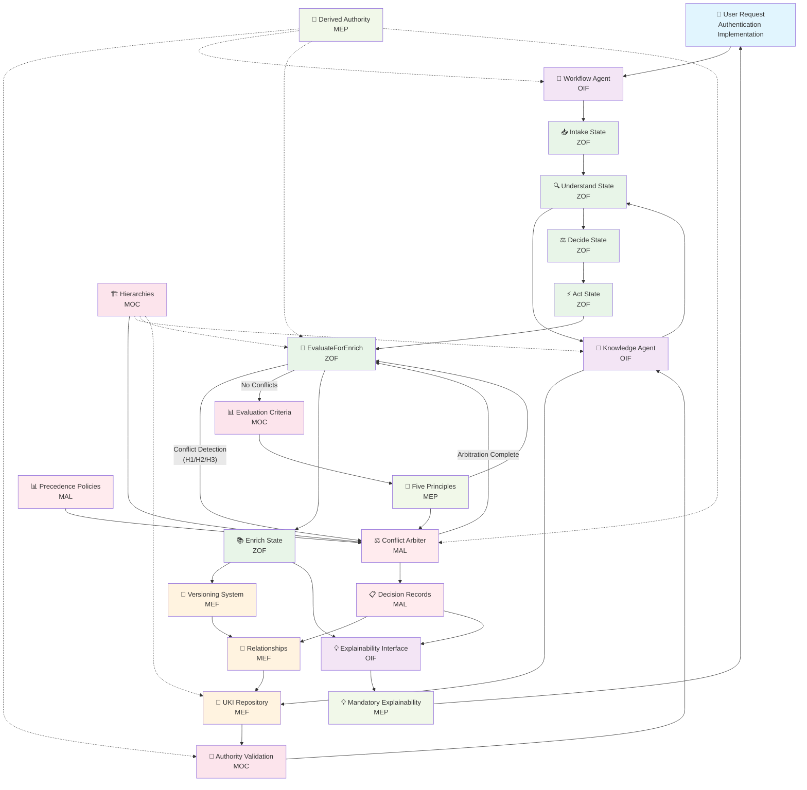

# Matrix Protocol — Integration Diagram
**Acronym:** Integration Diagram  
**Version:** 0.0.1-beta  
**Last Update:** 2025-10-05  

> ⚠️ **IMPORTANT**: This document is an informative translation. The authoritative version is MATRIX_PROTOCOL_INTEGRATION_DIAGRAM.md.

> 🔄 "The whole is greater than the sum of its parts — and the Matrix Protocol demonstrates this through seamless integration between frameworks."

---

## 1. Introduction

The **Matrix Protocol Integration Diagram** provides the meta-architectural view of how all frameworks (MEF, ZOF, OIF, MOC, MEP) work together in practice.

This document visualizes the end-to-end flows that cross boundaries between frameworks, showing concrete integration patterns that implementers encounter when building Matrix Protocol-compatible systems.

Unlike individual framework documentation that focuses on specific capabilities, this diagram shows the **complete journey** from user interaction to knowledge enrichment across all layers.

---

## 2. Central Integration Patterns

### Pattern 1: Knowledge-Driven Workflow
**Flow**: `User Request → OIF Intelligence → ZOF Workflow → Oracle Query → MEF UKI Creation`
- OIF receives user request and determines workflow type
- ZOF orchestrates canonical states with mandatory Oracle consultation
- MEF provides structured knowledge via UKIs during Understand state
- MOC validates all hierarchical references and authority levels
- MEP guides epistemological decisions throughout the process

### Pattern 2: Authority-Aware Operations
**Flow**: `Operation Request → MOC Authority Check → Framework-Specific Execution → MEP Compliance`
- All operations validate authority through MOC before execution
- Each framework respects the user's hierarchical context
- MEP principles ensure derived authority, never absolute truth
- Escalation paths route requests requiring higher authority

### Pattern 3: Enrichment Evaluation Cycle
**Flow**: `ZOF EvaluateForEnrich → MOC Criteria → MEP Epistemology → MEF UKI Creation → OIF Explanation`
- ZOF executes mandatory enrichment evaluation
- MOC provides organizational criteria for evaluation
- MEP guides epistemological justification requirements
- MEF structures the resulting UKI with appropriate metadata
- OIF provides explainable feedback to users

### Pattern 4: Multi-scope Enrichment Validation
**Flow**: `Multi-scope Request → ZOF Scope Mode Validation → MOC Authority Check → ANY/ALL Scope Logic → Enrichment Decision`
- Request affects multiple organizational scopes
- ZOF applies scope_mode validation (any vs all)
- MOC validates authority for each affected scope
- Logic gates determine approval based on scope_mode configuration
- Enrichment proceeds only with sufficient scope validation

### Pattern 5: MAL-MEF-MEP Epistemological Feedback Loop
**Flow**: `MAL Arbitration Decision → MEF Decision Record → MEP Epistemological Validation → Taxonomic Feedback → MOC Evolution`
- MAL makes arbitration decisions with epistemic justification
- MEF persists decision records as permanent knowledge artifacts
- MEP validates epistemological compliance and coherence
- Decision patterns inform taxonomic evolution proposals
- MOC analyzes feedback for possible ontological refinements

---

## 3. End-to-End Flow Diagram




---

## 4. Integration Points Matrix

| **From Framework** | **To Framework**        | **Integration Point**               | **Purpose**                                                          |
|------------------|---------------------------|---------------------------------------|------------------------------------------------------------------------|
| **OIF → ZOF**    | Workflow Agent            | Canonical States Orchestration     | Execute ZOF flows via intelligence archetypes                     |
| **ZOF → OIF**    | Oracle Consultation       | Knowledge Agent Query              | Query existing knowledge during Understand state             |
| **ZOF → MEF**    | Enrichment            | UKI Creation                        | Create structured knowledge during Enrich state                   |
| **ZOF → MOC**    | EvaluateForEnrich         | Criteria Consultation                 | Apply organizational evaluation criteria                         |
| **OIF → MOC**    | Authority Check | Hierarchical Validation                 | Validate user authority for operations                           |
| **MEF → MOC**    | Field Validation        | *_ref References                     | Validate all hierarchical field references                     |
| **OIF → MEP**    | Explainability           | Derived Authority                   | Ensure contextual, not absolute responses                          |
| **ZOF → MEP**    | Enrichment Decision | Epistemological Justification          | Apply MEP principles in enrichment evaluation                  |
| **MEF → MEP**    | Knowledge Promotion  | Responsible Promotion                  | Document epistemological justification for UKI evolution           |
| **ZOF → MAL**    | Conflict Detection      | Arbitration Invocation               | Invoke MAL when EvaluateForEnrich detects H1/H2/H3 conflicts        |
| **MAL → MEF**    | Decision Persistence   | Decision Record Storage  | Persist arbitration decisions as immutable audit records |
| **MAL → OIF**    | Result Communication  | Arbitration Explanation              | Explain arbitration results using structured templates        |
| **MOC → MAL**    | Policy Configuration  | Precedence Rules Provision | Provide arbitration policies and authority hierarchies           |
| **MEP → MAL**    | Epistemic Foundation     | Justification Generation              | Guide epistemological justification in arbitration decisions         |

---

## 5. Practical Examples

### **Example 1: JWT Authentication Implementation**

```yaml


# Complete Integration Flow
user_story: "As a developer, I need to implement JWT authentication"

# 1. OIF Intelligence Reception
oif_workflow_agent:
  request_analysis: "Need for authentication implementation"
  workflow_determination: "Technical implementation workflow"
  canonical_event: "work.proposed"

# 2. ZOF Canonical States Execution
zof_workflow_execution:
  intake:
    signals:
      context: "JWT authentication story received"
      decision: "Requirements clear, proceed to understand"
      result: "Context captured and organized"
  
  understand:
    oracle_consultation: 
      knowledge_agent_query: "existing authentication patterns"
      moc_authority_filter: "user scope: team, domain: technical"
      retrieved_ukis:
        - "uki:technical:pattern:jwt-authentication"
        - "uki:business:policy:security-requirements"
    signals:
      context: "Oracle returned existing authentication knowledge"
      decision: "Use proven JWT pattern with team-specific adaptations"
      result: "Implementation strategy defined"
  
  decide:
    moc_validation:
      authority_check: "user can implement in team scope"
      vendor_policy: "approved library selection"
    signals:
      context: "Strategy validated against organizational policies"
      decision: "Proceed with implementation using approved approach"
      result: "Technical plan approved"
  
  act:
    conceptual_execution: "Implement JWT solution following Oracle patterns"
    signals:
      context: "Implementation following proven patterns"
      decision: "Solution completed with team-specific improvements"
      result: "Working authentication system deployed"
  
  evaluate_for_enrich:
    moc_criteria_consultation:
      relevance: {threshold: "medium", result: "PASS", score: 0.8}
      reusability: {threshold: "high", result: "PASS", score: 0.9}
      impact: {threshold: "medium", result: "PASS", score: 0.7}
    mep_epistemological_check:
      novelty_validation: "Team-specific implementation patterns identified"
      authority_derivation: "Authorized for enrichment in team scope"
    signals:
      context: "Implementation contains reusable knowledge"
      decision: "Approve enrichment with team scope"
      result: "Qualified for Oracle enrichment"
  
  enrich:
    mef_uki_creation:
      - id: "uki:technical:example:team-jwt-implementation"
        scope_ref: "team"
        domain_ref: "technical"
        type_ref: "example"
        maturity_ref: "validated"
        relationships:
          - type: "derives_from"
            target: "uki:technical:pattern:jwt-authentication"
    signals:
      context: "New UKI created documenting team implementation"
      decision: "Knowledge stored with appropriate semantic relationships"
      result: "Oracle enriched for future reuse"

# 3. OIF Explainability Response
oif_explanation:
  mep_compliance: "Response contextualizes authority within team scope"
  explanation_to_user: |
    "Implementation completed successfully based on organizational patterns.
    
    ✅ Used: uki:technical:pattern:jwt-authentication (Oracle guidance)
    ✅ Validated: Against team authority and domain access
    ✅ Created: uki:technical:example:team-jwt-implementation
    
    This knowledge is now available for other team members working
    on similar authentication requirements."
```


### **Example 2: MAL Arbitration Scenario**

```yaml


# Concurrent JWT Implementation Conflict
user_story: "Two teams implementing JWT authentication simultaneously"

# 1. ZOF Conflict Detection during EvaluateForEnrich
zof_conflict_detection:
  conflict_type: "H2_concurrent_enrichment"
  candidates:
    - flow_id: "team-frontend-jwt-001"
      uki_target: "uki:technical:pattern:jwt-authentication"
      user: {scope: "team-frontend", authority: "developer"}
    - flow_id: "team-backend-jwt-002"
      uki_target: "uki:technical:pattern:jwt-authentication"
      user: {scope: "team-backend", authority: "tech_lead"}
  
  mal_invocation: "Local resolution failed, invoking MAL"

# 2. MAL Arbitration Process
mal_arbitration_event:
  event_id: "mal-evt-concurrent-jwt-001"
  event_type: "H2"
  policy_ref: "moc:arbitration:concurrent_enrichment"
  
  arbitration_decision:
    outcome: "winner"
    winner: "team-backend-jwt-002"
    loser: "team-frontend-jwt-001"
    precedence_applied:
      - "P1_authority": "tech_lead > developer"
    actions:
      - "allow_enrich:team-backend-jwt-002"
      - "defer_enrich:team-frontend-jwt-001"
    
    epistemic_rationale:
      summary: "Higher authority precedence in concurrent scenario"
      moc_nodes_cited: ["moc:authority:tech_lead", "moc:domain:technical"]

# 3. OIF Arbitration Explanation
oif_arbitration_template:
  decision_id: "mal-evt-concurrent-jwt-001"
  outcome: "winner"
  winner: "backend team JWT implementation"
  losers: ["frontend team JWT implementation"]
  precedence_applied: "Authority precedence: tech_lead > developer"
  
  user_explanation: |
    "Arbitration completed for concurrent JWT implementations.
    
    ✅ Winner: Backend team implementation (tech_lead authority)
    ⏸️ Deferred: Frontend team implementation 
    📋 Next Steps: Frontend team should coordinate with backend team
    🔗 Reference: MOC authority hierarchy for technical domain"

# 4. MEF Decision Record Persistence
mef_decision_record:
  decision_id: "mal-dec-concurrent-jwt-001"
  relationships_created:
    - type: "conflicts_with"
      source: "team-frontend-jwt-001"
      target: "team-backend-jwt-002"
      resolution: "authority_precedence"
  
  audit_trail: "Complete MAL arbitration recorded for future reference"
```


### **Example 3: Authority Escalation Scenario**

```yaml


# Organizational Policy Creation Attempt
user_request: "Create organizational security policy"
user_context: {scope: "team", authority: "developer", domain: "technical"}

# 1. MOC Authority Validation
moc_authority_check:
  required_scope: "organization" 
  user_max_scope: "team"
  validation_result: "ESCALATION_REQUIRED"
  escalation_path: "team_lead → architect → cto"

# 2. OIF Intelligent Response
oif_knowledge_agent:
  mep_derived_authority_application: |
    "Based on your 'developer' authority in 'team' scope (MOC: hierarchies.scope.team),
    you cannot create policies at the organizational level.
    
    Available actions:
    ✅ Create security guidelines at team level
    ✅ Request escalation via: team_lead → architect → cto
    🔒 Organizational policy creation requires 'architect' authority or higher
    
    Reference: MOC hierarchies.scope.team.governance.policy_creation_restrictions"

# 3. ZOF Workflow Adaptation  
zof_workflow_modification:
  original_flow: "work.proposed → organizational policy creation"
  adapted_flow: "assistance.requested → escalation routing"
  canonical_states:
    intake: "Policy creation request with scope mismatch"
    understand: "Consult MOC authority requirements"
    decide: "Route to escalation path per MOC configuration"
    act: "Generate escalation request with context"
    # EvaluateForEnrich skipped - no enrichment for escalation routing
```

---

## 6. Integration Anti-patterns

### **❌ Anti-pattern 1: Direct Framework Communication**
```yaml

# WRONG: Direct MEF → MOC bypass
direct_bad_pattern:
  problem: "MEF validates *_ref fields by directly querying MOC"
  issue: "Bypasses MEP derived authority principles"

# CORRECT: Authority-mediated interaction
authority_mediated_pattern:
  solution: "MEF requests validation through user's OIF context"
  benefit: "Respects hierarchical authority and derived truth"
```

### **❌ Anti-pattern 2: ZOF Oracle Bypass**
```yaml

# WRONG: ZOF skips Understand state
oracle_bypass_bad:
  problem: "ZOF proceeds directly from Intake to Decide"
  issue: "Violates Oracle-first principle, misses existing knowledge"

# CORRECT: Mandatory Oracle consultation
oracle_first_correct:
  solution: "Always execute Understand state with OIF Knowledge Agent query"
  benefit: "Leverages existing knowledge, prevents duplicate work"
```

### **❌ Anti-pattern 3: MAL Circumvention**
```yaml

# WRONG: Local conflict resolution without MAL
mal_bypass_bad:
  problem: "ZOF attempts manual conflict resolution in EvaluateForEnrich"
  issue: "Inconsistent decisions, no audit trail, violates determinism"

# CORRECT: Invoke MAL for H1/H2/H3 conflicts
mal_proper_invocation:
  solution: "Forward all unresolvable conflicts to MAL arbitration"
  benefit: "Consistent, auditable, epistemologically grounded decisions"
```

---

## 7. Implementation Checklist

### **Framework Integration Validation**
- [ ] All ZOF workflows include mandatory Oracle consultation
- [ ] OIF responses cite MOC context, avoid absolute statements
- [ ] MEF UKIs reference valid MOC hierarchy nodes
- [ ] MAL decisions include epistemic rationale and MOC references
- [ ] Authority checks precede all privileged operations

### **Cross-Framework Data Flow**
- [ ] User authority propagates correctly through all framework interactions
- [ ] Enrichment decisions follow complete ZOF → MOC → MEP → MEF → OIF cycle
- [ ] Conflict detection triggers MAL arbitration appropriately
- [ ] Decision records persist with complete audit trail
- [ ] Explanations reference appropriate framework contexts

### **MEP Compliance**
- [ ] No framework makes absolute truth claims
- [ ] All authority derives from MOC organizational context  
- [ ] Every decision includes epistemological justification
- [ ] Knowledge promotion requires explicit rationale
- [ ] Semantic elasticity maintained through MOC configurability

---

> ℹ️ **Integration Philosophy**: The Matrix Protocol's power emerges from seamless framework collaboration, not individual framework capabilities. Success requires understanding the integration patterns that transform individual tools into a unified epistemological system for human-AI collaboration.

*This integration diagram serves as the architectural blueprint for building Matrix Protocol-compliant systems that demonstrate the emergent intelligence arising from framework synergy.*