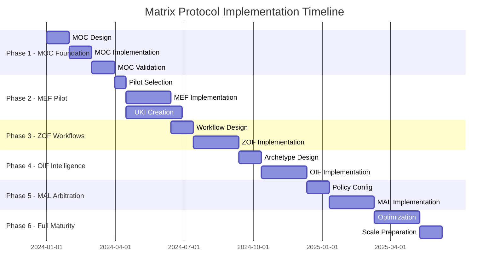

# Matrix Protocol Implementation Phases - Detailed Guide
**Gradual Implementation in 6 Phases with Checklists and Validation Milestones**

**Version:** 0.0.1-beta  
**Date:** 2025-10-05  
**Compatibility:** Matrix Protocol v0.0.1-beta  

> 🎯 **Purpose**: Provide detailed and actionable guidance for each implementation phase with concrete checklists, validation criteria and success metrics.

---

## 📊 Implementation Overview

### Phase Timeline and Dependencies



### Success Criteria by Phase

| Phase       | Primary Success Metric           | Secondary Metrics               | Business Impact            |
|------------|---------------------------------------|------------------------------------|---------------------------------|
| **Phase 1** | MOC validates 100% org structure         | Complete authority mapping     | Foundation established               |
| **Phase 2** | 100+ validated UKIs created           | 50% reduction knowledge conflicts | Knowledge quality improvement |
| **Phase 3** | All workflows follow canonical states | Oracle consultation 95%+              | Decision quality improvement      |
| **Phase 4** | AI responses cite sources 100%        | Knowledge access time <5 min   | User experience improvement    |
| **Phase 5** | Conflicts resolved in <15 min       | 90%+ stakeholder satisfaction       | Governance effectiveness             |
| **Phase 6** | ROI >200% demonstrated                 | System scales to org size    | Complete transformation          |

---

## 🏗️ PHASE 1: MOC Foundation (Months 1-3)

### Phase Overview
**Duration:** 3 months  
**Team Size:** 3-5 people (depending on org size)  
**Prerequisites:** Executive sponsorship, stakeholder identification  
**Deliverables:** Complete organizational MOC, governance policies, arbitration rules  

### Week-by-Week Breakdown

#### **Weeks 1-2: Organizational Assessment**

**Objectives:**
- [ ] Complete stakeholder mapping
- [ ] Conduct organizational structure analysis
- [ ] Identify existing knowledge systems
- [ ] Map current decision-making processes

**Activities:**
```yaml

stakeholder_interviews:
  executive_level: 
    - ceo_cto_interview: "Strategic vision and priorities"
    - division_heads: "Departmental structure and needs"
    - board_members: "Governance requirements" # For corporations
    
  management_level:
    - directors_vps: "Current knowledge challenges"
    - team_leaders: "Day-to-day operational needs"
    - project_managers: "Cross-functional coordination issues"
    
  operational_level:
    - senior_contributors: "Knowledge discovery and usage patterns"
    - domain_experts: "Specialized knowledge requirements"
    - new_hires: "Onboarding and knowledge gaps"

knowledge_audit:
  systems_inventory:
    - documentation_platforms: ["Confluence", "Notion", "SharePoint", "wikis"]
    - communication_tools: ["Slack", "Teams", "email_archives"]
    - project_management: ["Jira", "Asana", "project_folders"]
    - code_repositories: ["GitHub", "GitLab", "internal_repos"]
    - business_systems: ["CRM", "ERP", "specialized_tools"]
    
  knowledge_assessment:
    - document_count: "Total knowledge artifacts"
    - duplication_rate: "Percentage of redundant information"
    - conflict_identification: "Instances of contradictory information"
    - access_patterns: "Who uses which knowledge when"
    - maintenance_status: "Outdated vs current information"

decision_flow_mapping:
  critical_decisions:
    - architectural_decisions: "Who decides technical standards"
    - product_decisions: "Who decides feature priorities"
    - operational_decisions: "Who decides process changes"
    - strategic_decisions: "Who decides business direction"
    
  authority_analysis:
    - formal_authority: "Org chart decision rights"
    - informal_authority: "Real influence patterns"
    - escalation_paths: "Conflict resolution flows"
    - approval_requirements: "What needs whose approval"
```

**Weeks 1-2 Checklist:**
- [ ] Schedule and complete 15-25 stakeholder interviews
- [ ] Document current org structure with real (not official) reporting lines
- [ ] Inventory all knowledge systems and their usage patterns
- [ ] Identify top 10 knowledge pain points
- [ ] Map 20+ critical decision types and their current flow
- [ ] Analyze 5-10 recent decision conflicts and their resolution
- [ ] Document regulatory/compliance requirements
- [ ] Assess team readiness for Matrix Protocol and training needs

**Validation Criteria:**
- ✅ 80%+ of key stakeholders interviewed
- ✅ Complete knowledge systems inventory
- ✅ Authority mapping covers all major decision types
- ✅ Pain points prioritized with business impact assessment
- ✅ Stakeholder buy-in confirmed for Matrix Protocol approach

#### **Weeks 3-6: MOC Design**

**Objectives:**
- [ ] Design organizational taxonomic structure
- [ ] Define governance rules and policies
- [ ] Configure arbitration precedence rules
- [ ] Create authority hierarchy mapping

**MOC Design Process:**
```yaml

hierarchy_design:
  scope_hierarchy:
    design_principles:
      - "Match real organizational structure, not official"
      - "Enable knowledge flow, don't create silos"
      - "Support current culture while enabling improvement"
      - "Plan for organizational growth and change"
      
    design_sessions:
      - stakeholder_workshop: "Collaborative scope definition"
      - validation_session: "Test scope with real scenarios"
      - iteration_rounds: "Refine based on feedback"
      
  domain_hierarchy:
    domain_identification:
      - knowledge_clustering: "Group related knowledge areas"
      - expertise_mapping: "Who owns which domains"
      - cross_cutting_analysis: "Domains spanning multiple areas"
      - specialization_assessment: "Deep vs broad domain needs"
      
  maturity_hierarchy:
    progression_model:
      - validation_requirements: "What constitutes each maturity level"
      - promotion_criteria: "How knowledge advances"
      - authority_requirements: "Who can approve each level"
      - evidence_standards: "What proof is needed for maturity"

governance_design:
  authority_mapping:
    role_analysis:
      - decision_authority: "Who can make which decisions"
      - validation_authority: "Who can approve knowledge"
      - override_authority: "Who can bypass normal processes"
      - audit_authority: "Who ensures compliance"
      
    governance_rules:
      - change_control: "How MOC changes are managed"
      - quality_standards: "Minimum requirements for knowledge"
      - access_control: "Who can see what knowledge"
      - conflict_resolution: "How disputes are handled"

arbitration_configuration:
  precedence_rules:
    - authority_weight: "Higher MOC authority wins"
    - scope_specificity: "Context-dependent precedence"
    - maturity_level: "Validated beats endorsed beats draft"
    - temporal_recency: "More recent wins, respecting lifecycle"
    - evidence_density: "More MEF references wins"
    - deterministic_fallback: "Lexicographic UKI identifier"
    
  policy_definition:
    - conflict_types: "H1, H2, H3 handling procedures"
    - escalation_triggers: "When to invoke arbitration"
    - decision_recording: "How to document outcomes"
    - appeal_process: "How to contest decisions"
```

**Weeks 3-6 Checklist:**
- [ ] Complete scope hierarchy design with stakeholder validation
- [ ] Define domain hierarchy covering all knowledge areas
- [ ] Design maturity progression model with clear criteria
- [ ] Map authority hierarchy to real organizational power structure
- [ ] Define governance rules for all knowledge lifecycle stages
- [ ] Configure arbitration policies for all conflict types
- [ ] Create access control matrix balancing openness vs security
- [ ] Document change control process for MOC evolution

**Validation Criteria:**
- ✅ MOC design covers 100% of identified knowledge areas
- ✅ Authority mapping validated by key stakeholders
- ✅ Governance rules align with existing compliance requirements
- ✅ Arbitration policies tested with historical conflict scenarios
- ✅ MOC structure can accommodate planned organizational growth

#### **Weeks 7-12: MOC Implementation and Validation**

**Objectives:**
- [ ] Implement MOC in chosen technology platform
- [ ] Create validation and testing procedures
- [ ] Train core team on MOC usage
- [ ] Establish ongoing maintenance processes

**Implementation Activities:**
```yaml

technical_implementation:
  platform_setup:
    - moc_storage: "Database or configuration management"
    - api_development: "MOC query and validation services"
    - integration_layer: "Connect to existing systems"
    - admin_interface: "MOC management tools"
    
  validation_system:
    - reference_validation: "Ensure all refs point to valid nodes"
    - authority_validation: "Check user permissions against MOC"
    - consistency_checking: "Detect MOC conflicts and gaps"
    - version_control: "Track MOC evolution over time"

process_establishment:
  maintenance_procedures:
    - regular_review_schedule: "Monthly MOC assessment"
    - change_approval_process: "How to modify MOC structure"
    - stakeholder_feedback_loop: "Continuous improvement input"
    - performance_monitoring: "Track MOC effectiveness"
    
  training_program:
    - core_team_training: "Deep MOC understanding"
    - stakeholder_briefings: "MOC overview and benefits"
    - user_documentation: "How to work with MOC"
    - best_practices_guide: "Effective MOC usage patterns"

pilot_validation:
  test_scenarios:
    - authority_validation: "Test permission checking"
    - conflict_resolution: "Simulate arbitration scenarios"
    - knowledge_organization: "Validate taxonomy structure"
    - user_experience: "Assess ease of use"
    
  success_metrics:
    - response_time: "<500ms for MOC queries"
    - accuracy_rate: ">99% for authority validation"
    - user_satisfaction: ">4.0/5.0 from stakeholders"
    - coverage_completeness: "100% of org structure represented"
```

**Weeks 7-12 Checklist:**
- [ ] Deploy MOC implementation on chosen platform
- [ ] Implement all validation and consistency checking
- [ ] Create admin tools for MOC management
- [ ] Develop comprehensive user documentation
- [ ] Train core team on MOC usage and maintenance
- [ ] Conduct stakeholder briefings on MOC benefits
- [ ] Run pilot tests with real organizational scenarios
- [ ] Establish ongoing maintenance and review processes

**Phase 1 Success Criteria:**
- ✅ MOC covers 100% of organizational structure
- ✅ All authority relationships properly mapped
- ✅ Governance rules validated by legal/compliance
- ✅ Technical implementation passes all tests
- ✅ Stakeholders trained and comfortable with MOC
- ✅ Performance meets or exceeds requirements
- ✅ Change management processes operational

---

## 🔮 PHASE 2: MEF Pilot (Months 4-6)

### Phase Overview
**Duration:** 3 months  
**Team Size:** 5-8 people  
**Prerequisites:** Functional MOC, trained core team  
**Deliverables:** Working MEF implementation, 100+ validated UKIs, adoption metrics  

### Detailed Implementation Steps

#### **Weeks 1-2: Pilot Selection and Preparation**

**Pilot Selection Criteria:**
```yaml

ideal_pilot_characteristics:
  team_attributes:
    - early_adopters: "Willing to try new approaches"
    - knowledge_intensive: "Regularly create and consume knowledge"
    - pain_points: "Current knowledge challenges"
    - influence: "Respected within organization"
    - size: "20-50 people for manageable scope"
    
  knowledge_domain:
    - well_defined: "Clear boundaries and ownership"
    - active: "Frequent knowledge creation and updates"
    - valuable: "High business impact potential"
    - measurable: "Can track success metrics"

preparation_activities:
  team_readiness:
    - mef_training: "Deep dive on UKI structure and MEF principles"
    - moc_familiarization: "How to use organizational MOC"
    - tool_training: "Platform and interface usage"
    - expectation_setting: "Success criteria and timelines"
    
  content_preparation:
    - existing_audit: "Current knowledge assets in pilot domain"
    - migration_planning: "What to move vs what to recreate"
    - template_customization: "Adapt UKI templates for domain"
    - quality_standards: "Define validation criteria"
```

#### **Weeks 3-8: UKI Creation and MEF Implementation**

**Structured UKI Creation Process:**
```yaml

uki_creation_workflow:
  phase_1_critical: # Weeks 3-4
    focus: "Must-have knowledge for operations"
    targets:
      - operational_procedures: "Daily work processes"
      - critical_decisions: "Recent important choices"
      - expert_knowledge: "Specialist insights"
      - common_questions: "FAQ-style content"
    
    quality_gates:
      - moc_compliance: "All refs point to valid MOC nodes"
      - completeness: "All required fields filled"
      - examples: "Real, actionable examples provided"
      - relationships: "Proper connections to other UKIs"
      
  phase_2_important: # Weeks 5-6
    focus: "High-value knowledge for quality improvement"
    targets:
      - best_practices: "Proven effective approaches"
      - lessons_learned: "Historical insights"
      - standards_guidelines: "Quality and consistency rules"
      - integration_patterns: "How things connect"
      
  phase_3_useful: # Weeks 7-8
    focus: "Nice-to-have knowledge for completeness"
    targets:
      - background_context: "Historical information"
      - reference_materials: "Supporting documentation"
      - experimental_approaches: "Innovative ideas"
      - future_planning: "Roadmap and vision content"

content_migration_strategy:
  legacy_content_handling:
    assessment_criteria:
      - business_criticality: "Operations stop if lost"
      - usage_frequency: "How often accessed"
      - information_quality: "Accuracy and currentness"
      - maintenance_cost: "Effort to keep updated"
      
    migration_approaches:
      - direct_translation: "High-value, current content"
      - synthesis_consolidation: "Combine multiple sources"
      - expert_recreation: "Rewrite with subject matter expert"
      - retirement: "Mark obsolete, don't migrate"
```

**Weekly Progress Tracking:**
```yaml

week_3_targets:
  uki_creation: "15-20 critical operational UKIs"
  focus_areas: ["daily procedures", "emergency responses"]
  validation: "SME approval for all critical UKIs"
  
week_4_targets:
  uki_creation: "20-25 decision-focused UKIs"
  focus_areas: ["recent decisions", "decision frameworks"]
  validation: "Stakeholder review and approval"
  
week_5_targets:
  uki_creation: "15-20 best practice UKIs"
  focus_areas: ["proven approaches", "quality standards"]
  validation: "Peer review and iteration"
  
week_6_targets:
  uki_creation: "15-20 integration UKIs"
  focus_areas: ["system connections", "process flows"]
  validation: "Cross-team validation"
  
week_7_targets:
  uki_creation: "10-15 reference UKIs"
  focus_areas: ["background info", "supporting materials"]
  validation: "Completeness check"
  
week_8_targets:
  uki_creation: "10-15 future-focused UKIs"
  focus_areas: ["roadmap", "experimental approaches"]
  validation: "Strategic alignment check"
```

#### **Weeks 9-12: Adoption Measurement and Optimization**

**Usage Analytics Implementation:**
```yaml

metrics_collection:
  engagement_metrics:
    - daily_active_users: "People accessing MEF daily"
    - session_duration: "Time spent in knowledge activities"
    - search_success_rate: "Queries that find relevant UKIs"
    - content_creation_rate: "New UKIs per week"
    
  quality_metrics:
    - peer_review_participation: "% of UKIs reviewed by others"
    - quality_ratings: "Average scores in reviews"
    - update_frequency: "How often UKIs are refreshed"
    - relationship_completeness: "% of UKIs with proper connections"
    
  business_impact_metrics:
    - decision_time_reduction: "Faster access to relevant knowledge"
    - question_reduction: "Fewer 'where is...' requests"
    - onboarding_acceleration: "New team member ramp-up time"
    - duplicate_work_prevention: "Avoided reinvention"

optimization_activities:
  user_feedback_analysis:
    - usability_issues: "Interface and workflow problems"
    - content_gaps: "Missing knowledge areas"
    - quality_concerns: "UKIs needing improvement"
    - feature_requests: "Desired enhancements"
    
  process_refinement:
    - template_improvement: "Based on usage patterns"
    - workflow_optimization: "Reduce friction in UKI creation"
    - review_process_tuning: "Balance quality vs speed"
    - search_enhancement: "Improve discoverability"
```

**Phase 2 Success Validation:**
```yaml

quantitative_targets:
  content_volume:
    - total_ukis_created: ">100 validated UKIs"
    - coverage_completeness: ">80% of pilot domain knowledge"
    - quality_threshold: ">4.0/5.0 average rating"
    
  adoption_metrics:
    - active_user_rate: ">80% of pilot team using MEF"
    - creation_distribution: ">50% of team has created UKIs"
    - search_success: ">70% queries find relevant results"
    
  business_impact:
    - knowledge_access_time: "<5 minutes average"
    - duplicate_question_reduction: ">50% decrease"
    - decision_confidence: ">4.0/5.0 stakeholder rating"

qualitative_assessments:
  stakeholder_feedback:
    - pilot_team_satisfaction: "Net Promoter Score >50"
    - leadership_confidence: "Approval for expansion"
    - domain_expert_validation: "SME endorsement of quality"
    
  cultural_indicators:
    - voluntary_adoption: "People choosing to use MEF"
    - knowledge_sharing_increase: "More cross-team collaboration"
    - quality_improvement: "Better decisions documented"
```

---

## ⚡ PHASE 3: ZOF Workflows (Months 7-9)

### Phase Overview
**Duration:** 3 months  
**Team Size:** 6-10 people  
**Prerequisites:** Successful MEF pilot, established UKI knowledge base  
**Deliverables:** ZOF canonical state implementation, workflow automation, Oracle consultation integration  

### Canonical State Implementation

#### **Weeks 1-4: Workflow Design and State Definition**

**Canonical State Configuration:**
```yaml

canonical_states_design:
  intake_state:
    purpose: "Capture context and requirements"
    entry_criteria: "New request or problem identified"
    activities:
      - context_gathering: "Understand situation and needs"
      - requirement_clarification: "Define success criteria"
      - stakeholder_identification: "Who needs to be involved"
    exit_criteria: "Clear, actionable problem statement"
    signals:
      context: "What triggered this workflow"
      decision: "Problem is sufficiently understood"
      result: "Well-defined requirements and context"
      
  understand_state:
    purpose: "Oracle consultation for existing knowledge"
    entry_criteria: "Clear problem statement from Intake"
    activities:
      - knowledge_search: "Query relevant UKIs"
      - expert_consultation: "Contact domain experts"
      - precedent_analysis: "Review similar past decisions"
    exit_criteria: "Comprehensive understanding of existing knowledge"
    oracle_integration:
      - automated_search: "MEF queries based on context"
      - authority_filtering: "Show only accessible knowledge"
      - relationship_traversal: "Follow UKI connections"
    signals:
      context: "Available knowledge and expertise"
      decision: "Sufficient information to proceed"
      result: "Informed foundation for decision"
      
  decide_state:
    purpose: "Make decision based on knowledge + new context"
    entry_criteria: "Understanding complete from previous state"
    activities:
      - option_evaluation: "Consider alternatives using Oracle knowledge"
      - stakeholder_consultation: "Involve decision authorities"
      - impact_assessment: "Evaluate consequences"
    exit_criteria: "Clear decision with rationale"
    signals:
      context: "Available options and constraints"
      decision: "Selected approach with justification"
      result: "Actionable decision with reasoning"
      
  act_state:
    purpose: "Execute planned action"
    entry_criteria: "Decision made with clear rationale"
    activities:
      - implementation_planning: "Break down into actionable steps"
      - resource_allocation: "Assign people and tools"
      - execution_monitoring: "Track progress and issues"
    exit_criteria: "Action completed or milestone reached"
    signals:
      context: "Implementation approach and resources"
      decision: "Execution is complete or ready for evaluation"
      result: "Completed action with outcomes"
      
  evaluate_for_enrich_state:
    purpose: "Determine if new knowledge should be captured"
    entry_criteria: "Action completed with results"
    activities:
      - novelty_assessment: "Is this genuinely new knowledge?"
      - value_evaluation: "Would this help others in similar situations?"
      - authority_validation: "Does executor have right to create knowledge?"
    exit_criteria: "Clear enrichment decision with rationale"
    moc_integration:
      - criteria_application: "Use MOC evaluation criteria"
      - authority_checking: "Validate against scope/domain authority"
      - impact_assessment: "Evaluate organizational value"
    signals:
      context: "New insights and their potential value"
      decision: "Enrich Oracle or continue to review"
      result: "Enrichment approved/denied with reasoning"
      
  review_state:
    purpose: "Optional result validation"
    entry_criteria: "Action completed, enrichment decision made"
    activities:
      - outcome_assessment: "Did we achieve intended results?"
      - stakeholder_feedback: "Satisfaction with process and outcome"
      - improvement_identification: "What could be done better?"
    exit_criteria: "Review complete with lessons learned"
    signals:
      context: "Actual outcomes vs intended results"
      decision: "Review findings and improvement opportunities"
      result: "Validated results and lessons learned"
      
  enrich_state:
    purpose: "Create new UKIs to teach Oracle"
    entry_criteria: "Enrichment approved in EvaluateForEnrich"
    activities:
      - uki_creation: "Structure new knowledge as UKIs"
      - relationship_establishment: "Connect to existing knowledge"
      - quality_validation: "Ensure UKI meets standards"
    exit_criteria: "New knowledge successfully added to Oracle"
    mef_integration:
      - template_application: "Use appropriate UKI templates"
      - moc_compliance: "Ensure proper MOC references"
      - review_process: "Submit for peer validation"
    signals:
      context: "Knowledge to be captured and its context"
      decision: "Knowledge successfully structured and validated"
      result: "Oracle enriched with new, actionable knowledge"
```

#### **Weeks 5-8: EvaluateForEnrich Implementation**

**Enrichment Decision Logic:**
```yaml

evaluation_framework:
  semantic_novelty:
    assessment_criteria:
      - unique_insights: "Knowledge not already captured in Oracle"
      - contextual_adaptation: "Existing knowledge applied to new context"
      - methodology_innovation: "New approaches to known problems"
      - integration_patterns: "Novel combinations of existing knowledge"
    
    validation_methods:
      - oracle_search: "Comprehensive query for similar knowledge"
      - expert_consultation: "SME validation of novelty"
      - precedent_analysis: "Review of similar past situations"
      
  practical_value:
    assessment_criteria:
      - reusability: "Likely to be useful in future situations"
      - actionability: "Provides clear guidance for action"
      - completeness: "Contains sufficient detail for application"
      - reliability: "Based on solid evidence and reasoning"
      
    validation_methods:
      - scenario_testing: "Apply to hypothetical future situations"
      - stakeholder_assessment: "Perceived value by potential users"
      - cost_benefit_analysis: "Value vs effort to maintain"
      
  authority_validation:
    moc_integration:
      - scope_authority: "User has rights within relevant scope"
      - domain_expertise: "User recognized as domain expert"
      - maturity_level: "Appropriate level for user's authority"
      - governance_compliance: "Follows organizational rules"
      
    validation_process:
      - automatic_checking: "MOC-based permission validation"
      - peer_review: "Expert validation when required"
      - escalation_handling: "Process for edge cases"

decision_matrix:
  enrichment_approved:
    conditions:
      - semantic_novelty: "High (new insights or contexts)"
      - practical_value: "Medium or High"
      - authority_validation: "Passed"
    
    actions:
      - proceed_to_enrich: "Create new UKIs"
      - notify_stakeholders: "Inform relevant domain experts"
      - track_usage: "Monitor adoption and value"
      
  enrichment_denied:
    conditions:
      - semantic_novelty: "Low (already well covered)"
      - practical_value: "Low"
      - authority_validation: "Failed"
      
    actions:
      - continue_to_review: "Skip enrichment, proceed to review"
      - suggest_alternatives: "Point to existing relevant knowledge"
      - escalate_if_disputed: "Provide appeal process"
```

#### **Weeks 9-12: Integration and Automation**

**Workflow Automation Implementation:**
```yaml

automation_components:
  state_transitions:
    trigger_mechanisms:
      - user_actions: "Explicit state transition requests"
      - time_based: "Automatic progression after timeouts"
      - condition_based: "Smart transitions based on context"
      - external_events: "Integration with other systems"
      
    validation_logic:
      - exit_criteria_checking: "Ensure state completion"
      - authority_validation: "User permissions for transitions"
      - dependency_verification: "Required inputs available"
      
  oracle_integration:
    automated_consultation:
      - context_extraction: "Parse workflow context for search terms"
      - intelligent_querying: "Use NLP for relevant UKI discovery"
      - authority_filtering: "Show only accessible knowledge"
      - relationship_following: "Traverse UKI connections automatically"
      
    knowledge_presentation:
      - relevance_ranking: "Sort results by applicability"
      - context_highlighting: "Emphasize relevant portions"
      - action_extraction: "Identify actionable guidance"
      - expert_identification: "Connect to knowledge creators"
      
  signal_collection:
    automatic_capture:
      - timestamp_recording: "When transitions occur"
      - context_preservation: "What information was available"
      - decision_rationale: "Why transition was made"
      - outcome_tracking: "What resulted from transition"
      
    manual_enrichment:
      - guided_prompts: "Help users capture quality signals"
      - template_assistance: "Structured signal formats"
      - validation_checking: "Ensure signal completeness"

integration_points:
  existing_systems:
    project_management:
      - task_creation: "Automatically create workflow tasks"
      - progress_tracking: "Update project status from workflow state"
      - milestone_integration: "Align workflow completion with project milestones"
      
    communication_platforms:
      - notification_routing: "Send updates to relevant channels"
      - expert_summoning: "Alert SMEs when consultation needed"
      - decision_broadcasting: "Share outcomes with stakeholders"
      
    knowledge_systems:
      - legacy_integration: "Bridge to existing documentation"
      - search_federation: "Query across multiple knowledge sources"
      - content_migration: "Gradually move valuable content to MEF"
```

**Phase 3 Success Validation:**
```yaml

workflow_adoption_metrics:
  usage_statistics:
    - workflows_initiated: ">50 per week across organization"
    - canonical_state_compliance: ">90% follow prescribed sequence"
    - oracle_consultation_rate: ">95% workflows query existing knowledge"
    - enrichment_approval_rate: "40-60% (balanced threshold)"
    
  quality_indicators:
    - signal_completeness: ">90% states have quality signals"
    - decision_traceability: "100% decisions have rationale"
    - knowledge_utilization: ">70% workflows reference existing UKIs"
    - stakeholder_satisfaction: ">4.0/5.0 rating"

business_impact_metrics:
  efficiency_improvements:
    - decision_time_reduction: ">30% faster than pre-ZOF"
    - rework_reduction: ">50% fewer repeated mistakes"
    - coordination_improvement: "Better cross-team alignment"
    - knowledge_reuse_increase: ">60% more references to existing knowledge"
    
  quality_improvements:
    - decision_consistency: "Similar situations handled similarly"
    - stakeholder_alignment: "Reduced conflicts and misunderstandings"
    - audit_trail_completeness: "100% decisions fully documented"
    - learning_acceleration: "Faster organizational knowledge growth"
```

---

## 🧠 PHASE 4: OIF Intelligence (Months 10-12)

### Phase Overview
**Duration:** 3 months  
**Team Size:** 8-12 people (including AI/ML specialists)  
**Prerequisites:** Functioning ZOF workflows, substantial UKI knowledge base  
**Deliverables:** OIF archetype system, AI agents, contextual knowledge assistance  

### Archetype System Implementation

#### **Weeks 1-4: Canonical Archetype Design**

**Knowledge Agent Development:**
```yaml

knowledge_agent_specifications:
  core_capabilities:
    mef_specialization:
      - uki_search: "Advanced querying with semantic understanding"
      - relationship_traversal: "Follow UKI connections intelligently"
      - context_extraction: "Understand user intent and situation"
      - authority_filtering: "Respect MOC permissions and scope"
      
    intelligent_assistance:
      - query_interpretation: "Understand natural language questions"
      - result_ranking: "Prioritize most relevant UKIs"
      - gap_identification: "Detect missing knowledge areas"
      - expert_routing: "Connect users to appropriate SMEs"
      
  moc_integration:
    authority_validation:
      - scope_checking: "Ensure user can access requested knowledge"
      - domain_filtering: "Show only relevant domain knowledge"
      - maturity_respect: "Consider user's authority level for UKI maturity"
      - governance_compliance: "Follow organizational access rules"
      
    contextual_adaptation:
      - organizational_awareness: "Understand user's position and needs"
      - cultural_sensitivity: "Adapt communication style appropriately"
      - regulatory_compliance: "Ensure responses meet compliance requirements"
      
  explainability_framework:
    hierarchical_citation:
      - moc_node_references: "Cite specific MOC nodes in responses"
      - uki_source_attribution: "Always reference source UKIs"
      - authority_context: "Explain why recommendations are valid for user"
      - confidence_indication: "Express certainty levels appropriately"
      
    derived_authority_principle:
      - contextual_responses: "All advice tied to organizational context"
      - no_absolutes: "Avoid definitive statements without MOC backing"
      - citation_requirements: "Every claim backed by traceable source"
      - escalation_guidance: "When to consult human experts"

workflow_agent_specifications:
  zof_specialization:
    state_management:
      - canonical_state_tracking: "Monitor workflow progression"
      - transition_assistance: "Guide users through state changes"
      - exit_criteria_validation: "Ensure state completion requirements met"
      - signal_collection_support: "Help capture quality workflow signals"
      
    oracle_consultation_automation:
      - context_analysis: "Extract searchable terms from workflow context"
      - intelligent_querying: "Formulate effective MEF searches"
      - result_synthesis: "Combine multiple UKI insights"
      - recommendation_generation: "Suggest actions based on Oracle knowledge"
      
  evaluate_for_enrich_execution:
    decision_support:
      - novelty_assessment: "Compare new insights against existing UKIs"
      - value_evaluation: "Assess potential organizational benefit"
      - authority_validation: "Check user permissions for knowledge creation"
      - criteria_application: "Apply MOC-defined evaluation criteria"
      
    mal_integration:
      - conflict_detection: "Identify when arbitration might be needed"
      - precedence_analysis: "Understand how P1-P6 rules might apply"
      - escalation_preparation: "Prepare information for potential arbitration"
```

#### **Weeks 5-8: Specialized Archetype Development**

**Organization-Specific Archetype Customization:**
```yaml

specialized_archetype_framework:
  domain_expert_agents:
    technical_domain_specialist:
      - expertise_scope: "Technical patterns, architecture, implementation"
      - knowledge_focus: "Engineering UKIs, technical decisions"
      - communication_style: "Precise, implementation-focused"
      - authority_level: "Can suggest technical standards"
      
    business_domain_specialist:
      - expertise_scope: "Business rules, processes, strategy"
      - knowledge_focus: "Business UKIs, strategic decisions"
      - communication_style: "Business-oriented, outcome-focused"
      - authority_level: "Can suggest business process improvements"
      
    compliance_specialist:
      - expertise_scope: "Regulatory, legal, compliance requirements"
      - knowledge_focus: "Compliance UKIs, regulatory decisions"
      - communication_style: "Risk-aware, regulation-focused"
      - authority_level: "Can flag compliance issues"
      
  role_based_agents:
    manager_assistant:
      - target_users: "Team leads, project managers"
      - knowledge_priorities: "People management, process optimization"
      - decision_support: "Resource allocation, team coordination"
      - escalation_authority: "Can suggest organizational changes"
      
    contributor_assistant:
      - target_users: "Individual contributors, specialists"
      - knowledge_priorities: "Task execution, skill development"
      - decision_support: "Technical choices, implementation details"
      - escalation_authority: "Can suggest process improvements"
      
    executive_assistant:
      - target_users: "Senior leadership, strategic decision makers"
      - knowledge_priorities: "Strategic knowledge, organizational insights"
      - decision_support: "Strategic choices, resource allocation"
      - escalation_authority: "Can suggest strategic changes"

customization_process:
  organizational_adaptation:
    culture_alignment:
      - communication_style: "Match organizational communication norms"
      - decision_patterns: "Reflect how organization actually makes decisions"
      - authority_respect: "Understand real vs formal power structures"
      - value_emphasis: "Highlight what organization truly values"
      
    domain_specialization:
      - industry_knowledge: "Incorporate industry-specific expertise"
      - regulatory_awareness: "Understand applicable regulations"
      - competitive_context: "Awareness of market and competitive factors"
      - technology_stack: "Knowledge of organizational technology choices"
      
  moc_governance:
    archetype_approval:
      - design_review: "MOC authority approval for specialized archetypes"
      - scope_validation: "Ensure archetypes operate within defined boundaries"
      - authority_limits: "Clear constraints on archetype decision-making"
      - evolution_process: "How archetypes can be modified over time"
```

#### **Weeks 9-12: Integration and Validation**

**Archetype System Integration:**
```yaml

system_integration:
  knowledge_layer_integration:
    mef_connectivity:
      - real_time_uki_access: "Live queries to knowledge base"
      - relationship_awareness: "Understand UKI connections"
      - version_sensitivity: "Work with appropriate UKI versions"
      - update_responsiveness: "Adapt to knowledge base changes"
      
    moc_compliance:
      - permission_enforcement: "Strict adherence to access controls"
      - authority_validation: "Real-time checking of user permissions"
      - scope_boundaries: "Respect organizational boundaries"
      - governance_alignment: "Follow all MOC governance rules"
      
  workflow_layer_integration:
    zof_collaboration:
      - state_awareness: "Understand current workflow state"
      - transition_support: "Assist with state transitions"
      - signal_enhancement: "Help improve signal quality"
      - oracle_consultation: "Facilitate knowledge discovery"
      
    mal_preparation:
      - conflict_anticipation: "Identify potential arbitration needs"
      - information_gathering: "Prepare data for arbitration"
      - precedence_understanding: "Know how P1-P6 rules work"
      - decision_communication: "Explain MAL outcomes to users"

validation_framework:
  archetype_performance:
    accuracy_metrics:
      - knowledge_retrieval_precision: ">90% relevant results"
      - authority_compliance: "100% respect for MOC permissions"
      - citation_accuracy: "100% traceable source attribution"
      - recommendation_quality: ">4.0/5.0 user rating"
      
    explainability_validation:
      - moc_citation_completeness: "All responses cite relevant MOC nodes"
      - derivation_clarity: "Clear explanation of authority sources"
      - confidence_calibration: "Appropriate uncertainty expression"
      - escalation_appropriateness: "Correct human handoff decisions"
      
  user_experience_metrics:
    adoption_indicators:
      - daily_active_usage: ">70% of target users engage daily"
      - session_duration: "Average >10 minutes (indicating value)"
      - query_success_rate: ">80% users find what they need"
      - repeat_usage: ">90% users return within a week"
      
    satisfaction_measures:
      - net_promoter_score: ">50 among regular users"
      - time_savings_perception: ">50% report significant time savings"
      - decision_confidence: ">4.0/5.0 increased confidence in decisions"
      - knowledge_accessibility: ">4.5/5.0 easier to find relevant knowledge"
```

**Phase 4 Success Validation:**
```yaml

technical_success_criteria:
  archetype_functionality:
    - canonical_archetypes_operational: "Knowledge and Workflow agents fully functional"
    - specialized_archetypes_deployed: "Organization-specific agents working"
    - moc_integration_complete: "100% compliance with organizational taxonomy"
    - explainability_verified: "All responses properly cited and contextual"
    
business_success_criteria:
  knowledge_accessibility:
    - average_query_response_time: "<30 seconds for complex questions"
    - knowledge_discovery_improvement: ">60% faster than pre-OIF"
    - expert_consultation_efficiency: ">40% reduction in unnecessary expert interruptions"
    - decision_support_quality: ">4.0/5.0 stakeholder rating"
    
organizational_success_criteria:
  cultural_adoption:
    - ai_agent_acceptance: ">80% positive sentiment toward AI assistance"
    - knowledge_sharing_increase: ">50% more cross-team knowledge exchange"
    - decision_transparency: ">90% decisions include clear rationale"
    - continuous_learning: "Organization demonstrably learning faster"
```

---

## ⚖️ PHASE 5: MAL Arbitration (Months 13-15)

### Phase Overview
**Duration:** 3 months  
**Team Size:** 6-8 people (including governance specialists)  
**Prerequisites:** Operational OIF archetypes, active knowledge creation  
**Deliverables:** MAL arbitration system, conflict resolution automation, governance enforcement  

### Arbitration System Implementation

#### **Weeks 1-4: Arbitration Policy Configuration**

**Conflict Type Handling Configuration:**
```yaml

h1_horizontal_conflicts:
  definition: "Equivalent UKIs that conflict semantically"
  detection_mechanisms:
    - semantic_analysis: "NLP-based conflict detection"
    - manual_reporting: "User-flagged conflicts"
    - automated_scanning: "Regular knowledge base analysis"
    - cross_reference_validation: "Check UKI relationship consistency"
    
  resolution_process:
    conflict_assessment:
      - scope_analysis: "Determine which MOC scopes are affected"
      - stakeholder_identification: "Who has authority in this domain"
      - impact_evaluation: "Business consequences of conflict"
      - precedence_determination: "Which P1-P6 rules apply"
      
    arbitration_execution:
      - automatic_precedence_application: "Apply P1-P6 rules systematically"
      - decision_record_creation: "Document winner, loser, rationale"
      - stakeholder_notification: "Inform affected parties"
      - knowledge_base_update: "Implement arbitration outcome"

h2_concurrent_enrichment:
  definition: "Simultaneous modification attempts"
  detection_mechanisms:
    - timestamp_analysis: "Detect overlapping enrichment attempts"
    - lock_violation_detection: "Identify concurrent edit attempts"
    - workflow_collision_monitoring: "Multiple ZOF flows targeting same UKI"
    
  resolution_process:
    temporal_analysis:
      - submission_timing: "Exact timestamp comparison"
      - workflow_progression: "Which flow progressed further"
      - authority_comparison: "User authority levels"
      - change_scope_analysis: "Extent and type of proposed changes"
      
    precedence_application:
      - authority_weight_primary: "Higher MOC authority wins (P1)"
      - temporal_precedence_secondary: "Earlier submission wins if authority equal"
      - impact_assessment: "Consider business impact of each change"
      - merge_possibility: "Can changes be combined?"

h3_promotion_contention:
  definition: "Competing promotion proposals"
  detection_mechanisms:
    - promotion_queue_monitoring: "Multiple promotion requests for same UKI"
    - conflicting_maturity_targets: "Different proposed maturity levels"
    - competing_rationales: "Contradictory promotion justifications"
    
  resolution_process:
    promotion_evaluation:
      - evidence_quality_assessment: "Strength of promotion rationale"
      - authority_validation: "Promoter's right to advance maturity"
      - organizational_benefit: "Value of each promotion path"
      - precedence_rule_application: "Systematic P1-P6 evaluation"

precedence_rules_configuration:
  p1_authority_weight:
    moc_authority_mapping:
      - executive_level: "weight: 10 (highest organizational authority)"
      - director_level: "weight: 8 (senior management authority)"
      - manager_level: "weight: 6 (middle management authority)"
      - lead_level: "weight: 4 (technical/team leadership authority)"
      - contributor_level: "weight: 2 (individual contributor authority)"
      - external_level: "weight: 1 (limited organizational authority)"
      
    domain_authority_modifiers:
      - domain_expert: "+2 (recognized expertise in relevant domain)"
      - cross_domain_expert: "+1 (expertise spans multiple relevant domains)"
      - domain_novice: "-1 (limited expertise in relevant domain)"
      
  p2_scope_specificity:
    specificity_hierarchy:
      - team_scope: "Most specific, highest precedence"
      - department_scope: "Department-specific knowledge"
      - division_scope: "Division-wide applicability"
      - organization_scope: "Organizational-wide knowledge"
      - external_scope: "Cross-organizational or industry knowledge"
      
    context_matching:
      - exact_scope_match: "Conflict within same scope boundary"
      - parent_child_scope: "One scope contains the other"
      - sibling_scope: "Related but separate scopes"
      - unrelated_scope: "No hierarchical relationship"
      
  p3_maturity_level:
    progression_precedence:
      - approved: "Highest maturity, strongest precedence"
      - validated: "Medium-high maturity"
      - endorsed: "Medium maturity"
      - draft: "Lowest maturity, weakest precedence"
      
    lifecycle_considerations:
      - recent_promotion: "Recently advanced maturity"
      - stable_maturity: "Long-standing maturity level"
      - pending_review: "Maturity under evaluation"
      - deprecated: "Marked for retirement"
      
  p4_temporal_recency:
    recency_calculation:
      - creation_date: "When UKI was originally created"
      - last_modified: "Most recent substantial update"
      - lifecycle_events: "Promotions, reviews, approvals"
      - usage_patterns: "Recent access and reference patterns"
      
    lifecycle_respect:
      - active_maintenance: "Regularly updated and maintained"
      - stable_content: "Infrequently changed but current"
      - aging_content: "Older but still relevant"
      - stale_content: "Old and potentially outdated"
      
  p5_evidence_density:
    reference_counting:
      - direct_citations: "UKIs that directly reference this UKI"
      - indirect_references: "UKIs connected through relationships"
      - external_validation: "References from outside knowledge systems"
      - usage_analytics: "Frequency of access and application"
      
    quality_weighting:
      - high_quality_references: "Citations from validated/approved UKIs"
      - peer_references: "Citations from same maturity level"
      - lower_quality_references: "Citations from draft UKIs"
      - self_references: "Self-citations (lower weight)"
      
  p6_deterministic_fallback:
    lexicographic_ordering:
      - uki_identifier_comparison: "Alphabetical order of UKI IDs"
      - scope_ref_precedence: "Scope reference alphabetical order"
      - type_ref_precedence: "Type reference alphabetical order"
      - creation_timestamp: "Exact creation time as final tiebreaker"
```

#### **Weeks 5-8: Automated Arbitration Implementation**

**Arbitration Engine Development:**
```yaml

arbitration_engine:
  conflict_detection_system:
    automated_monitoring:
      - semantic_conflict_scanner: "NLP-based contradiction detection"
      - relationship_consistency_checker: "Validate UKI relationship integrity"
      - concurrent_modification_detector: "Real-time collision detection"
      - promotion_queue_monitor: "Track competing promotion requests"
      
    alert_generation:
      - immediate_alerts: "Critical conflicts requiring urgent resolution"
      - batched_notifications: "Lower-priority conflicts for periodic review"
      - stakeholder_routing: "Send alerts to appropriate authorities"
      - escalation_triggers: "When to involve human arbitrators"
      
  decision_automation:
    rule_engine:
      - precedence_rule_implementation: "Systematic P1-P6 rule application"
      - conflict_type_routing: "H1/H2/H3 specific handling logic"
      - authority_validation: "Real-time MOC authority checking"
      - impact_assessment: "Automated business impact evaluation"
      
    decision_recording:
      - immutable_decision_logs: "Tamper-proof arbitration records"
      - rationale_documentation: "Detailed explanation of decisions"
      - stakeholder_notification: "Automatic communication of outcomes"
      - audit_trail_maintenance: "Complete history of arbitration events"
      
  human_escalation:
    escalation_triggers:
      - rule_ambiguity: "When precedence rules don't clearly apply"
      - high_impact_conflicts: "Business-critical arbitration decisions"
      - stakeholder_disputes: "When parties contest automated decisions"
      - policy_gaps: "Situations not covered by current rules"
      
    escalation_process:
      - authority_identification: "Determine appropriate human arbitrator"
      - context_preparation: "Compile all relevant information"
      - decision_support: "Provide recommended resolution"
      - resolution_tracking: "Monitor and document human decisions"

integration_implementation:
  mef_integration:
    knowledge_base_updates:
      - winner_preservation: "Maintain winning UKI in knowledge base"
      - loser_handling: "Deprecate or merge losing UKI"
      - relationship_updates: "Adjust UKI relationships based on decisions"
      - metadata_maintenance: "Update arbitration history in UKI metadata"
      
    quality_maintenance:
      - consistency_enforcement: "Ensure knowledge base coherence"
      - duplicate_prevention: "Avoid future similar conflicts"
      - relationship_validation: "Maintain UKI relationship integrity"
      - search_index_updates: "Refresh discovery mechanisms"
      
  zof_integration:
    workflow_coordination:
      - conflict_state_handling: "Pause workflows during arbitration"
      - resolution_communication: "Notify workflows of arbitration outcomes"
      - enrichment_guidance: "Provide direction for future knowledge creation"
      - process_optimization: "Learn from conflicts to improve workflows"
      
  oif_integration:
    archetype_updates:
      - knowledge_refresh: "Update archetype knowledge after arbitration"
      - conflict_awareness: "Train archetypes to avoid known conflict patterns"
      - explanation_enhancement: "Improve archetype conflict explanation abilities"
      - decision_communication: "Enable archetypes to explain MAL decisions"
```

#### **Weeks 9-12: Governance Enforcement and Validation**

**Governance System Validation:**
```yaml

governance_validation:
  arbitration_accuracy:
    decision_quality_metrics:
      - precedence_rule_consistency: "100% compliance with P1-P6 rules"
      - stakeholder_satisfaction: ">90% acceptance of arbitration decisions"
      - appeal_success_rate: "<10% decisions overturned on appeal"
      - resolution_speed: "Average <15 minutes for automated decisions"
      
    conflict_resolution_effectiveness:
      - recurrence_prevention: ">80% of resolved conflicts don't reoccur"
      - knowledge_quality_improvement: "Overall knowledge base quality increases"
      - stakeholder_alignment: "Reduced conflicts over time"
      - organizational_learning: "Better conflict prevention processes"
      
  system_performance:
    technical_metrics:
      - detection_accuracy: ">95% of actual conflicts detected"
      - false_positive_rate: "<5% of alerts are not actual conflicts"
      - processing_speed: "Real-time conflict detection and resolution"
      - system_availability: ">99.9% uptime for arbitration services"
      
    business_impact:
      - conflict_resolution_time: ">70% reduction vs manual processes"
      - decision_consistency: "Similar conflicts resolved similarly"
      - stakeholder_productivity: "Less time spent on conflict resolution"
      - knowledge_governance_maturity: "Measurable improvement in governance"

long_term_optimization:
  adaptive_learning:
    pattern_recognition:
      - conflict_trend_analysis: "Identify recurring conflict patterns"
      - prevention_strategy_development: "Proactive conflict avoidance"
      - rule_refinement: "Improve precedence rules based on outcomes"
      - policy_evolution: "Adapt governance policies to organizational learning"
      
    continuous_improvement:
      - stakeholder_feedback_integration: "Incorporate user suggestions"
      - performance_optimization: "Enhance speed and accuracy"
      - user_experience_improvement: "Make arbitration more transparent"
      - organizational_adaptation: "Evolve with organizational changes"
```

**Phase 5 Success Validation:**
```yaml

arbitration_success_metrics:
  conflict_resolution_efficiency:
    - average_resolution_time: "<15 minutes for automated decisions"
    - stakeholder_satisfaction: ">90% acceptance rate"
    - appeal_rate: "<10% of decisions contested"
    - recurrence_prevention: ">80% of conflicts don't reoccur"
    
governance_effectiveness:
  knowledge_quality:
    - consistency_improvement: "Measurable reduction in contradictory knowledge"
    - authority_compliance: "100% adherence to MOC governance rules"
    - decision_transparency: "Complete audit trail for all arbitrations"
    - stakeholder_confidence: ">4.0/5.0 trust in arbitration system"
    
organizational_impact:
  productivity_gains:
    - conflict_time_reduction: ">70% less time spent on knowledge conflicts"
    - decision_speed_improvement: ">50% faster resolution of disputes"
    - governance_maturity: "Demonstrable improvement in knowledge governance"
    - cultural_transformation: "Shift toward systematic conflict resolution"
```

---

## 🎯 PHASE 6: Full Maturity (Months 16-18)

### Phase Overview
**Duration:** 3 months  
**Team Size:** 10-15 people (optimization and scaling focus)  
**Prerequisites:** Functioning MAL arbitration, integrated framework stack  
**Deliverables:** Performance optimization, scaling preparation, ROI demonstration, sustainability plan  

### System Optimization and Scaling

#### **Weeks 1-4: Performance Optimization**

**Framework Integration Optimization:**
```yaml

cross_framework_optimization:
  moc_performance_tuning:
    query_optimization:
      - authority_caching: "Cache user permission calculations"
      - hierarchy_indexing: "Optimize MOC hierarchy queries"
      - reference_validation_speedup: "Fast validation of MOC references"
      - concurrent_access_optimization: "Handle high-volume simultaneous queries"
      
    governance_streamlining:
      - policy_evaluation_acceleration: "Faster governance rule application"
      - approval_workflow_optimization: "Streamline change approval processes"
      - audit_trail_efficiency: "Optimize audit log storage and retrieval"
      
  mef_knowledge_optimization:
    uki_discovery_enhancement:
      - search_algorithm_improvement: "Better relevance ranking"
      - relationship_traversal_optimization: "Faster UKI connection following"
      - semantic_search_acceleration: "Enhanced NLP-based knowledge discovery"
      - large_scale_indexing: "Handle growing knowledge base efficiently"
      
    content_management_scaling:
      - version_control_optimization: "Efficient UKI versioning system"
      - bulk_operations_support: "Handle large-scale knowledge operations"
      - storage_optimization: "Efficient storage of growing knowledge base"
      - backup_recovery_enhancement: "Robust data protection systems"
      
  zof_workflow_optimization:
    state_transition_acceleration:
      - workflow_engine_tuning: "Faster state transition processing"
      - parallel_workflow_support: "Handle multiple concurrent workflows"
      - resource_allocation_optimization: "Efficient workflow resource usage"
      - monitoring_enhancement: "Real-time workflow performance tracking"
      
    oracle_consultation_optimization:
      - query_response_acceleration: "Sub-second knowledge retrieval"
      - context_analysis_speedup: "Faster workflow context extraction"
      - recommendation_generation_optimization: "Quick action suggestions"
      - batch_consultation_support: "Efficient multiple knowledge queries"
      
  oif_intelligence_optimization:
    archetype_response_acceleration:
      - knowledge_retrieval_caching: "Cache frequently accessed UKIs"
      - reasoning_optimization: "Faster AI decision-making processes"
      - explanation_generation_speedup: "Quick citation and rationale creation"
      - concurrent_user_support: "Handle multiple simultaneous AI interactions"
      
    learning_optimization:
      - model_update_efficiency: "Fast incorporation of new knowledge"
      - personalization_acceleration: "Quick adaptation to user preferences"
      - context_memory_optimization: "Efficient conversation context management"
      
  mal_arbitration_optimization:
    conflict_detection_acceleration:
      - real_time_monitoring_enhancement: "Instant conflict identification"
      - pattern_recognition_speedup: "Faster conflict pattern detection"
      - bulk_analysis_optimization: "Efficient large-scale conflict scanning"
      
    decision_processing_optimization:
      - rule_application_acceleration: "Faster P1-P6 precedence evaluation"
      - decision_record_creation_speedup: "Quick arbitration documentation"
      - notification_system_optimization: "Instant stakeholder communication"

performance_monitoring:
  key_performance_indicators:
    response_time_metrics:
      - moc_query_response: "<100ms for authority validation"
      - uki_search_response: "<2 seconds for complex knowledge queries"
      - workflow_state_transition: "<1 second for state changes"
      - archetype_response: "<5 seconds for AI-generated responses"
      - arbitration_decision: "<30 seconds for automated conflict resolution"
      
    throughput_metrics:
      - concurrent_users: "Support >500 simultaneous active users"
      - knowledge_operations: ">1000 UKI operations per minute"
      - workflow_processing: ">100 concurrent active workflows"
      - ai_interactions: ">200 simultaneous archetype conversations"
      - arbitration_capacity: ">50 conflicts processed per hour"
      
    reliability_metrics:
      - system_availability: ">99.9% uptime"
      - data_integrity: "100% knowledge consistency maintained"
      - error_rate: "<0.1% of operations result in errors"
      - recovery_time: "<5 minutes for system recovery"
```

#### **Weeks 5-8: Organizational Scaling Preparation**

**Scaling Strategy Implementation:**
```yaml

organizational_scaling:
  capacity_planning:
    user_growth_preparation:
      - infrastructure_scaling: "Auto-scaling cloud infrastructure"
      - database_optimization: "Handle 10x current knowledge volume"
      - network_optimization: "Support distributed global users"
      - storage_expansion: "Scalable knowledge and audit storage"
      
    knowledge_volume_scaling:
      - uki_management_at_scale: "Efficient handling of 10,000+ UKIs"
      - relationship_network_optimization: "Complex UKI interconnection management"
      - search_performance_maintenance: "Fast discovery in large knowledge bases"
      - version_control_scalability: "Handle extensive knowledge evolution"
      
    workflow_volume_scaling:
      - concurrent_workflow_support: "1000+ simultaneous active workflows"
      - resource_allocation_efficiency: "Optimal workflow resource distribution"
      - monitoring_at_scale: "Track performance across large workflow volumes"
      - automation_optimization: "Reduce manual intervention requirements"
      
  organizational_change_management:
    cultural_transformation_support:
      - change_champion_network: "Trained advocates throughout organization"
      - resistance_management: "Address skepticism and adoption barriers"
      - success_story_amplification: "Share wins to build momentum"
      - continuous_education: "Ongoing training and capability building"
      
    governance_maturity_advancement:
      - policy_sophistication: "More nuanced governance as organization learns"
      - authority_model_refinement: "Evolve authority structures based on experience"
      - compliance_integration: "Deeper integration with regulatory requirements"
      - international_expansion_support: "Multi-jurisdiction governance handling"
      
    process_institutionalization:
      - standard_operating_procedures: "Formalize Matrix Protocol operations"
      - role_definition_evolution: "Clarify responsibilities in mature system"
      - performance_measurement_integration: "Embed Matrix metrics in business KPIs"
      - succession_planning: "Ensure continuity through personnel changes"

scaling_validation:
  stress_testing:
    load_testing_scenarios:
      - peak_usage_simulation: "Black Friday-level knowledge activity"
      - concurrent_crisis_management: "Multiple urgent workflows simultaneously"
      - knowledge_migration_stress: "Large-scale legacy content integration"
      - global_coordination_testing: "Multi-timezone collaborative workflows"
      
    resilience_testing:
      - failure_recovery_validation: "System behavior under component failures"
      - data_corruption_recovery: "Knowledge integrity under adverse conditions"
      - network_partition_handling: "Distributed system resilience"
      - security_breach_response: "Maintain operations under security incidents"
      
  organizational_readiness_assessment:
    capability_maturity_evaluation:
      - knowledge_management_maturity: "Organizational KM capability assessment"
      - ai_collaboration_readiness: "Comfort and skill with AI assistance"
      - governance_sophistication: "Ability to handle complex governance scenarios"
      - continuous_improvement_culture: "Organizational learning and adaptation capacity"
```

#### **Weeks 9-12: ROI Demonstration and Sustainability Planning**

**Return on Investment Analysis:**
```yaml

roi_calculation:
  quantifiable_benefits:
    efficiency_gains:
      - decision_time_reduction: "Average 40% faster decision-making"
      - knowledge_discovery_acceleration: "60% faster information finding"
      - onboarding_speed_improvement: "50% faster new employee ramp-up"
      - duplicate_work_elimination: "70% reduction in reinventing solutions"
      - meeting_efficiency_improvement: "30% reduction in coordination meetings"
      
    quality_improvements:
      - decision_consistency_increase: "80% more consistent similar decisions"
      - error_reduction: "50% fewer mistakes from missing information"
      - compliance_improvement: "90% better regulatory compliance tracking"
      - stakeholder_alignment_enhancement: "60% reduction in misunderstandings"
      - innovation_acceleration: "40% faster idea-to-implementation cycles"
      
    cost_savings:
      - knowledge_management_cost_reduction: "60% lower KM operational costs"
      - training_cost_optimization: "40% more efficient employee development"
      - coordination_overhead_reduction: "50% less time spent on coordination"
      - rework_cost_elimination: "70% reduction in duplicate efforts"
      - compliance_cost_optimization: "30% more efficient regulatory compliance"
      
  revenue_enhancement:
    business_capability_improvements:
      - faster_time_to_market: "25% accelerated product development"
      - improved_customer_satisfaction: "20% increase in customer retention"
      - enhanced_innovation_capacity: "35% more successful innovation projects"
      - operational_excellence: "15% improvement in operational efficiency"
      - competitive_advantage: "Measurable differentiation from competitors"
      
    strategic_value_creation:
      - organizational_learning_acceleration: "2x faster adaptation to market changes"
      - knowledge_asset_value: "Quantifiable intellectual property value"
      - decision_quality_improvement: "Better strategic and operational choices"
      - risk_mitigation: "Reduced business risks through better information"
      - scalability_enhancement: "Ability to grow without proportional overhead"

roi_metrics:
  financial_analysis:
    investment_breakdown:
      - implementation_costs: "Technology, consulting, training investments"
      - operational_costs: "Ongoing system maintenance and support"
      - change_management_costs: "Organizational transformation expenses"
      - training_costs: "Employee capability development"
      
    benefit_quantification:
      - hard_savings: "Directly measurable cost reductions"
      - soft_savings: "Efficiency gains and quality improvements"
      - revenue_impact: "Business growth attributable to Matrix Protocol"
      - risk_reduction_value: "Avoided costs from better risk management"
      
    roi_calculation:
      - 3_year_roi: "Target >200% return on investment"
      - payback_period: "Target <18 months for investment recovery"
      - net_present_value: "Positive NPV with 10% discount rate"
      - internal_rate_of_return: "Target >30% IRR"

sustainability_planning:
  long_term_viability:
    continuous_improvement_framework:
      - regular_assessment_cycles: "Quarterly system performance reviews"
      - stakeholder_feedback_integration: "Ongoing user input incorporation"
      - technology_evolution_adaptation: "Keep pace with technological advances"
      - organizational_change_responsiveness: "Adapt to business evolution"
      
    capability_maintenance:
      - expertise_retention: "Maintain Matrix Protocol knowledge in organization"
      - training_program_institutionalization: "Embedded capability development"
      - vendor_relationship_management: "Sustainable technology partner relationships"
      - knowledge_preservation: "Protect organizational knowledge investment"
      
    evolution_planning:
      - framework_advancement: "Prepare for Matrix Protocol updates"
      - scaling_roadmap: "Plan for organizational growth"
      - innovation_integration: "Incorporate new technologies and methodologies"
      - competitive_response: "Maintain competitive advantages"
```

**Phase 6 Success Validation:**
```yaml

maturity_success_criteria:
  technical_excellence:
    - system_performance: "All performance targets consistently met"
    - reliability: ">99.9% system availability"
    - scalability: "Demonstrated ability to handle 10x current load"
    - integration: "Seamless operation across all framework components"
    
  organizational_transformation:
    - cultural_adoption: ">90% of organization actively using Matrix Protocol"
    - process_integration: "Matrix Protocol embedded in standard operations"
    - capability_development: "Organization demonstrably more knowledge-mature"
    - competitive_advantage: "Measurable business differentiation"
    
  business_value_realization:
    - roi_achievement: ">200% return on investment demonstrated"
    - efficiency_gains: "Quantified productivity improvements"
    - quality_improvements: "Measurable decision and outcome quality gains"
    - strategic_benefits: "Enhanced organizational capabilities and agility"
    
  sustainability_assurance:
    - long_term_viability: "Clear path for continued value creation"
    - continuous_improvement: "Embedded learning and adaptation processes"
    - risk_mitigation: "Robust protection of knowledge investment"
    - evolution_readiness: "Prepared for future technological and organizational changes"
```

---

## 📊 Cross-Phase Success Metrics and Validation

### Cumulative Impact Measurement

```yaml

integrated_success_metrics:
  knowledge_management_maturity:
    baseline_establishment: # Pre-implementation
      - knowledge_chaos_index: "Measure of information inconsistency"
      - decision_time_baseline: "Average time for critical decisions"
      - knowledge_reuse_rate: "Frequency of leveraging existing knowledge"
      - stakeholder_satisfaction_baseline: "Initial satisfaction with knowledge systems"
      
    progressive_improvement: # Across all phases
      - phase_1_improvements: "MOC establishes governance foundation"
      - phase_2_improvements: "MEF creates structured knowledge base"
      - phase_3_improvements: "ZOF systematizes decision processes"
      - phase_4_improvements: "OIF provides intelligent assistance"
      - phase_5_improvements: "MAL ensures consistent governance"
      - phase_6_improvements: "Full integration delivers transformational value"
      
  organizational_capability_evolution:
    decision_making_maturity:
      - consistency_improvement: "Similar situations handled similarly"
      - speed_enhancement: "Faster access to relevant information"
      - quality_advancement: "Better outcomes from better information"
      - transparency_increase: "Clear rationale for all decisions"
      
    collaboration_effectiveness:
      - cross_team_knowledge_sharing: "Increased inter-team collaboration"
      - expertise_accessibility: "Easier access to organizational expertise"
      - coordination_efficiency: "Reduced coordination overhead"
      - conflict_resolution_improvement: "Faster, fairer dispute resolution"
      
    learning_acceleration:
      - knowledge_capture_improvement: "Better preservation of organizational learning"
      - best_practice_propagation: "Faster spread of effective approaches"
      - mistake_prevention: "Reduced repetition of past errors"
      - innovation_enhancement: "Better building on existing knowledge"

risk_mitigation_validation:
  implementation_risk_management:
    adoption_resistance_mitigation:
      - change_management_effectiveness: "Smooth organizational transition"
      - stakeholder_buy_in_maintenance: "Sustained executive and user support"
      - cultural_alignment_achievement: "Matrix Protocol fits organizational culture"
      
    technical_risk_mitigation:
      - integration_complexity_management: "Successful system integration"
      - performance_risk_mitigation: "System meets performance requirements"
      - scalability_risk_management: "System handles organizational growth"
      - security_risk_mitigation: "Knowledge security maintained or enhanced"
      
    business_risk_mitigation:
      - roi_risk_management: "Investment returns meet or exceed projections"
      - competitive_risk_mitigation: "Organization maintains or improves competitive position"
      - operational_risk_reduction: "Reduced business risks through better knowledge management"
      - regulatory_risk_mitigation: "Enhanced compliance and governance"
```

---

## 🔄 Continuous Improvement and Evolution Framework

### Post-Implementation Optimization

```yaml

ongoing_optimization:
  quarterly_assessment_cycle:
    performance_review:
      - system_performance_analysis: "Technical metrics and optimization opportunities"
      - user_satisfaction_assessment: "Stakeholder feedback and improvement suggestions"
      - business_impact_measurement: "ROI tracking and value demonstration"
      - competitive_advantage_evaluation: "Market positioning and differentiation"
      
    improvement_planning:
      - priority_identification: "Most impactful optimization opportunities"
      - resource_allocation: "Investment in highest-value improvements"
      - timeline_development: "Structured improvement implementation"
      - success_criteria_definition: "Clear targets for improvement initiatives"
      
  annual_strategic_review:
    framework_evolution_assessment:
      - matrix_protocol_updates: "Incorporate latest framework enhancements"
      - technology_advancement_integration: "Leverage new technological capabilities"
      - organizational_change_adaptation: "Adapt to business evolution"
      - competitive_landscape_response: "Maintain competitive advantages"
      
    capability_advancement_planning:
      - next_level_capability_development: "Advanced Matrix Protocol capabilities"
      - strategic_knowledge_initiatives: "Knowledge-driven business initiatives"
      - innovation_acceleration_programs: "Leverage knowledge for innovation"
      - partnership_knowledge_strategies: "External knowledge collaboration"
```

---

**Conclusão**: Este guia de implementação em 6 fases fornece um roteiro detalhado e acionável para transformar qualquer organização através do Protocolo Matrix. Cada fase construi sobre a anterior, criando uma fundação sólida para gestão de conhecimento avançada e colaboração humano-IA. O sucesso requer compromisso organizacional, execução disciplinada e adaptação contínua baseada em aprendizado e feedback.

**Próximos Passos**: Utilize este guia em conjunto com os templates específicos para diferentes portes organizacionais e as checklists de validação para garantir implementação bem-sucedida e sustentável do Protocolo Matrix.