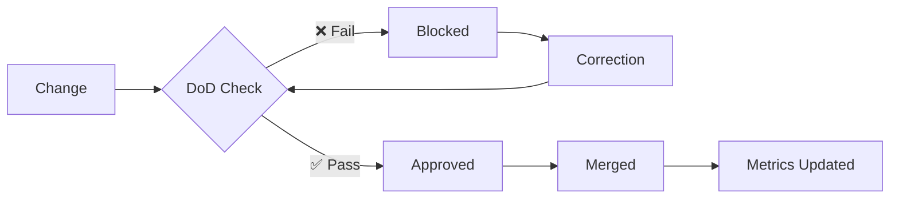
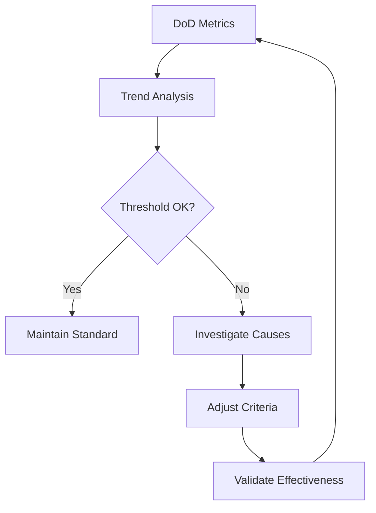

# Definition of Done (DoD) - Matrix Protocol

## 🎯 Overview

The **Definition of Done (DoD)** is a comprehensive checklist that ensures systematic quality before publishing any changes to Matrix Protocol documentation. This system was developed through **6 improvement sprints** and integrates automated validation with human oversight.

## ✅ Main DoD Checklist

### 📋 1. Structure and Metadata

```yaml
structure:
  frontmatter:
    - [ ] `title` present and descriptive
    - [ ] `description` clear (≤150 characters)
    - [ ] `tags` conform to validated glossary
    - [ ] `framework` specified when applicable
    - [ ] `maturity` defined (draft/beta/production)
    - [ ] `icon` appropriate for category
    - [ ] `lang` specified (pt/en)
    - [ ] `last_updated` current
    
  organization:
    - [ ] "📖 Related Resources" section when applicable
    - [ ] Logical heading hierarchy (H1→H2→H3)
    - [ ] English-only naming (kebab-case/snake_case)
    - [ ] Consistent folder structure
```

### 🔗 2. Content and Navigation

```yaml
content:
  quality:
    - [ ] Accurate and consistent Matrix Protocol concepts
    - [ ] Practical examples when conceptual/technical
    - [ ] Clear and objective language
    - [ ] Standardized terminology
    
  navigation:
    - [ ] Functional internal links (`localePath()` for bilingual)
    - [ ] Appropriate cross-references
    - [ ] Conceptual breadcrumbs when hierarchical
    - [ ] Bidirectional interlinks implemented
```

### 🌍 3. Bilingual Harmonization

```yaml
bilingualism:
  parity:
    - [ ] PT↔EN parity ≥90% or documented divergence
    - [ ] Technical concepts translated consistently
    - [ ] Navigation functional in both languages
    - [ ] Equivalent structure maintained
    
  divergences:
    - [ ] Justified divergences documented
    - [ ] Context notes when necessary
    - [ ] Appropriate cross-references
```

### 🔧 4. Technical Validation

```yaml
technical:
  build:
    - [ ] Nuxt 4.x build successful without warnings
    - [ ] Dynamic navigation functional
    - [ ] Performance maintained (bundle size)
    - [ ] Basic accessibility respected
    
  automation:
    - [ ] Validation scripts executed
    - [ ] Quality metrics updated
    - [ ] Links audited and functional
```

## 🤖 Automated Validation

### DoD Verification Scripts

```bash
#!/bin/bash
# DoD automated validation sequence

echo "🔍 Executing Matrix Protocol DoD validation..."

# 1. Frontmatter validation
node scripts/frontmatter-check.js --schema-validation
if [ $? -ne 0 ]; then
  echo "❌ Error: Non-compliant frontmatter"
  exit 1
fi

# 2. Link audit
node scripts/link-integrity.js --full-audit
if [ $? -ne 0 ]; then
  echo "❌ Error: Broken links detected"
  exit 1
fi

# 3. Naming validation
node scripts/naming-validator.js --english-only
if [ $? -ne 0 ]; then
  echo "❌ Error: English-only naming violation"
  exit 1
fi

# 4. Validation build
npm run build --validation-mode
if [ $? -ne 0 ]; then
  echo "❌ Error: Build failing"
  exit 1
fi

# 5. Quality metrics
node scripts/quality-metrics.js --update-dod
if [ $? -ne 0 ]; then
  echo "❌ Error: Quality metrics below threshold"
  exit 1
fi

echo "✅ DoD validation approved successfully!"
```

### Workflow Integration

```yaml
# .github/workflows/dod-validation.yml
name: Matrix Protocol DoD Validation

on:
  pull_request:
    paths:
      - 'website/content/**'
      
jobs:
  dod-check:
    runs-on: ubuntu-latest
    steps:
      - name: Checkout
        uses: actions/checkout@v4
        
      - name: Setup Node.js
        uses: actions/setup-node@v4
        with:
          node-version: '18'
          
      - name: Install dependencies
        run: npm ci
        
      - name: Execute DoD Validation
        run: bash scripts/dod-validator.sh
        
      - name: Generate DoD Report
        run: node scripts/dod-report-generator.js
```

## 📊 DoD Compliance Metrics

### Quality KPIs

```yaml
dod_metrics:
  structural_compliance:
    description: "% pages with complete DoD structure"
    formula: "(dod_compliant_pages / total_pages) * 100"
    target: "≥95%"
    current: "{{ dynamic_value }}"
    
  content_quality:
    description: "Content quality score"
    formula: "average(clarity + accuracy + completeness)"
    target: "≥4.0/5.0"
    current: "{{ dynamic_value }}"
    
  bilingual_parity:
    description: "% PT↔EN parity"
    formula: "(aligned_concepts / total_concepts) * 100"
    target: "≥90%"
    current: "{{ dynamic_value }}"
    
  technical_validation:
    description: "% successful builds without warnings"
    formula: "(success_builds / total_builds) * 100"
    target: "100%"
    current: "{{ dynamic_value }}"
```

### Compliance Dashboard



## 🚨 Escalation Process

### Approval Levels

```yaml
approval_matrix:
  structural_issues:
    reviewer: "Documentation Editor"
    escalation: "Nuxt Content Maintainer"
    
  technical_issues:
    reviewer: "Nuxt Content Maintainer"
    escalation: "Tech Lead"
    
  conceptual_issues:
    reviewer: "Knowledge Engineer"
    escalation: "Project Manager"
    
  emergency_exceptions:
    authority: "Tech Lead"
    documentation: "Mandatory justification + correction deadline"
```

### Controlled Exceptions

```markdown
> ⚠️ **Approved DoD Exception**
> 
> **Justification**: [Specific reason for exception]
> **Approved by**: [Name + role]
> **Correction deadline**: [Target date]
> **Tracking**: [Issue/task for follow-up]
```

## 📖 Practical Templates

### New Page Template

```yaml
# Specific checklist for new page creation
new_page:
  pre_creation:
    - [ ] Validate need and positioning
    - [ ] Verify appropriate folder structure
    - [ ] Define conceptual relationships
    
  during_creation:
    - [ ] Apply complete frontmatter
    - [ ] Implement related resources section
    - [ ] Create bilingual version (if applicable)
    
  post_creation:
    - [ ] Execute automated DoD validation
    - [ ] Test navigation in both languages
    - [ ] Update quality metrics
```

### Content Update Template

```yaml
# Specific checklist for updates
content_update:
  analysis:
    - [ ] Check impact on related concepts
    - [ ] Validate need for bilingual update
    - [ ] Review affected links and references
    
  execution:
    - [ ] Maintain conceptual consistency
    - [ ] Update `last_updated`
    - [ ] Preserve existing DoD structure
    
  validation:
    - [ ] Confirm functional builds
    - [ ] Verify maintained parity
    - [ ] Update affected metrics
```

## 🔄 Continuous DoD Maintenance

### Periodic Review

```yaml
dod_review:
  weekly:
    - Compliance metrics analysis
    - Failure pattern identification
    - Threshold adjustments when necessary
    
  monthly:
    - Checklist effectiveness review
    - Team feedback collection
    - Automated script optimization
    
  quarterly:
    - Complete DoD system audit
    - Industry standards benchmarking
    - Evolution based on lessons learned
```

### Data-Driven Evolution



## 📖 Related Resources

### Matrix Protocol Frameworks
- [MEF - Matrix Embedding Framework](../../frameworks/mef) - Knowledge structuring via UKIs
- [ZOF - Zion Orchestration Framework](../../frameworks/zof) - Epistemological workflow orchestration
- [OIF - Operator Intelligence Framework](../../frameworks/oif) - AI archetypes for execution

### Related Documentation
- [Feedback Loop and Metrics](./feedback-loop) - Continuous monitoring system
- [Explainability](./explainability) - Justification and transparency templates
- [Validation and Checklists](./validation-checklists) - Other quality systems

### Validation Tools
- [Content Audit](./content-audit) - Automated audit scripts
- [UKI Templates](./uki-templates) - Templates for UKI creation
- [MOC Generation](./moc-generation) - Ontology generation tools

---

> ✅ **Matrix Protocol DoD** - Comprehensive quality system ensuring systematic excellence, sustainable maintainability, and compliance with Matrix Protocol epistemological principles in every documentation change.