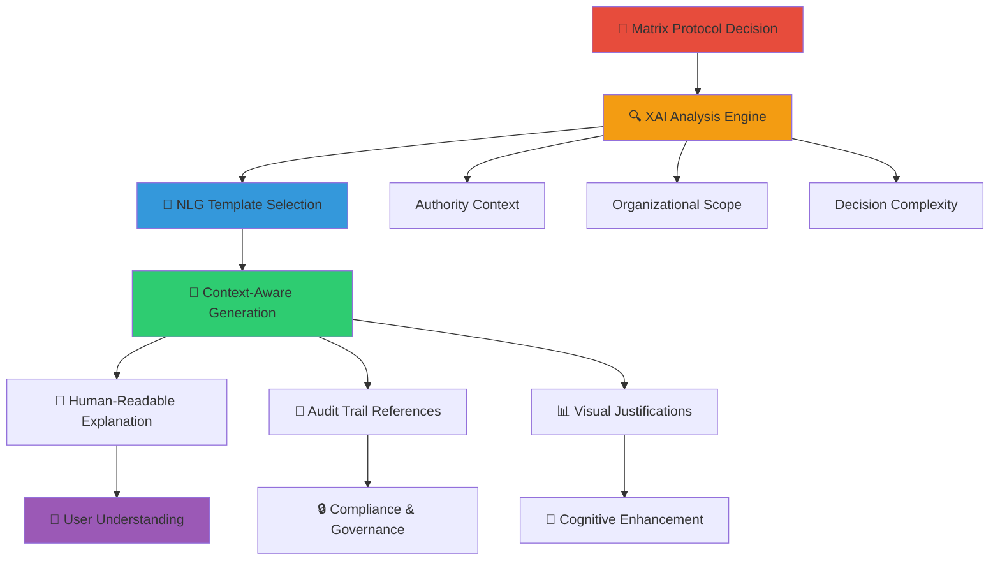
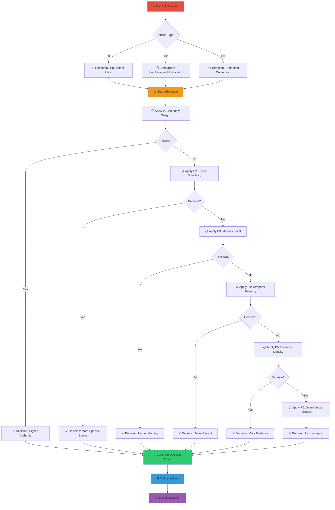
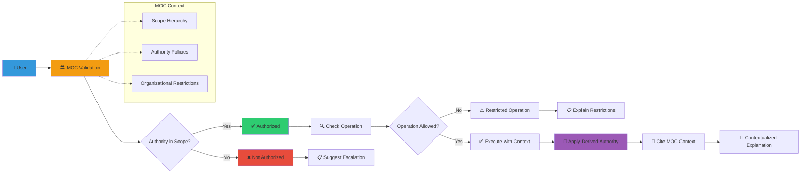
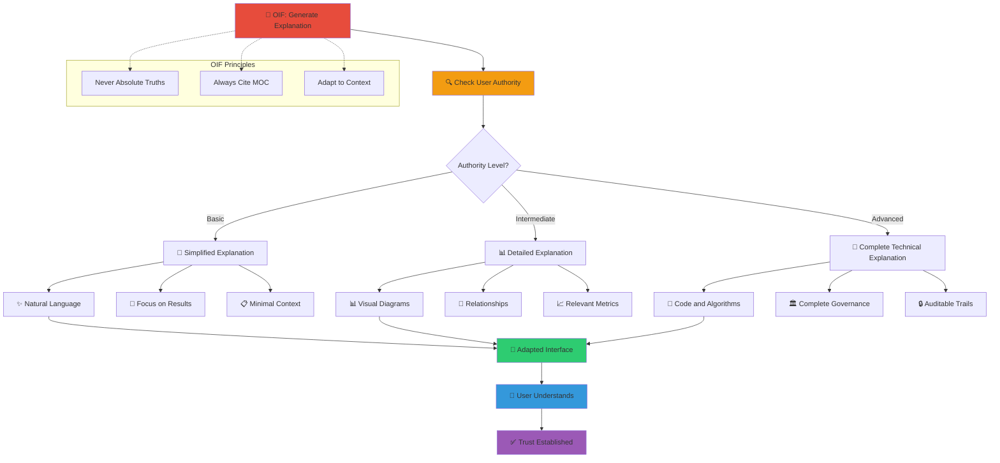

# Explainability and XAI/NLG Templates

Matrix Protocol is founded on the principle of **Necessary Explainability** (MEP), ensuring that every epistemic decision is auditable and comprehensible. This page presents XAI (Explainable AI) and NLG (Natural Language Generation) templates for clear decision communication, maintaining technical precision and human accessibility.

## Matrix Explainability Overview

### Explainability Architecture



### Matrix Explainability Principles

#### 1. **Derived Authority**
Explanations always cite organizational context (MOC) and never make absolute statements.

#### 2. **Epistemic Transparency**
Every decision includes complete epistemic reasoning, from data to conclusions.

#### 3. **Hierarchical Adaptability**
Explanations adapt to the user's authority level and technical knowledge.

#### 4. **Complete Auditability**
Every explanation process generates auditable trails for compliance and governance.

## Template 1: MAL Arbitration Explanation

### MAL Template Structure

```python
class MALExplanationTemplate:
    """Template for explaining Matrix Arbiter Layer arbitration decisions"""
    
    def __init__(self, decision_record, user_context):
        self.decision = decision_record
        self.user = user_context
        self.moc_context = self.get_moc_context()
    
    def generate_explanation(self):
        """Generate complete MAL decision explanation"""
        explanation = {
            'summary': self.generate_summary(),
            'rationale': self.generate_rationale(),
            'evidence': self.compile_evidence(),
            'implications': self.analyze_implications(),
            'audit_trail': self.create_audit_trail()
        }
        
        return self.format_for_user(explanation)
    
    def generate_summary(self):
        """Executive summary of the decision"""
        return f"""
        🏛️ Matrix Arbiter Layer Arbitration Decision
        
        **Conflict**: {self.decision.conflict_type}
        **Result**: {self.decision.winner.title}
        **Rule Applied**: {self.decision.precedence_rule}
        **Context**: {self.moc_context.scope_description}
        """
    
    def generate_rationale(self):
        """Detailed epistemic justification"""
        precedence_explanation = self.explain_precedence_rule()
        
        return f"""
        📋 Epistemic Justification
        
        The decision was based on deterministic application of precedences
        defined in the organizational MOC:
        
        **Rule {self.decision.precedence_rule}**: {precedence_explanation}
        
        **Organizational Context**:
        - Scope: {self.moc_context.scope_ref}
        - Authority: {self.moc_context.authority_level}
        - Applicable Policies: {self.moc_context.applicable_policies}
        
        **Derived Authority**:
        This decision derives its authority from the organizational context
        defined in the MOC, not from absolute truths. In other organizational
        contexts, the decision could be different.
        """
    
    def explain_precedence_rule(self):
        """Explains the specific precedence rule applied"""
        rules = {
            'P1': 'Authority Weight - Higher organizational authority weight',
            'P2': 'Scope Specificity - Application scope specificity',
            'P3': 'Maturity Level - Epistemic maturity level',
            'P4': 'Temporal Recency - Temporal recency respecting lifecycle',
            'P5': 'Evidence Density - MEF evidence density',
            'P6': 'Deterministic Fallback - Lexicographic deterministic fallback'
        }
        
        rule_code = self.decision.precedence_rule
        rule_description = rules.get(rule_code, 'Unrecognized rule')
        
        return f"{rule_description}\n\nDetails: {self.decision.rule_details}"
```

### MAL Output Example

```markdown
🏛️ **Matrix Arbiter Layer Arbitration Decision**

**Conflict**: H1 - Horizontal (Equivalent UKIs)
**Result**: uki:squad-payments:rule:data-retention-30d
**Rule Applied**: P3 - Maturity Level
**Context**: Squad Payments - Compliance and Security

📋 **Epistemic Justification**

The decision was based on deterministic application of precedences
defined in the organizational MOC:

**Rule P3**: Maturity Level - validated supersedes endorsed

The winning UKI has "validated" maturity while the competitor
has only "endorsed". In the Squad Payments context, data retention
rules require rigorous validation due to GDPR/LGPD compliance
requirements.

**Organizational Context**:
- Scope: squad-payments (squad level)
- Authority: tech-lead + compliance-officer
- Applicable Policies: GDPR compliance, data minimization

**Derived Authority**:
This decision derives its authority from the Squad Payments
organizational context as defined in the MOC. In other
organizational contexts with different compliance requirements,
the decision could favor data minimization (7 days).
```

## Template 2: ZOF Enrichment Justification

### ZOF Template Structure

```python
class ZOFExplanationTemplate:
    """Template for explaining ZOF enrichment decisions"""
    
    def __init__(self, enrichment_decision, workflow_context):
        self.decision = enrichment_decision
        self.workflow = workflow_context
        self.oracle_data = self.get_oracle_consultation_data()
    
    def generate_explanation(self):
        """Generate complete ZOF process explanation"""
        return {
            'workflow_summary': self.summarize_workflow(),
            'enrichment_analysis': self.analyze_enrichment_decision(),
            'oracle_consultation': self.explain_oracle_process(),
            'moc_criteria': self.evaluate_moc_criteria(),
            'outcome_justification': self.justify_outcome()
        }
    
    def summarize_workflow(self):
        """Summarize the executed ZOF flow"""
        return f"""
        ⚡ ZOF Workflow: {self.workflow.flow_id}
        
        **Canonical States Executed**:
        1. 📥 Intake: {self.workflow.states.intake.summary}
        2. 🧠 Understand: Consulted {len(self.oracle_data.ukis)} existing UKIs
        3. 🎯 Decide: {self.workflow.states.decide.decision}
        4. ⚡ Act: {self.workflow.states.act.action_taken}
        5. 🔍 EvaluateForEnrich: {self.decision.can_enrich_result}
        
        **Explainability Signals**:
        - Context: {self.workflow.explainability.context}
        - Decision: {self.workflow.explainability.decision}
        - Result: {self.workflow.explainability.result}
        """
    
    def analyze_enrichment_decision(self):
        """Analyze the enrichment decision"""
        if self.decision.can_enrich:
            return self.explain_positive_enrichment()
        else:
            return self.explain_negative_enrichment()
    
    def explain_positive_enrichment(self):
        """Explain why enrichment was approved"""
        return f"""
        ✅ **Enrichment Approved**
        
        **MOC Criteria Met**:
        {self.format_moc_criteria()}
        
        **Semantic Novelty**: {self.decision.semantic_novelty_score}/100
        The proposed knowledge presents aspects not covered by the
        {len(self.oracle_data.ukis)} existing UKIs consulted.
        
        **Practical Value**: {self.decision.practical_value_score}/100
        Implementation of this knowledge can positively impact
        {self.decision.impact_areas} within scope {self.workflow.scope_ref}.
        
        **Sufficient Authority**: ✅
        User {self.workflow.user_authority} has authority to create
        UKIs in scope {self.workflow.scope_ref} according to MOC.
        """
    
    def explain_oracle_process(self):
        """Explain the Oracle consultation process"""
        return f"""
        📖 **Oracle Consultation (Understand State)**
        
        **UKIs Consulted**: {len(self.oracle_data.ukis)}
        {self.format_consulted_ukis()}
        
        **Base Knowledge Identified**:
        - Related patterns: {len(self.oracle_data.related_patterns)}
        - Potential conflicts: {len(self.oracle_data.potential_conflicts)}
        - Knowledge gaps: {len(self.oracle_data.knowledge_gaps)}
        
        **Decision Context**:
        Oracle consultation revealed that the proposed knowledge
        {self.oracle_data.relationship_to_existing} with existing
        knowledge, justifying {self.decision.enrichment_rationale}.
        """
```

### ZOF Output Example

```markdown
⚡ **ZOF Workflow**: payment-gateway-selection-brazil

**Canonical States Executed**:
1. 📥 Intake: Need for gateway in Brazilian market
2. 🧠 Understand: Consulted 12 existing UKIs about gateways
3. 🎯 Decide: Select Stripe for market-entry MVP
4. ⚡ Act: Initial Stripe Brazil marketplace configuration
5. 🔍 EvaluateForEnrich: ✅ Approved for enrichment

**Explainability Signals**:
- Context: Brazilian market specific needs (PIX, boleto)
- Decision: Stripe offers best regulatory support for BR
- Result: MVP configured + new knowledge identified

✅ **Enrichment Approved**

**MOC Criteria Met**:
- business_impact: 85/100 (high relevance for expansion)
- reusability: 90/100 (applicable to other LATAM markets)  
- authority: ✅ tech-lead authorized for squad-payments

**Semantic Novelty**: 78/100
Proposed knowledge about Brazilian regulatory specificities
is not covered by the 12 existing gateway UKIs.

**Practical Value**: 92/100
Implementation can accelerate Brazil go-to-market by 2-3 weeks
and serve as template for other emerging markets.

📖 **Oracle Consultation (Understand State)**

**UKIs Consulted**: 12
- uki:squad-payments:pattern:gateway-integration-007
- uki:squad-payments:rule:fee-calculation-005
- uki:squad-payments:rule:currency-conversion-003
- [+ 9 related UKIs]

**Base Knowledge Identified**:
- Related patterns: 5 (integration, fees, compliance)
- Potential conflicts: 0 (no conflicts identified)
- Knowledge gaps: 3 (regulatory BR, PIX, boleto)

**Decision Context**:
Oracle consultation revealed that the proposed knowledge
**complements** existing knowledge, covering regulatory
gaps specific to the Brazilian market.
```

## Template 3: MEF Validation and Evolution

### MEF Template Structure

```python
class MEFExplanationTemplate:
    """Template for explaining MEF validations and evolutions"""
    
    def __init__(self, uki_operation, validation_result):
        self.operation = uki_operation
        self.validation = validation_result
        self.uki = self.operation.target_uki
        self.moc_compliance = self.check_moc_compliance()
    
    def generate_explanation(self):
        """Generate complete MEF operation explanation"""
        if self.operation.type == 'creation':
            return self.explain_uki_creation()
        elif self.operation.type == 'evolution':
            return self.explain_uki_evolution()
        elif self.operation.type == 'validation':
            return self.explain_uki_validation()
    
    def explain_uki_creation(self):
        """Explain new UKI creation"""
        return f"""
        📊 **MEF UKI Creation**
        
        **UKI**: {self.uki.id}
        **Title**: {self.uki.title}
        **Scope**: {self.uki.scope_ref}
        **Result**: {'✅ Approved' if self.validation.passed else '❌ Rejected'}
        
        **Structural Validation**:
        {self.format_structural_validation()}
        
        **Semantic Validation**:
        {self.format_semantic_validation()}
        
        **MOC Compliance**:
        {self.format_moc_compliance()}
        
        **Integration with Existing Knowledge**:
        {self.analyze_knowledge_integration()}
        
        **Derived Authority**:
        This UKI derives its validity from organizational context
        {self.uki.scope_ref} according to MOC governance. Validation
        considers standards specific to this organization.
        """
    
    def explain_uki_evolution(self):
        """Explain existing UKI evolution"""
        return f"""
        🔄 **MEF UKI Evolution**
        
        **UKI**: {self.uki.id}
        **Version**: {self.uki.version} → {self.operation.target_version}
        **Change Type**: {self.operation.change_impact}
        **Rationale**: {self.operation.promotion_rationale}
        
        **Impact Analysis**:
        {self.analyze_evolution_impact()}
        
        **Affected Relationships**:
        {self.analyze_relationship_impact()}
        
        **Auditable Trail**:
        - Previous version: {self.uki.version}
        - Evolution author: {self.operation.author}
        - Date: {self.operation.timestamp}
        - Approvals: {self.operation.approvals}
        
        **Responsible Promotion Principle**:
        This evolution follows the MEP Responsible Promotion principle,
        including complete epistemic justification and preserving
        the auditable trail of decisions.
        """
    
    def format_structural_validation(self):
        """Format structural validation result"""
        result = "✅ APPROVED" if self.validation.structural.passed else "❌ REJECTED"
        details = []
        
        for check in self.validation.structural.checks:
            status = "✅" if check.passed else "❌"
            details.append(f"  {status} {check.description}")
        
        return f"{result}\n" + "\n".join(details)
    
    def analyze_knowledge_integration(self):
        """Analyze integration with existing knowledge"""
        if not self.validation.relationships:
            return "No automatic integration detected."
        
        integrations = []
        for rel in self.validation.relationships:
            integrations.append(
                f"- {rel.type}: {rel.target_uki} ({rel.confidence}% confidence)"
            )
        
        return "Identified integrations:\n" + "\n".join(integrations)
```

### MEF Output Example

```markdown
📊 **MEF UKI Creation**

**UKI**: uki:squad-payments:rule:brazil-gateway-compliance-019
**Title**: "Gateway Compliance for Brazil - PIX and Boleto"
**Scope**: squad-payments
**Result**: ✅ Approved

**Structural Validation**: ✅ APPROVED
  ✅ Valid Schema 1.0
  ✅ Required fields present (id, title, content, examples)
  ✅ Well-formed relationships
  ✅ Correct semantic versioning (0.0.1-beta)

**Semantic Validation**: ✅ APPROVED (Score: 89/100)
  ✅ Conceptual coherence with squad-payments domain
  ✅ Terminology consistent with organizational MOC
  ✅ Relevant and testable practical examples

**MOC Compliance**: ✅ APPROVED
  ✅ scope_ref: squad-payments valid
  ✅ domain_ref: business appropriate
  ✅ type_ref: business_rule authorized
  ✅ maturity_ref: draft allowed for creation
  ✅ Authority: tech-lead sufficient for scope

**Integration with Existing Knowledge**:
Identified integrations:
- complements: uki:squad-payments:pattern:gateway-integration-007 (92% confidence)
- depends_on: uki:squad-payments:rule:fee-calculation-005 (85% confidence)
- extends: uki:squad-payments:rule:compliance-latam-001 (78% confidence)

**Derived Authority**:
This UKI derives its validity from the squad-payments
organizational context according to MOC governance. Validation
considers Brazilian compliance standards applicable
to this business context.
```

## Visual Decision Graphs

### 1. MAL Arbitration: P1-P6 in Visual Action



### 2. Derived Authority: Organizational Context



### 3. OIF Hierarchical Explanation: Access Levels



## 📖 Related Resources

### Matrix Protocol Frameworks
- [MEP - Matrix Epistemic Principle](/en/docs/frameworks/mep) - Necessary explainability principles
- [MEF - Matrix Embedding Framework](/en/docs/frameworks/mef) - Auditable knowledge structuring
- [ZOF - Zion Orchestration Framework](/en/docs/frameworks/zof) - Explainable and auditable workflows
- [OIF - Operator Intelligence Framework](/en/docs/frameworks/oif) - Archetypes with hierarchical explanations
- [MOC - Matrix Ontology Catalog](/en/docs/frameworks/moc) - Organizational governance and authority
- [MAL - Matrix Arbiter Layer](/en/docs/frameworks/mal) - Deterministic and auditable arbitration

### Advanced Concepts
- [Conceptual Roadmaps](/en/docs/examples/conceptual-roadmaps) - Matrix epistemological journeys
- [Inference & Reasoning](/en/docs/frameworks/inference-reasoning) - Neural-symbolic foundation
- [MOC Governance](/en/docs/manual/moc-governance) - Organizational policies

### Tools and Implementation
- [Implementation Guide](/en/docs/implementation) - Practical adoption steps
- [Organizational Templates](/en/docs/manual/templates) - Models by organization type
- [Validation Tools](/en/docs/manual/tools) - Support utilities

### Practical Cases
- [UKI Examples](/en/docs/examples/knowledge/structured) - Real structured cases
- [Organizational Pilots](/en/docs/examples/pilots) - Practical implementations
- [Knowledge Comparison](/en/docs/examples) - Structured vs unstructured