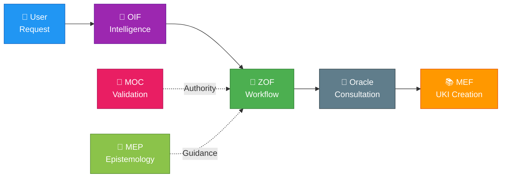
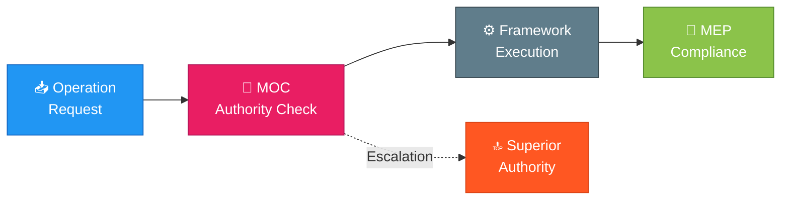
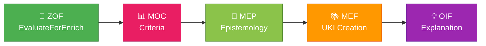
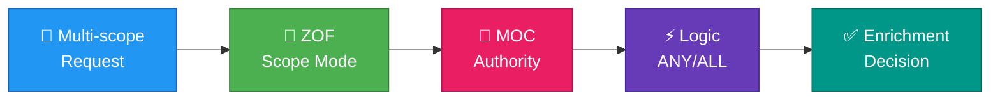
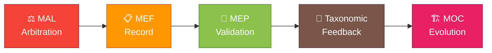
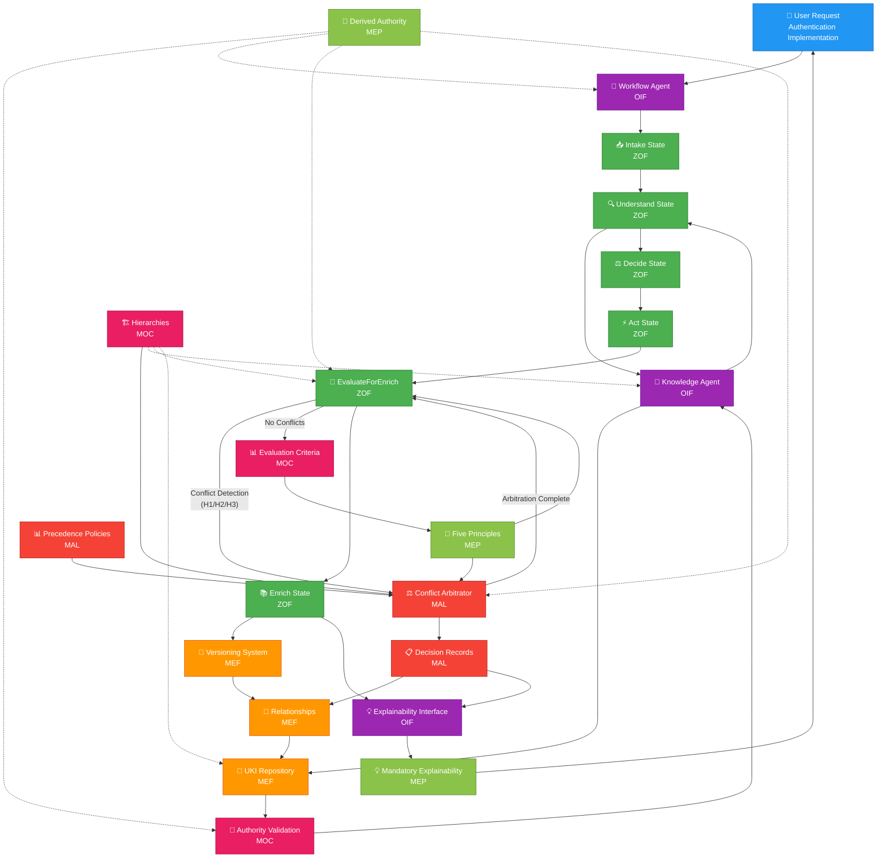
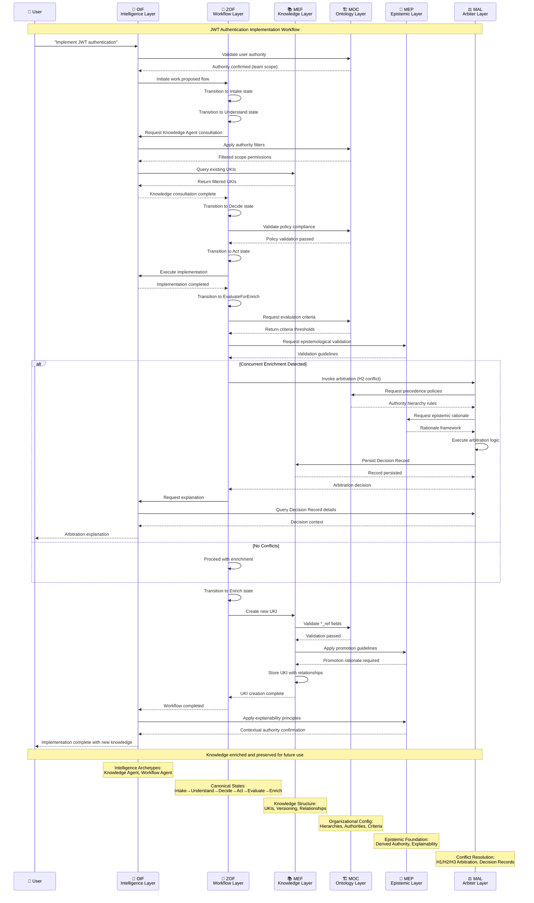

# Matrix Protocol — Integration Diagram
**Acronym:** Integration Diagram  
**Status:** Active  
**Version:** Beta  
**Date:** 2025-01-25  

> 🔄 "The whole is greater than the sum of its parts — and the Matrix Protocol demonstrates this through seamless framework integration."

---

## 1. Introduction

The **Matrix Protocol Integration Diagram** provides the meta-architectural view of how all frameworks (MEF, ZOF, OIF, MOC, MEP) work together in practice.

This document visualizes the end-to-end flows that cross framework boundaries, showing concrete integration patterns that implementers encounter when building Matrix Protocol-compliant systems.

Unlike individual framework documentation that focuses on specific capabilities, this diagram shows the **complete journey** from user interaction to knowledge enrichment across all layers.

---

## 2. Core Integration Patterns

### Pattern 1: Knowledge-Driven Workflow



- OIF receives user request and determines workflow type
- ZOF orchestrates canonical states with mandatory Oracle consultation
- MEF provides structured knowledge via UKIs during Understand state
- MOC validates all hierarchical references and authority levels
- MEP guides epistemological decisions throughout the process

### Pattern 2: Authority-Aware Operations



- All operations validate authority through MOC before execution
- Each framework respects user's hierarchical context
- MEP principles ensure derived authority, never absolute truth
- Escalation paths route requests requiring superior authority

### Pattern 3: Enrichment Evaluation Cycle



- ZOF executes mandatory enrichment evaluation
- MOC provides organizational criteria for evaluation
- MEP guides epistemological justification requirements
- MEF structures the resulting UKI with proper metadata
- OIF provides explainable feedback to users

### Pattern 4: Multi-scope Enrichment Validation



- Request affects multiple organizational scopes
- ZOF applies scope_mode validation (any vs all)
- MOC validates authority for each affected scope
- Logic gates determine approval based on scope_mode configuration
- Enrichment proceeds only with sufficient scope validation

### Pattern 5: MAL-MEF-MEP Epistemological Feedback Loop



- MAL makes arbitration decisions with epistemic rationale
- MEF persists decision records as permanent knowledge artifacts
- MEP validates epistemological compliance and coherence
- Decision patterns inform taxonomic evolution proposals
- MOC analyzes feedback for potential ontology refinements

---

## 3. End-to-End Flow Diagram



---

## 3.5. Cross-Framework Integration Sequence

This sequence diagram shows the temporal flow of interactions between Matrix Protocol frameworks during a typical knowledge enrichment workflow.



---

## 4. Integration Points Matrix

| **From Framework** | **To Framework** | **Integration Point** | **Purpose** |
|-------------------|------------------|----------------------|-------------|
| **OIF → ZOF** | Workflow Agent | Canonical States Orchestration | Execute ZOF flows via intelligence archetypes |
| **ZOF → OIF** | Oracle Consultation | Knowledge Agent Query | Consult existing knowledge during Understand state |
| **ZOF → MEF** | Enrichment | UKI Creation | Create structured knowledge during Enrich state |
| **ZOF → MOC** | EvaluateForEnrich | Criteria Consultation | Apply organizational evaluation criteria |
| **OIF → MOC** | Authority Check | Hierarchical Validation | Validate user authority for operations |
| **MEF → MOC** | Field Validation | *_ref References | Validate all hierarchical field references |
| **OIF → MEP** | Explainability | Derived Authority | Ensure contextual, non-absolute responses |
| **ZOF → MEP** | Enrichment Decision | Epistemological Justification | Apply MEP principles in enrichment evaluation |
| **MEF → MEP** | Knowledge Promotion | Responsible Promotion | Document epistemological justification for UKI evolution |
| **ZOF → MAL** | Conflict Detection | Arbitration Invocation | Invoke MAL when EvaluateForEnrich detects H1/H2/H3 conflicts |
| **MAL → MEF** | Decision Persistence | Decision Record Storage | Persist arbitration decisions as immutable audit records |
| **MAL → OIF** | Outcome Communication | Arbitration Explanation | Explain arbitration outcomes using structured templates |
| **MOC → MAL** | Policy Configuration | Precedence Rule Supply | Provide arbitration policies and authority hierarchies |
| **MEP → MAL** | Epistemic Foundation | Rationale Generation | Guide epistemological justification in arbitration decisions |
| **ZOF → MOC** | Multi-scope Validation | Scope Mode Configuration | Apply scope_mode validation for any/all enrichment logic |
| **MOC → ZOF** | Lifecycle Management | Lifecycle Policy Supply | Provide lifecycle_ref policies for temporal governance |
| **MAL → MEP** | Epistemic Feedback | Decision Pattern Analysis | Inform epistemological consistency through arbitration outcomes |
| **MEF → MOC** | Ontology Evolution | Promotion Pattern Feedback | Provide promotion pattern data for taxonomic refinement |
| **OIF → MEF** | Archetype Metadata | Archetype Level Validation | Validate archetype_level for canonical prompt preservation |

---

## 5. Practical Examples

### **Example 1: JWT Authentication Implementation**

```yaml
# Complete Integration Flow
user_story: "As a developer, I need to implement JWT authentication"

# 1. OIF Intelligence Reception
oif_workflow_agent:
  request_analysis: "Authentication implementation need"
  workflow_determination: "Technical implementation workflow"
  canonical_event: "work.proposed"

# 2. ZOF Canonical States Execution
zof_workflow_execution:
  intake:
    signals:
      context: "JWT authentication story received"
      decision: "Clear requirements, proceed to understanding"
      result: "Context captured and organized"
  
  understand:
    oracle_consultation: 
      knowledge_agent_query: "existing authentication patterns"
      moc_authority_filter: "user scope: team, domain: technical"
      retrieved_ukis:
        - "uki:technical:pattern:jwt-authentication"
        - "uki:business:policy:security-requirements"
    signals:
      context: "Oracle returned existing authentication knowledge"
      decision: "Use proven JWT pattern with team-specific adaptations"
      result: "Implementation strategy defined"
  
  decide:
    moc_validation:
      authority_check: "user can implement in team scope"
      vendor_policy: "approved library selection"
    signals:
      context: "Strategy validated against organizational policies"
      decision: "Proceed with implementation using approved approach"
      result: "Technical plan approved"
  
  act:
    conceptual_execution: "Implement JWT solution following Oracle patterns"
    signals:
      context: "Implementation following proven patterns"
      decision: "Solution completed with team-specific enhancements"
      result: "Working authentication system deployed"
  
  evaluate_for_enrich:
    moc_criteria_consultation:
      relevance: {threshold: "medium", result: "PASS", score: 0.8}
      reusability: {threshold: "high", result: "PASS", score: 0.9}
      impact: {threshold: "medium", result: "PASS", score: 0.7}
    mep_epistemological_check:
      novelty_validation: "Team-specific implementation patterns identified"
      authority_derivation: "Authorized for team scope enrichment"
    signals:
      context: "Implementation contains reusable knowledge"
      decision: "Approve enrichment with team scope"
      result: "Qualified for Oracle enrichment"
  
  enrich:
    mef_uki_creation:
      - id: "uki:technical:example:team-jwt-implementation"
        scope_ref: "team"
        domain_ref: "technical"
        type_ref: "example"
        maturity_ref: "validated"
        relationships:
          - type: "derives_from"
            target: "uki:technical:pattern:jwt-authentication"
    signals:
      context: "New UKI created documenting team implementation"
      decision: "Knowledge stored with proper semantic relationships"
      result: "Oracle enriched for future reuse"

# 3. OIF Explainability Response
oif_explanation:
  mep_compliance: "Response contextualizes authority within team scope"
  explanation_to_user: |
    "Implementation completed successfully based on organizational patterns.
    
    ✅ Used: uki:technical:pattern:jwt-authentication (Oracle guidance)
    ✅ Validated: Against team authority and domain access
    ✅ Created: uki:technical:example:team-jwt-implementation
    
    This knowledge is now available for other team members working on
    similar authentication requirements."
```

### **Example 2: MAL Arbitration Scenario**

```yaml
# Concurrent JWT Implementation Conflict
user_story: "Two teams implementing JWT authentication simultaneously"

# 1. ZOF Conflict Detection during EvaluateForEnrich
zof_conflict_detection:
  conflict_type: "H2_concurrent_enrichment"
  candidates:
    - flow_id: "team-frontend-jwt-001"
      uki_target: "uki:technical:pattern:jwt-authentication"
      user: {scope: "team-frontend", authority: "developer"}
    - flow_id: "team-backend-jwt-002"
      uki_target: "uki:technical:pattern:jwt-authentication"
      user: {scope: "team-backend", authority: "tech_lead"}
  
  mal_invocation: "Local resolution failed, invoking MAL"

# 2. MAL Arbitration Process
mal_arbitration_event:
  event_id: "mal-evt-concurrent-jwt-001"
  event_type: "H2"
  policy_ref: "moc:arbitration:concurrent_enrichment"
  
  arbitration_decision:
    outcome: "winner"
    winner: "team-backend-jwt-002"
    loser: "team-frontend-jwt-001"
    precedence_applied:
      - "P1_authority": "tech_lead > developer"
    actions:
      - "allow_enrich:team-backend-jwt-002"
      - "defer_enrich:team-frontend-jwt-001"
    
    epistemic_rationale:
      summary: "Higher authority precedence in concurrent scenario"
      moc_nodes_cited: ["moc:authority:tech_lead", "moc:domain:technical"]

# 3. OIF Arbitration Explanation
oif_arbitration_template:
  decision_id: "mal-evt-concurrent-jwt-001"
  outcome: "winner"
  winner: "team-backend JWT implementation"
  losers: ["team-frontend JWT implementation"]
  precedence_applied: "Authority precedence: tech_lead > developer"
  
  user_explanation: |
    "Arbitration completed for concurrent JWT implementations.
    
    ✅ Winner: Backend team implementation (tech_lead authority)
    ⏸️ Deferred: Frontend team implementation 
    📋 Next Steps: Frontend team should coordinate with backend team
    🔗 Reference: MOC authority hierarchy for technical domain"

# 4. MEF Decision Record Persistence
mef_decision_record:
  decision_id: "mal-dec-concurrent-jwt-001"
  relationships_created:
    - type: "conflicts_with"
      source: "team-frontend-jwt-001"
      target: "team-backend-jwt-002"
      resolution: "authority_precedence"
  
  audit_trail: "Complete MAL arbitration recorded for future reference"
```

### **Example 2B: Multi-scope Enrichment with Scope Mode Validation**

```yaml
# Cross-organizational Security Guideline Creation
user_request: "Create security guideline affecting multiple teams"
affected_scopes: ["team-frontend", "team-backend", "team-devops"]

# 1. ZOF Multi-scope Detection
zof_scope_mode_evaluation:
  detected_scopes: ["team-frontend", "team-backend", "team-devops"]
  knowledge_type: "guideline" 
  
  # MOC Configuration Lookup
  moc_scope_mode_determination:
    explicit_config: "not_specified"
    knowledge_type_based:
      guideline_knowledge: "any"  # Guidelines can use ANY validation
    applied_mode: "any"  # OR logic - one team validation sufficient
    
# 2. Multi-scope Authority Validation  
moc_authority_validation:
  validation_results:
    team_frontend: 
      user_authority: "tech_lead"
      scope_authority_required: "tech_lead"
      validation: "PASS"
    team_backend:
      user_authority: "tech_lead" 
      scope_authority_required: "tech_lead"
      validation: "PASS"
    team_devops:
      user_authority: "tech_lead"
      scope_authority_required: "senior_engineer"  
      validation: "FAIL - insufficient authority"

# 3. Scope Mode Logic Application
zof_scope_validation:
  mode: "any"
  logic: "OR operation across all affected scopes"
  results:
    team_frontend: "PASS"
    team_backend: "PASS" 
    team_devops: "FAIL"
  
  final_decision: "APPROVED - ANY mode satisfied by frontend AND backend"
  rationale: "Guideline knowledge allows any-scope validation per MOC config"

# 4. Enrichment Execution
enrichment_result:
  scope_coverage: ["team-frontend", "team-backend"]
  scope_excluded: ["team-devops"]  # Due to authority failure
  advisory_note: "DevOps team can adopt guideline but cannot enforce it"
  
  created_uki:
    scope_ref: ["team-frontend", "team-backend"] 
    lifecycle_ref: "quarterly_review"
    authority_validation_record: "multi_scope_any_mode_approved"
```

### **Example 3: Authority Escalation Scenario**

```yaml
# Organization-Level Policy Creation Attempt
user_request: "Create organization-wide security policy"
user_context: {scope: "team", authority: "developer", domain: "technical"}

# 1. MOC Authority Validation
moc_authority_check:
  required_scope: "organization" 
  user_max_scope: "team"
  validation_result: "ESCALATION_REQUIRED"
  escalation_path: "team_lead → architect → cto"

# 2. OIF Intelligent Response
oif_knowledge_agent:
  mep_derived_authority_application: |
    "Based on your 'developer' authority in 'team' scope (MOC: hierarchies.scope.team),
    you cannot create organization-level policies.
    
    Available actions:
    ✅ Create team-level security guidelines
    ✅ Request escalation via: team_lead → architect → cto
    🔒 Organization policy creation requires 'architect' authority or higher
    
    Reference: MOC hierarchies.scope.team.governance.policy_creation_restrictions"

# 3. ZOF Workflow Adaptation  
zof_workflow_modification:
  original_flow: "work.proposed → organization policy creation"
  adapted_flow: "assistance.requested → escalation routing"
  canonical_states:
    intake: "Policy creation request with scope mismatch"
    understand: "Consult MOC authority requirements"
    decide: "Route to escalation path per MOC configuration"
    act: "Generate escalation request with context"
    # EvaluateForEnrich skipped - no enrichment for escalation routing
```

---

## 6. Cross-References

- [MEF — Matrix Embedding Framework](frameworks/mef)  
- [ZOF — Zion Orchestration Framework](frameworks/zof)  
- [OIF — Operator Intelligence Framework](frameworks/oif)  
- [MOC — Matrix Ontology Catalog](frameworks/moc)  
- [MEP — Matrix Epistemic Principle](mep)  
- [Matrix Protocol Glossary](glossary)
- [MAL — Matrix Arbiter Layer](frameworks/mal)
