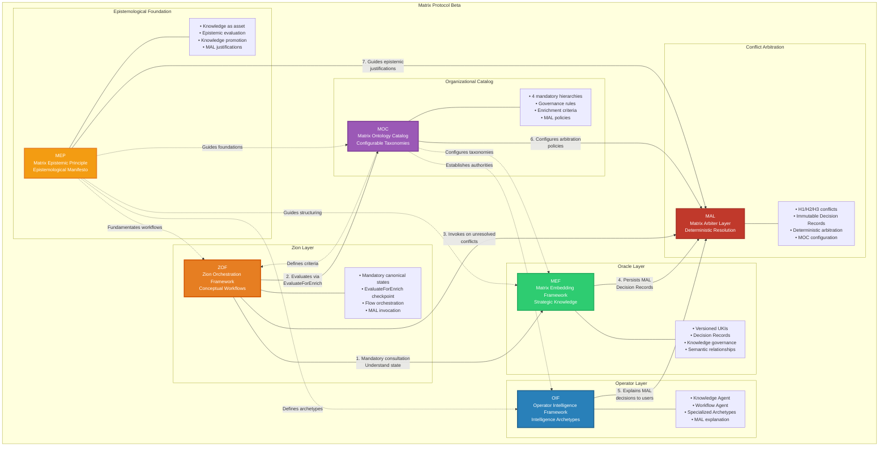
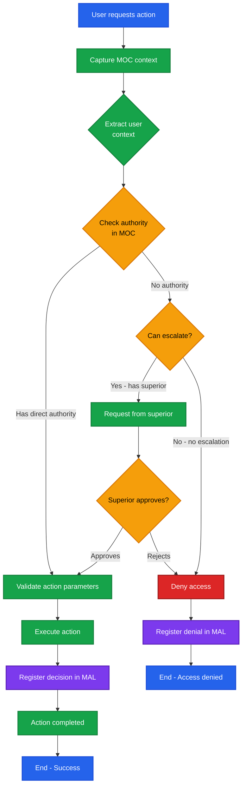

# Matrix Protocol — Human-AI Collaboration Protocol
**Acronym:** Matrix Protocol  
**Version:** 0.0.1-beta  
**Date:** 2025-10-05  

> 🚨 **IMPORTANT**: This document contains illustrative examples that are **NOT mandatory taxonomies**. All taxonomies are configurable via organizational MOC.

> "There are moments when a choice presents itself, silent, at the edge of the unknown. Some doors invite us to cross them — and in doing so, nothing is ever the same again." — Morpheus

---

## 1. Introduction

The **Matrix Protocol** is an integrated ecosystem that connects humans and AI through three interdependent layers: **Oracle**, **Zion**, and **Operator**.

Each layer plays a unique role in the strategic, technical, and operational flow, ensuring that guidelines are transformed into practical actions with efficiency and intelligence.

The Matrix Protocol establishes the conceptual and technical foundation for structured collaboration between humans and artificial intelligence, providing governance, traceability, and organizational adaptability.

### Matrix Protocol Framework Architecture



---

## 2. Terms and Definitions

- **Oracle Layer**: Strategic knowledge core implemented via MEF
- **Zion Layer**: Conceptual workflow framework implemented via ZOF
- **Operator Layer**: Intelligence archetype framework implemented via OIF
- **UKI**: Units of Knowledge Interlinked - basic units of structured knowledge
- **EvaluateForEnrich**: Mandatory checkpoint for knowledge enrichment evaluation
- **Canonical States**: Universal sequence of states in ZOF workflows

Cross-reference to **MOC (Matrix Ontology Catalog)** for organization-specific taxonomies.

---

## 3. Core Concepts

### Local Flexibility with Global Coherence

The Matrix Protocol separates **universal core concepts** from **organization-specific taxonomies** following the **MEP (Matrix Epistemic Principle)**:

#### Universal Concepts (Fixed)
- **Canonical States**: Intake → Understand → Decide → Act → EvaluateForEnrich → Review → Enrich
- **Mandatory Checkpoints**: EvaluateForEnrich as conditional evaluation point
- **Structural Fields**: scope_ref, domain_ref, type_ref, maturity_ref (references, not values)
- **Semantic Relationships**: Relationship types between UKIs (implements, depends_on, extends, etc.)

#### Local Hierarchies (Configurable via MOC)
- **Semantic Catalog**: Each organization defines its hierarchical structure in **MOC (Matrix Ontology Catalog)**
- **Organizational Taxonomies**: Domains, types, scopes, and maturity levels specific to context
- **Governance Rules**: Authorities, visibility, and propagation defined by context
- **Enrichment Criteria**: EvaluateForEnrich parameters adaptable to organizational context

#### Semantic Interoperability
- **Shareable Concepts**: Knowledge can be exported between organizations maintaining universal structure
- **Translatability**: Different MOCs can map equivalent concepts
- **Global Coherence**: Same fundamental principles regardless of local configuration

### Epistemological Foundations
The Matrix Protocol is guided by the **MEP (Matrix Epistemic Principle)** — an epistemological manifesto that establishes how knowledge is treated, evaluated, and promoted in the ecosystem.

---

## 4. Normative Rules

> ⚠️ This section is **normative**.

### Mandatory Three-Layer Architecture
Implementations MUST include:
1. **Oracle Layer**: MUST implement strategic governance via MEF
2. **Zion Layer**: MUST implement conceptual workflows via ZOF
3. **Operator Layer**: MUST implement intelligence archetypes via OIF

### Mandatory Arbitration Layer
Implementations MUST include:
- **MAL (Matrix Arbiter Layer)**: MUST handle conflict and concurrency arbitration when local governance rules cannot resolve disputes
- Engines MUST invoke MAL on unresolved conflicts (H1/H2/H3) after EvaluateForEnrich checkpoint
- MAL decisions MUST be persisted as immutable Decision Records via MEF
- MAL explanations MUST be delegated to OIF for user communication

### Mandatory Canonical States
All ZOF workflows MUST follow the sequence:
- **Intake**: Context and requirements capture
- **Understand**: Mandatory Oracle consultation (UKIs)
- **Decide**: Decision based on existing knowledge
- **Act**: Execution of planned action
- **EvaluateForEnrich**: Mandatory evaluation checkpoint
- **Review**: Optional result validation
- **Enrich**: Conditional Oracle enrichment

### EvaluateForEnrich Checkpoint
- MUST be applied to all workflows
- MUST consult criteria defined in organizational MOC
- MUST generate epistemological justification for decisions
- MUST respect MOC authorities and scopes

### Mandatory MOC Integration
- All *_ref fields MUST reference valid MOC nodes
- Knowledge filtering MUST respect MOC hierarchies
- Authority validations MUST be based on MOC

---

## 5. Interoperability

The Matrix Protocol achieves seamless integration through three interdependent layers with cross-cutting governance:

- **MEF (Matrix Embedding Framework)**: Implements Oracle Layer with versioned knowledge structuring; provides UKI format consumed by ZOF workflows; enables OIF knowledge processing; validates against MOC taxonomies; materializes MEP principles; persists MAL Decision Records
- **ZOF (Zion Orchestration Framework)**: Implements Zion Layer with technology-independent workflows; orchestrates Oracle consultation via MEF; executes through OIF archetypes; validates via MOC criteria; applies MEP epistemology; invokes MAL for conflict resolution
- **OIF (Operator Intelligence Framework)**: Implements Operator Layer with governance-aware intelligence; processes MEF knowledge structures; executes ZOF workflows; respects MOC hierarchies; expresses MEP principles; explains MAL arbitration decisions
- **MOC (Matrix Ontology Catalog)**: Provides configurable organizational taxonomies enabling local flexibility; validates all framework operations; defines authority rules; enables organizational customization while maintaining protocol coherence; configures MAL arbitration policies
- **MEP (Matrix Epistemic Principle)**: Establishes epistemological foundations ensuring derived authority, responsible promotion, and mandatory explainability across all framework operations; guides MAL epistemic rationale
- **MAL (Matrix Arbiter Layer)**: Provides deterministic conflict and concurrency arbitration when local governance fails; invoked by ZOF on H1/H2/H3 conflicts; persisted by MEF; explained by OIF; configured by MOC; aligned with MEP

---

## 6. Conventions and Examples

All examples in this document are **illustrative only** and do not define normative behavior.  
Normative semantics (scopes, governance, archetypes, enrich criteria) are always derived from the **MOC (Matrix Ontology Catalog)** of each organization.  
Examples are provided for clarity and MAY be adapted to local contexts, but MUST NOT be treated as protocol-level obligations.

---

## 7. Illustrative Examples (Appendix)

> **Example (Informative, MOC-dependent)**

### **Oracle Layer - Strategic Governance**
```yaml
# --- Illustrative Example ---
# Function: Wisdom core of Matrix Protocol
oracle_responsibilities:
  strategic_governance:
    - "Define guidelines through strategic domain UKIs"
    - "Establish human-AI collaboration metrics"
    - "Create decision UKIs for strategic alignments"
    - "Ensure versioning and traceability"
  
  embedded_knowledge_base:
    - "Implement governance through versioned UKIs"
    - "Structure governed Knowledge Sources"
    - "Ensure traceability via semantic relationships"
    - "Create MEF governance cycles based on MOC"

oracle_components:
  governed_knowledge_sources: "MEF repositories with integrated strategic governance"
  governance_templates: "Configurable MEF templates following MOC-defined linkage rules"
  compliance_validator: "MEF validation + strategic traceability verification"
  strategic_version_manager: "Versioning that propagates strategic changes to dependent UKIs"
```

### **Zion Layer - Conceptual Workflow Framework**
```yaml
# --- Illustrative Example ---
# ZOF Canonical States
canonical_states_flow:
  sequence: "Intake → Understand → Decide → Act → EvaluateForEnrich → Review → Enrich"
  
  mandatory_checkpoint: "EvaluateForEnrich"
  checkpoint_criteria: "consults criteria defined in organizational MOC"
  
  canonical_events:
    - "knowledge.added"
    - "work.proposed"
    - "work.refine.requested"
    - "assistance.requested"
    - "test.authored"
    - "feedback.submitted"

# Practical Example: JWT Authentication Implementation
authentication_workflow:
  event: "work.proposed - New JWT authentication need"
  intake: "Capture story and context, organize requirements"
  understand: "Consult uki:technical:pattern:jwt-authentication, uki:business:rule:security-requirements"
  decide: "Choose library based on uki:business:policy:vendor-approval"
  act: "Implement solution using team tools"
  evaluate: "Evaluate MOC criteria (relevance=high, reusability=medium) → approved for team scope"
  review: "Validation following uki:culture:guideline:code-review-process"
  enrich: "Create uki:technical:example:auth-implementation and uki:technical:pattern:token-refresh"
  result: "Solution implemented + structured knowledge returned to Oracle for future reuse"
```

### **Operator Layer - Intelligence Framework**
```yaml
# --- Illustrative Example ---
# OIF Intelligence Archetypes
intelligence_archetypes:
  knowledge_agent:
    specialization: "comprehension, organization, and MEF knowledge relationships"
    moc_integration: "access control based on organizational hierarchies"
    capabilities: "semantic search, knowledge filtering, explanation generation"
  
  workflow_agent:
    specialization: "orchestration of ZOF conceptual flows"
    checkpoint_execution: "execution of EvaluateForEnrich with MOC criteria"
    capabilities: "flow state management, Oracle consultation, enrichment evaluation"
  
  specialized_archetypes:
    creation_method: "methodology for domain-customized intelligences"
    authority_levels: "defined by organizational MOC"
    governance_awareness: "complete integration with MOC hierarchies"

# JWT Implementation Example via OIF
jwt_implementation_oif:
  user_context: "Developer with MOC scope='team', domain_access=['technical'], authority='developer'"
  workflow_agent: "initiates work.proposed orchestration, validates user authority via MOC"
  understand_state: "Workflow Agent requests Knowledge Agent with MOC filters (scope≤'team', domain='technical')"
  knowledge_agent: "returns accessible UKIs: uki:technical:pattern:jwt-standard (scope='team'), filtering org-level patterns"
  evaluate_state: "applies MOC evaluation criteria and determines enrichment scope='team' based on user authority"
  enrich_state: "Knowledge Agent creates new UKIs with scope_ref='team', respecting user's MOC permissions"
  result: "Implementation completed + Oracle enriched within user's authorized scope, complete MOC governance applied"
```

### **MEF Integration with Matrix Protocol**
```yaml
# --- Illustrative Example ---
# MEF as Oracle Layer Implementation
mef_oracle_implementation:
  knowledge_structuring: "UKIs provide standardized format for all knowledge types"
  semantic_versioning: "controlled knowledge evolution with complete traceability"
  domain_organization: "organizational domains structure all knowledge (defined in MOC)"
  validation_framework: "automatic compliance verification ensures knowledge quality"
  relationship_mapping: "semantic connections enable intelligent knowledge navigation"
  knowledge_promotion: "formal transition of UKIs from limited to broad scope through consolidated value recognition"

# MEF Lifecycle in Matrix Protocol
lifecycle_flow:
  oracle_create: "Oracle: Create UKI"
  mef_validation: "MEF Validation"
  knowledge_sources: "Knowledge Sources"
  zion_consult: "Zion: Semantic Query"
  operator_apply: "Operator: Apply Knowledge"
  feedback_loop: "Feedback to Oracle"
  uki_evolution: "UKI Evolution"
  promotion_evaluation: "Promotion Evaluation (local vs broad scope)"
  derived_uki: "New Derived UKI (if promoted)"
  continuous_cycle: "Return to Oracle Create"
```

### **Mandatory Operational Sequence for Oracle Queries**
```yaml
# --- Illustrative Example ---
mandatory_operational_sequence:
  1_moc_context: "MOC Context: Identify user hierarchy, authorities, and scope via MOC"
  2_pertinence_filtering: "Pertinence Filtering: Apply visibility rules based on hierarchical context"
  3_authority_validation: "Authority Validation: Verify user has authority for requested domains/types"
  4_scope_filtering: "Scope Filtering: Apply scope restrictions (restricted vs propagated) per MOC"
  5_oracle_query: "Oracle Query: Execute semantic search only on authorized UKI subset"

critical_requirement: "Filtering ALWAYS precedes query, never the reverse, to ensure security and efficiency"

moc_integration_points:
  oracle_moc: "MEF UKIs use *_ref fields that reference MOC nodes instead of fixed values"
  zion_moc: "ZOF consults MOC for authority validation during EvaluateForEnrich"
  operator_moc: "OIF uses MOC to filter knowledge and validate explanations based on hierarchies"
```

### **Authority Validation Flowchart**


### **Framework Benefits**
```yaml
# --- Illustrative Example ---
organizational_benefits:
  clear_architecture: "Well-defined layers for different responsibilities"
  standardized_knowledge: "MEF ensures consistent knowledge representation with MOC hierarchical flexibility"
  conceptual_workflows: "ZOF guides 'how to think' about AI-oriented flows with EvaluateForEnrich checkpoint"
  agent_specifications: "OIF defines governance-aware intelligence archetypes with MOC integration"
  local_flexibility: "MOC allows complete adaptation to organizational structures while preserving global concepts"
  technology_independence: "All layers allow tool flexibility while maintaining conceptual consistency"
  complete_traceability: "Semantic relationships between knowledge and decisions with governance transparency"
  adaptive_governance: "Authority, visibility, and propagation rules configured per organizational context"
  scalable_implementation: "From individual teams to enterprise-wide adoption"
  ai_ready_structure: "Built for intelligent systems and human-AI collaboration"
  evolutionary_design: "Continuous improvement through feedback loops and criterious enrichment via EvaluateForEnrich"
```

**Awakening in the Matrix**
> "The answer is out there, looking for you. And it will find you, if you want it to." — Trinity

The moment of choice has arrived.
You have **crossed layers**, **deciphered codes**, and now stand before the door.
The next step **can only be taken by you**.

**The Matrix is ready to be reprogrammed.** **Are you ready to discover how deep the rabbit hole goes?**

---

## 8. Cross-References

- [Matrix Protocol Glossary](glossary)
- [MEF — Matrix Embedding Framework](frameworks/mef)  
- [ZOF — Zion Orchestration Framework](frameworks/zof)  
- [OIF — Operator Intelligence Framework](frameworks/oif)  
- [MOC — Matrix Ontology Catalog](frameworks/moc)  
- [MEP — Matrix Epistemic Principle](mep)  
- [MAL — Matrix Arbiter Layer](frameworks/mal)
