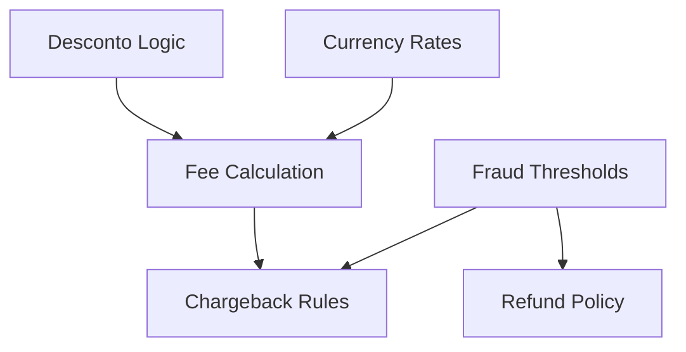

# Regras de Negocio MEF

Esta secao contem **6 UKIs** que estruturam as regras fundamentais de negocio da squad de pagamentos, transformando conhecimento disperso e contraditorio em definicoes precisas, versionadas e relacionadas.

## 📋 UKIs de Regras de Negocio

### 💰 Descontos e Promocoes
**[uki-pay-discount-logic-001.yaml](./uki-pay-discount-logic-001.yaml)**
- **Titulo**: Regras de Desconto por Volume e Cupons
- **Versao**: 2.1.0 (validated)
- **Escopo**: Logica de aplicacao de descontos automaticos e cupons
- **Precedencia**: Define ordem de aplicacao entre descontos por volume vs cupons

### 🔄 Reembolsos
**[uki-pay-refund-policy-002.yaml](./uki-pay-refund-policy-002.yaml)**
- **Titulo**: Politica de Reembolsos e Estornos
- **Versao**: 1.2.0 (validated)
- **Escopo**: Regras para processamento de reembolsos parciais e totais
- **Timeline**: Prazos especificos por tipo de transacao

### 🛡️ Deteccao de Fraude
**[uki-pay-fraud-thresholds-003.yaml](./uki-pay-fraud-thresholds-003.yaml)**
- **Titulo**: Thresholds de Deteccao de Fraude
- **Versao**: 3.0.0 (validated)
- **Escopo**: Limites e criterios para flagging de transacoes suspeitas
- **Automacao**: Regras para bloqueio automatico vs analise manual

### 💱 Taxas de Cambio
**[uki-pay-currency-rates-004.yaml](./uki-pay-currency-rates-004.yaml)**
- **Titulo**: Gestao de Taxas de Cambio
- **Versao**: 1.1.0 (validated)
- **Escopo**: Atualizacao e aplicacao de taxas para transacoes internacionais
- **Fallback**: Estrategias quando APIs de cambio falham

### 💳 Calculo de Taxas
**[uki-pay-fee-calculation-005.yaml](./uki-pay-fee-calculation-005.yaml)**
- **Titulo**: Calculo de Taxas por Gateway
- **Versao**: 2.0.0 (validated)
- **Escopo**: Formulas especificas para cada gateway de pagamento
- **Transparencia**: Exibicao de taxas para o cliente final

### ⚖️ Chargebacks
**[uki-pay-chargeback-rules-006.yaml](./uki-pay-chargeback-rules-006.yaml)**
- **Titulo**: Regras de Chargeback e Contestacao
- **Versao**: 1.0.0 (validated)
- **Escopo**: Processo de contestacao e documentacao necessaria
- **SLA**: Prazos para resposta a disputas

## 🔗 Relacionamentos Entre Regras

### Interdependencias Principais:

### Exemplos de Integracao:
- **Descontos + Taxas**: Taxas sao calculadas APOS aplicacao de descontos
- **Fraude + Reembolsos**: Transacoes flagradas tem politica de reembolso diferenciada
- **Cambio + Taxas**: Taxas internacionais incluem spread cambial
- **Fraude + Chargebacks**: Score de fraude influencia estrategia de contestacao

## ⚡ Beneficios da Estruturacao

### Vs. Conhecimento Disperso Original:
| Aspecto | Antes (Caotico) | Depois (MEF) |
|---------|----------------|--------------|
| **Contradicoes** | Multiplas versoes conflitantes | Fonte unica de verdade |
| **Atualizacao** | Manual, error-prone | Versionamento semantico |
| **Descoberta** | Dificil localizar regras | Busca por scope/domain |
| **Validacao** | Sem processo formal | Maturity levels + approval |
| **Rastreabilidade** | Historico perdido | Audit trail completo |

## 🎯 Casos de Uso Praticos

### Para Desenvolvedores:
- Implementacao de logica de negocio consistente
- Validacao de regras durante desenvolvimento
- Integracao entre diferentes dominios

### Para Product Managers:
- Visibilidade completa das regras ativas
- Impacto de mudancas em regras relacionadas
- Historico de evolucao das politicas

### Para Auditoria/Compliance:
- Documentacao formal de todas as regras
- Rastreabilidade de mudancas
- Validacao de conformidade regulatoria

---

> 💡 **Navegacao**: Retorne ao [indice estruturado](../) ou explore [padroes tecnicos](../technical-patterns) e [procedimentos](../procedures) relacionados.