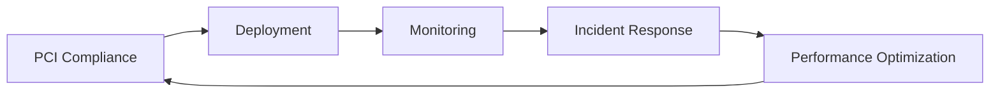

# Procedimentos MEF

Esta secao contem **5 UKIs** que estruturam os processos operacionais criticos da squad de pagamentos, transformando procedimentos informais e dispersos em documentacao padronizada, versionada e auditavel.

## 📋 UKIs de Procedimentos

### 🔒 Conformidade e Seguranca
**[uki-pay-pci-compliance-013.yaml](uki-pay-pci-compliance-013.md)**
- **Titulo**: Procedimentos de Conformidade PCI DSS
- **Versao**: 2.0.0 (validated)
- **Escopo**: Checklist completo para auditoria PCI DSS anual
- **Criticidade**: Procedimento mandatorio para operacao legal

### 🚀 Deployment
**[uki-pay-deployment-process-015.yaml](uki-pay-deployment-process-015.md)**
- **Titulo**: Processo de Deployment para Pagamentos
- **Versao**: 1.3.0 (validated)
- **Escopo**: Pipeline de deployment com validacoes especificas
- **Rollback**: Procedimentos de reversao rapida em caso de problemas

### 🚨 Resposta a Incidentes
**[uki-pay-incident-response-014.yaml](uki-pay-incident-response-014.md)**
- **Titulo**: Resposta a Incidentes de Pagamento
- **Versao**: 1.1.0 (validated)
- **Escopo**: Runbook para incidentes criticos em pagamentos
- **Escalation**: Matriz de escalacao por severidade e impacto

### 📊 Monitoramento
**[uki-pay-monitoring-alerts-016.yaml](uki-pay-monitoring-alerts-016.md)**
- **Titulo**: Configuracao de Alertas de Monitoramento
- **Versao**: 1.0.0 (validated)
- **Escopo**: Definicao de alertas, thresholds e responsaveis
- **SLA**: Tempos de resposta por tipo de alerta

### ⚡ Performance
**[uki-pay-performance-optimization-017.yaml](uki-pay-performance-optimization-017.md)**
- **Titulo**: Procedimentos de Otimizacao de Performance
- **Versao**: 1.0.0 (validated)
- **Escopo**: Checklist de otimizacao para gateway de pagamentos
- **Benchmarks**: Metricas-alvo de performance por operacao

## 🔄 Fluxo de Operacoes

### Pipeline Operacional Integrado:

### Interdependencias Operacionais:
- **PCI + Deployment**: Deployment so e permitido apos validacao PCI
- **Monitoring + Incidents**: Alertas acionam automaticamente response procedures
- **Performance + Monitoring**: Metricas de performance alimentam configuracao de alertas
- **Incidents + Deployment**: Incidentes podem triggar rollback procedures

## 🛡️ Aspectos de Governanca

### Autoridade e Responsabilidade:
| Procedimento | Owner | Reviewers | Frequencia |
|-------------|-------|-----------|------------|
| **PCI Compliance** | Security Lead | CISO, Auditor | Anual |
| **Deployment** | Tech Lead | DevOps, QA | A cada release |
| **Incident Response** | SRE Lead | Tech Lead, PM | Quando necessario |
| **Monitoring** | DevOps Lead | SRE, Tech Lead | Mensal |
| **Performance** | Tech Lead | Architect, DevOps | Trimestral |

### Ciclo de Vida dos Procedimentos:
1. **Draft** → Criacao inicial por especialista
2. **Review** → Validacao por pares e stakeholders
3. **Validated** → Aprovacao formal e entrada em vigor
4. **Active** → Uso operacional com metricas de compliance
5. **Update** → Evolucao baseada em licoes aprendidas

## ⚡ Beneficios da Padronizacao

### Vs. Procedimentos Informais:
| Aspecto | Antes (Ad-hoc) | Depois (MEF) |
|---------|----------------|--------------|
| **Consistencia** | Variacao por pessoa/time | Procedimento unico e claro |
| **Treinamento** | Conhecimento tacito | Documentacao formal |
| **Auditoria** | Evidencia fragmentada | Rastro completo de compliance |
| **Evolucao** | Mudancas nao documentadas | Versionamento controlado |
| **Eficiencia** | Retrabalho e erros | Execucao otimizada |

## 🎯 Casos de Uso Praticos

### Para SREs/DevOps:
- Execucao consistente de procedimentos criticos
- Troubleshooting eficiente usando runbooks estruturados
- Metricas de compliance automatizadas

### Para Auditoria:
- Evidencia documental de processos
- Rastreabilidade de mudancas em procedimentos
- Validacao de conformidade regulatoria

### Para Novos Membros:
- Onboarding estruturado com procedimentos claros
- Reducao de tempo para produtividade
- Menor dependencia de conhecimento tribal

## 🔍 Metricas de Compliance

### KPIs dos Procedimentos:
- **PCI Compliance**: 100% compliance score anual
- **Deployment**: <2% rollback rate
- **Incident Response**: MTTR <15min para P0
- **Monitoring**: <5min detection time
- **Performance**: <500ms latencia p95

---

> 💡 **Navegacao**: Retorne ao [indice estruturado](../) ou explore [regras de negocio](../business-rules) e [padroes tecnicos](../technical-patterns) relacionados.