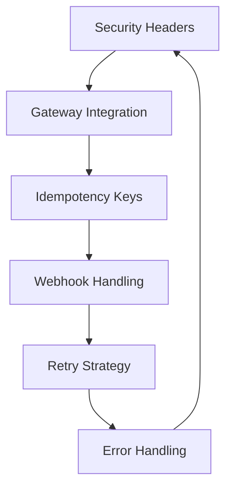

# Padroes Tecnicos MEF

Esta secao contem **6 UKIs** que estruturam os padroes tecnicos fundamentais para implementacao robusta do sistema de pagamentos, transformando praticas informais em guidelines tecnicos claros, testaveis e evolutivos.

## 📋 UKIs de Padroes Tecnicos

### 🔌 Integracao com Gateways
**[uki-pay-gateway-integration-007.yaml](uki-pay-gateway-integration-007)**
- **Titulo**: Padrao de Integracao com Gateways de Pagamento
- **Versao**: 1.2.0 (validated)
- **Escopo**: Interface unificada para multiplos provedores de pagamento
- **Fallback**: Estrategia de failover entre gateways

### 🔄 Estrategia de Retry
**[uki-pay-retry-strategy-008.yaml](uki-pay-retry-strategy-008)**
- **Titulo**: Estrategia de Retry e Circuit Breaker
- **Versao**: 2.0.0 (validated)
- **Escopo**: Politicas de retry com backoff exponencial
- **Protecao**: Circuit breaker para protecao contra cascata de falhas

### 🔗 Processamento de Webhooks
**[uki-pay-webhook-handling-009.yaml](uki-pay-webhook-handling-009)**
- **Titulo**: Processamento Seguro de Webhooks
- **Versao**: 1.1.0 (validated)
- **Escopo**: Validacao, autenticacao e processamento idempotente
- **Seguranca**: Verificacao de assinatura e rate limiting

### 🔒 Cabecalhos de Seguranca
**[uki-pay-security-headers-010.yaml](uki-pay-security-headers-010)**
- **Titulo**: Cabecalhos de Seguranca Obrigatorios
- **Versao**: 1.0.0 (validated)
- **Escopo**: Headers HTTP para conformidade PCI e seguranca
- **Compliance**: Validacao automatizada de headers

### 🔑 Chaves de Idempotencia
**[uki-pay-idempotency-keys-011.yaml](uki-pay-idempotency-keys-011)**
- **Titulo**: Implementacao de Chaves de Idempotencia
- **Versao**: 1.3.0 (validated)
- **Escopo**: Prevencao de transacoes duplicadas
- **TTL**: Gestao de lifecycle das chaves

### ⚠️ Tratamento de Erros
**[uki-pay-error-handling-012.yaml](uki-pay-error-handling-012)**
- **Titulo**: Padrao de Tratamento de Erros
- **Versao**: 1.0.0 (validated)
- **Escopo**: Categorizacao, logging e response de erros
- **Observabilidade**: Metricas e alertas por tipo de erro

## 🏗️ Arquitetura de Padroes

### Stack Tecnico Integrado:

### Dependencias Entre Padroes:
- **Security + Gateway**: Headers aplicados em todas as requests para gateways
- **Idempotency + Retry**: Chaves preservadas durante tentativas de retry
- **Webhook + Error**: Webhooks seguem padrao uniforme de error handling
- **Retry + Circuit Breaker**: Retry respects circuit breaker state
- **Error + Observability**: Todos os erros geram metricas estruturadas

## 🔧 Implementacao Tecnica

### Guidelines de Codigo:
| Padrao | Framework | Libs/Tools | Testing |
|--------|-----------|-----------|---------|
| **Gateway Integration** | Adapter Pattern | HTTP clients + SDK wrappers | Mock gateways |
| **Retry Strategy** | Exponential backoff | Polly/.NET, Tenacity/Python | Fault injection |
| **Webhook Handling** | Event-driven | Message queues + validators | Webhook simulators |
| **Security Headers** | Middleware | Security libs + validators | Header validation tests |
| **Idempotency** | Key-value store | Redis/DynamoDB + TTL | Duplicate request tests |
| **Error Handling** | Exception hierarchy | Structured logging + APM | Error scenario tests |

### Compliance e Validacao:
- **Automated Tests**: Cada padrao tem test suite especifico
- **Static Analysis**: Linting rules para enforcement
- **Runtime Validation**: Middleware para verificacao em producao
- **Monitoring**: Dashboards especificos por padrao

## ⚡ Beneficios da Padronizacao

### Vs. Implementacoes Ad-hoc:
| Aspecto | Antes (Inconsistente) | Depois (MEF) |
|---------|----------------------|--------------|
| **Qualidade** | Implementacoes variadas | Padrao unico e testado |
| **Manutencao** | Conhecimento fragmentado | Documentacao centralizada |
| **Debugging** | Cada caso e unico | Comportamento previsivel |
| **Onboarding** | Curva de aprendizado alta | Guidelines claros |
| **Evolucao** | Mudancas descoordenadas | Evolucao controlada |

## 🎯 Casos de Uso Praticos

### Para Desenvolvedores:
- Guidelines claros para implementacao
- Code examples e templates prontos
- Test scenarios pre-definidos

### Para Arquitetos:
- Padroes comprovados e evolutivos
- Analise de impacto de mudancas
- Consistency across teams

### Para SREs:
- Comportamento previsivel em producao
- Runbooks baseados em padroes conhecidos
- Metricas padronizadas para observabilidade

## 📊 Metricas de Qualidade

### KPIs dos Padroes:
- **Gateway Integration**: 99.9% uptime per gateway
- **Retry Strategy**: <1% fallback to circuit breaker
- **Webhook Processing**: <1s processing time p95
- **Security Headers**: 100% compliance score
- **Idempotency**: 0% duplicate transactions
- **Error Handling**: <5min MTTR for categorized errors

### Evolucao dos Padroes:
- **Performance Benchmarks**: Continuous monitoring
- **Security Audits**: Quarterly reviews
- **Developer Feedback**: Monthly retrospectives
- **Technology Updates**: Yearly pattern review

---

> 💡 **Navegacao**: Retorne ao [indice estruturado](../) ou explore [regras de negocio](../business-rules) e [procedimentos](../procedures) relacionados.