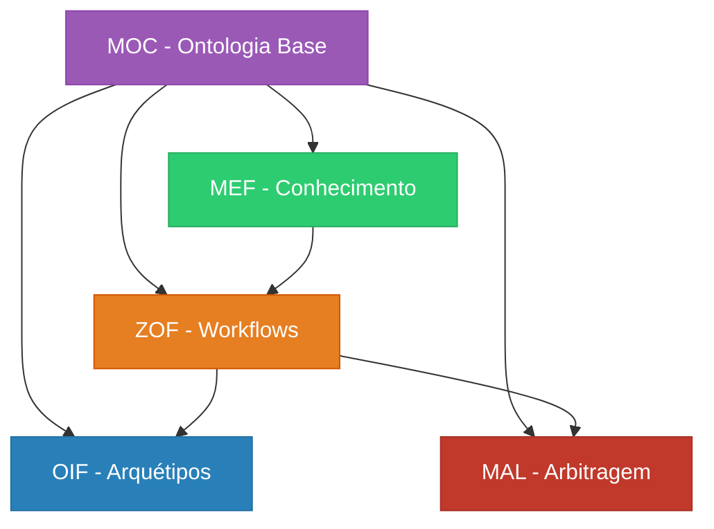

# Frameworks Matrix Protocol

O Matrix Protocol é composto por **5 frameworks interdependentes** que trabalham em conjunto para criar um sistema robusto de colaboração humano-IA. Cada framework tem sua especialidade e se integra com os demais.

## 🏛️ Arquitetura dos Frameworks

### Camada Oracle (Estratégica)
- **[MEF - Matrix Embedding Framework](/docs/frameworks/mef)** - Estruturação de conhecimento versionado
- **[MEF Ontology](/docs/frameworks/mef-ontology)** - Ontologia específica do MEF

### Camada Zion (Orquestração)  
- **[ZOF - Zion Orchestration Framework](/docs/frameworks/zof)** - Workflows orientados a IA

### Camada Operator (Execução)
- **[OIF - Operator Intelligence Framework](/docs/frameworks/oif)** - Arquétipos de agentes IA

### Camadas Transversais
- **[MOC - Matrix Ontology Catalog](/docs/frameworks/moc)** - Catálogo ontológico organizacional
- **[MAL - Matrix Arbiter Layer](/docs/frameworks/mal)** - Arbitragem e resolução de conflitos

## 📊 Visão Comparativa

| Framework | Foco Principal | Usuários Típicos | Complexidade |
|-----------|----------------|-------------------|--------------|
| **MEF** | Estruturação de conhecimento | Especialistas de domínio | ⭐⭐⭐ |
| **ZOF** | Orquestração de workflows | Líderes técnicos | ⭐⭐⭐⭐ |
| **OIF** | Arquétipos de IA | Desenvolvedores | ⭐⭐⭐⭐⭐ |
| **MOC** | Governança organizacional | Arquitetos | ⭐⭐ |
| **MAL** | Resolução de conflitos | Administradores | ⭐⭐⭐⭐ |

## 🎯 Por Onde Começar?

### Para Iniciantes
1. **[MOC](/docs/frameworks/moc)** - Comece definindo sua ontologia organizacional
2. **[MEF](/docs/frameworks/mef)** - Aprenda a estruturar conhecimento
3. **[ZOF](/docs/frameworks/zof)** - Implemente workflows básicos

### Para Implementação Avançada
1. **[OIF](/docs/frameworks/oif)** - Configure arquétipos de IA
2. **[MAL](/docs/frameworks/mal)** - Configure arbitragem e governança

### Para Compreensão Teórica
1. **[MEF Ontology](/docs/frameworks/mef-ontology)** - Fundamentos ontológicos do MEF

## 🔗 Interdependências

## 📖 Documentação Detalhada

### MEF - Matrix Embedding Framework
- **[Especificação Completa](/docs/frameworks/mef)** - Estruturação de UKIs
- **[Ontologia MEF](/docs/frameworks/mef-ontology)** - Fundamentos teóricos

### ZOF - Zion Orchestration Framework  
- **[Especificação Completa](/docs/frameworks/zof)** - Estados canônicos e workflows

### OIF - Operator Intelligence Framework
- **[Especificação Completa](/docs/frameworks/oif)** - Arquétipos e agentes IA

### MOC - Matrix Ontology Catalog
- **[Especificação Completa](/docs/frameworks/moc)** - Catálogo ontológico

### MAL - Matrix Arbiter Layer
- **[Especificação Completa](/docs/frameworks/mal)** - Arbitragem determinística

## 🚀 Recursos Práticos

- **[Guia de Implementação](/docs/implementation)** - Como implementar todos os frameworks
- **[Templates](/docs/manual/templates)** - Templates prontos para cada framework
- **[Exemplos](/docs/manual/examples)** - Casos de uso reais
- **[Ferramentas](/docs/manual/tools)** - Checklists de validação

---

> **💡 Dica**: Os frameworks são projetados para serem implementados gradualmente. Comece com MOC e MEF, depois expanda para os demais conforme sua organização amadurece.