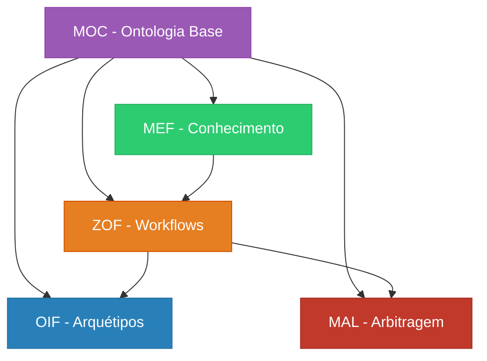

<!-- TODO:("Ajustar esse conteúdo pois tem muitos links com textos diferentes que levam para o mesmo lugr, então precisa ser revisado") -->
# Frameworks Matrix Protocol

O Matrix Protocol é composto por **5 frameworks interdependentes** que trabalham em conjunto para criar um sistema robusto de colaboração humano-IA. Cada framework tem sua especialidade e se integra com os demais.

## 🏛️ Arquitetura dos Frameworks

### Camada Oracle (Estratégica)
- **[MEF - Matrix Embedding Framework](./mef)** - Estruturação de conhecimento versionado
- **[MEF Ontology](./mef-ontology)** - Ontologia específica do MEF

### Camada Zion (Orquestração)  
- **[ZOF - Zion Orchestration Framework](./zof)** - Workflows orientados a IA

### Camada Operator (Execução)
- **[OIF - Operator Intelligence Framework](./oif)** - Arquétipos de agentes IA

### Camadas Transversais
- **[MOC - Matrix Ontology Catalog](./moc)** - Catálogo ontológico organizacional
- **[MAL - Matrix Arbiter Layer](./mal)** - Arbitragem e resolução de conflitos

## 📊 Visão Comparativa

| Framework | Foco Principal               | Usuários Típicos         | Complexidade |
|-----------|------------------------------|--------------------------|--------------|
| **MEF**   | Estruturação de conhecimento | Especialistas de domínio | ⭐⭐⭐          |
| **ZOF**   | Orquestração de workflows    | Líderes técnicos         | ⭐⭐⭐⭐         |
| **OIF**   | Arquétipos de IA             | Desenvolvedores          | ⭐⭐⭐⭐⭐        |
| **MOC**   | Governança organizacional    | Arquitetos               | ⭐⭐           |
| **MAL**   | Resolução de conflitos       | Administradores          | ⭐⭐⭐⭐         |

## 🎯 Por Onde Começar?

### Para Iniciantes
1. **[MOC](./moc)** - Comece definindo sua ontologia organizacional
2. **[MEF](./mef)** - Aprenda a estruturar conhecimento
3. **[ZOF](./zof)** - Implemente workflows básicos

### Para Implementação Avançada
1. **[OIF](./oif)** - Configure arquétipos de IA
2. **[MAL](./mal)** - Configure arbitragem e governança

### Para Compreensão Teórica
1. **[MEF Ontology](./mef-ontology)** - Fundamentos ontológicos do MEF

## 🔗 Interdependências

## 📖 Documentação Detalhada

### MEF - Matrix Embedding Framework
- **[Especificação Completa](./mef)** - Estruturação de UKIs
- **[Ontologia MEF](./mef-ontology)** - Fundamentos teóricos

### ZOF - Zion Orchestration Framework  
- **[Especificação Completa](./zof)** - Estados canônicos e workflows

### OIF - Operator Intelligence Framework
- **[Especificação Completa](./oif)** - Arquétipos e agentes IA

### MOC - Matrix Ontology Catalog
- **[Especificação Completa](./moc)** - Catálogo ontológico

### MAL - Matrix Arbiter Layer
- **[Especificação Completa](./mal)** - Arbitragem determinística

## 🚀 Recursos Práticos

- **[Guia de Implementação](../implementation)** - Como implementar todos os frameworks
- **[Templates](../manual/templates)** - Templates prontos para cada framework
- **[Exemplos](../manual/examples)** - Casos de uso reais
- **[Ferramentas](../manual/tools)** - Checklists de validação

---

> **💡 Dica**: Os frameworks são projetados para serem implementados gradualmente. Comece com MOC e MEF, depois expanda para os demais conforme sua organização amadurece.