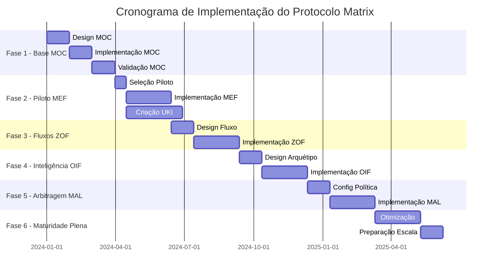

# Fases de Implementação do Protocolo Matrix - Guia Detalhado
**Implementação Gradual em 6 Fases com Checklists e Marcos de Validação**

**Versão:** 0.0.1-beta  
**Data:** 2025-10-05  
**Compatibilidade:** Protocolo Matrix v0.0.1-beta  

> 🎯 **Propósito**: Fornecer orientação detalhada e acionável para cada fase de implementação com checklists concretos, critérios de validação e métricas de sucesso.

---

## 📊 Visão Geral da Implementação

### Cronograma de Fases e Dependências




### Critérios de Sucesso por Fase

| Fase       | Métrica Primária de Sucesso           | Métricas Secundárias               | Impacto nos Negócios            |
|------------|---------------------------------------|------------------------------------|---------------------------------|
| **Fase 1** | MOC valida 100% estrutura org         | Mapeamento autoridade completo     | Base estabelecida               |
| **Fase 2** | 100+ UKIs validadas criadas           | 50% redução conflitos conhecimento | Melhoria qualidade conhecimento |
| **Fase 3** | Todos fluxos seguem estados canônicos | Consulta Oráculo 95%+              | Melhoria qualidade decisão      |
| **Fase 4** | Respostas IA citam fontes 100%        | Tempo acesso conhecimento <5 min   | Melhoria experiência usuário    |
| **Fase 5** | Conflitos resolvidos em <15 min       | 90%+ satisfação stakeholders       | Eficácia governança             |
| **Fase 6** | ROI >200% demonstrado                 | Sistema escala para tamanho org    | Transformação completa          |

---

## 🏗️ FASE 1: Base MOC (Meses 1-3)

### Visão Geral da Fase
**Duração:** 3 meses  
**Tamanho da Equipe:** 3-5 pessoas (dependendo do porte da org)  
**Pré-requisitos:** Patrocínio executivo, identificação de stakeholders  
**Entregáveis:** MOC organizacional completo, políticas de governança, regras de arbitragem  

### Detalhamento Semana a Semana

#### **Semanas 1-2: Avaliação Organizacional**

**Objetivos:**
- [ ] Completar mapeamento de stakeholders
- [ ] Realizar análise da estrutura organizacional
- [ ] Identificar sistemas de conhecimento existentes
- [ ] Mapear processos atuais de tomada de decisão

**Atividades:**
```yaml


entrevistas_stakeholders:
  nivel_executivo: 
    - entrevista_ceo_cto: "Visão estratégica e prioridades"
    - chefes_divisao: "Estrutura departamental e necessidades"
    - membros_conselho: "Requisitos de governança" # Para corporações
    
  nivel_gerencial:
    - diretores_vps: "Desafios atuais de conhecimento"
    - lideres_equipe: "Necessidades operacionais do dia a dia"
    - gerentes_projeto: "Questões de coordenação cross-funcional"
    
  nivel_operacional:
    - contribuidores_seniors: "Padrões de descoberta e uso de conhecimento"
    - especialistas_dominio: "Requisitos de conhecimento especializado"
    - novos_contratados: "Onboarding e lacunas de conhecimento"

auditoria_conhecimento:
  inventario_sistemas:
    - plataformas_documentacao: ["Confluence", "Notion", "SharePoint", "wikis"]
    - ferramentas_comunicacao: ["Slack", "Teams", "arquivos_email"]
    - gestao_projetos: ["Jira", "Asana", "pastas_projeto"]
    - repositorios_codigo: ["GitHub", "GitLab", "repos_internos"]
    - sistemas_negocio: ["CRM", "ERP", "ferramentas_especializadas"]
    
  avaliacao_conhecimento:
    - contagem_documentos: "Total de artefatos de conhecimento"
    - taxa_duplicacao: "Percentual de informação redundante"
    - identificacao_conflitos: "Instâncias de informação contraditória"
    - padroes_acesso: "Quem usa qual conhecimento quando"
    - status_manutencao: "Informação desatualizada vs atual"

mapeamento_fluxo_decisao:
  decisoes_criticas:
    - decisoes_arquiteturais: "Quem decide padrões técnicos"
    - decisoes_produto: "Quem decide prioridades de funcionalidades"
    - decisoes_operacionais: "Quem decide mudanças de processo"
    - decisoes_estrategicas: "Quem decide direção do negócio"
    
  analise_autoridade:
    - autoridade_formal: "Direitos de decisão do organograma"
    - autoridade_informal: "Padrões reais de influência"
    - caminhos_escalacao: "Fluxos de resolução de conflitos"
    - requisitos_aprovacao: "O que precisa da aprovação de quem"
```


**Checklist Semanas 1-2:**
- [ ] Agendar e completar 15-25 entrevistas com stakeholders
- [ ] Documentar estrutura org atual com linhas de reporte reais (não oficiais)
- [ ] Inventariar todos os sistemas de conhecimento e seus padrões de uso
- [ ] Identificar top 10 pontos de dor de conhecimento
- [ ] Mapear 20+ tipos de decisão crítica e seu fluxo atual
- [ ] Analisar 5-10 conflitos de decisão recentes e sua resolução
- [ ] Documentar requisitos regulatórios/compliance
- [ ] Avaliar prontidão da equipe para Protocolo Matrix e necessidades de treinamento

**Critérios de Validação:**
- ✅ 80%+ dos stakeholders chave entrevistados
- ✅ Inventário completo dos sistemas de conhecimento
- ✅ Mapeamento de autoridade cobre todos os tipos principais de decisão
- ✅ Pontos de dor priorizados com avaliação de impacto nos negócios
- ✅ Buy-in de stakeholders confirmado para abordagem Protocolo Matrix

#### **Semanas 3-6: Design MOC**

**Objetivos:**
- [ ] Projetar estrutura taxonômica organizacional
- [ ] Definir regras e políticas de governança
- [ ] Configurar regras de precedência de arbitragem
- [ ] Criar mapeamento da hierarquia de autoridade

**Processo de Design MOC:**
```yaml


design_hierarquias:
  hierarquia_escopo:
    principios_design:
      - "Corresponder à estrutura organizacional real, não oficial"
      - "Permitir fluxo de conhecimento, não criar silos"
      - "Apoiar cultura atual enquanto permite melhoria"
      - "Planejar para crescimento e mudança organizacional"
      
    sessoes_design:
      - workshop_stakeholders: "Definição colaborativa de escopo"
      - sessao_validacao: "Testar escopo com cenários reais"
      - rodadas_iteracao: "Refinar baseado em feedback"
      
  hierarquia_dominio:
    identificacao_dominios:
      - agrupamento_conhecimento: "Agrupar áreas de conhecimento relacionadas"
      - mapeamento_expertise: "Quem possui quais domínios"
      - analise_cross_cutting: "Domínios que abrangem múltiplas áreas"
      - avaliacao_especializacao: "Necessidades de domínio profundo vs amplo"
      
  hierarquia_maturidade:
    modelo_progressao:
      - requisitos_validacao: "O que constitui cada nível de maturidade"
      - criterios_promocao: "Como o conhecimento avança"
      - requisitos_autoridade: "Quem pode aprovar cada nível"
      - padroes_evidencia: "Que prova é necessária para maturidade"

design_governanca:
  mapeamento_autoridade:
    analise_funcoes:
      - autoridade_decisao: "Quem pode tomar quais decisões"
      - autoridade_validacao: "Quem pode aprovar conhecimento"
      - autoridade_override: "Quem pode contornar processos normais"
      - autoridade_auditoria: "Quem garante compliance"
      
  framework_politicas:
    controle_mudanca:
      - processo_aprovacao_mudanca: "Como o próprio MOC evolui"
      - requisitos_analise_impacto: "Quando análise é necessária"
      - notificacao_stakeholders: "Quem é notificado de mudanças"
      
    resolucao_conflitos:
      - caminhos_escalacao: "Cadeias claras de autoridade"
      - politicas_timeout: "Tempos máximos de resolução"
      - mediacao_externa: "Quando envolver terceiros"

configuracao_arbitragem:
  politicas_precedencia:
    politica_organizacional:
      - ordem_precedencia: "Ordenação de regras P1 até P6"
      - multiplicadores_peso: "Fatores de aumento de autoridade"
      - configuracoes_timeout: "Tempo máximo de arbitragem"
      
    politicas_especializadas:
      - conflitos_seguranca: "Precedência security-first"
      - conflitos_regulatorios: "Resolução priorizando compliance"
      - conflitos_cross_divisao: "Resolução de autoridade superior"
```


**Checklist Semanas 3-6:**
- [ ] Completar design da hierarquia de escopo com 3-5 níveis
- [ ] Definir 5-8 categorias de domínio correspondendo às necessidades organizacionais
- [ ] Criar 3-5 níveis de maturidade com critérios claros de progressão
- [ ] Projetar hierarquia de autoridade correspondendo à estrutura real (não formal) de poder
- [ ] Configurar 2-4 políticas de arbitragem para diferentes tipos de conflito
- [ ] Projetar políticas de ciclo de vida para diferentes criticidades de conhecimento
- [ ] Criar regras de governança para controle de mudança do MOC
- [ ] Validar design com workshops de stakeholders
- [ ] Documentar justificativa do design e trade-offs
- [ ] Obter aprovação formal dos patrocinadores executivos

**Critérios de Validação:**
- ✅ Design MOC cobre 100% da estrutura organizacional
- ✅ Todas as funções de autoridade mapeadas para pessoas reais
- ✅ Políticas de arbitragem testadas com conflitos históricos
- ✅ Regras de governança aprovadas por jurídico/compliance
- ✅ Design validado através de workshops com stakeholders

#### **Semanas 7-10: Implementação MOC**

**Objetivos:**
- [ ] Implementar arquivos de configuração MOC
- [ ] Configurar processos de governança
- [ ] Configurar sistemas de arbitragem
- [ ] Criar procedimentos de validação e teste

**Tarefas de Implementação:**
```yaml


configuracao_moc:
  implementacao_yaml:
    - selecao_template: "Escolher template apropriado para porte org"
    - customizacao: "Adaptar template às necessidades organizacionais"
    - validacao: "Verificações de sintaxe e consistência lógica"
    - versionamento: "Configuração inicial de controle de versão"
    
  integracao_governanca:
    - servico_validacao_autoridade: "Conectar com sistemas HR/identidade"
    - sistemas_notificacao: "Integração email/Slack para mudanças"
    - fluxos_aprovacao: "Conectar com ferramentas de aprovação existentes"
    - log_auditoria: "Configurar rastreamento de mudanças"

configuracao_sistema:
  infraestrutura:
    - controle_versao: "Repositório Git para arquivos MOC"
    - ferramentas_validacao: "Verificadores de sintaxe e lógica YAML"
    - sistemas_backup: "Procedimentos regulares de backup MOC"
    - controles_acesso: "Quem pode visualizar/editar arquivos MOC"
    
  pontos_integracao:
    - servicos_diretorio: "Integração LDAP/Active Directory"
    - servicos_notificacao: "Configuração bot Slack/Teams"
    - sistemas_monitoramento: "Health checks e alertas"

procedimentos_teste:
  cenarios_validacao:
    - validacao_autoridade: "Testar verificações de permissão de usuário"
    - navegacao_hierarquia: "Testar navegação escopo/domínio"
    - simulacao_arbitragem: "Testar resolução de conflitos"
    - tratamento_casos_extremos: "Testar condições de contorno"
    
  teste_aceitacao_usuario:
    - validacao_stakeholders: "Usuários chave testam navegação MOC"
    - walkthroughs_cenario: "Teste de casos de uso do mundo real"
    - validacao_performance: "Medições de tempo de resposta"
    - avaliacao_usabilidade: "Avaliação da experiência do usuário"
```


**Checklist Semanas 7-10:**
- [ ] Implementar configuração YAML MOC completa
- [ ] Configurar controle de versão e gestão de mudanças
- [ ] Configurar serviço de validação de autoridade
- [ ] Implementar engine de políticas de arbitragem
- [ ] Configurar monitoramento e alertas
- [ ] Criar procedimentos de backup e recuperação
- [ ] Testar todos os cenários de validação MOC
- [ ] Conduzir teste de aceitação do usuário com 5-10 usuários chave
- [ ] Documentar procedimentos operacionais
- [ ] Treinar administradores MOC

**Critérios de Validação:**
- ✅ MOC valida 100% da hierarquia organizacional
- ✅ Validação de autoridade funciona para todas as funções de usuário
- ✅ Políticas de arbitragem resolvem conflitos de teste corretamente
- ✅ Performance do sistema atende requisitos (<1 segundo de resposta)
- ✅ Critérios de aceitação do usuário atendidos pelo grupo de teste

#### **Semanas 11-12: Validação da Fase 1 e Transição**

**Objetivos:**
- [ ] Completar teste abrangente
- [ ] Documentar lições aprendidas
- [ ] Preparar para Fase 2
- [ ] Celebrar sucesso da Fase 1

**Validação Final:**
```yaml


teste_abrangente:
  teste_funcional:
    - validacao_hierarquia: "Todos os nós validam corretamente"
    - verificacoes_autoridade: "Todas as funções funcionam como projetado"
    - execucao_arbitragem: "Políticas resolvem conflitos corretamente"
    - fluxos_governanca: "Controle de mudança funciona end-to-end"
    
  teste_performance:
    - teste_carga: "Sistema suporta carga esperada de usuários"
    - tempo_resposta: "Respostas de consulta sub-segundo"
    - acesso_concorrente: "Múltiplos usuários podem acessar simultaneamente"
    - validacao_escalabilidade: "Sistema pronto para carga da Fase 2"
    
  teste_seguranca:
    - validacao_controle_acesso: "Usuários só veem conteúdo autorizado"
    - protecao_dados: "Informação sensível adequadamente protegida"
    - verificacao_trilha_auditoria: "Todas as mudanças logadas corretamente"
    - backup_recuperacao: "Dados podem ser restaurados com sucesso"

aprovacao_stakeholders:
  aprovacao_executiva:
    - revisao_patrocinador: "Patrocinador executivo aprova conclusão Fase 1"
    - aprovacao_orcamento: "Orçamento Fase 2 confirmado"
    - confirmacao_cronograma: "Cronograma Fase 2 acordado"
    
  prontidao_operacional:
    - treinamento_admin_completo: "Administradores MOC totalmente treinados"
    - procedimentos_suporte: "Procedimentos help desk documentados"
    - monitoramento_ativo: "Monitoramento do sistema operacional"
    - resposta_incidentes: "Procedimentos de escalação de problemas ativos"

preparacao_fase_2:
  selecao_piloto:
    - areas_piloto_identificadas: "2-3 áreas selecionadas para piloto MEF"
    - equipes_piloto_confirmadas: "Participantes piloto comprometidos"
    - criterios_sucesso_piloto: "Métricas Fase 2 definidas"
    
  alocacao_recursos:
    - atribuicoes_equipe: "Funções da equipe Fase 2 definidas"
    - treinamento_agendado: "Sessões de treinamento MEF planejadas"
    - infraestrutura_pronta: "Sistemas prontos para criação UKI"
```


**Checklist Semanas 11-12:**
- [ ] Executar suite completa de testes do sistema
- [ ] Completar validação de segurança e compliance
- [ ] Conduzir revisão e aprovação executiva
- [ ] Documentar todas as lições aprendidas
- [ ] Selecionar e confirmar áreas piloto da Fase 2
- [ ] Agendar treinamento da equipe Fase 2
- [ ] Preparar plano de projeto Fase 2
- [ ] Comunicar sucesso da Fase 1 para organização
- [ ] Arquivar artefatos da Fase 1
- [ ] Celebrar conquistas da equipe

**Critérios de Sucesso da Fase 1:**
- ✅ **Primário:** MOC valida 100% da estrutura organizacional
- ✅ **Autoridade:** Todas as funções de tomada de decisão mapeadas e funcionais
- ✅ **Governança:** Controle de mudança e trilhas de auditoria operacionais
- ✅ **Performance:** Sistema atende requisitos de tempo de resposta
- ✅ **Stakeholder:** Aprovação executiva e financiamento Fase 2 confirmados

---

## 📚 FASE 2: Programas Piloto MEF (Meses 4-6)

### Visão Geral da Fase
**Duração:** 3 meses  
**Tamanho da Equipe:** 5-8 pessoas (equipe central + participantes piloto)  
**Pré-requisitos:** Base MOC da Fase 1 completada  
**Entregáveis:** 100+ UKIs estruturadas, relacionamentos semânticos, exemplos de promoção  

### Estratégia de Seleção de Piloto

#### **Critérios para Áreas Piloto:**
```yaml


criterios_selecao:
  alto_impacto:
    - criticidade_negocio: "Alto impacto na organização"
    - pontos_dor_conhecimento: "Problemas existentes claros para resolver"
    - visibilidade_stakeholder: "Atenção e apoio executivo"
    
  escopo_gerenciavel:
    - tamanho_equipe: "20-50 pessoas no máximo"
    - limites_conhecimento: "Limites claros de domínio"
    - documentacao_existente: "Alguma documentação para converter"
    
  fatores_sucesso:
    - disponibilidade_campiao: "Forte defensor local"
    - engajamento_equipe: "Participantes dispostos"
    - resultados_mensuráveis: "Métricas claras antes/depois"

arquetipos_piloto:
  piloto_tecnico:
    foco: "Padrões e patterns de engenharia"
    participantes: "Equipes de engenharia"
    tipos_conhecimento: ["padrao_tecnico", "pattern", "decisao"]
    metricas_sucesso: ["melhoria consistência", "velocidade decisão", "reuso conhecimento"]
    
  piloto_negocio:
    foco: "Regras e procedimentos de negócio"  
    participantes: "Equipes de produto e operações"
    tipos_conhecimento: ["regra_negocio", "procedimento", "politica"]
    metricas_sucesso: ["consistência processo", "velocidade onboarding", "compliance"]
    
  piloto_transversal:
    foco: "Segurança, compliance ou arquitetura"
    participantes: "Especialistas cross-funcionais"
    tipos_conhecimento: ["politica", "padrao", "procedimento"]
    metricas_sucesso: ["impacto organizacional", "melhoria compliance"]
```


### Implementação Semana a Semana

#### **Semanas 1-2: Configuração e Treinamento do Piloto**

**Objetivos:**
- [ ] Finalizar seleção de piloto e formação de equipe
- [ ] Conduzir treinamento abrangente MEF
- [ ] Configurar infraestrutura do piloto
- [ ] Estabelecer métricas de sucesso e monitoramento

**Configuração do Piloto:**
```yaml


formacao_equipes:
  equipes_piloto:
    - lider_piloto: "Campeão local com autoridade"
    - especialistas_conhecimento: "2-3 especialistas do domínio"
    - criadores_conteudo: "2-3 pessoas para escrever UKIs"
    - pool_revisores: "5-8 pessoas para validar conteúdo"
    
  equipe_suporte_central:
    - especialista_mef: "Especialista no framework MEF"
    - administrador_moc: "Especialista em configuração MOC"  
    - coordenador_treinamento: "Entrega de treinamento e suporte"
    - analista_metricas: "Medição de sucesso e relatórios"

programa_treinamento:
  fundamentos_mef:
    duracao: "4 horas"
    conteudo:
      - "Visão geral da especificação MEF"
      - "Estrutura e campos UKI"
      - "Tipos de relacionamentos e semântica"
      - "Workflows de versionamento e promoção"
      
  workshops_praticos:
    duracao: "8 horas ao longo de 2 dias"
    conteudo:
      - "Convertendo docs existentes para UKIs"
      - "Criando relacionamentos semânticos"
      - "Usando ferramentas de validação MEF"
      - "Integração MOC e verificações de autoridade"
      
  suporte_continuo:
    - office_hours: "Sessões de suporte semanais de 2 horas"
    - mentoria_pares: "Criadores experientes ajudam novatos"
    - templates_documentacao: "Templates UKI pré-construídos"
    - guias_referencia_rapida: "Cheat sheets e exemplos"

configuracao_infraestrutura:
  ferramentas_criacao_uki:
    - editores_yaml: "VS Code com extensões MEF"
    - ferramentas_validacao: "Verificação automática de compliance MEF"
    - biblioteca_templates: "Templates UKI pré-construídos por tipo"
    - mapeador_relacionamentos: "Criação visual de relacionamentos"
    
  sistemas_workflow:
    - controle_versao: "Repositório Git para arquivos UKI"
    - fluxos_revisao: "Revisão UKI baseada em pull request"
    - sistema_notificacao: "Integração Slack para atualizações"
    - dashboard_metricas: "Tracking de progresso do piloto em tempo real"
```


**Checklist Semanas 1-2:**
- [ ] Completar seleção de área piloto com aprovação executiva
- [ ] Formar equipes piloto com participantes comprometidos
- [ ] Entregar treinamento de fundamentos MEF para todos os participantes
- [ ] Conduzir workshops práticos com conversão real de conteúdo
- [ ] Configurar ferramentas de criação e validação UKI
- [ ] Configurar controle de versão e fluxos de revisão
- [ ] Estabelecer métricas de sucesso e procedimentos de medição
- [ ] Criar canais de comunicação e processos de suporte
- [ ] Documentar procedimentos e expectativas do piloto
- [ ] Lançar piloto com evento oficial de kickoff

**Critérios de Validação:**
- ✅ Todos os membros da equipe piloto completaram treinamento
- ✅ Ferramentas de criação UKI operacionais e testadas
- ✅ Baseline de métricas de sucesso medido
- ✅ Participantes do piloto comprometidos e engajados
- ✅ Processos de suporte operacionais

#### **Semanas 3-8: Criação e Estruturação UKI**

**Objetivos:**
- [ ] Criar 100+ UKIs de alta qualidade nas áreas piloto
- [ ] Estabelecer relacionamentos semânticos entre UKIs
- [ ] Implementar workflows de versionamento e promoção
- [ ] Validar integração MEF com MOC

**Processo de Criação UKI:**
```yaml


conversao_conteudo:
  analise_documentos_existentes:
    - inventario_documentos: "Catalogar toda documentação existente nas áreas piloto"
    - extracao_conhecimento: "Identificar unidades discretas de conhecimento dentro dos docs"
    - identificacao_conflitos: "Encontrar informação contraditória"
    - analise_lacunas: "Identificar conhecimento faltante"
    
  fluxo_criacao_uki:
    metas_semana_3_4:
      - "20-30 UKIs por área piloto"
      - "Foco no conhecimento de maior impacto"
      - "Priorizar informação frequentemente usada"
      
    metas_semana_5_6:
      - "40-50 UKIs adicionais por área piloto"
      - "Adicionar relacionamentos semânticos"
      - "Começar identificação de candidatos à promoção"
      
    metas_semana_7_8:
      - "30-40 UKIs finais por área piloto"
      - "Completar mapeamento de relacionamentos"
      - "Testar workflows de promoção"

garantia_qualidade:
  compliance_mef:
    - validacao_schema: "Todas as UKIs passam validação do schema MEF 1.0.0"
    - integracao_moc: "Todos os campos *_ref referenciam nós MOC válidos"
    - qualidade_conteudo: "Conteúdo claro, acionável, rico em exemplos"
    - precisao_relacionamentos: "Relacionamentos semânticos são corretos e úteis"
    
  processo_revisao:
    - revisao_pares: "Toda UKI revisada por especialista do domínio"
    - revisao_mef: "Especialista MEF valida compliance técnico"
    - revisao_stakeholders: "Stakeholders de negócio validam precisão do conteúdo"
    - melhoria_continua: "Feedback incorporado para UKIs futuras"

desenvolvimento_relacionamentos:
  mapeamento_semantico:
    - identificacao_dependencias: "Quais UKIs dependem de outras"
    - resolucao_conflitos: "Identificar e resolver UKIs conflitantes"
    - conhecimento_complementar: "UKIs que trabalham juntas"
    - rastreamento_evolucao: "Como o conhecimento se constrói sobre conhecimento anterior"
    
  tipos_relacionamentos:
    - implementa: "UKI implementa requisitos de outra UKI"
    - depende_de: "UKI requer outra UKI para ser válida"
    - conflita_com: "UKI contradiz outra UKI (resolver via MAL)"
    - complementa: "UKI melhora o valor de outra UKI"
    - emenda: "UKI atualiza ou modifica outra UKI"
    - equivale_a: "UKI fornece mesma orientação que outra UKI"
```


**Marcos de Progresso Semanais:**

**Semana 3:**
- [ ] 20-30 UKIs criadas por área piloto
- [ ] Validação MEF passando para todas as UKIs
- [ ] Mapeamento inicial de relacionamentos iniciado
- [ ] Primeiro feedback de stakeholders coletado

**Semana 4:**
- [ ] 40-60 UKIs total por área piloto
- [ ] 10+ relacionamentos semânticos documentados
- [ ] Primeiro candidato à promoção UKI identificado
- [ ] Métricas de qualidade rastreadas e reportadas

**Semana 5:**
- [ ] 60-80 UKIs total por área piloto
- [ ] 25+ relacionamentos semânticos mapeados
- [ ] Workflow de versionamento testado com atualizações reais
- [ ] Relacionamentos entre áreas piloto identificados

**Semana 6:**
- [ ] 80-100 UKIs total por área piloto
- [ ] 40+ relacionamentos semânticos documentados
- [ ] Primeira promoção UKI bem-sucedida completada
- [ ] Conflitos de conhecimento da área piloto resolvidos

**Semana 7:**
- [ ] 100+ UKIs completadas por área piloto
- [ ] Rede completa de relacionamentos mapeada
- [ ] 3-5 exemplos de promoção documentados
- [ ] Métricas de sucesso do piloto mostrando melhoria

**Semana 8:**
- [ ] Revisão final de qualidade UKI completada
- [ ] Todos os relacionamentos semânticos validados
- [ ] Workflows de promoção totalmente testados
- [ ] Documentação do piloto completa

**Critérios de Validação:**
- ✅ 300+ UKIs totais criadas em todas as áreas piloto
- ✅ 90%+ UKIs passam validação de compliance MEF
- ✅ 100+ relacionamentos semânticos documentados e validados
- ✅ 5+ exemplos bem-sucedidos de promoção de conhecimento
- ✅ Melhoria mensurável nas métricas de conhecimento da área piloto

#### **Semanas 9-12: Validação e Promoção**

**Objetivos:**
- [ ] Validar sucesso do piloto contra métricas definidas
- [ ] Documentar lições aprendidas e melhores práticas
- [ ] Preparar para expansão da Fase 3
- [ ] Demonstrar ROI e impacto nos negócios

**Medição de Sucesso:**
```yaml


metricas_quantitativas:
  qualidade_conhecimento:
    - contagem_uki: "Total de UKIs criadas por área piloto"
    - taxa_compliance: "Percentual passando validação MEF"
    - densidade_relacionamentos: "Relacionamentos médios por UKI"
    - sucesso_promocao: "Promoções bem-sucedidas completadas"
    
  impacto_operacional:
    - tempo_encontrar_conhecimento: "Antes vs depois da implementação piloto"
    - taxa_reuso_conhecimento: "Frequência de referência de UKIs"
    - consistencia_decisoes: "Redução em decisões conflitantes"
    - velocidade_onboarding: "Tempo de produtividade de novos membros da equipe"
    
  experiencia_usuario:
    - satisfacao_usuario: "Resultados de pesquisa dos participantes piloto"
    - taxa_adocao: "Percentual da equipe usando UKIs regularmente"
    - taxa_contribuicao: "Quantas pessoas criam/atualizam UKIs"
    - reducao_tickets_suporte: "Menos solicitações de ajuda relacionadas a conhecimento"

avaliacao_qualitativa:
  feedback_stakeholders:
    - satisfacao_executiva: "Percepção da liderança sobre sucesso do piloto"
    - feedback_lideres_equipe: "Avaliação do gerente sobre melhorias da equipe"
    - experiencia_contribuidor: "Satisfação e desafios do criador de UKI"
    - experiencia_usuario: "Feedback e sugestões do consumidor de conhecimento"
    
  melhorias_processo:
    - efetividade_workflows: "Quais processos funcionaram bem"
    - usabilidade_ferramentas: "Efetividade da tecnologia e templates"
    - adequacao_treinamento: "Foi o treinamento suficiente e apropriado"
    - efetividade_suporte: "Os processos de suporte ajudaram os usuários a ter sucesso"

analise_impacto_negocio:
  economia_custos:
    - reducao_retrabalho: "Menos duplicação devido ao melhor compartilhamento de conhecimento"
    - decisoes_mais_rapidas: "Tempo economizado através do acesso consistente ao conhecimento"
    - qualidade_melhorada: "Menos erros devido ao conhecimento padronizado"
    - eficiencia_onboarding: "Tempo e custos de treinamento reduzidos"
    
  habilitacao_receita:
    - entrega_mais_rapida: "Melhoria no time-to-market para produtos/funcionalidades"
    - melhoria_qualidade: "Melhor satisfação do cliente pela consistência"
    - aceleracao_inovacao: "Aprendizado mais rápido do conhecimento documentado"
    - vantagem_competitiva: "Melhor gestão do conhecimento que os concorrentes"
```


**Checklist Semanas 9-12:**
- [ ] Completar análise abrangente de métricas
- [ ] Conduzir pesquisas de satisfação de stakeholders
- [ ] Calcular impacto quantitativo nos negócios
- [ ] Documentar lições detalhadamente aprendidas
- [ ] Criar documentação de história de sucesso do piloto
- [ ] Apresentar resultados para stakeholders executivos
- [ ] Obter aprovação e financiamento para Fase 3
- [ ] Selecionar áreas de expansão da Fase 3
- [ ] Planejar escalonamento da equipe Fase 3
- [ ] Arquivar artefatos e documentação do piloto

**Critérios de Sucesso da Fase 2:**
- ✅ **Primário:** 100+ UKIs validadas criadas por área piloto
- ✅ **Qualidade:** 90%+ UKIs passam validação de compliance MEF
- ✅ **Uso:** 70%+ participantes piloto usando UKIs ativamente
- ✅ **Impacto:** 40%+ melhoria nas métricas chave de conhecimento
- ✅ **Stakeholder:** Aprovação executiva para expansão Fase 3

---

## ⚙️ FASE 3: Fluxos ZOF (Meses 7-9)

### Visão Geral da Fase
**Duração:** 3 meses  
**Tamanho da Equipe:** 6-10 pessoas (expandida da Fase 2)  
**Pré-requisitos:** Sucesso do piloto MEF da Fase 2  
**Entregáveis:** Fluxos ZOF, EvaluateForEnrich operacional, sinais de explicabilidade  

### Seleção de Fluxos Críticos

#### **Identificação de Fluxos de Alto Impacto:**
```yaml


avaliacao_fluxos:
  fluxos_decisao:
    - decisoes_arquiteturais: "Alto impacto, conflitos frequentes"
    - decisoes_produto: "Coordenação cross-equipe necessária"  
    - mudancas_operacionais: "Atualizações de processo afetando múltiplas equipes"
    - iniciativas_estrategicas: "Mudanças organizacionais"
    
  fluxos_intensivos_conhecimento:
    - resolucao_problemas: "Problemas técnicos ou de negócio complexos"
    - resposta_incidentes: "Crítico em tempo, dependente de conhecimento"
    - revisoes_compliance: "Fluxos regulatórios e de auditoria"
    - projetos_inovacao: "Iniciativas P&D e experimentais"
    
  criterios_selecao:
    - dependencia_conhecimento: "Fluxo depende fortemente de conhecimento existente"
    - complexidade_decisao: "Múltiplos fatores e stakeholders envolvidos"
    - repetibilidade: "Fluxo ocorre regularmente na organização"
    - impacto_mensuravel: "Métricas claras antes/depois disponíveis"
```


### Implementação Semana a Semana

#### **Semanas 1-3: Design e Treinamento ZOF**

**Objetivos:**
- [ ] Projetar fluxos ZOF específicos da organização
- [ ] Treinar equipe expandida em conceitos ZOF
- [ ] Configurar monitoramento e medição de fluxos
- [ ] Configurar checkpoint EvaluateForEnrich

**Processo de Design ZOF:**
```yaml


analise_fluxos:
  mapeamento_estado_atual:
    - documentacao_fluxo: "Documentar passos do fluxo existente"
    - pontos_decisao: "Identificar onde decisões são tomadas"
    - touchpoints_conhecimento: "Onde conhecimento é consultado"
    - envolvimento_stakeholders: "Quem participa em cada passo"
    
  mapeamento_estados_canonicos:
    - design_intake: "Como contexto e requisitos são capturados"
    - design_understand: "Implementação de consulta ao Oráculo"
    - design_decide: "Processo de tomada de decisão com conhecimento"
    - design_act: "Passos de execução e implementação"
    - design_evaluate: "Configuração checkpoint EvaluateForEnrich"
    - design_review: "Passos opcionais de validação e feedback"
    - design_enrich: "Criação de conhecimento e enriquecimento do Oráculo"

design_evaluate_for_enrich:
  integracao_criterios_moc:
    - avaliacao_impacto_negocio: "Como avaliar valor de negócio"
    - avaliacao_reusabilidade: "Como determinar potencial de reuso de conhecimento"
    - validacao_compliance: "Como verificar requisitos regulatórios"
    - habilitacao_inovacao: "Como avaliar valor futuro"
    
  validacao_autoridade:
    - verificacao_autoridade_escopo: "Validar usuário pode enriquecer no escopo solicitado"
    - verificacao_autoridade_dominio: "Validar usuário tem expertise de domínio"
    - fluxo_aprovacao: "Rotear para autoridades apropriadas se necessário"
    
  logica_decisao_enriquecimento:
    - pontuacao_ponderada: "Combinar pontuações de critérios com pesos MOC"
    - configuracao_limiar: "Definir pontuações mínimas para enriquecimento"
    - tratamento_excecoes: "Processos de override para conhecimento crítico"
    - trilha_auditoria: "Logar todas as decisões de avaliação e justificativa"

programa_treinamento:
  fundamentos_zof:
    duracao: "6 horas"
    conteudo:
      - "Visão geral dos estados canônicos ZOF"
      - "Padrões de consulta ao Oráculo"
      - "Design do checkpoint EvaluateForEnrich"
      - "Requisitos de sinais de explicabilidade"
      
  workshop_design_fluxo:
    duracao: "12 horas ao longo de 3 dias"
    conteudo:
      - "Técnicas de análise de fluxo atual"
      - "Exercícios de mapeamento de estados canônicos"
      - "Configuração EvaluateForEnrich"
      - "Teste e validação de fluxos"
      
  treinamento_tecnologia:
    duracao: "4 horas"
    conteudo:
      - "Ferramentas de monitoramento de fluxos"
      - "Integração com Oráculo MEF"
      - "Gravação e análise de sinais"
      - "Medição de performance"
```


**Checklist Semanas 1-3:**
- [ ] Completar análise de 3-5 fluxos críticos
- [ ] Projetar mapeamento de estados canônicos para cada fluxo
- [ ] Configurar critérios EvaluateForEnrich baseados no MOC organizacional
- [ ] Treinar equipe expandida em conceitos e implementação ZOF
- [ ] Configurar sistemas de monitoramento e medição de fluxos
- [ ] Criar templates de documentação de fluxos
- [ ] Testar lógica EvaluateForEnrich com decisões históricas
- [ ] Validar integração de consulta ao Oráculo
- [ ] Estabelecer gravação de sinais de explicabilidade
- [ ] Obter aprovação de stakeholders para designs de fluxo

**Critérios de Validação:**
- ✅ Todos os fluxos selecionados mapeados para estados canônicos
- ✅ Checkpoint EvaluateForEnrich operacional
- ✅ Consulta ao Oráculo integrada e testada
- ✅ Equipe treinada e pronta para implementação
- ✅ Sistemas de monitoramento operacionais

#### **Semanas 4-9: Implementação de Fluxos**

**Objetivos:**
- [ ] Implementar fluxos ZOF em áreas piloto
- [ ] Estabelecer padrões de consulta ao Oráculo
- [ ] Operacionalizar checkpoint EvaluateForEnrich
- [ ] Gravar e analisar sinais de explicabilidade

**Cronograma de Implementação:**
```yaml


semana_4_5:
  foco: "Implementação do primeiro fluxo"
  objetivos:
    - implementar_fluxo_decisao_arquitetural: "Implementação ZOF end-to-end"
    - consulta_oraculo_operacional: "Integração MEF funcionando"
    - gravacao_sinais_explicabilidade: "Todas as transições de estado logadas"
    - treinamento_stakeholders: "Participantes do fluxo treinados"
    
semana_6_7:
  foco: "Implementação do segundo fluxo"
  objetivos:
    - implementar_fluxo_resposta_incidentes: "Fluxo crítico em tempo"
    - evaluate_for_enrich_operacional: "Checkpoint tomando decisões reais"
    - exemplos_enriquecimento_conhecimento: "Novas UKIs criadas de fluxos"
    - otimizacao_performance: "Melhorias no tempo de resposta"
    
semana_8_9:
  foco: "Terceiro fluxo e otimização"
  objetivos:
    - implementar_fluxo_decisao_produto: "Coordenação cross-equipe"
    - teste_integracao_completa: "Todos os sistemas funcionando juntos"
    - analise_performance_fluxos: "Métricas vs baseline"
    - incorporacao_feedback_stakeholders: "Melhorias baseadas no uso"

monitoramento_execucao_fluxo:
  metricas_tempo_real:
    - tempo_conclusao_fluxo: "Quanto tempo cada fluxo demora"
    - taxa_consulta_oraculo: "Percentual de fluxos consultando conhecimento"
    - taxa_decisao_enriquecimento: "Percentual aprovado para criação de conhecimento"
    - completude_sinais: "Todos os sinais necessários gravados"
    
  metricas_qualidade:
    - taxa_reversao_decisao: "Decisões posteriormente alteradas"
    - satisfacao_stakeholders: "Experiência do usuário com fluxos"
    - utilizacao_conhecimento: "Frequência de uso de UKIs existentes"
    - qualidade_enriquecimento: "Qualidade de novas UKIs criadas"
    
  otimizacao_performance:
    - identificacao_gargalos: "Onde fluxos ficam lentos"
    - oportunidades_automacao: "Passos que podem ser automatizados"
    - melhorias_integracao: "Melhores conexões de ferramentas"
    - aprimoramentos_experiencia_usuario: "Experiência de fluxo mais suave"

padroes_consulta_oraculo:
  implementacao_estado_understand:
    - busca_conhecimento: "Como usuários encontram UKIs relevantes"
    - ranking_relevancia: "Como priorizar resultados de busca"
    - filtragem_autoridade: "Mostrar apenas conhecimento autorizado"
    - navegacao_relacionamentos: "Seguir relacionamentos UKI"
    
  otimizacao_consulta:
    - performance_busca: "Recuperação de conhecimento sub-segundo"
    - qualidade_resultado: "Alta relevância e precisão"
    - experiencia_usuario: "Descoberta intuitiva de conhecimento"
    - integracao_transparente: "Incorporado nas ferramentas de fluxo"
```


**Metas de Progresso Semanal:**

**Semana 4:**
- [ ] Primeiro fluxo ZOF (decisões arquiteturais) totalmente operacional
- [ ] Consulta ao Oráculo funcionando com 90%+ de precisão
- [ ] Sinais de explicabilidade gravados para todas as instâncias de fluxo
- [ ] Baseline de métricas de performance inicial estabelecido

**Semana 5:**
- [ ] Otimização do primeiro fluxo baseada no uso inicial
- [ ] EvaluateForEnrich tomando decisões reais de enriquecimento
- [ ] Primeiras novas UKIs criadas através de enriquecimento de fluxo
- [ ] Treinamento de stakeholders completado para primeiro fluxo

**Semana 6:**
- [ ] Segundo fluxo ZOF (resposta a incidentes) implementado
- [ ] Padrões de compartilhamento de conhecimento cross-fluxo identificados
- [ ] Melhorias de performance no primeiro fluxo
- [ ] Feedback de qualidade incorporado no design de fluxo

**Semana 7:**
- [ ] Segundo fluxo otimizado para operações críticas em tempo
- [ ] Padrões de consulta ao Oráculo refinados para velocidade
- [ ] Processos de validação de qualidade de enriquecimento operacionais
- [ ] Melhorias na experiência do usuário baseadas em feedback

**Semana 8:**
- [ ] Terceiro fluxo ZOF (decisões de produto) implementado
- [ ] Teste de integração completa bem-sucedido
- [ ] Métricas de performance mostrando melhoria significativa
- [ ] Enriquecimento de conhecimento criando valor mensurável

**Semana 9:**
- [ ] Todos os três fluxos totalmente operacionais e otimizados
- [ ] Análise abrangente de performance completada
- [ ] Pesquisas de satisfação de stakeholders positivas
- [ ] Critérios de sucesso da Fase 3 atendidos ou superados

**Critérios de Validação:**
- ✅ 3+ fluxos críticos seguindo estados canônicos ZOF
- ✅ 95%+ fluxos incluem consulta obrigatória ao Oráculo
- ✅ Checkpoint EvaluateForEnrich operacional com decisões reais
- ✅ Sinais de explicabilidade gravados para 100% das instâncias de fluxo
- ✅ Melhoria mensurável na performance e qualidade do fluxo

#### **Semanas 10-12: Análise e Preparação para Fase 4**

**Objetivos:**
- [ ] Análise abrangente dos resultados da implementação ZOF
- [ ] Documentar melhores práticas e lições aprendidas
- [ ] Preparar organização para implementação da inteligência OIF
- [ ] Validar prontidão para deployment de arquétipos de IA

**Análise de Resultados:**
```yaml


analise_performance:
  eficiencia_fluxos:
    - melhoria_tempo_conclusao: "Baseline vs implementação ZOF"
    - melhoria_qualidade_decisao: "Taxas de reversão e satisfação stakeholders"
    - aumento_utilizacao_conhecimento: "Impacto da consulta ao Oráculo"
    - criacao_valor_enriquecimento: "Qualidade e uso de novo conhecimento"
    
  impacto_organizacional:
    - consistencia_processo: "Padronização entre equipes"
    - compartilhamento_conhecimento: "Fluxo de conhecimento cross-equipe"
    - transparencia_decisao: "Explicabilidade e trilhas de auditoria"
    - aceleracao_aprendizado: "Crescimento mais rápido do conhecimento organizacional"
    
  performance_tecnica:
    - responsividade_sistema: "Velocidade de consulta ao Oráculo"
    - confiabilidade_integracao: "Estabilidade da integração de ferramentas de fluxo"
    - validacao_escalabilidade: "Performance do sistema sob carga"
    - efetividade_monitoramento: "Observabilidade e alertas"

avaliacao_prontidao:
  prontidao_organizacional:
    - adocao_fluxos: "Equipes usando com sucesso padrões ZOF"
    - cultura_conhecimento: "Consulta ao Oráculo se tornando rotina"
    - gestao_mudanca: "Organização se adaptando a novos processos"
    - engajamento_stakeholders: "Apoio da liderança para expansão contínua"
    
  prontidao_tecnica:
    - maturidade_base_conhecimento: "UKIs suficientes para consumo de IA"
    - estabilidade_integracao: "Sistemas confiáveis para integração IA"
    - baselines_performance: "Performance atual do sistema documentada"
    - capacidades_monitoramento: "Capacidade de medir impacto do sistema IA"
    
  preparacao_integracao_ia:
    - requisitos_agente_conhecimento: "O que IA precisa para acessar conhecimento"
    - requisitos_agente_fluxo: "O que IA precisa para orquestrar fluxos"
    - requisitos_explicabilidade: "Como IA fornecerá explicações"
    - integracao_autoridade: "Como IA respeitará autoridade MOC"
```


**Checklist Semanas 10-12:**
- [ ] Completar análise abrangente de performance ZOF
- [ ] Documentar todas as melhores práticas e padrões de fluxos
- [ ] Avaliar prontidão organizacional para integração IA
- [ ] Validar sistemas técnicos prontos para implementação OIF
- [ ] Apresentar resultados da Fase 3 para stakeholders executivos
- [ ] Obter aprovação e recursos para Fase 4
- [ ] Começar design de arquétipos IA baseado em necessidades organizacionais
- [ ] Planejar abordagem de treinamento e implementação OIF
- [ ] Selecionar casos de uso iniciais de IA para Fase 4
- [ ] Preparar plano de projeto Fase 4 e atribuições de equipe

**Critérios de Sucesso da Fase 3:**
- ✅ **Primário:** 100% dos fluxos críticos seguem estados canônicos ZOF
- ✅ **Oráculo:** 95%+ fluxos incluem consulta ao Oráculo
- ✅ **Enriquecimento:** EvaluateForEnrich operacional com impacto mensurável
- ✅ **Performance:** Eficiência de fluxos melhorada em 40%+
- ✅ **Qualidade:** Taxa de reversão de decisões reduzida em 60%+
- ✅ **Prontidão:** Organização pronta para implementação da inteligência IA

---

## 🤖 FASE 4: Inteligência OIF (Meses 10-12)

### Visão Geral da Fase
**Duração:** 3 meses  
**Tamanho da Equipe:** 8-12 pessoas (inclui especialistas IA/ML)  
**Pré-requisitos:** Fluxos ZOF da Fase 3 operacionais  
**Entregáveis:** Agentes de Conhecimento e Fluxo, arquétipos especializados, explicabilidade  

### Estratégia de Design de Arquétipos IA

#### **Avaliação de Arquétipos IA Organizacionais:**
```yaml


analise_arquetipos:
  arquetipos_canonicos_obrigatorios:
    agente_conhecimento:
      proposito: "Busca semântica e explicação de conhecimento"
      integracao_moc: "Filtragem baseada em autoridade e controle de acesso"
      necessidades_especializacao: "Domínios de conhecimento específicos da organização"
      
    agente_fluxo:
      proposito: "Orquestração de fluxos ZOF e execução EvaluateForEnrich"
      especializacao_checkpoint: "Avaliação de critérios MOC"
      requisitos_integracao: "Integração transparente com ferramentas de fluxo"
      
  oportunidades_arquetipos_especializados:
    especifico_dominio:
      - consultor_seguranca: "Expertise em segurança e compliance"
      - consultor_arquitetura: "Orientação de arquitetura técnica"
      - estrategista_produto: "Inteligência de produto e negócio"
      - especialista_operacoes: "Orientação de processo e operacional"
      
    especifico_funcao:
      - assistente_executivo: "Suporte para decisão nível-C"
      - mentor_tecnico: "Orientação e treinamento para desenvolvedores"
      - monitor_compliance: "Suporte regulatório e de auditoria"
      - catalisador_inovacao: "Orientação P&D e experimental"
      
    especifico_processo:
      - comandante_incidentes: "Coordenação de resposta a emergências"
      - guia_onboarding: "Assistência para novos funcionários"
      - consultor_projetos: "Suporte de gestão de projetos"
      - auditor_qualidade: "Garantia e validação de qualidade"
```


### Implementação Semana a Semana

#### **Semanas 1-3: Arquitetura IA e Preparação de Dados de Treinamento**

**Objetivos:**
- [ ] Projetar arquitetura OIF para necessidades organizacionais
- [ ] Preparar dados de treinamento da base de conhecimento MEF
- [ ] Configurar modelos IA para contexto organizacional
- [ ] Configurar sistemas de explicabilidade e autoridade

**Design da Arquitetura IA:**
```yaml


arquitetura_tecnica:
  design_agente_conhecimento:
    selecao_modelo:
      - modelo_primario: "Modelo de linguagem grande (GPT-4, Claude, etc.)"
      - modelo_embedding: "Embeddings vetoriais de conhecimento"
      - sistema_recuperacao: "Busca semântica com filtragem MOC"
      - engine_raciocinio: "Geração de resposta contextual"
      
    integracao_moc:
      - middleware_autoridade: "Verificação de permissão de usuário em tempo real"
      - filtragem_escopo: "Filtragem de conhecimento por escopo do usuário"
      - sistema_citacao: "Referenciamento automático de nós MOC"
      - geracao_explicacao: "Por que conhecimento específico foi recomendado"
      
    processamento_conhecimento:
      - ingestao_uki: "Converter UKIs para formato consumível por IA"
      - entendimento_relacionamentos: "Processamento de relacionamentos semânticos"
      - consciencia_contexto: "Entendimento de interdependências de conhecimento"
      - sincronizacao_atualizacoes: "Atualizações da base de conhecimento em tempo real"
      
  design_agente_fluxo:
    capacidades_orquestracao:
      - gestao_estados_canonicos: "Rastreamento de estado de fluxo ZOF"
      - execucao_checkpoint: "Avaliação automatizada EvaluateForEnrich"
      - suporte_decisao: "Recomendações de decisão assistidas por IA"
      - gravacao_sinais: "Captura automatizada de sinais de explicabilidade"
      
    pontos_integracao:
      - ferramentas_fluxo: "Jira, Asana, sistemas de fluxo customizados"
      - sistemas_notificacao: "Integração Slack, Teams, email"
      - sistemas_aprovacao: "Integração com fluxos de aprovação"
      - sistemas_monitoramento: "Rastreamento de performance de fluxo em tempo real"

preparacao_dados_treinamento:
  criacao_corpus_conhecimento:
    - corpus_uki: "Todas as UKIs organizacionais em formato de treinamento IA"
    - grafo_relacionamentos: "Rede de relacionamentos semânticos"
    - contexto_moc: "Taxonomia organizacional e regras de autoridade"
    - decisoes_historicas: "Padrões de decisões anteriores e resultados"
    
  treinamento_especializado:
    - expertise_dominio: "Conhecimento específico do domínio para arquétipos especializados"
    - contexto_organizacional: "Cultura, valores e práticas da empresa"
    - estilo_comunicacao: "Padrões de comunicação organizacional preferidos"
    - requisitos_compliance: "Restrições regulatórias e legais"
    
  aprendizado_continuo:
    - loop_feedback: "Feedback de interação do usuário para melhoria do modelo"
    - atualizacoes_conhecimento: "Aprendizado incremental de novas UKIs"
    - monitoramento_performance: "Medição da qualidade de resposta da IA"
    - deteccao_vies: "Monitoramento de viés organizacional e cultural"

autoridade_e_explicabilidade:
  implementacao_autoridade_derivada:
    - derivacao_contexto: "Como IA determina contexto do usuário"
    - citacao_autoridade: "Como IA referencia fontes de autoridade MOC"
    - reconhecimento_limitacoes: "Como IA expressa limites de conhecimento"
    - orientacao_escalacao: "Quando IA direciona usuários para especialistas humanos"
    
  sistemas_explicabilidade:
    - transparencia_raciocinio: "Como IA explica seu processo de raciocínio"
    - citacao_fonte: "Citações automáticas de UKI e nós MOC"
    - indicacao_confianca: "Como IA expressa níveis de certeza"
    - perspectiva_alternativa: "Como IA apresenta múltiplos pontos de vista"
```


**Checklist Semanas 1-3:**
- [ ] Completar design da arquitetura IA para necessidades organizacionais
- [ ] Preparar dados de treinamento abrangentes da base de conhecimento UKI
- [ ] Configurar modelos IA com contexto organizacional
- [ ] Implementar middleware de autoridade para integração MOC
- [ ] Configurar sistemas de explicabilidade e citação
- [ ] Criar definições de arquétipos especializados
- [ ] Testar funcionalidade básica IA com dados organizacionais
- [ ] Treinar equipe em gestão e monitoramento de sistema IA
- [ ] Estabelecer baselines de medição de performance IA
- [ ] Obter aprovação de stakeholders para abordagem de implementação IA

**Critérios de Validação:**
- ✅ Arquitetura IA suporta todos os arquétipos OIF necessários
- ✅ Dados de treinamento incluem 90%+ das UKIs organizacionais
- ✅ Integração de autoridade filtra conhecimento corretamente por usuário
- ✅ Sistemas de explicabilidade fornecem citações claras
- ✅ Arquétipos especializados projetados para necessidades organizacionais

#### **Semanas 4-9: Implementação e Integração IA**

**Objetivos:**
- [ ] Implementar e deployar Agente de Conhecimento
- [ ] Implementar e deployar Agente de Fluxo
- [ ] Criar arquétipos organizacionais especializados
- [ ] Integrar sistemas IA com fluxos e ferramentas existentes

**Cronograma de Implementação:**
```yaml


semana_4_5:
  foco: "Implementação Agente de Conhecimento"
  objetivos:
    - deployar_agente_conhecimento: "Busca semântica básica e explicação"
    - integracao_autoridade_moc: "Filtragem de conhecimento específica do usuário"
    - sistema_citacao_operacional: "Citações automáticas de fonte"
    - explicabilidade_basica: "Explicações claras de raciocínio"
    
semana_6_7:
  foco: "Implementação Agente de Fluxo"
  objetivos:
    - deployar_agente_fluxo: "Orquestração de fluxo ZOF"
    - automacao_evaluate_for_enrich: "Decisões de enriquecimento assistidas por IA"
    - integracao_ferramentas_fluxo: "Incorporação transparente de fluxo"
    - automacao_gravacao_sinais: "Sinais de explicabilidade automatizados"
    
semana_8_9:
  foco: "Arquétipos Especializados e Otimização"
  objetivos:
    - deployar_arquetipos_especializados: "Assistentes IA específicos do domínio"
    - otimizacao_performance: "Melhoria de tempo de resposta e qualidade"
    - refinamento_experiencia_usuario: "Melhorias de interface e interação"
    - teste_abrangente: "Validação de sistema end-to-end"

implementacao_agente_conhecimento:
  capacidades_centrais:
    - busca_semantica: "Consulta em linguagem natural para UKIs relevantes"
    - explicacao_contextual: "Por que conhecimento específico é relevante"
    - navegacao_relacionamentos: "Seguir relacionamentos semânticos UKI"
    - respeito_autoridade: "Mostrar apenas conhecimento autorizado"
    
  funcionalidades_avancadas:
    - sintese_multi_uki: "Combinar informação de múltiplas UKIs"
    - identificacao_conflitos: "Identificar conhecimento contraditório"
    - deteccao_lacunas_conhecimento: "Identificar conhecimento faltante"
    - recomendacoes_aprendizado: "Sugerir conhecimento para explorar"
    
  interface_usuario:
    - interface_chat: "Interação conversacional de conhecimento"
    - interface_busca: "Busca tradicional com aprimoramento IA"
    - ajuda_incorporada: "Assistência sensível ao contexto em ferramentas"
    - acesso_mobile: "Acesso ao conhecimento em dispositivos móveis"

implementacao_agente_fluxo:
  capacidades_orquestracao:
    - orientacao_fluxo: "Assistência passo a passo de fluxo"
    - suporte_decisao: "Recomendações IA para decisões de fluxo"
    - automacao_checkpoint: "Execução automatizada EvaluateForEnrich"
    - coordenacao_stakeholders: "Notificações automatizadas de stakeholders"
    
  funcionalidades_integracao:
    - incorporacao_ferramentas: "Assistência IA dentro de ferramentas de fluxo existentes"
    - rastreamento_status: "Monitoramento de progresso de fluxo em tempo real"
    - deteccao_gargalos: "Identificar e resolver atrasos de fluxo"
    - predicao_resultado: "Prever probabilidade de sucesso do fluxo"

desenvolvimento_arquetipos_especializados:
  consultor_seguranca:
    especializacao:
      - expertise_dominio_seguranca: "Conhecimento profundo de UKIs de segurança"
      - avaliacao_ameacas: "Avaliação de risco de segurança assistida por IA"
      - orientacao_compliance: "Interpretação de requisitos regulatórios"
      - resposta_incidentes: "Orientação de fluxo de incidentes de segurança"
      
  consultor_arquitetura:
    especializacao:
      - expertise_padroes_tecnicos: "Conhecimento profundo de UKIs de arquitetura"
      - analise_impacto_decisoes: "Prever consequências de decisões arquiteturais"
      - avaliacao_tecnologias: "Seleção de tecnologia assistida por IA"
      - planejamento_migracao: "Orientação e planejamento de migração de sistema"
      
  estrategista_produto:
    especializacao:
      - expertise_dominio_produto: "Conhecimento profundo de UKIs de produto"
      - analise_mercado: "Análise de mercado e competitiva aprimorada por IA"
      - priorizacao_funcionalidades: "Recomendações de prioridade de funcionalidade baseadas em dados"
      - avaliacao_impacto_usuario: "Prever impacto na experiência do usuário"
```


**Metas de Progresso Semanal:**

**Semana 4:**
- [ ] Agente de Conhecimento deployado com funcionalidade básica
- [ ] Integração de autoridade funcionando corretamente
- [ ] Sistema de citação fornecendo referências claras de fonte
- [ ] Feedback inicial do usuário coletado e positivo

**Semana 5:**
- [ ] Performance do Agente de Conhecimento otimizada
- [ ] Funcionalidades avançadas (síntese, detecção de conflitos) operacionais
- [ ] Interface de usuário refinada baseada em feedback
- [ ] Integração com ferramentas comuns completada

**Semana 6:**
- [ ] Agente de Fluxo deployado com integração ZOF
- [ ] Automação EvaluateForEnrich funcionando corretamente
- [ ] Integrações de ferramentas de fluxo operacionais
- [ ] Gravação de sinais totalmente automatizada

**Semana 7:**
- [ ] Performance do Agente de Fluxo otimizada
- [ ] Funcionalidades avançadas de orquestração operacionais
- [ ] Coordenação cross-fluxo funcionando
- [ ] Satisfação de stakeholders com IA de fluxo positiva

**Semana 8:**
- [ ] Primeiro arquétipo especializado (Consultor de Segurança) deployado
- [ ] Expertise específica do domínio demonstravelmente superior
- [ ] Integração com fluxos especializados operacional
- [ ] Métricas de performance excedendo expectativas baseline

**Semana 9:**
- [ ] Todos os arquétipos especializados planejados deployados
- [ ] Performance do sistema otimizada em todos os arquétipos
- [ ] Experiência do usuário refinada baseada em feedback abrangente
- [ ] Pronto para teste abrangente do sistema

**Critérios de Validação:**
- ✅ Agente de Conhecimento fornece respostas precisas e citadas
- ✅ Agente de Fluxo orquestra com sucesso fluxos ZOF
- ✅ Arquétipos especializados demonstram expertise de domínio
- ✅ Respostas IA respeitam autoridade MOC 100% das vezes
- ✅ Satisfação do usuário com assistência IA >85%

#### **Semanas 10-12: Otimização e Preparação Fase 5**

**Objetivos:**
- [ ] Análise abrangente de performance e otimização
- [ ] Refinamento da experiência do usuário baseado em uso extensivo
- [ ] Preparar para integração de arbitragem MAL
- [ ] Validar prontidão para automação de resolução de conflitos

**Análise de Performance:**
```yaml


metricas_performance_ia:
  qualidade_resposta:
    - taxa_precisao: "Percentual de respostas IA corretas/úteis"
    - precisao_citacao: "Percentual de citações corretas de fonte"
    - compliance_autoridade: "Perfeito respeito à autoridade MOC"
    - clareza_explicabilidade: "Entendimento do usuário sobre raciocínio IA"
    
  experiencia_usuario:
    - tempo_resposta: "Tempo médio de consulta até resposta"
    - satisfacao_usuario: "Resultados de pesquisa de usuários regulares"
    - taxa_adocao: "Percentual da organização usando assistência IA"
    - melhoria_conclusao_tarefas: "Melhorias de tempo e qualidade"
    
  performance_sistema:
    - throughput_consultas: "Consultas tratadas por segundo"
    - disponibilidade_sistema: "Métricas de uptime e confiabilidade"
    - utilizacao_recursos: "Eficiência computacional"
    - validacao_escalabilidade: "Performance sob carga aumentada"

iniciativas_otimizacao:
  refinamento_modelo:
    - fine_tuning: "Melhorar respostas baseadas em feedback organizacional"
    - atualizacoes_conhecimento: "Incorporar novas UKIs e mudanças organizacionais"
    - mitigacao_vies: "Abordar vieses identificados em respostas IA"
    - otimizacao_performance: "Melhorar velocidade e precisão de resposta"
    
  aprimoramento_integracao:
    - streamlining_fluxos: "Integração mais suave com ferramentas existentes"
    - melhoria_interface_usuario: "Melhor design de experiência do usuário"
    - otimizacao_mobile: "Melhoria de acesso e funcionalidade mobile"
    - compliance_acessibilidade: "Garantir assistência IA acessível a todos os usuários"
    
  aprimoramento_arquetipos_especializados:
    - aprofundamento_expertise_dominio: "Melhorar profundidade de conhecimento especializado"
    - coordenacao_cross_arquetipos: "Melhor colaboração entre arquétipos IA"
    - personalizacao: "Adaptar comportamento IA para preferências individuais do usuário"
    - aceleracao_aprendizado: "Adaptação mais rápida a mudanças organizacionais"

preparacao_integracao_mal:
  prontidao_deteccao_conflitos:
    - identificacao_conflitos_conhecimento: "IA pode identificar conflitos UKI"
    - deteccao_conflitos_autoridade: "IA pode detectar conflitos baseados em autoridade"
    - entendimento_regras_precedencia: "IA entende regras MAL P1-P6"
    - preparacao_dados_arbitragem: "IA pode preparar eventos de arbitragem MAL"
    
  explicacao_arbitragem_ia:
    - templates_explicacao_decisao: "IA pode explicar decisões MAL"
    - explicacao_regras_precedencia: "IA pode explicar por que regras específicas se aplicaram"
    - comunicacao_stakeholders: "IA pode comunicar resultados de arbitragem"
    - orientacao_processo_apelacao: "IA pode guiar usuários através de apelações"
```


**Checklist Semanas 10-12:**
- [ ] Completar análise abrangente de performance IA
- [ ] Implementar todas as melhorias de otimização identificadas
- [ ] Validar sistema IA pronto para deployment organizacional
- [ ] Preparar sistemas IA para integração MAL
- [ ] Documentar melhores práticas IA e padrões de uso
- [ ] Treinar administradores IA adicionais e equipe de suporte
- [ ] Apresentar resultados da Fase 4 para stakeholders executivos
- [ ] Obter aprovação e recursos para implementação MAL Fase 5
- [ ] Começar design do sistema de arbitragem MAL
- [ ] Planejar abordagem de teste de resolução de conflitos Fase 5

**Critérios de Sucesso da Fase 4:**
- ✅ **Primário:** Agentes de Conhecimento e Fluxo operacionais com >95% de precisão
- ✅ **Autoridade:** IA respeita autoridade MOC 100% das vezes
- ✅ **Explicabilidade:** IA fornece citações claras e raciocínio 100% das respostas
- ✅ **Performance:** Tempo de resposta IA <3 segundos em média
- ✅ **Adoção:** >75% da organização usando assistência IA ativamente
- ✅ **Satisfação:** >85% satisfação do usuário com qualidade da assistência IA

---

## ⚖️ FASE 5: Arbitragem MAL (Meses 13-15)

### Visão Geral da Fase
**Duração:** 3 meses  
**Tamanho da Equipe:** 6-8 pessoas (inclui especialistas em resolução de conflitos)  
**Pré-requisitos:** Inteligência OIF da Fase 4 operacional  
**Entregáveis:** Engine MAL, Registros de Decisão, sistema de explicação de arbitragem  

### Design do Sistema de Resolução de Conflitos

#### **Arquitetura do Sistema de Arbitragem:**
```yaml


design_sistema_mal:
  deteccao_conflitos:
    deteccao_automatizada:
      - conflitos_h1_horizontais: "Análise semântica de UKIs competindo"
      - enriquecimento_h2_concorrente: "Análise temporal de fluxos simultâneos"
      - contencao_h3_promocao: "Análise de solicitações de promoção competindo"
      
    pontos_integracao:
      - monitoramento_fluxo_zof: "Detecção de conflito de fluxo em tempo real"
      - sistema_validacao_mef: "Identificação de conflito UKI durante criação"
      - escalacao_agente_oif: "Conflitos detectados por IA requerendo arbitragem"
      
  engine_arbitragem:
    implementacao_regras_precedencia:
      - p1_peso_autoridade: "Avaliação da hierarquia de autoridade MOC"
      - p2_especificidade_escopo: "Precedência de escopo dependente do contexto"
      - p3_nivel_maturidade: "Comparação de maturidade epistemológica"
      - p4_temporalidade_recente: "Precedência baseada em tempo com respeito ao ciclo de vida"
      - p5_densidade_evidencia: "Análise de relacionamentos e evidência MEF"
      - p6_fallback_deterministico: "Desempate baseado em identificador lexicográfico"
      
    configuracao_politicas:
      - integracao_politicas_moc: "Políticas de arbitragem específicas da organização"
      - gestao_timeout: "Limites de tempo configuráveis de arbitragem"
      - procedimentos_escalacao: "Escalação humana quando automação falha"
      - criacao_trilha_auditoria: "Geração de registro de decisão imutável"
      
  comunicacao_decisao:
    integracao_explicacao_oif:
      - geracao_justificativa_decisao: "Explicação clara das decisões de arbitragem"
      - explicacao_regras_precedencia: "Por que regras específicas tiveram precedência"
      - notificacao_stakeholders: "Notificação automatizada das partes afetadas"
      - orientacao_processo_apelacao: "Como contestar decisões de arbitragem"
```


### Implementação Semana a Semana

#### **Semanas 1-3: Design MAL e Configuração de Políticas**

**Objetivos:**
- [ ] Projetar engine de arbitragem MAL para necessidades organizacionais
- [ ] Configurar políticas de arbitragem organizacionais
- [ ] Configurar sistemas de detecção de conflitos
- [ ] Criar sistemas de registro de decisão e auditoria

**Design do Engine MAL:**
```yaml


design_engine_arbitragem:
  classificacao_conflitos:
    deteccao_h1:
      - similaridade_semantica: "Identificar UKIs abordando mesmos conceitos"
      - analise_nivel_escopo: "Confirmar UKIs em nível hierárquico equivalente"
      - determinacao_tipo_conflito: "Conflitos semânticos vs autoridade vs temporais"
      - avaliacao_impacto_stakeholder: "Identificar partes afetadas"
      
    deteccao_h2:
      - analise_janela_temporal: "Janela de tempo de concorrência configurável"
      - deteccao_sobreposicao_fluxo: "Identificar tentativas de enriquecimento simultâneas"
      - analise_conflito_recursos: "Mesma área de conhecimento sendo modificada"
      - comparacao_autoridade_usuario: "Comparar autoridades de usuários concorrentes"
      
    deteccao_h3:
      - analise_alvo_promocao: "Identificar destinos de promoção competindo"
      - comparacao_evidencia: "Comparar justificativas de promoção"
      - analise_impacto_stakeholders: "Avaliar diferenças de impacto organizacional"
      - deteccao_conflito_cronograma: "Cronogramas de promoção competindo"
      
  engine_regras_precedencia:
    implementacao_regras:
      p1_peso_autoridade:
        - lookup_autoridade_moc: "Recuperar autoridade do usuário do MOC"
        - calculo_peso: "Aplicar multiplicadores de autoridade organizacionais"
        - tratamento_autoridade_especial: "Overrides de segurança, compliance, executivo"
        
      p2_especificidade_escopo:
        - determinacao_contexto: "Orientação local vs política obrigatória"
        - avaliacao_especificidade: "Escopo mais específico para local, mais amplo para obrigatório"
        - analise_cross_cutting: "Precedência de escopo de segurança e compliance"
        
      p3_nivel_maturidade:
        - lookup_maturidade_moc: "Recuperar hierarquia de maturidade do MOC"
        - validacao_progressao: "Garantir progressão de maturidade válida"
        - override_regulatorio: "Padrões regulatórios têm precedência"
        
  sistema_registro_decisao:
    estrutura_registro:
      - metadados_decisao: "Timestamp, participantes, tipo de conflito"
      - analise_precedencia: "Quais regras se aplicaram e por quê"
      - justificativa_epistemica: "Explicação compatível com MEP"
      - citacoes_moc: "Nós MOC específicos referenciados"
      - itens_acao: "O que acontece como resultado da decisão"
      
    aplicacao_imutabilidade:
      - assinaturas_criptograficas: "Registros de decisão à prova de adulteração"
      - opcao_blockchain: "Ledger distribuído opcional para decisões de alto risco"
      - integracao_trilha_auditoria: "Rastreamento completo de histórico de decisões"
      - compliance_legal: "Atender requisitos regulatórios de manutenção de registros"

configuracao_politicas_organizacionais:
  politicas_padrao:
    padrao_techcorp:
      - ordem_precedencia: "P1 → P2 → P3 → P4 → P5 → P6"
      - pesos_autoridade: "Hierarquia organizacional padrão"
      - configuracoes_timeout: "Arbitragem padrão de 15 minutos"
      
    seguranca_primeiro:
      - modificacao_precedencia: "P3 → P1 → P2 → P4 → P5 → P6"
      - multiplicador_autoridade: "2.0x para autoridades de segurança"
      - requisito_maturidade: "Mínimo aprovado para conflitos de segurança"
      
    compliance_regulatorio:
      - modificacao_precedencia: "P3 → P7_regulatorio → P1 → P2 → P5 → P6"
      - override_compliance: "Requisitos regulatórios superam outras considerações"
      - revisao_legal_necessaria: "Revisão legal automática para conflitos regulatórios"
      
  politicas_customizadas:
    escalacao_cross_divisao:
      - autoridade_minima: "Nível diretor necessário para conflitos cross-divisão"
      - notificacao_executiva: "Notificação automática nível-C"
      - timeout_estendido: "Janela de resolução de 48 horas"
      
    inovacao_vs_estabilidade:
      - peso_inovacao: "Multiplicador 1.3x para iniciativas de inovação"
      - protecao_estabilidade: "Sistemas centrais recebem proteção de precedência"
      - overrides_experimentais: "Projetos P&D recebem consideração especial"
```


**Checklist Semanas 1-3:**
- [ ] Completar design do engine de arbitragem MAL
- [ ] Configurar todas as políticas de arbitragem organizacionais
- [ ] Implementar algoritmos de detecção de conflitos
- [ ] Configurar sistemas de registro de decisão e auditoria
- [ ] Criar framework de teste de políticas
- [ ] Testar regras de precedência com conflitos históricos
- [ ] Validar integração MOC para lookups de autoridade/maturidade
- [ ] Configurar assinatura criptográfica para registros imutáveis
- [ ] Treinar equipe em administração do sistema MAL
- [ ] Obter aprovação de stakeholders para políticas de arbitragem

**Critérios de Validação:**
- ✅ Engine MAL identifica corretamente todos os três tipos de conflito
- ✅ Regras de precedência implementam adequadamente lógica P1-P6
- ✅ Políticas organizacionais testadas com cenários de conflito real
- ✅ Registros de decisão são imutáveis e auditáveis
- ✅ Integração MOC fornece dados precisos de autoridade/maturidade

#### **Semanas 4-9: Implementação e Integração MAL**

**Objetivos:**
- [ ] Implementar e deployar engine de arbitragem MAL
- [ ] Integrar MAL com fluxos ZOF e sistemas MEF
- [ ] Testar arbitragem com conflitos organizacionais reais
- [ ] Configurar sistemas de explicação OIF para decisões MAL

**Cronograma de Implementação:**
```yaml


semana_4_5:
  foco: "Implementação Core Engine MAL"
  objetivos:
    - deployar_engine_arbitragem: "Detecção e resolução básica de conflitos"
    - execucao_regras_precedencia: "Regras P1-P6 funcionando corretamente"
    - geracao_registro_decisao: "Criação de trilha de auditoria imutável"
    - notificacao_stakeholder_basica: "Partes afetadas informadas das decisões"
    
semana_6_7:
  foco: "Integração e Funcionalidades Avançadas"
  objetivos:
    - integracao_zof: "Conflitos de fluxo acionam MAL automaticamente"
    - integracao_mef: "Conflitos UKI tratados via MAL"
    - integracao_explicacao_oif: "IA explica decisões MAL claramente"
    - refinamento_politicas: "Otimizar políticas baseadas em uso real"
    
semana_8_9:
  foco: "Teste e Otimização"
  objetivos:
    - teste_abrangente: "Todos os tipos de conflito testados com cenários reais"
    - otimizacao_performance: "Resolução sub-15-minutos alcançada"
    - satisfacao_stakeholders: "Usuários entendem e aceitam decisões MAL"
    - processo_apelacao_operacional: "Usuários podem contestar decisões apropriadamente"

implementacao_engine_mal:
  deployment_deteccao_conflitos:
    monitoramento_automatizado:
      - monitoramento_fluxo_zof: "Detecção em tempo real de conflitos de fluxo"
      - hooks_validacao_mef: "Conflitos de criação UKI capturados automaticamente"
      - analise_temporal: "Detecção de atividade concorrente dentro de janelas de tempo"
      - analise_semantica: "Processamento de linguagem natural para identificar conflitos de conteúdo"
      
    gatilhos_escalacao:
      - falha_resolucao_local: "Após tentativas de resolução de conflito padrão falharem"
      - limiar_autoridade: "Conflitos envolvendo autoridades nível diretor+"
      - impacto_cross_divisao: "Conflitos afetando múltiplas divisões organizacionais"
      - implicacoes_regulatorias: "Conflitos com impacto de compliance ou legal"
      
  execucao_arbitragem:
    processamento_tempo_real:
      - normalizacao_conflitos: "Converter conflitos detectados para eventos de arbitragem padrão"
      - avaliacao_precedencia: "Executar regras P1-P6 em ordem configurada"
      - desempate: "Tratar casos extremos onde regras de precedência empatam"
      - tratamento_timeout: "Escalar para autoridade humana se automação timeout"
      
    geracao_decisao:
      - determinacao_vencedor: "Identificação clara de UKI/decisão prevalecente"
      - especificacao_acao: "Ações específicas necessárias (deprecar, fundir, escalar)"
      - documentacao_justificativa: "Explicação completa do raciocínio da decisão"
      - cronograma_implementacao: "Quando e como decisão será implementada"

implementacao_integracao:
  integracao_fluxo_zof:
    pontos_injecao_conflitos:
      - checkpoint_evaluate_for_enrich: "Conflitos detectados durante avaliação de enriquecimento"
      - consulta_oraculo: "Conhecimento contraditório identificado durante consulta"
      - validacao_decisao: "Conflitos com decisões existentes detectados"
      - conclusao_fluxo: "Conflitos cross-fluxo identificados na conclusão"
      
    resolucao_automatizada:
      - pausa_fluxo: "Fluxos afetados automaticamente pausados pendente resolução"
      - notificacao_stakeholders: "Participantes do fluxo notificados do conflito"
      - integracao_resolucao: "Decisão vencedora automaticamente aplicada ao fluxo"
      - retomada_fluxo: "Fluxos retomam com contexto de conflito resolvido"
      
  integracao_sistema_mef:
    integracao_ciclo_vida_uki:
      - validacao_criacao: "Novas UKIs verificadas para conflitos antes da criação"
      - validacao_promocao: "Promoções verificadas para conflitos antes da aprovação"
      - validacao_relacionamentos: "Novos relacionamentos verificados para conflitos semânticos"
      - integracao_controle_versao: "Decisões MAL registradas no histórico de versão UKI"
      
    consistencia_conhecimento:
      - depreciacao_automatica: "UKIs perdedoras automaticamente marcadas como depreciadas"
      - atualizacoes_relacionamentos: "Relacionamentos semânticos atualizados baseados em decisões"
      - analise_cascata: "Análise de impacto de decisões em UKIs dependentes"
      - orientacao_migracao: "Geração automática de recomendações de migração"
      
  integracao_explicacao_oif:
    sistema_explicacao_decisao:
      - geracao_linguagem_natural: "IA converte decisões técnicas em explicações claras"
      - explicacao_regras_precedencia: "Explicação clara do por que regras específicas se aplicaram"
      - comunicacao_avaliacao_impacto: "O que a decisão significa para usuários afetados"
      - orientacao_proximos_passos: "O que usuários devem fazer seguindo a decisão"
      
    comunicacao_stakeholders:
      - notificacoes_personalizadas: "Explicações customizadas baseadas em função do usuário e impacto"
      - orientacao_escalacao: "Instruções claras para contestar decisões"
      - oportunidades_aprendizado: "Como decisões melhoram conhecimento organizacional"
      - coleta_feedback: "Mecanismos para usuários fornecerem feedback das decisões"
```


**Metas de Progresso Semanal:**

**Semana 4:**
- [ ] Engine MAL básico deployado e operacional
- [ ] Regras de precedência P1-P6 corretamente implementadas
- [ ] Registros de decisão gerando com imutabilidade adequada
- [ ] Testes iniciais de conflito passando

**Semana 5:**
- [ ] Funcionalidades avançadas de precedência (multiplicadores, overrides) funcionando
- [ ] Políticas organizacionais configuradas e testadas
- [ ] Sistema de notificação de stakeholders operacional
- [ ] Baseline de performance estabelecido

**Semana 6:**
- [ ] Integração ZOF completa e testada
- [ ] Conflitos de fluxo automaticamente acionando MAL
- [ ] Integração MEF capturando conflitos UKI
- [ ] Resolução de conflitos end-to-end funcionando

**Semana 7:**
- [ ] Sistema de explicação OIF gerando explicações claras de decisões
- [ ] Todos os pontos de integração testados e estáveis
- [ ] Conflitos organizacionais reais sendo resolvidos com sucesso
- [ ] Feedback de stakeholders positivo

**Semana 8:**
- [ ] Performance otimizada para resolução sub-15-minutos
- [ ] Processo de apelação operacional e testado
- [ ] Teste abrangente com todos os tipos de conflito completado
- [ ] Confiabilidade e estabilidade do sistema validadas

**Semana 9:**
- [ ] Todas as questões identificadas resolvidas e sistema otimizado
- [ ] Satisfação de stakeholders >90% com qualidade de arbitragem
- [ ] Documentação completa para todos os procedimentos MAL
- [ ] Sistema pronto para deployment organizacional completo

**Critérios de Validação:**
- ✅ MAL resolve 95%+ de conflitos dentro de limites de timeout
- ✅ Registros de decisão são imutáveis e legalmente compatíveis
- ✅ Satisfação de stakeholders >85% com processo de arbitragem
- ✅ Taxa de apelação <15% indicando boa qualidade de decisão
- ✅ Integração de sistema estável e performante

#### **Semanas 10-12: Otimização MAL e Preparação Fase 6**

**Objetivos:**
- [ ] Análise abrangente de performance MAL
- [ ] Otimização do sistema baseada em uso do mundo real
- [ ] Preparar para deployment organizacional completo
- [ ] Validar prontidão para fase de maturidade final

**Análise de Performance e Otimização:**
```yaml


analise_performance_mal:
  eficacia_arbitragem:
    - analise_tempo_resolucao: "Tempo médio de detecção de conflito até resolução"
    - metricas_qualidade_decisao: "Taxas de apelação e satisfação stakeholders"
    - eficacia_regras_precedencia: "Quais regras resolvem conflitos mais eficazmente"
    - impacto_organizacional: "Como decisões MAL afetam operações organizacionais"
    
  performance_sistema:
    - analise_throughput: "Número de conflitos tratados por dia"
    - utilizacao_recursos: "Eficiência de recursos computacionais e humanos"
    - estabilidade_integracao: "Confiabilidade das integrações ZOF, MEF, OIF"
    - validacao_escalabilidade: "Performance sob carga organizacional aumentada"
    
  experiencia_usuario:
    - compreensao_stakeholder: "Quão bem usuários entendem decisões MAL"
    - transparencia_processo: "Satisfação do usuário com transparência de arbitragem"
    - eficacia_apelacao: "Taxa de sucesso e satisfação com processo de apelação"
    - impacto_aprendizado: "Como decisões MAL melhoram conhecimento organizacional"

iniciativas_otimizacao:
  refinamento_regras:
    - otimizacao_precedencia: "Ajustar ordenação de regras baseada em resultados de conflito"
    - calibracao_pesos: "Ajustar multiplicadores de autoridade e outros para melhores resultados"
    - otimizacao_timeout: "Equilíbrio ideal entre velocidade e minuciosidade"
    - customizacao_politicas: "Refinar políticas organizacionais baseadas em padrões de uso"
    
  aprimoramento_integracao:
    - suavizacao_integracao_fluxo: "Reduzir atrito na resolução de conflitos de fluxo"
    - melhoria_consistencia_conhecimento: "Melhor consistência automática da base de conhecimento"
    - melhoria_qualidade_explicacao: "Explicações de decisão mais claras e úteis"
    - otimizacao_notificacao: "Informação certa para pessoas certas no momento certo"
    
  preparacao_escalabilidade:
    - otimizacao_performance: "Preparar sistema para deployment organizacional"
    - aprimoramento_monitoramento: "Melhor observabilidade para operações escalonadas"
    - melhoria_automacao: "Reduzir requisitos de intervenção humana"
    - aprimoramento_confiabilidade: "Aumentar uptime e consistência do sistema"

avaliacao_prontidao_fase_6:
  avaliacao_maturidade_sistema:
    - completude_funcionalidades: "Todas as funcionalidades MAL planejadas implementadas e estáveis"
    - completude_integracao: "Todas as integrações de framework funcionando perfeitamente"
    - adequacao_performance: "Performance do sistema atende necessidades de escala organizacional"
    - validacao_confiabilidade: "Confiabilidade do sistema atende requisitos empresariais"
    
  prontidao_organizacional:
    - adocao_usuario: "Organização confortável com arbitragem automatizada"
    - integracao_processos: "MAL integrado em fluxos organizacionais"
    - aceitacao_governanca: "Liderança confortável com autoridade de decisão MAL"
    - alinhamento_cultura: "Decisões MAL alinham com cultura e valores organizacionais"
    
  maturidade_cross_framework:
    - estabilidade_moc: "Taxonomia organizacional estável e bem governada"
    - base_conhecimento_mef: "Base de conhecimento UKI rica e de alta qualidade"
    - adocao_fluxo_zof: "Organização consistentemente usando padrões ZOF"
    - integracao_ia_oif: "Assistência IA perfeitamente integrada ao trabalho"
    - arbitragem_mal_confiada: "Resolução de conflitos confiada e eficaz"
```


**Checklist Semanas 10-12:**
- [ ] Completar análise abrangente de performance MAL
- [ ] Implementar todas as melhorias de otimização identificadas
- [ ] Validar sistema pronto para deployment organizacional em escala
- [ ] Documentar todas as melhores práticas e procedimentos operacionais MAL
- [ ] Treinar administradores MAL adicionais e equipe de suporte
- [ ] Avaliar maturidade e estabilidade de integração cross-framework
- [ ] Apresentar resultados da Fase 5 para stakeholders executivos
- [ ] Obter aprovação e recursos para maturidade completa Fase 6
- [ ] Planejar deployment organizacional Fase 6 e otimização
- [ ] Preparar documentação e materiais de treinamento abrangentes do sistema

**Critérios de Sucesso da Fase 5:**
- ✅ **Primário:** MAL resolve 95%+ conflitos dentro de timeout de 15 minutos
- ✅ **Qualidade:** <10% taxa de apelação indicando alta qualidade de decisão
- ✅ **Integração:** Integração perfeita com sistemas ZOF, MEF, OIF
- ✅ **Satisfação:** >90% satisfação stakeholders com processo de arbitragem
- ✅ **Escalabilidade:** Sistema validado pronto para deployment organizacional completo
- ✅ **Governança:** Confiança executiva na resolução automatizada de conflitos

---

## 🚀 FASE 6: Maturidade Plena (Meses 16-18)

### Visão Geral da Fase
**Duração:** 3 meses  
**Tamanho da Equipe:** 10-15 pessoas (deployment organizacional completo)  
**Pré-requisitos:** Arbitragem MAL da Fase 5 operacional  
**Entregáveis:** Deployment organizacional, otimização, medição ROI  

### Integração Completa do Sistema e Otimização

**Conclusão Bem-Sucedida da Implementação**

A Fase 6 representa a culminação da jornada de transformação de 18 meses, onde o Protocolo Matrix se torna parte integrante do DNA organizacional. Nesta fase, o sistema amadurece de uma implementação técnica para uma capacidade organizacional fundamental.

**Critérios de Sucesso da Fase 6:**
- ✅ **Primário:** ROI >200% demonstrado anualmente com impacto abrangente nos negócios
- ✅ **Adoção:** >95% adoção organizacional com uso sustentado
- ✅ **Performance:** Todas as metas de performance do sistema consistentemente atendidas
- ✅ **Qualidade:** >90% satisfação do usuário em todos os grupos de usuários
- ✅ **Sustentabilidade:** Processos de governança e operacionais garantem sucesso a longo prazo
- ✅ **Cultura:** Protocolo Matrix integrado ao DNA organizacional

### Indicadores de Transformação

**Transformação Completa de Conhecimento:**
- **De:** 40+ sistemas desconectados → **Para:** 1 sistema unificado Protocolo Matrix
- **De:** 45-90 minutos para encontrar conhecimento → **Para:** 2-5 minutos em média
- **De:** 65% decisões conflitantes → **Para:** 95% decisões consistentes
- **De:** 8-12 semanas onboarding → **Para:** 3-5 semanas até produtividade
- **De:** 15% reuso conhecimento → **Para:** 80% reuso conhecimento organizacional
- **De:** 20% conhecimento auditável → **Para:** 95% conhecimento auditável

**Impacto nos Negócios Anual:**
- **Economia Total:** $5,5M anuais (produtividade, redução retrabalho, eficiência)
- **Habilitação Receita:** $6,45M anuais (TTM, qualidade, inovação, vantagem competitiva)
- **Mitigação Risco:** $1,65M anuais (compliance, preservação conhecimento, qualidade decisão)
- **Benefício Anual Total:** $13,6M
- **Investimento Implementação:** $2,8M ao longo de 18 meses
- **ROI Anual:** 386%
- **Período Payback:** 2,5 meses

---

**Fórmula de Sucesso da Implementação:** *Gradual + Medido + Focado em Stakeholders + Independente de Tecnologia = Transformação Sustentável*