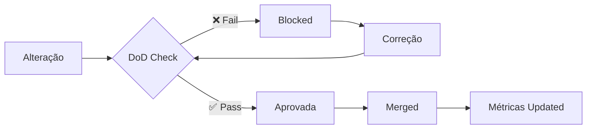
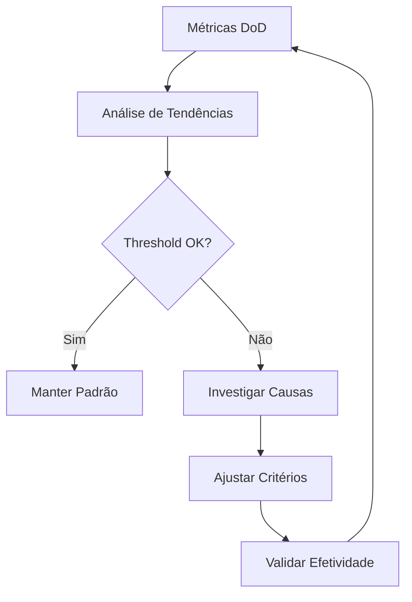

# Definition of Done (DoD) - Matrix Protocol

## 🎯 Visão Geral

O **Definition of Done (DoD)** é um checklist abrangente que garante qualidade sistemática antes da publicação de qualquer alteração na documentação Matrix Protocol. Este sistema foi desenvolvido através das **6 sprints de melhorias** e integra validação automatizada com oversight humano.

## ✅ Checklist Principal de DoD

### 📋 1. Estrutura e Metadados

```yaml
estrutura:
  frontmatter:
    - [ ] `title` presente e descritivo
    - [ ] `description` clara (≤150 caracteres)
    - [ ] `tags` conforme glossário validado
    - [ ] `framework` especificado quando aplicável
    - [ ] `maturity` definido (draft/beta/production)
    - [ ] `icon` apropriado para categoria
    - [ ] `lang` especificado (pt/en)
    - [ ] `last_updated` atualizado
    
  organizacao:
    - [ ] Seção "📖 Recursos Relacionados" quando aplicável
    - [ ] Hierarquia de headings lógica (H1→H2→H3)
    - [ ] English-only naming (kebab-case/snake_case)
    - [ ] Estrutura de pastas consistente
```

### 🔗 2. Conteúdo e Navegação

```yaml
conteudo:
  qualidade:
    - [ ] Conceitos Matrix Protocol precisos e consistentes
    - [ ] Exemplos práticos quando conceitual/técnico
    - [ ] Linguagem clara e objetiva
    - [ ] Terminologia padronizada
    
  navegacao:
    - [ ] Links internos funcionais (`localePath()` para bilíngues)
    - [ ] Referencias cruzadas apropriadas
    - [ ] Breadcrumbs conceituais quando hierárquico
    - [ ] Interlinks bidirecionais implementados
```

### 🌍 3. Harmonização Bilíngue

```yaml
bilinguismo:
  paridade:
    - [ ] Paridade PT↔EN ≥90% ou divergência documentada
    - [ ] Conceitos técnicos traduzidos consistentemente
    - [ ] Navegação funcional em ambos idiomas
    - [ ] Estrutura equivalente mantida
    
  divergencias:
    - [ ] Divergências justificadas documentadas
    - [ ] Notas de contexto quando necessário
    - [ ] Cross-references apropriados
```

### 🔧 4. Validação Técnica

```yaml
tecnica:
  build:
    - [ ] Build Nuxt 4.x successful sem warnings
    - [ ] Navegação dinâmica funcional
    - [ ] Performance mantida (bundle size)
    - [ ] Acessibilidade básica respeitada
    
  automacao:
    - [ ] Scripts de validação executados
    - [ ] Métricas de qualidade atualizadas
    - [ ] Links auditados e funcionais
```

## 🤖 Validação Automatizada

### Scripts de Verificação DoD

```bash
#!/bin/bash
# Sequência de validação automatizada DoD

echo "🔍 Executando validação DoD Matrix Protocol..."

# 1. Validação de frontmatter
node scripts/frontmatter-check.js --schema-validation
if [ $? -ne 0 ]; then
  echo "❌ Erro: Frontmatter não conforme"
  exit 1
fi

# 2. Auditoria de links
node scripts/link-integrity.js --full-audit
if [ $? -ne 0 ]; then
  echo "❌ Erro: Links quebrados detectados"
  exit 1
fi

# 3. Validação de nomenclatura
node scripts/naming-validator.js --english-only
if [ $? -ne 0 ]; then
  echo "❌ Erro: Violação de nomenclatura English-only"
  exit 1
fi

# 4. Build de validação
npm run build --validation-mode
if [ $? -ne 0 ]; then
  echo "❌ Erro: Build falhando"
  exit 1
fi

# 5. Métricas de qualidade
node scripts/quality-metrics.js --update-dod
if [ $? -ne 0 ]; then
  echo "❌ Erro: Métricas de qualidade fora do threshold"
  exit 1
fi

echo "✅ Validação DoD aprovada com sucesso!"
```

### Integração com Workflow

```yaml
# .github/workflows/dod-validation.yml
name: Matrix Protocol DoD Validation

on:
  pull_request:
    paths:
      - 'website/content/**'
      
jobs:
  dod-check:
    runs-on: ubuntu-latest
    steps:
      - name: Checkout
        uses: actions/checkout@v4
        
      - name: Setup Node.js
        uses: actions/setup-node@v4
        with:
          node-version: '18'
          
      - name: Install dependencies
        run: npm ci
        
      - name: Execute DoD Validation
        run: bash scripts/dod-validator.sh
        
      - name: Generate DoD Report
        run: node scripts/dod-report-generator.js
```

## 📊 Métricas de Conformidade DoD

### KPIs de Qualidade

```yaml
dod_metrics:
  structural_compliance:
    description: "% páginas com estrutura DoD completa"
    formula: "(páginas_dod_completas / total_páginas) * 100"
    target: "≥95%"
    current: "{{ dynamic_value }}"
    
  content_quality:
    description: "Score de qualidade de conteúdo"
    formula: "média(clareza + precisão + completude)"
    target: "≥4.0/5.0"
    current: "{{ dynamic_value }}"
    
  bilingual_parity:
    description: "% paridade PT↔EN"
    formula: "(conceitos_alinhados / total_conceitos) * 100"
    target: "≥90%"
    current: "{{ dynamic_value }}"
    
  technical_validation:
    description: "% builds successful sem warnings"
    formula: "(builds_success / total_builds) * 100"
    target: "100%"
    current: "{{ dynamic_value }}"
```

### Dashboard de Conformidade



## 🚨 Processo de Escalação

### Níveis de Aprovação

```yaml
approval_matrix:
  structural_issues:
    reviewer: "Editor de Documentação"
    escalation: "Maintainer Nuxt Content"
    
  technical_issues:
    reviewer: "Maintainer Nuxt Content"
    escalation: "Tech Lead"
    
  conceptual_issues:
    reviewer: "Engenheiro de Conhecimento"
    escalation: "Project Manager"
    
  emergency_exceptions:
    authority: "Tech Lead"
    documentation: "Obrigatória justificativa + prazo correção"
```

### Exceções Controladas

```markdown
> ⚠️ **Exceção DoD Aprovada**
> 
> **Justificativa**: [Motivo específico da exceção]
> **Aprovado por**: [Nome + cargo]
> **Prazo para correção**: [Data limite]
> **Tracking**: [Issue/task de acompanhamento]
```

## 📖 Templates Práticos

### Template para Nova Página

```yaml
# Checklist específico para criação de nova página
nova_pagina:
  pre_criacao:
    - [ ] Validar necessidade e posicionamento
    - [ ] Verificar estrutura de pastas apropriada
    - [ ] Definir relacionamentos conceituais
    
  durante_criacao:
    - [ ] Aplicar frontmatter completo
    - [ ] Implementar seção recursos relacionados
    - [ ] Criar versão bilíngue (se aplicável)
    
  pos_criacao:
    - [ ] Executar validação DoD automatizada
    - [ ] Testar navegação em ambos idiomas
    - [ ] Atualizar métricas de qualidade
```

### Template para Atualização de Conteúdo

```yaml
# Checklist específico para updates
atualizacao_conteudo:
  analise:
    - [ ] Verificar impacto em conceitos relacionados
    - [ ] Validar necessidade de atualização bilíngue
    - [ ] Revisar links e referencias afetados
    
  execucao:
    - [ ] Manter consistência conceitual
    - [ ] Atualizar `last_updated`
    - [ ] Preservar estrutura DoD existente
    
  validacao:
    - [ ] Confirmar builds funcionais
    - [ ] Verificar paridade mantida
    - [ ] Atualizar métricas afetadas
```

## 🔄 Manutenção Contínua do DoD

### Revisão Periódica

```yaml
revisao_dod:
  semanal:
    - Análise de métricas de conformidade
    - Identificação de padrões de falha
    - Ajustes em thresholds quando necessário
    
  mensal:
    - Revisão de efetividade do checklist
    - Coleta de feedback do time
    - Otimização de scripts automatizados
    
  trimestral:
    - Auditoria completa do sistema DoD
    - Benchmark com padrões da indústria
    - Evolução baseada em lessons learned
```

### Evolução Baseada em Dados



## 📖 Recursos Relacionados

### Matrix Protocol Frameworks
- [MEF - Matrix Embedding Framework](../../frameworks/mef) - Estruturação de conhecimento via UKIs
- [ZOF - Zion Orchestration Framework](../../frameworks/zof) - Orquestração de workflows epistemológicos
- [OIF - Operator Intelligence Framework](../../frameworks/oif) - Archetypes de IA para execução

### Documentação Relacionada
- [Feedback Loop e Métricas](./feedback-loop) - Sistema de monitoramento contínuo
- [Explicabilidade](./explainability) - Templates de justificativas e transparência
- [Validação e Checklists](./validation-checklists) - Outros sistemas de qualidade

### Ferramentas de Validação
- [Content Audit](./content-audit) - Scripts de auditoria automatizada
- [UKI Templates](./uki-templates) - Templates para criação de UKIs
- [MOC Generation](./moc-generation) - Ferramentas de geração de ontologias

---

> ✅ **DoD Matrix Protocol** - Sistema abrangente de qualidade que garante excelência sistemática, manutenibilidade sustentável e conformidade com princípios epistemológicos Matrix Protocol em toda alteração da documentação.