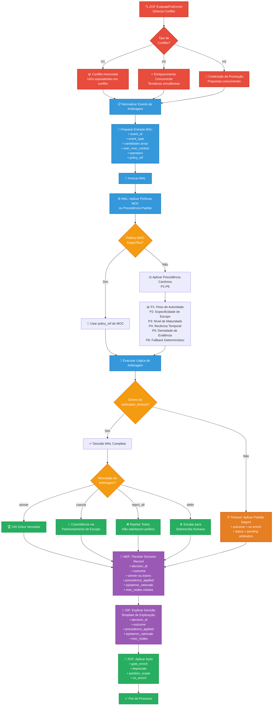

# MAL — Matrix Arbiter Layer
**Acrônimo:** MAL  
**Versão:** 0.0.1  
**Status:** Ativo  
**Data:** 2025-10-05

> "Na ausência de conflito, a sabedoria permanece não testada." — Provérbio Antigo

---

## 1. Introdução

A **Matrix Arbiter Layer (MAL)** é a camada de arbitragem de conflitos e concorrência do protocolo que opera como autoridade final de tomada de decisão quando regras de governança locais não conseguem resolver conflitos complexos.

A MAL é invocada **apenas** quando regras locais (filtragem de escopo, validação de autoridade, EvaluateForEnrich) não conseguem resolver três tipos específicos de conflito: conflitos horizontais entre UKIs equivalentes, tentativas de enriquecimento concorrente e contenções de promoção.

A MAL não substitui MOC, ZOF, OIF ou MEF; ela fornece tomada de decisão determinística, então delega explicação ao OIF e persistência ao MEF enquanto respeita políticas configuradas no MOC.

---

## 2. Termos e Definições

- **Evento de Arbitragem**: Entrada normalizada descrevendo uma condição de conflito ou concorrência que requer decisão MAL
- **Registro de Decisão**: Resultado assinado e imutável com designação de vencedor/perdedor, justificativa e referências
- **Política de Precedência**: Regras de desempate ordenadas configuradas no MOC com padrões fornecidos pela MAL
- **Conflito Horizontal (H1)**: Dois ou mais UKIs de nível de escopo equivalente que entram em conflito semanticamente
- **Enriquecimento Concorrente (H2)**: Dois ou mais fluxos tentando enriquecer semânticas sobrepostas simultaneamente
- **Contenção de Promoção (H3)**: Propostas concorrentes para promover UKIs distintos a nível de governança superior

Referências adicionais no **MOC (Matrix Ontology Catalog)** para políticas de arbitragem organizacionais específicas.

---

## 3. Conceitos Centrais

### Princípio No-Op
A MAL opera como uma camada de arbitragem de último recurso. Se regras de escopo/autoridade podem resolver conflitos localmente através de validação padrão MOC, a MAL NÃO DEVE ser invocada.

### Tomada de Decisão Determinística
Dados entradas idênticas e configuração de política, a MAL DEVE produzir decisões consistentes e reproduzíveis em todas as invocações para garantir previsibilidade do sistema.

### Integração de Justificativa Epistêmica
Toda decisão MAL DEVE incluir justificação epistemológica alinhada com princípios MEP, referenciando nós específicos do MOC e fornecendo raciocínio rastreável.

### Auditabilidade e Transparência
Todas as decisões de arbitragem DEVEM ser persistidas como Registros de Decisão imutáveis com rastreabilidade completa aos UKIs de entrada, políticas MOC e cadeias de raciocínio.

### Experiência de Usuário Não-Bloqueante
Se a MAL não puder decidir dentro do arbitration_timeout configurado, o ZOF DEVE aplicar o resultado padrão seguro:
- Outcome = no enrich
- Status = pending arbitration

O OIF DEVE notificar o usuário que a arbitragem está pendente, incluindo instruções de escalação do MOC se disponíveis.

### Fluxo de Arbitragem MAL - Processo Completo



---

## 4. Regras Normativas

> ⚠️ Esta seção é **normativa**.

### Condições de Invocação Obrigatórias
O ZOF DEVE invocar a MAL quando detectar tipos de conflito H1, H2 ou H3 após completar o checkpoint EvaluateForEnrich e tentativas de resolução local falharam.

### Fronteiras de Autoridade de Arbitragem
- A MAL DEVE tomar decisões finais sobre conflitos dentro de seu escopo
- A MAL NÃO DEVE comunicar resultados diretamente aos usuários
- O OIF NÃO DEVE tentar arbitragem; DEVE apenas explicar resultados da MAL
- O OIF DEVE renderizar todos os resultados MAL usando um Template de Explicação de Arbitragem que inclua pelo menos:
  - decision_id
  - outcome
  - winner/losers (se aplicável)
  - precedence_applied
  - epistemic_rationale com moc_nodes citados
- O MEF DEVE persistir todas as decisões MAL como Registros de Decisão imutáveis
- O MOC DEVE fornecer configuração de política mas NÃO DEVE sobrescrever decisões MAL

### Requisitos de Entrada Normalizada
Todo Evento de Arbitragem DEVE conter:
- **event_id**: Identificador único para a solicitação de arbitragem
- **event_type**: Um de {H1, H2, H3} indicando classificação do conflito
- **candidates[]**: Array de referências UKI conflitantes com metadados completos
- **user_moc_context**: Claims hierárquicos e níveis de autoridade do usuário
- **operation**: Tipo de operação solicitada (read/enrich/promote)
- **policy_ref**: Referência opcional a política de arbitragem MOC específica

### Hierarquia de Política de Precedência

A MAL DEVE aplicar regras de precedência conforme configurado no MOC.

Se policy_ref for fornecido no Evento de Arbitragem, a MAL DEVE resolver usando a política referenciada do MOC.

Se ausente, a MAL PODE usar sua precedência padrão canônica (P1–P6).

Organizações DEVEM sempre configurar políticas de arbitragem no MOC para sobrescrever padrões.

Ordem de precedência padrão canônica:
1. **P1 Peso de Autoridade**: Nó de autoridade superior na hierarquia MOC vence
2. **P2 Especificidade de Escopo**: Escopo mais específico vence para instruções locais; escopo mais amplo vence para regras globais obrigatórias
3. **P3 Nível de Maturidade**: validated > endorsed > draft/experimental
4. **P4 Recência Temporal**: Versão mais recente vence se não violar regras de ciclo de vida
5. **P5 Densidade de Evidência**: UKI com mais links de evidência MEF e referências
6. **P6 Fallback Determinístico**: Comparação lexicográfica de identificador UKI

### Resultados de Decisão
A MAL DEVE produzir um de quatro resultados:
- **winner**: UKI único escolhido como autoritativo
- **coexist**: Múltiplos UKIs válidos através de particionamento de escopo
- **reject_all**: Nenhum satisfaz requisitos de política
- **defer**: Requer sobrescrita humana ou escalação

### Requisitos de Persistência e Comunicação

A MAL NÃO DEVE introduzir termos ontológicos fora do MOC.

Todos os resultados devem referenciar campos de ontologia existentes:
- scope_ref (particionamento)
- authority_ref (hierarquia de autoridade)
- lifecycle_ref (regras de promoção/depreciação)

Relacionamentos (conflicts_with, supersedes) DEVEM ser persistidos no MEF, sempre citando referências MOC.

- O MEF DEVE armazenar Registros de Decisão com relacionamentos de conflito usando termos ontológicos MOC
- O OIF DEVE receber mensagens estruturadas para explicar decisões usando Templates de Explicação de Arbitragem
- Templates de Explicação de Arbitragem DEVEM incluir campos mínimos obrigatórios: decision_id, outcome, winner/losers, precedence_applied, epistemic_rationale com moc_nodes citados
- Todas as decisões DEVEM incluir justificativa epistêmica referenciando nós MOC e evidência MEF

### Restrições de Tempo e Consistência
- A MAL DEVE completar arbitragem dentro de arbitration_timeout configurado no MOC
- Se a MAL não puder decidir dentro do arbitration_timeout configurado, o ZOF DEVE aplicar o resultado padrão seguro:
  - Outcome = no enrich
  - Status = pending arbitration
- O OIF DEVE notificar o usuário que a arbitragem está pendente, incluindo instruções de escalação do MOC se disponíveis
- Registros de Decisão DEVEM ser imutáveis uma vez persistidos

---

## 5. Interoperabilidade

- **MEF (Matrix Embedding Framework)**: Persiste Registros de Decisão como trilha de auditoria imutável
- **ZOF (Zion Orchestration Framework)**: Detecta condições H1/H2/H3 e invoca MAL com Eventos de Arbitragem
- **OIF (Operator Intelligence Framework)**: Renderiza decisões MAL aos usuários via templates de Explicação de Arbitragem
- **MOC (Matrix Ontology Catalog)**: Fornece políticas de arbitragem e configuração de regras de precedência
- **MEP (Matrix Epistemic Principle)**: Orienta geração de justificativa epistêmica e garante princípios de autoridade derivada

---

## 6. Convenções e Exemplos

Todos os exemplos neste documento são **meramente ilustrativos** e não definem comportamento normativo.  
A semântica normativa (escopos, governança, arquétipos, critérios de enriquecimento) é sempre derivada do **MOC (Matrix Ontology Catalog)** de cada organização.  
Os exemplos são fornecidos para fins de clareza e PODEM ser adaptados aos contextos locais, mas NÃO DEVEM ser tratados como obrigações no nível do protocolo.

---

## 7. Exemplos Ilustrativos (Apêndice)

> **Exemplo (Informativo, Dependente do MOC)**

### **Arbitragem de Conflito Horizontal (H1)**
```yaml
# --- Exemplo Ilustrativo ---
arbitration_event:
  event_id: "mal-evt-20250826-001"
  event_type: "H1"
  conflict_description: "Duas regras de segurança de escopo equivalente em conflito"
  
  candidates:
    - uki_ref: "uki:squad-x:rule:retencao-dados-30d"
      scope_ref: "squad-x"
      domain_ref: "security"
      type_ref: "rule"
      maturity_level: "validated"
      version: "1.2.0"
      evidence_refs: ["uki:org:policy:lgpd-compliance", "doc:logs-auditoria-2024"]
    
    - uki_ref: "uki:squad-x:rule:retencao-dados-7d"
      scope_ref: "squad-x"
      domain_ref: "security"
      type_ref: "rule"
      maturity_level: "endorsed"
      version: "2.0.0"
      evidence_refs: ["uki:org:policy:minimizacao-dados"]
  
  user_moc_context:
    scopes: ["squad-x", "tribe-alpha", "organization"]
    authority_level: "squad_lead"
  
  operation: "enrich"

decision_record:
  decision_id: "mal-dec-20250826-h1-001"
  outcome: "winner"
  
  winner: "uki:squad-x:rule:retencao-dados-30d"
  losers: ["uki:squad-x:rule:retencao-dados-7d"]
  
  precedence_applied:
    - "P3_maturity": "validated > endorsed"
    - "P5_evidence": "Conformidade LGPD supera minimização de dados em contexto de segurança"
  
  epistemic_rationale:
    summary: "Maturidade validada e evidência regulatória mais forte"
    reasoning: |
      Enquanto ambos UKIs operam em escopo equivalente de squad, a regra de
      retenção de 30 dias demonstra maior maturidade epistemológica e evidência
      regulatória mais forte ligada aos requisitos de conformidade LGPD.
```

### **Arbitragem de Enriquecimento Concorrente (H2)**
```yaml
# --- Exemplo Ilustrativo ---
arbitration_event:
  event_id: "mal-evt-20250826-002"
  event_type: "H2"
  conflict_description: "Tentativas simultâneas de enriquecimento em padrões de autenticação"

decision_record:
  decision_id: "mal-dec-20250826-h2-001"
  outcome: "winner"
  
  precedence_applied:
    - "P1_authority": "tech_lead > developer"
  
  actions:
    - "allow_enrich:zof-auth-jwt-implementation-002"
    - "defer_enrich:zof-auth-jwt-implementation-001"
  
  epistemic_rationale:
    summary: "Precedência de autoridade superior em cenário concorrente"
```

### **Arbitragem de Contenção de Promoção (H3)**
```yaml
# --- Exemplo Ilustrativo ---
arbitration_event:
  event_id: "mal-evt-20250826-003"
  event_type: "H3"
  conflict_description: "Propostas de promoção concorrentes ao nível organizacional"

decision_record:
  decision_id: "mal-dec-20250826-h3-001"
  outcome: "winner"
  
  winner: "uki:tribe-alpha:guideline:padrao-code-review"
  
  precedence_applied:
    - "P1_authority": "tribe_lead > squad_lead para promoções org-level"
    - "P2_scope": "nível tribe mais próximo ao org-level que squad-level"
    - "P5_evidence": "Auditoria de conformidade externa tem peso maior"
  
  epistemic_rationale:
    summary: "Convergência de autoridade, proximidade de escopo e evidência de conformidade"
```

---

## 8. Interfaces Mínimas MAL (Normativo)

### Schema de Entrada de Evento de Arbitragem
```yaml
# --- Interface Normativa ---
arbitration_event:
  event_id: string                    # Obrigatório: Identificador único de arbitragem
  event_type: enum[H1, H2, H3]        # Obrigatório: Classificação do conflito
  timestamp: ISO8601                  # Obrigatório: Timestamp de criação do evento
  
  candidates: array                   # Obrigatório: Entidades conflitantes
    - uki_ref: string                 # Identificador UKI
      scope_ref: string               # Referência de escopo MOC
      domain_ref: string              # Referência de domínio MOC
      maturity_level: string          # Classificação de maturidade
      evidence_refs: array[string]    # Referências de evidência suporte
  
  user_moc_context:                   # Obrigatório: Contexto do usuário
    scopes: array[string]             # Hierarquia de escopo do usuário
    authority_level: string           # Designação de autoridade do usuário
  
  operation: enum[read, enrich, promote]  # Obrigatório: Operação solicitada
  policy_ref: string                  # Opcional: Política de arbitragem específica
```

### Schema de Saída de Registro de Decisão
```yaml
# --- Interface Normativa ---
decision_record:
  decision_id: string                 # Obrigatório: Identificador único da decisão
  event_ref: string                   # Obrigatório: Referência ao evento de arbitragem
  outcome: enum[winner, coexist, reject_all, defer]  # Obrigatório: Resultado da decisão
  
  winner: string                      # Condicional: UKI escolhido (se outcome=winner)
  precedence_applied: array           # Obrigatório: Regras de precedência aplicadas
  
  epistemic_rationale:                # Obrigatório: Explicação alinhada ao MEP
    summary: string                   # Justificativa breve da decisão
    reasoning: string                 # Explicação detalhada
    references:
      moc_nodes: array[string]        # Nós MOC referenciados
      mef_evidence: array[string]     # Evidência MEF referenciada
  
  audit:                              # Obrigatório: Informações de auditoria
    decided_at: ISO8601               # Timestamp da decisão
    decided_by: string                # Identificador da versão MAL
    timeout_used_ms: integer          # Tempo de processamento usado
```

---

## 9. Referências Cruzadas

- [Matrix Protocol — Especificação Principal](protocol)
- [Matrix Protocol Glossário](glossary)
- [MEF — Matrix Embedding Framework](frameworks/mef)  
- [ZOF — Zion Orchestration Framework](frameworks/zof)  
- [OIF — Operator Intelligence Framework](frameworks/oif)  
- [MOC — Matrix Ontology Catalog](frameworks/moc)  
- [MEP — Matrix Epistemic Principle](mep)  
