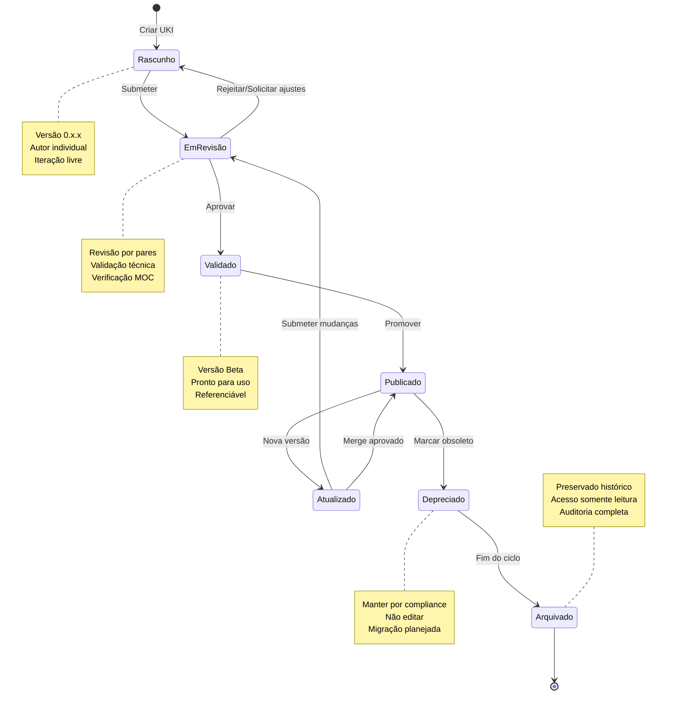

# MEF — Matrix Embedding Framework
**Acrônimo:** MEF  
**Versão:** 0.0.1-beta  
**Data:** 2025-10-05

---

## 1. Introdução

O **Matrix Embedding Framework (MEF)** especifica de forma integral, padronizada e internacionalizada a estrutura mínima e completa de conhecimento embebido versionado a ser utilizada por pessoas e agentes inteligentes no contexto do Protocolo Matrix.

O MEF define um **modelo padronizado de estruturação do conhecimento versionado** que permite que qualquer membro de um time multidisciplinar possa criar, registrar, interligar e utilizar unidades mínimas de conhecimento — chamadas de **UKIs (Units of Knowledge Interlinked)**.

---

## 2. Termos e Definições

- **UKI**: Units of Knowledge Interlinked - unidades básicas do conhecimento estruturado
- **Versionamento Semântico**: Controle de versão seguindo padrão MAJOR.MINOR.PATCH
- **Relacionamentos Ontológicos**: Conexões tipadas entre UKIs (depends_on, overrides, etc.)
- **Promoção de Conhecimento**: Processo formal de elevação de escopo ou maturidade
- **Campos *_ref**: Campos que referenciam nós definidos no MOC organizacional

---

## 3. Conceitos Centrais

### Estrutura UKI
Cada UKI é um arquivo YAML estruturado contendo:
- **Metadados obrigatórios**: id, título, versão, datas
- **Referências MOC**: scope_ref, domain_ref, type_ref, maturity_ref
- **Conteúdo**: Conhecimento estruturado específico
- **Relacionamentos**: Conexões tipadas com outras UKIs
- **Controle de vida**: Status e gestão de ciclo de vida

### Integração MOC
- **Campos *_ref**: Fazem referência a nós definidos no MOC organizacional
- **Flexibilidade Local**: Organizações configuram hierarquias mantendo estrutura universal
- **Governança Integrada**: MOC define regras de autoridade e visibilidade

### Orientação MEP
- **Estratificação**: Campo maturity_ref reflete níveis epistemológicos
- **Promoção Responsável**: Campo promotion_rationale documenta justificativas
- **Autoridade Derivada**: Campos scope_ref e governance_ref implementam autoridade contextual

---

## 4. Regras Normativas

> ⚠️ Esta seção é **normativa**.

### Estrutura UKI Obrigatória
Toda UKI DEVE conter:
- **id**: Identificador único no formato uki:[domain_ref]:[type_ref]:[slug]
- **title**: Título descritivo e objetivo
- **version**: Versionamento semântico MAJOR.MINOR.PATCH
- **scope_ref, domain_ref, type_ref**: Referências válidas ao MOC organizacional
- **created_date, last_modified**: Datas de criação e modificação
- **status**: Estado do ciclo de vida (active, deprecated, archived)

### Versionamento Obrigatório
- DEVE seguir padrão semântico MAJOR.MINOR.PATCH
- DEVE incluir change_summary para versões posteriores à inicial
- DEVE referenciar previous_version quando aplicável
- DEVE classificar change_impact (major, minor, patch)

### Relacionamentos Obrigatórios
- DEVE usar tipos padronizados: depends_on, overrides, conflicts_with, complements, amends, precedes, equivalent_to
- DEVE incluir description específica para cada relacionamento
- DEVE referenciar UKIs válidas no formato correto

### Persistência de Decision Record (Integração MAL)
- Implementações MEF DEVEM persistir Decision Records MAL como trilha de auditoria imutável
- Decision Records DEVEM ser armazenados com metadados completos de arbitragem
- UKIs resultantes de arbitragem MAL DEVEM referenciar o Decision Record correspondente
- Relacionamentos de Decision Record (conflicts_with, supersedes, partitioned_by_scope) DEVEM ser mantidos
- Decision Records NÃO DEVEM ser modificáveis após criação

---

## 5. Interoperabilidade

- **MOC (Matrix Ontology Catalog)**: Define taxonomias organizacionais referenciadas pelos campos *_ref
- **MEP (Matrix Epistemic Principle)**: Fornece fundamentos epistemológicos para versionamento e promoção
- **ZOF (Zion Orchestration Framework)**: Consome UKIs durante workflows e checkpoint EvaluateForEnrich
- **OIF (Operator Intelligence Framework)**: Utiliza UKIs para alimentar arquétipos de inteligência

---

## 5. Ciclo de Vida das UKIs

### Estados Canônicos

O MEF define um modelo padronizado para o ciclo de vida das UKIs, garantindo controle de qualidade e governança do conhecimento organizacional.



### Transições de Estado

#### Rascunho → Em Revisão
- **Gatilho**: Submissão formal pelo autor
- **Validações**: Estrutura YAML válida, referências MOC corretas
- **Autoridade**: Autor da UKI

#### Em Revisão → Validado  
- **Gatilho**: Aprovação por revisores designados
- **Validações**: Conteúdo tecnicamente correto, alinhamento estratégico
- **Autoridade**: Definida pelo MOC organizacional (scope_ref)

#### Validado → Publicado
- **Gatilho**: Promoção pelo responsável de domínio
- **Validações**: Impacto organizacional avaliado, dependências resolvidas
- **Autoridade**: domain_ref + maturity_ref no MOC

#### Publicado → Depreciado
- **Gatilho**: Conhecimento obsoleto ou substituído
- **Validações**: Plano de migração, UKIs dependentes notificadas
- **Autoridade**: Mesma do estado Publicado

### Regras de Versionamento por Estado

- **Rascunho**: 0.x.x (incremento livre)
- **Em Revisão**: 0.x.x (congelado durante revisão)
- **Validado**: Beta (primeira versão estável)
- **Publicado**: 1.x.x, 2.x.x... (versionamento semântico)
- **Depreciado**: Versão congelada
- **Arquivado**: Versão final preservada

---

## 6. Convenções e Exemplos

Todos os exemplos neste documento são **meramente ilustrativos** e não definem comportamento normativo.  
A semântica normativa (escopos, governança, arquétipos, critérios de enriquecimento) é sempre derivada do **MOC (Matrix Ontology Catalog)** de cada organização.  
Os exemplos são fornecidos para fins de clareza e PODEM ser adaptados aos contextos locais, mas NÃO DEVEM ser tratados como obrigações no nível do protocolo.

---

## 7. Exemplos Ilustrativos (Apêndice)

> **Exemplo (Informativo, Dependente do MOC)**

### **Estrutura Padrão UKI**
```yaml
# --- Exemplo Ilustrativo ---
schema: "1.0"
ontology_reference: "Ontology_MEF_Support v1.0"
version: "0.0.1"

id: uki:technical:pattern:jwt-authentication  # EXEMPLO
title: "Padrão de Autenticação JWT"
scope_ref: "team"           # Referência ao MOC
domain_ref: "technical"     # Referência ao MOC
type_ref: "pattern"         # Referência ao MOC
maturity_ref: "validated"   # Referência ao MOC
created_date: 2025-01-25
last_modified: 2025-01-25
status: active

content: |
  Implementação padronizada de autenticação JWT
  seguindo boas práticas de segurança...

relationships:
  - type: depends_on
    target: uki:technical:constraint:security-requirements
    description: "Implementa requisitos de segurança definidos"
```

### **Promoção de Conhecimento**
```yaml
# --- Exemplo Ilustrativo ---
promotion:
  is_promoted_from: uki:technical:example:local-auth-impl
  promotion_rationale: |
    Solução demonstrou valor em múltiplos projetos
    e foi validada por arquitetos de segurança.
    Promovida para padrão organizacional.

impact_analysis:
  severity: medium
  affected_domains: ["technical", "security"]
  propagation_estimate: 15
```

### **Relacionamentos Ontológicos**
```yaml
# --- Exemplo Ilustrativo ---
relationships:
  - type: depends_on
    target: uki:business:rule:authentication-policy
    description: "Implementa política de autenticação organizacional"
  
  - type: overrides
    target: uki:technical:pattern:basic-auth-deprecated
    description: "Substitui padrão de autenticação básica obsoleto"
  
  - type: complements
    target: uki:technical:pattern:authorization-rbac
    description: "Trabalha em conjunto com autorização baseada em papéis"
```

---

## 8. Referências Cruzadas

- [MOC — Matrix Ontology Catalog](frameworks/moc)  
- [MEP — Matrix Epistemic Principle](mep)  
- [ZOF — Zion Orchestration Framework](frameworks/zof)  
- [OIF — Operator Intelligence Framework](frameworks/oif)  
