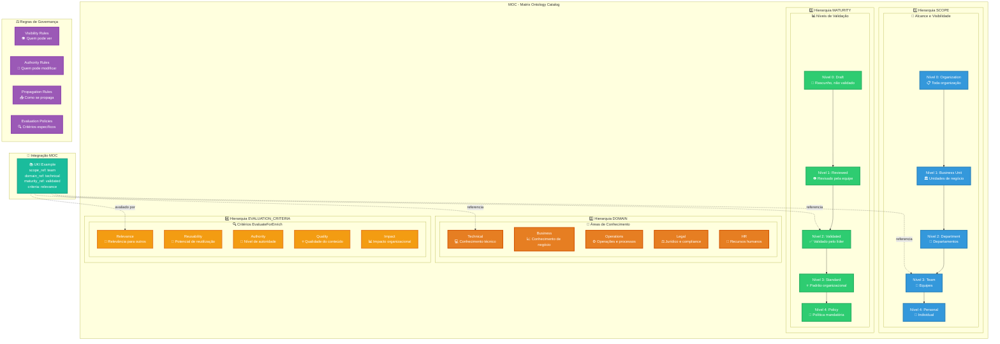
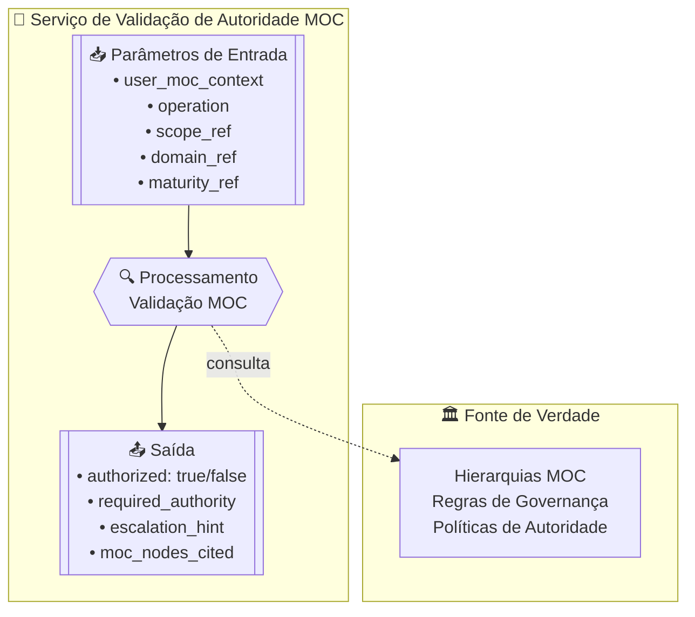

# MOC — Matrix Ontology Catalog
**Acrônimo:** MOC  
**Versão:** 0.0.1-beta  
**Data:** 2025-10-05

> 🚨 **AVISO IMPORTANTE**: Este documento contém EXEMPLOS ILUSTRATIVOS (como `technical`, `business`, `draft`, etc.) que NÃO são taxonomias obrigatórias. Cada organização define suas próprias hierarquias conforme suas necessidades específicas. Exemplos servem apenas como referência conceitual.

> "A flexibilidade local preserva a coerência global."

---

## 1. Introdução

O **Matrix Ontology Catalog (MOC)** é o componente fundamental que permite ao Protocolo Matrix separar conceitos centrais universais de taxonomias e estruturas organizacionais específicas.

O MOC define **hierarquias configuráveis** para qualquer conceito que dependa de estruturas organizacionais, mantendo consistência conceitual global enquanto permite adaptabilidade local total.

O MOC atua como o sistema de governança e configuração que permite diferentes organizações adaptarem o Protocolo Matrix às suas estruturas específicas sem perder a interoperabilidade conceitual.

---

## 2. Termos e Definições

- **Conceitos Centrais**: Elementos universais fixos do protocolo (scope, domain, maturity)
- **Taxonomias Locais**: Estruturas hierárquicas específicas definidas por cada organização
- **Hierarquias Configuráveis**: Sistemas de classificação adaptáveis às necessidades organizacionais
- **Nós MOC**: Elementos individuais dentro de uma hierarquia (ex: "team", "technical", "draft")
- **Governança Organizacional**: Regras de autoridade, visibilidade e propagação específicas

Referências adicionais no **MOC organizacional** para definições ontológicas específicas.

---

## 3. Conceitos Centrais

### Separação Conceitual Fundamental

**Conceitos Centrais (Universais)**
- Fixos e imutáveis em todas as implementações
- Exemplos: escopo, domínio, maturidade, propagação, checkpoints de fluxo
- Definidos pelo Protocolo Matrix

**Taxonomias Locais (Configuráveis)**
- Definidas pelo implementador no MOC
- Exemplos: nomes específicos de escopos, estrutura de domínios, papéis organizacionais
- Adaptáveis ao contexto organizacional

### Hierarquias Semânticas Configuráveis

Todo conceito hierárquico deve:
- Ser definido conceitualmente pelo protocolo
- Ter sua hierarquia concreta fornecida pelo MOC
- Permitir reorganização sem quebrar MEF, ZOF ou OIF
- Manter relacionamentos semânticos estáveis

### Princípio da Flexibilidade Local
O MOC garante que estruturas organizacionais específicas não conflitem com a interoperabilidade conceitual do protocolo, permitindo adaptação total mantendo coerência global.

---

## 4. Regras Normativas

> ⚠️ Esta seção é **normativa**.

### Estrutura Obrigatória do MOC
Todo MOC organizacional DEVE conter:
1. **Metadados de versão**: versão, organização, datas de criação/modificação
2. **Hierarquias mínimas**: scope, domain, maturity, evaluation_criteria
3. **Regras de governança**: controle de versão, auditoria, resolução de conflitos
4. **Nós com metadados completos**: id, label, parent, level, governance

### Hierarquias Obrigatórias
- **scope**: DEVE definir alcance e visibilidade do conhecimento
- **domain**: DEVE definir áreas de conhecimento e especialização  
- **maturity**: DEVE definir níveis de validação e confiabilidade
- **evaluation_criteria**: DEVE definir critérios para checkpoint EvaluateForEnrich

### Estrutura das Quatro Hierarquias MOC



### Regras de Integridade
- Nós DEVEM ter identificadores únicos dentro de cada hierarquia
- Relacionamentos parent-child DEVEM ser consistentes
- Níveis hierárquicos DEVEM ser sequenciais (0, 1, 2...)
- Regras de governança DEVEM ser definidas para todos os nós

### Controle de Mudanças
- Alterações no MOC DEVEM ser versionadas
- Impacto em UKIs dependentes DEVE ser analisado
- Aprovação por autoridade competente DEVE ser obrigatória
- Notificações automáticas DEVEM ser enviadas para afetados

### 🔐 Serviço de Validação de Autoridade (Normativo)



O **MOC (Matrix Ontology Catalog)** é a referência canônica para **validação de autoridade** no Protocolo Matrix.  
Esse serviço não executa decisões ou orquestrações (papel do ZOF/OIF), mas define as **regras e ontologia** necessárias para validar se um usuário PODE realizar determinada operação.

#### Interface do Serviço
- **Parâmetros de entrada**:  
  - `user_moc_context` (contexto hierárquico: escopo, domínio, níveis de autoridade)  
  - `operation` (read, enrich, promote, create, update, delete)  
  - `scope_ref` (escopo do conhecimento alvo)  
  - `domain_ref` (domínio do conhecimento alvo)  
  - `type_ref` (tipo do conhecimento alvo: rule, procedure, policy, etc.)  
  - `maturity_ref` (nível de maturidade do conhecimento alvo)  

- **Saída**:  
  - `authorized: true|false` (resultado da autorização)  
  - `required_authority` (nó ou nível esperado para autorização)  
  - `escalation_hint` (possível nó de autoridade superior para delegação/override)  
  - `moc_nodes_cited` (nós específicos do MOC usados na decisão de validação)

#### Requisitos de Integração com Frameworks
- O **ZOF** DEVE consumir este serviço antes do enriquecimento (checkpoint EvaluateForEnrich)  
- O **OIF** DEVE explicar decisões de validação aos usuários, citando nós relevantes do MOC  
- O **MEF** DEVE validar autoridade de criação de UKI via este serviço antes de persistir conhecimento

### 🔄 Gestão de Ciclo de Vida (Normativo)

O MOC DEVE fornecer configuração para gestão de ciclo de vida do conhecimento para garantir governança temporal adequada dos UKIs.

#### Configuração de Ciclo de Vida
```yaml
# --- Configuração Normativa ---
lifecycle_management:
  default_lifecycle_policies:
    quarterly_review:                       # EXEMPLO - dependente da organização
      review_frequency_days: 90
      auto_reminder: true
      required_stakeholders: ["domain_owner", "content_author"]
      evaluation_criteria: ["accuracy", "relevance", "completeness"]
      
    annual_validation:                      # EXEMPLO - dependente da organização
      review_frequency_days: 365
      mandatory_revalidation: true
      required_evidence: ["usage_metrics", "stakeholder_feedback"]
      escalation_required: false
      
    sunset_after_2y:                       # EXEMPLO - dependente da organização
      deprecation_warning_days: 60
      final_removal_days: 730
      migration_plan_required: true
      alternative_uki_required: true
      stakeholder_notification: true
      
    continuous_monitoring:                  # EXEMPLO - dependente da organização
      monitoring_frequency_days: 30
      automated_validation: true
      threshold_triggers: ["low_usage", "conflict_frequency", "promotion_patterns"]
      
  lifecycle_transition_rules:
    draft_to_validated:
      lifecycle_change_allowed: true
      authority_escalation: false
      review_period_extension: true
      
    validated_to_deprecated:
      lifecycle_change_allowed: true
      authority_escalation: true
      mandatory_migration_plan: true
      stakeholder_approval_required: true
      
  governance_integration:
    moc_authority_validation: true          # Valida mudanças de ciclo via autoridade MOC
    mal_arbitration_lifecycle: true         # Considera ciclo de vida na arbitragem MAL
    promotion_lifecycle_impact: true       # Analisa impacto do ciclo nas promoções
```

#### Requisitos de Integração de Ciclo de Vida
- **Integração MEF**: Todos os UKIs DEVEM referenciar políticas organizacionais de ciclo de vida via lifecycle_ref
- **Integração MAL**: Status do ciclo de vida DEVE ser considerado em decisões de arbitragem
- **Integração ZOF**: Políticas de ciclo de vida DEVEM ser avaliadas durante o checkpoint EvaluateForEnrich
- **Integração OIF**: Status do ciclo de vida DEVE ser comunicado aos usuários nas explicações

> **Importante**: Os exemplos de ciclo de vida acima (`quarterly_review`, `sunset_after_2y`, etc.) são **meramente ilustrativos**. Cada organização define suas próprias políticas de ciclo de vida de acordo com necessidades específicas de governança, mantendo os requisitos estruturais do MOC.

### ⚖️ Configuração de Políticas de Arbitragem (Integração MAL)

Implementações MOC DEVEM fornecer configuração para políticas de arbitragem MAL para garantir resolução consistente de conflitos.

⚠️ **REQUISITO OBRIGATÓRIO**: Esta seção é **OBRIGATÓRIA** para todas as implementações MOC. Organizações DEVEM configurar políticas de arbitragem para garantir resolução determinística de conflitos e prevenir divergências de interpretação.

#### Configuração Obrigatória de Arbitragem
```yaml
# --- Configuração Normativa ---
arbitration_policies:
  default_precedence_order:           # Ordem padrão P1-P6 (MAL pode sobrepor)
    - "P1_authority_weight"           # Maior peso de autoridade MOC vence
    - "P2_scope_specificity"          # Precedência de escopo dependente do contexto
    - "P3_maturity_level"             # validated > endorsed > draft
    - "P4_temporal_recency"           # Mais recente vence (respeitando ciclo de vida)
    - "P5_evidence_density"           # Mais evidências/referências MEF vence
    - "P6_deterministic_fallback"     # Identificador UKI lexicográfico
  
  scope_specificity_rules:            # Configuração P2
    local_instructions:               # squad > tribe > org para orientações locais
      precedence_order: ["squad", "tribe", "organization"]
    mandatory_rules:                  # org > tribe > squad para políticas obrigatórias
      precedence_order: ["organization", "tribe", "squad"]
    context_mapping:
      - types: ["guideline", "example", "template"]
        rule: "local_instructions"
      - types: ["policy", "constraint", "decision"]  
        rule: "mandatory_rules"
  
  authority_weight_mapping:           # Configuração P1
    hierarchical_levels:
      - level: "organization"
        weight: 1000
        authorities: ["cto", "architecture_committee"]
      - level: "tribe"  
        weight: 500
        authorities: ["tribe_lead", "senior_architect"]
      - level: "squad"
        weight: 100
        authorities: ["squad_lead", "tech_lead", "developer"]
  
  arbitration_timeout: 2000           # Milissegundos para decisão MAL
  
  conflict_type_policies:             # Políticas específicas por tipo de conflito
    H1_horizontal_conflicts:
      enable_coexistence: true        # Permitir particionamento de escopo
      require_deprecation: false      # Não forçar winner-take-all
    H2_concurrent_enrichment:
      temporal_threshold_ms: 30000    # Considerar concorrente se dentro de 30s
      authority_precedence: true      # Maior autoridade vence em cenário concorrente
    H3_promotion_contention:
      evidence_weight_multiplier: 1.5 # Evidência externa recebe peso extra
      cross_scope_validation: true    # Validar promoção além dos limites de escopo
```

#### Exemplos de Políticas de Arbitragem Nomeadas
```yaml
# --- Exemplos de Políticas Organizacionais ---
named_arbitration_policies:
  "moc:arbitration:security_conflicts":
    description: "Precedência de alta autoridade para conhecimento crítico de segurança"
    precedence_order:
      - "P1_authority_weight"         # Segurança requer maior autoridade primeiro
      - "P3_maturity_level"           # Conhecimento de segurança validado priorizado
      - "P2_scope_specificity"        # Segurança organizacional sobre local
      - "P4_temporal_recency"
      - "P5_evidence_density"
      - "P6_deterministic_fallback"
    authority_weight_multiplier: 2.0  # Peso dobrado para autoridades de segurança
    maturity_minimum_required: "validated"
    
  "moc:arbitration:concurrent_enrichment":
    description: "Resolução temporal e baseada em autoridade para atualizações concorrentes"
    precedence_order:
      - "P4_temporal_recency"         # Mais recente vence em cenários concorrentes
      - "P1_authority_weight"         # Então maior autoridade
      - "P3_maturity_level"
      - "P2_scope_specificity"
      - "P5_evidence_density"
      - "P6_deterministic_fallback"
    temporal_window_ms: 30000         # Janela de concorrência de 30 segundos
    authority_tiebreaker: true
    
  "moc:arbitration:promotion_contention":
    description: "Avaliação com foco em evidências para conflitos de promoção de conhecimento"
    precedence_order:
      - "P5_evidence_density"         # Evidência primeiro para promoções
      - "P1_authority_weight"         # Autoridade valida evidência
      - "P3_maturity_level"           # Progressão de maturidade respeitada
      - "P2_scope_specificity"
      - "P4_temporal_recency"
      - "P6_deterministic_fallback"
    evidence_density_multiplier: 1.5  # Peso extra para evidência
    cross_scope_validation: true
    
  "moc:arbitration:lifecycle_governance":
    description: "Precedência consciente de ciclo de vida para evolução de conhecimento"
    precedence_order:
      - "P7_lifecycle_stage"          # Customizado: Ciclo de vida tem precedência
      - "P1_authority_weight"         # Autoridade gerencia ciclo de vida
      - "P3_maturity_level"
      - "P2_scope_specificity"
      - "P4_temporal_recency"
      - "P5_evidence_density"
      - "P6_deterministic_fallback"
    lifecycle_respect_rules: true
    sunset_precedence: false          # Conhecimento em sunset não vence
```

#### Estrutura de Namespace de Referência de Política
```yaml
# --- Especificação de Namespace Normativa ---
policy_reference_structure:
  namespace_format: "moc:arbitration:{policy_name}"
  
  standard_policies:                  # Políticas organizacionais comuns
    - "moc:arbitration:security_conflicts"
    - "moc:arbitration:concurrent_enrichment"
    - "moc:arbitration:promotion_contention"
    - "moc:arbitration:lifecycle_governance"
    - "moc:arbitration:cross_domain_resolution"
    
  custom_policy_naming:
    format: "moc:arbitration:{organization}_{domain}_{purpose}"
    examples:
      - "moc:arbitration:acme_technical_reviews"
      - "moc:arbitration:corp_business_policies"
      - "moc:arbitration:startup_rapid_iteration"
      
  policy_inheritance:
    default_fallback: "default_precedence_order"
    policy_override: "política nomeada substitui completamente o padrão"
    policy_extension: "política nomeada modifica regras específicas de precedência"
```

#### Requisitos de Integração MAL
- MAL DEVE consultar políticas de arbitragem MOC para aplicação de regras de precedência
- Regras de especificidade de escopo MOC DEVEM ser aplicadas para avaliação P2
- Hierarquias de autoridade MOC DEVEM ser usadas para cálculo de peso P1
- Timeout de arbitragem DEVE ser respeitado por MAL
- Mudanças de política DEVEM disparar atualizações de configuração MAL

### 🔄 Feedback de Evolução Taxonômica (Normativo)

O MOC DEVE implementar mecanismos de feedback para atualização taxonômica baseada em padrões de promoção de UKIs.

#### Análise de Padrões de Promoção
```yaml
# --- Configuração Normativa ---
promotion_analysis:
  monitoring_window_days: 90              # Janela de análise para padrões de promoção
  promotion_threshold_triggers:
    frequent_promotions:                   # Muitas promoções do mesmo tipo
      min_count: 10
      same_source_scope: true
      same_target_scope: true
      action: "suggest_taxonomy_refinement"
    
    cross_scope_patterns:                  # Promoções cruzando hierarquias
      pattern_frequency: 5
      cross_boundary_type: ["scope", "domain"]
      action: "analyze_taxonomy_gaps"
    
    authority_escalation_frequency:        # Escalações frequentes
      escalation_count: 8
      time_window_days: 30
      action: "review_authority_hierarchy"
```

#### Feedback Loop para Evolução Taxonômica
- **Detecção Automática**: Sistema DEVE monitorar padrões de promoção e identificar inconsistências taxonômicas
- **Análise de Impacto**: MOC DEVE analisar como promoções sucessivas indicam lacunas ou desalinhamentos hierárquicos
- **Proposta de Evolução**: Sistema DEVE gerar propostas de refinamento taxonômico baseadas em evidência de uso
- **Aprovação Governada**: Mudanças taxonômicas DEVEM seguir processo de aprovação organizacional
- **Migração Controlada**: Atualizações MOC DEVEM incluir plano de migração para UKIs existentes

#### Critérios para Evolução Taxonômica
```yaml
# --- Critérios Normativos ---
evolution_criteria:
  taxonomy_refinement_indicators:
    - "Promoções frequentes de squad → tribe → org (sugere nível intermediário ausente)"
    - "Promoções cross-domain indicando problemas de fronteira de domínio"
    - "Escalações de autoridade sugerindo lacunas hierárquicas"
    - "Conflitos semânticos em MAL indicando sobreposição taxonômica"
  
  evolution_validation_requirements:
    - "Análise de impacto em UKIs existentes"
    - "Definição de caminho de migração para conhecimento afetado"
    - "Aprovação de stakeholders em níveis hierárquicos afetados"
    - "Plano de rollback em caso de problemas de evolução"
```

#### 🧬 Evolução Ontológica (Normativo)

**Princípio Central**: Promoções sucessivas de UKIs fornecem feedback para refinamento taxonômico, mas mudanças taxonômicas NUNCA são automáticas. O MOC permanece como única fonte de verdade para ontologias organizacionais.

##### Loop de Feedback Promoção ↔ Ontologia
```yaml
# --- Configuração Normativa ---
ontology_evolution:
  feedback_mechanism:
    promotion_pattern_detection:       # Detecção automática
      enabled: true
      analysis_frequency_days: 30
      pattern_threshold_analysis: true
      
    taxonomy_suggestion_generation:    # Propostas automáticas
      enabled: true
      evidence_aggregation: true
      impact_pre_analysis: true
      stakeholder_identification: true
      
    ontology_update_authority:         # Controle curatorial manual
      automatic_updates: false         # NUNCA automático
      curatorial_approval_required: true
      organizational_governance: true
      change_impact_validation: true

  curatorial_governance:
    approval_authority: ["architecture_committee", "ontology_curators"]
    evidence_review_required: true
    stakeholder_consultation: true
    controlled_migration_planning: true
    rollback_capability_required: true
    
  framework_separation:
    mef_role: "promotion_registration"    # MEF registra promoções apenas
    mal_role: "conflict_arbitration"      # MAL arbitra conflitos apenas  
    moc_role: "taxonomic_authority"       # MOC é única fonte de verdade
    promotion_feedback_flow: "mef → analysis → proposals → moc_curation"
```

##### Garantias de Evolução
- **Sem Contradição**: Promoção é registro MEF; taxonomia é autoridade MOC
- **Controle Curatorial**: Todas as mudanças taxonômicas requerem aprovação organizacional
- **Baseado em Evidências**: Padrões de promoção informam mas nunca alteram taxonomias automaticamente  
- **Migração Controlada**: Mudanças incluem análise de impacto e planos de migração
- **Integridade de Framework**: Separação clara entre registro de promoção e autoridade taxonômica

---

## 5. Interoperabilidade

O MOC atua como a base de governança que permite customização organizacional em todos os frameworks:

- **MEF (Matrix Embedding Framework)**: Valida todas as referências de campos *_ref contra hierarquias MOC; aplica restrições de taxonomia organizacional; fornece regras de governança para criação de UKI e workflows de promoção
- **ZOF (Zion Orchestration Framework)**: Fornece critérios de avaliação para checkpoint EvaluateForEnrich; valida autoridade de usuário para operações de enriquecimento; define regras organizacionais de governança de workflow; invoca MAL com políticas de arbitragem configuradas no MOC
- **OIF (Operator Intelligence Framework)**: Fornece contexto hierárquico para filtragem de inteligência; valida autoridade de usuário para operações de arquétipo; fornece caminhos de escalação para requisitos de autoridade; usa nós MOC em explicações de arbitragem
- **MEP (Matrix Epistemic Principle)**: Implementa contexto organizacional para autoridade derivada; fornece base taxonômica para estratificação epistemológica; permite flexibilidade local com coerência global
- **MAL (Matrix Arbiter Layer)**: Consome políticas de arbitragem MOC para configuração de regras de precedência; aplica hierarquias de autoridade MOC para avaliação P1; usa regras de especificidade de escopo MOC para avaliação P2; respeita timeout MOC e políticas de tipo de conflito

---

## 6. Convenções e Exemplos

Todos os exemplos neste documento são **meramente ilustrativos** e não definem comportamento normativo.  
A semântica normativa (escopos, governança, arquétipos, critérios de enriquecimento) é sempre derivada do **MOC (Matrix Ontology Catalog)** de cada organização.  
Os exemplos são fornecidos para fins de clareza e PODEM ser adaptados aos contextos locais, mas NÃO DEVEM ser tratados como obrigações no nível do protocolo.

---

## 7. Exemplos Ilustrativos (Apêndice)

> **Exemplo (Informativo, Dependente do MOC organizacional)**

### **Estrutura Base do MOC**
```yaml
# --- Exemplo Ilustrativo ---
moc_version: "1.0"
organization: "[Nome da Organização]"
created_date: "[YYYY-MM-DD]"
last_modified: "[YYYY-MM-DD]"
version: "[MAJOR.MINOR.PATCH]"

hierarchies:
  scope:
    metadata:
      concept: "Alcance e visibilidade do conhecimento"
    nodes:
      - id: "personal"    # EXEMPLO
        label: "Pessoal"
        level: 0
        governance:
          visibility: ["owner"]
          authority_required: "self"
      - id: "team"        # EXEMPLO
        label: "Equipe"
        level: 1
        governance:
          visibility: ["team_members"]
          authority_required: "team_lead"
```

### **Integração MEF**
```yaml
# --- Exemplo Ilustrativo ---
# Campos MOC no MEF:
scope_ref: "team"           # Referência ao nó MOC
domain_ref: "technical"     # Referência ao nó MOC
maturity_ref: "approved"    # Referência ao nó MOC
```

### **Integração ZOF**
```yaml
# --- Exemplo Ilustrativo ---
# Checkpoint EvaluateForEnrich:
flow_execution:
  - state: "evaluate_for_enrich"
    signals:
      context: "Avaliando se conhecimento gerado deve enriquecer Oracle"
      criteria_refs: ["relevance", "reusability", "impact"]  # Referências MOC
      decision: "Baseado em critérios MOC específicos da organização"
      result: "Aprovado para enriquecimento com escopo 'team'"
```

### **Integração OIF**
```yaml
# --- Exemplo Ilustrativo ---
# Controle de Acesso:
user_context:
  scope_level: "team" 
  domain_access: ["technical", "business"]
  
access_control:
  uki_filtering: "baseado em scope_ref e domain_ref do usuário"
  explanation_refs: "cita nós MOC específicos nas justificativas"
```

### **Governança e Versionamento**
```yaml
# --- Exemplo Ilustrativo ---
governance:
  version_control:
    change_approval_required: true
    change_authority: "architecture_committee"
    impact_analysis_required: true
  
  audit_trail:
    track_changes: true
    change_notifications: ["all_users"]
    validation_frequency_days: 90
```

**Benefícios Ilustrativos:**
- *Flexibilidade*: Organização adapta estruturas às necessidades específicas
- *Governança*: Regras claras e auditáveis para mudanças
- *Evolução*: Mudanças organizacionais não quebram o protocolo
- *Interoperabilidade*: Diferentes organizações podem compartilhar conhecimento
- *Contexto IA*: Inteligências entendem hierarquias organizacionais específicas

---

## 8. Referências Cruzadas

- [Protocolo Matrix — Especificação Principal](protocol)  
- [MEF — Matrix Embedding Framework](frameworks/mef)  
- [ZOF — Zion Orchestration Framework](frameworks/zof)  
- [OIF — Operator Intelligence Framework](frameworks/oif)  
- [MEP — Matrix Epistemic Principle](mep)  
- [MAL — Matrix Arbiter Layer](frameworks/mal)  
