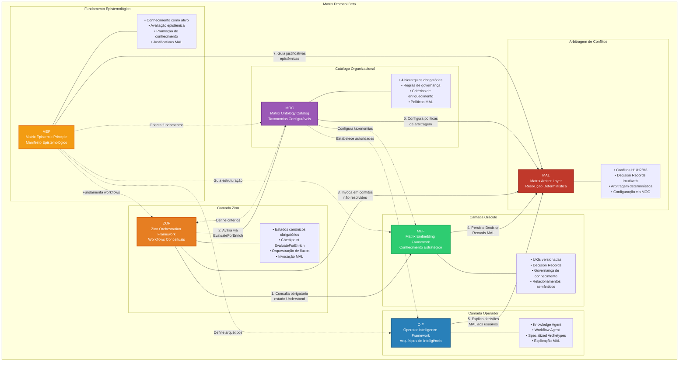
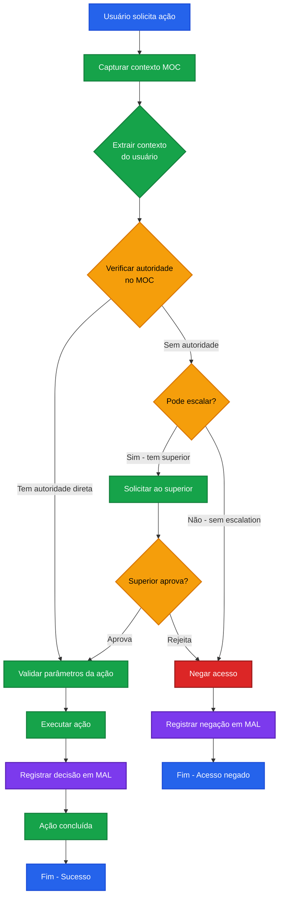

# Matrix Protocol — Protocolo de Colaboração Humano-IA
**Acrônimo:** Matrix Protocol  
**Status:** Ativo  
**Versão:** Beta  
**Data:** 2025-01-25

> 🚨 **IMPORTANTE**: Este documento contém exemplos ilustrativos que **NÃO são taxonomias obrigatórias**. Todas as taxonomias são configuráveis via MOC organizacional.

> "Há momentos em que uma escolha se apresenta, silenciosa, à beira do desconhecido. Algumas portas nos convidam a atravessá-las — e, ao fazê-lo, nada volta a ser como antes." — Morpheus

---

## 1. Introdução

O **Protocolo Matrix** é um ecossistema integrado que conecta humanos e IA por meio de três camadas interdependentes: **Oráculo**, **Zion** e **Operador**.

Cada camada desempenha um papel único no fluxo estratégico, técnico e operacional, garantindo que diretrizes sejam transformadas em ações práticas com eficiência e inteligência.

O Protocolo Matrix estabelece a base conceitual e técnica para colaboração estruturada entre humanos e inteligência artificial, proporcionando governança, rastreabilidade e adaptabilidade organizacional.

### Arquitetura de Frameworks Matrix Protocol



---

## 2. Termos e Definições

- **Camada Oráculo**: Núcleo de conhecimento estratégico implementado via MEF
- **Camada Zion**: Framework conceitual de workflows implementado via ZOF  
- **Camada Operador**: Framework de arquétipos de inteligência implementado via OIF
- **UKI**: Units of Knowledge Interlinked - unidades básicas do conhecimento estruturado
- **EvaluateForEnrich**: Checkpoint obrigatório para avaliação de enriquecimento de conhecimento
- **Estados Canônicos**: Sequência universal de estados em workflows ZOF

Referências adicionais no **MOC (Matrix Ontology Catalog)** para taxonomias organizacionais específicas.

---

## 3. Conceitos Centrais

### Flexibilidade Local com Coerência Global

O Protocolo Matrix separa **conceitos centrais universais** de **taxonomias organizacionais específicas** seguindo o **MEP (Matrix Epistemic Principle)**:

#### Conceitos Universais (Fixos)
- **Estados Canônicos**: Intake → Understand → Decide → Act → EvaluateForEnrich → Review → Enrich
- **Checkpoints Obrigatórios**: EvaluateForEnrich como ponto de avaliação condicional
- **Campos Estruturais**: scope_ref, domain_ref, type_ref, maturity_ref (referências, não valores)
- **Relacionamentos Semânticos**: Tipos de relação entre UKIs (implements, depends_on, extends, etc.)

#### Hierarquias Locais (Configuráveis via MOC)
- **Catálogo Semântico**: Cada organização define sua estrutura hierárquica no **MOC (Matrix Ontology Catalog)**
- **Taxonomias Organizacionais**: Domínios, tipos, escopos e níveis de maturidade específicos
- **Regras de Governança**: Autoridades, visibilidade e propagação definidas por contexto
- **Critérios de Enriquecimento**: Parâmetros do EvaluateForEnrich adaptáveis ao contexto organizacional

#### Interoperabilidade Semântica
- **Conceitos Compartilháveis**: Conhecimento pode ser exportado entre organizações mantendo estrutura universal
- **Tradutibilidade**: MOCs diferentes podem mapear conceitos equivalentes
- **Coerência Global**: Mesmos princípios fundamentais independente da configuração local

### Fundamentos Epistemológicos
O Protocolo Matrix é orientado pelo **MEP (Matrix Epistemic Principle)** — um manifesto epistemológico que estabelece como o conhecimento é tratado, avaliado e promovido no ecossistema.

---

## 4. Regras Normativas

> ⚠️ Esta seção é **normativa**.

### Arquitetura Obrigatória de Três Camadas
Implementações DEVEM incluir:
1. **Camada Oráculo**: DEVE implementar governança estratégica via MEF
2. **Camada Zion**: DEVE implementar workflows conceituais via ZOF
3. **Camada Operador**: DEVE implementar arquétipos de inteligência via OIF

### Camada de Arbitragem Obrigatória
Implementações DEVEM incluir:
- **MAL (Matrix Arbiter Layer)**: DEVE gerenciar arbitragem de conflitos e concorrência quando regras de governança locais não conseguem resolver disputas
- Engines DEVEM invocar MAL em conflitos não resolvidos (H1/H2/H3) após checkpoint EvaluateForEnrich
- Decisões MAL DEVEM ser persistidas como Decision Records imutáveis via MEF
- Explicações MAL DEVEM ser delegadas ao OIF para comunicação com usuários

### Estados Canônicos Obrigatórios
Todos os workflows ZOF DEVEM seguir a sequência:
- **Intake**: Captura de contexto e requisitos
- **Understand**: Consulta obrigatória ao Oráculo (UKIs)
- **Decide**: Decisão baseada em conhecimento existente
- **Act**: Execução da ação planejada
- **EvaluateForEnrich**: Checkpoint obrigatório de avaliação
- **Review**: Validação opcional do resultado
- **Enrich**: Enriquecimento condicional do Oráculo

### Checkpoint EvaluateForEnrich
- DEVE ser aplicado em todos os workflows
- DEVE consultar critérios definidos no MOC organizacional
- DEVE gerar justificativa epistemológica para decisões
- DEVE respeitar autoridades e escopos do MOC

### Integração MOC Obrigatória
- Todos os *_ref fields DEVEM referenciar nós MOC válidos
- Filtragem de conhecimento DEVE respeitar hierarquias MOC
- Validações de autoridade DEVEM ser baseadas no MOC

---

## 5. Interoperabilidade

- **MEF (Matrix Embedding Framework)**: Implementa a Camada Oráculo com estruturação de conhecimento versionado; persiste Decision Records MAL
- **ZOF (Zion Orchestration Framework)**: Implementa a Camada Zion com workflows conceituais independentes de tecnologia; invoca MAL para resolução de conflitos
- **OIF (Operator Intelligence Framework)**: Implementa a Camada Operador com arquétipos de inteligência cientes de governança; explica decisões de arbitragem MAL
- **MOC (Matrix Ontology Catalog)**: Fornece taxonomias organizacionais configuráveis para todas as camadas; configura políticas de arbitragem MAL
- **MEP (Matrix Epistemic Principle)**: Estabelece fundamentos epistemológicos para todo o protocolo; guia justificativas epistêmicas MAL
- **MAL (Matrix Arbiter Layer)**: Fornece arbitragem determinística de conflitos e concorrência quando governança local falha; invocada pelo ZOF; persistida pelo MEF; explicada pelo OIF; configurada pelo MOC; alinhada ao MEP

---

## 6. Convenções e Exemplos

Todos os exemplos neste documento são **meramente ilustrativos** e não definem comportamento normativo.  
A semântica normativa (escopos, governança, arquétipos, critérios de enriquecimento) é sempre derivada do **MOC (Matrix Ontology Catalog)** de cada organização.  
Os exemplos são fornecidos para fins de clareza e PODEM ser adaptados aos contextos locais, mas NÃO DEVEM ser tratados como obrigações no nível do protocolo.

---

## 7. Exemplos Ilustrativos (Apêndice)

> **Exemplo (Informativo, Dependente do MOC)**

### **Camada Oráculo - Governança Estratégica**
```yaml
# --- Exemplo Ilustrativo ---
# Função: Núcleo de sabedoria do Protocolo Matrix
oracle_responsibilities:
  governance_strategic:
    - "Definir diretrizes através de UKIs de domínios estratégicos"
    - "Estabelecer métricas de colaboração humano-IA"
    - "Criar UKIs de decisão para alinhamentos estratégicos"
    - "Garantir versionamento e rastreabilidade"
  
  knowledge_base:
    - "Implementar governança através de UKIs versionadas"
    - "Estruturar Knowledge Sources governados"
    - "Garantir rastreabilidade via relacionamentos semânticos"
    - "Criar ciclos de governança MEF baseados no MOC"
```

### **Camada Zion - Framework Conceitual de Workflows**
```yaml
# --- Exemplo Ilustrativo ---
# Estados Canônicos ZOF
canonical_states_flow:
  sequence: "Intake → Understand → Decide → Act → EvaluateForEnrich → Review → Enrich"
  
  mandatory_checkpoint: "EvaluateForEnrich"
  checkpoint_criteria: "consulta critérios definidos no MOC organizacional"
  
  events_canonical:
    - "knowledge.added"
    - "work.proposed"
    - "work.refine.requested"
    - "assistance.requested"
    - "test.authored"
    - "feedback.submitted"

# Exemplo Prático: Implementação de Autenticação
authentication_flow:
  event: "work.proposed - Nova necessidade de autenticação JWT"
  intake: "Captura história e contexto, organiza requisitos"
  understand: "Consulta uki:technical:pattern:jwt-authentication, uki:business:rule:security-requirements"
  decide: "Escolhe biblioteca baseada em uki:business:policy:vendor-approval"
  act: "Implementa solução usando ferramentas da equipe"
  evaluate: "Avalia critérios MOC (relevância=alta, reusabilidade=média) → aprovado escopo team"
  review: "Validação seguindo uki:culture:guideline:code-review-process"
  enrich: "Cria uki:technical:example:auth-implementation e uki:technical:pattern:token-refresh"
```

### **Camada Operador - Framework de Inteligência**
```yaml
# --- Exemplo Ilustrativo ---
# Arquétipos de Inteligência OIF
intelligence_archetypes:
  knowledge_agent:
    specialization: "compreensão, organização e relacionamento de conhecimento MEF"
    moc_integration: "controle de acesso baseado em hierarquias organizacionais"
  
  workflow_agent:
    specialization: "orquestração de fluxos conceituais ZOF"
    checkpoint_execution: "execução do EvaluateForEnrich com critérios MOC"
  
  specialized_archetypes:
    creation_method: "metodologia para inteligências customizadas por domínio"
    authority_levels: "definidos pelo MOC organizacional"

# Exemplo de Implementação JWT via OIF
jwt_implementation_oif:
  user_context: "Desenvolvedor com MOC scope='team', domain_access=['technical']"
  workflow_agent: "inicia orquestração work.proposed, valida autoridade via MOC"
  understand_state: "Workflow Agent solicita Knowledge Agent com filtros MOC"
  knowledge_agent: "retorna UKIs acessíveis: uki:technical:pattern:jwt-standard (scope=team)"
  evaluate_state: "aplica critérios MOC e determina enrichment scope=team"
  enrich_state: "Knowledge Agent cria UKIs com scope_ref=team, respeitando MOC"
```

### **Integração MEF com Protocolo Matrix**
```yaml
# --- Exemplo Ilustrativo ---
# MEF como Implementação da Camada Oráculo
mef_oracle_implementation:
  knowledge_structuring: "UKIs fornecem formato padronizado"
  semantic_versioning: "evolução controlada com rastreabilidade"
  domain_organization: "domínios organizacionais estruturam conhecimento"
  validation_framework: "verificação automática de conformidade"
  relationship_mapping: "conexões semânticas para navegação inteligente"

# Ciclo de Vida MEF no Protocolo Matrix
lifecycle_flow:
  1: "Oráculo: Criar UKI"
  2: "Validação MEF"
  3: "Knowledge Sources"
  4: "Zion: Consulta Semântica"
  5: "Operador: Aplicar Conhecimento"
  6: "Feedback para Oráculo"
  7: "Evolução da UKI"
  8: "Avaliação de Promoção (local vs amplo)"
```

### **Ordem Operacional para Consultas Oracle**
```yaml
# --- Exemplo Ilustrativo ---
mandatory_operational_sequence:
  1: "Contexto MOC: Identificar hierarquia, autoridades e escopo via MOC"
  2: "Filtragem de Pertinência: Aplicar regras de visibilidade baseadas no contexto"
  3: "Validação de Autoridade: Verificar autoridade para domínios/tipos solicitados"
  4: "Filtragem por Escopo: Aplicar restrições de escopo conforme MOC"
  5: "Consulta ao Oráculo: Executar busca semântica no subconjunto autorizado"

important: "A filtragem SEMPRE precede a consulta, nunca o contrário"
```

### **Fluxo de Validação de Autoridade**

O protocolo implementa um sistema determinístico de validação de autoridade baseado no contexto MOC organizacional:



#### Componentes da Validação

1. **Contexto MOC**: Identifica hierarquia, escopo e domínios do usuário
2. **Autoridade Direta**: Verificação imediata via `scope_ref` e `domain_ref`
3. **Escalation Path**: Definido pela hierarquia organizacional no MOC
4. **Registro MAL**: Todas as decisões são auditadas via Decision Records
5. **Feedback Loop**: Resultados alimentam refinamento de políticas

#### Critérios de Autoridade

- **scope_ref**: Define alcance organizacional (individual → team → department → company)
- **domain_ref**: Especifica domínios de conhecimento acessíveis
- **maturity_ref**: Determina nível de validação necessário
- **type_ref**: Controla tipos de ação permitidos

### **Benefícios do Framework**
```yaml
# --- Exemplo Ilustrativo ---
organizational_benefits:
  architecture: "Camadas bem definidas para responsabilidades diferentes"
  standardized_knowledge: "MEF garante representação consistente com flexibilidade MOC"
  conceptual_workflows: "ZOF orienta como pensar fluxos orientados a IA"
  agent_specifications: "OIF define arquétipos cientes de governança"
  local_flexibility: "MOC permite adaptação preservando conceitos globais"
  technology_independence: "Flexibilidade de ferramentas mantendo consistência conceitual"
  complete_traceability: "Relacionamentos semânticos com transparência de governança"
  adaptive_governance: "Regras configuradas por contexto organizacional"
  scalable_implementation: "De equipes individuais à adoção empresarial"
  ai_ready_structure: "Construída para sistemas inteligentes"
  evolutionary_design: "Melhoria contínua via EvaluateForEnrich"
```

**O Despertar na Matrix**
> "A resposta está aí, te procurando. E vai te encontrar, se você quiser." — Trinity

O momento da escolha chegou.
Você **cruzou camadas**, **decifrou códigos** e agora está diante da porta.
O próximo passo **só pode ser dado por você**.

**A Matrix está pronta para ser reprogramada.** **Você está pronto para descobrir até onde vai a toca do coelho?**

---

## 8. Referências Cruzadas

- [Matrix Protocol Glossary](glossary)
- [MEF — Matrix Embedding Framework](frameworks/mef)  
- [ZOF — Zion Orchestration Framework](frameworks/zof)  
- [OIF — Operator Intelligence Framework](frameworks/oif)  
- [MOC — Matrix Ontology Catalog](frameworks/moc)  
- [MEP — Matrix Epistemic Principle](mep)  
- [MAL — Matrix Arbiter Layer](frameworks/mal)  
