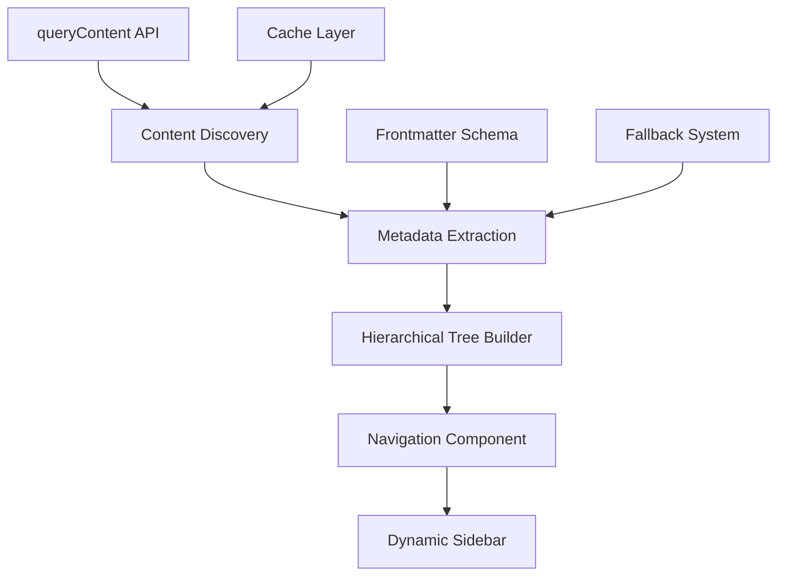

# 🚀 **PROJETO: NAVEGAÇÃO DINÂMICA - VISÃO GERAL**

## 📋 **CONTEXTO DO PROBLEMA**

### **Estado Atual**
O sistema de navegação em `app/composables/useDocsNavigation.ts` utiliza uma abordagem **hardcoded** e **não escalável**:

```typescript
// ❌ PROBLEMA: Estrutura fixa nas linhas 119-210
const navigation = [
  {
    title: t('docs.sections.quickstart'),
    path: `/docs/quickstart`,
    icon: 'i-heroicons-rocket-launch'
  },
  {
    title: t('docs.sections.frameworks'),
    path: `/docs/frameworks`,
    icon: 'i-heroicons-cube',
    children: [
      // ❌ Lista fixa de 5 frameworks hardcoded
      { title: t('docs.frameworks.mef'), path: `/docs/frameworks/mef` },
      { title: t('docs.frameworks.zof'), path: `/docs/frameworks/zof` },
      // ... mais 3 itens fixos
    ]
  },
  // ❌ Mais 7 seções hardcoded...
]
```

### **Limitações Identificadas**
- ✗ Cada nova seção precisa ser **manualmente adicionada** no código
- ✗ Frameworks limitados a **5 itens fixos** (MEF, ZOF, OIF, MOC, MAL)
- ✗ Apenas seção "examples" usa descoberta dinâmica (linha 214)
- ✗ **Manutenção custosa** para evolução da documentação
- ✗ **Escalabilidade limitada** para novos conteúdos

## 🎯 **OBJETIVO DA SOLUÇÃO**

### **Transformação Desejada**
Substituir o sistema atual por uma **navegação completamente dinâmica** que:

✅ **Descubra automaticamente** a estrutura do `/content`  
✅ **Gere hierarquia** baseada em arquivos/pastas reais  
✅ **Adicione novos conteúdos** sem editar código  
✅ **Funcione como Docusaurus** (autodescoberta inteligente)  
✅ **Mantenha performance** e compatibilidade  

### **Arquitetura da Solução**


## 📁 **ESTRUTURA DE CONTEÚDO ATUAL**

### **Análise do `/content`**
```
content/
├── pt/docs/
│   ├── frameworks/ (7 arquivos .md)
│   │   ├── index.md
│   │   ├── mal.md, mef.md, moc.md, oif.md, zof.md
│   │   └── mef-ontology.md
│   ├── manual/ (estrutura complexa com subpastas)
│   │   ├── templates/ (6 subpastas + arquivos)
│   │   ├── examples/ (2 arquivos)
│   │   ├── reference/ (2 arquivos)
│   │   └── tools/ (2 arquivos)
│   ├── examples/ (hierarquia profunda)
│   │   └── knowledge/ (estrutura complexa + YAML files)
│   └── [outras 6 seções]
└── en/docs/ (estrutura similar)
```

### **Oportunidades Identificadas**
- 📁 **Estrutura rica** já existente para descoberta automática
- 📄 **Metadados disponíveis** em frontmatter dos arquivos `.md`
- 🔄 **Padrão consolidado** entre versões PT/EN
- ⚡ **Function `buildDynamicChildren`** já implementada (parcialmente)

## 🛠️ **STACK TECNOLÓGICO**

### **Ferramentas Principais**
- **Nuxt Content v3.x**: `queryCollection()`, `where()`, `all()`
- **Nuxt UI v3.x**: Componentes de navegação
- **Context7**: Documentação e melhores práticas
- **Vue 3 + TypeScript**: Composables e reatividade

### **APIs Chave Utilizadas**
```typescript
// Nuxt Content v3.x - Discovery API
const content = await queryCollection(locale)
  .where('path', 'LIKE', `${basePath}/%`)
  .all()

// Metadados do Frontmatter
interface ContentMeta {
  title: string
  description?: string
  order?: number
  icon?: string
  category?: string
}
```

## 📊 **MÉTRICAS DE SUCESSO**

### **Técnicas**
- ✅ **Performance**: Lighthouse ≥ 90 (mantido)
- ✅ **Bundle Size**: ≤ atual + 5KB
- ✅ **Loading Time**: Navegação ≤ 200ms
- ✅ **Test Coverage**: ≥ 90%

### **Funcionais**
- ✅ **Descoberta Automática**: 100% das seções descobertas
- ✅ **Multilingual**: Paridade PT/EN completa
- ✅ **Escalabilidade**: Adição de novo conteúdo sem código
- ✅ **Maintenance**: Zero intervenção manual para novos arquivos

### **Experiência**
- ✅ **Usabilidade**: Navegação idêntica à atual
- ✅ **Acessibilidade**: WCAG AA mantido
- ✅ **Responsividade**: Funcionamento em todos breakpoints

## 🗓️ **CRONOGRAMA EXECUTIVO**

### **Sprint 1 (2 semanas)** - *Descoberta e Preparação*
- Auditoria completa da estrutura atual
- Padronização de metadados
- Protótipo do composable de descoberta

### **Sprint 2 (2 semanas)** - *API Core*
- Implementação do `useContentDiscovery.ts`
- Sistema de fallbacks para metadados
- Navegação dinâmica funcional

### **Sprint 3 (2 semanas)** - *Integração e Validação*
- Feature flags para migração gradual
- Testes automatizados completos
- Performance validada e lançamento

## 🎯 **PRÓXIMOS PASSOS**

1. **Executar Sprint Planning** para Sprint 1
2. **Iniciar auditoria** da estrutura de conteúdo atual
3. **Definir schema** de metadados padronizado
4. **Implementar protótipo** do sistema de descoberta

---

**📍 Status Atual**: Projeto iniciado - Aguardando execução do Sprint 1  
**🔄 Última Atualização**: Criação do documento base  
**👥 Equipe**: 5 agents especializados prontos para execução