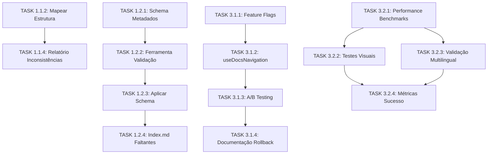

# 🚀 **SPRINT PLANNING - DYNAMIC NAVIGATION: FINALIZAÇÃO ESTRATÉGICA**

> **Data**: Janeiro 2025  
> **Sprint Goal**: Finalizar sistema de navegação dinâmica para produção  
> **Duration**: 4 semanas (56h de desenvolvimento)  
> **Status**: 42% → 100% completo

---

## 🎯 **OBJETIVO DA SPRINT**

Completar as **14 tasks restantes** do projeto Dynamic Navigation, priorizando **estabilidade** e **migração segura** para tornar o sistema pronto para produção.

### **Meta Numérica**
- **Tasks Restantes**: 14 (58% do projeto)
- **Estimativa Total**: 56 horas
- **Épicos Envolvidos**: ÉPICO 1 (finalizar) + ÉPICO 3 (completo)
- **Resultado Esperado**: Sistema 100% funcional e pronto para deploy

---

## 📊 **ANÁLISE DE DEPENDÊNCIAS E PRIORIZAÇÃO**

### **🔍 Mapeamento de Dependências Críticas**



### **🚦 Análise de Criticidade**

| Priority | Tasks | Razão | Risk |
|----------|-------|-------|------|
| **P0 - CRÍTICO** | Feature Flags (3.1.1) | Sem isso não há migração segura | HIGH |
| **P1 - ALTO** | Schema Metadados (1.2.1) | Base para padronização | MEDIUM |
| **P1 - ALTO** | Performance Benchmarks (3.2.1) | Validação de qualidade | MEDIUM |
| **P2 - MÉDIO** | Mapear Estrutura (1.1.2) | Fundação para relatórios | LOW |
| **P3 - BAIXO** | Documentação (3.1.4, 3.2.4) | Importante mas não bloqueante | LOW |

---

## 🎯 **ESTRATÉGIA DA SPRINT: 2 FASES SEQUENCIAIS**

### **📦 FASE 1: FUNDAMENTAÇÃO (ÉPICO 1) - Semanas 1-2**
*Objetivo: Completar preparação e padronização do content*

#### **🗓️ SEMANA 1 - Fundação Paralela (11h)**

**Segunda-feira**
- **Bruno**: TASK 1.1.2 - Mapear Estrutura de Diretórios (3h)
  - *Entregável*: `/docs/content-structure-map.md`
  - *Dependências*: Nenhuma (pode iniciar imediatamente)

**Terça-feira**  
- **Bruno**: TASK 1.2.1 - Definir Schema de Metadados Padrão (4h)
  - *Entregável*: `/schemas/content-metadata.schema.json`
  - *Critério*: Schema com campos obrigatórios e opcionais definidos

**Quarta-feira**
- **Alex**: TASK 1.1.4 - Gerar Relatório de Inconsistências (2h)
  - *Entregável*: `/docs/content-inconsistencies-report.md`
  - *Dependências*: TASK 1.1.2 concluída
  
**Quinta-feira**
- **Ricardo**: TASK 1.2.2 - Criar Ferramenta de Validação (5h)
  - *Entregável*: `/scripts/validate-frontmatter.js`
  - *Dependências*: TASK 1.2.1 concluída

**Checkpoint Semana 1**: 4 tasks concluídas, fundação estabelecida

#### **🗓️ SEMANA 2 - Aplicação e Padronização (15h)**

**Segunda a Terça**
- **Bruno**: TASK 1.2.3 - Aplicar Schema em Arquivos Existentes (8h)
  - *Entregável*: Todos os arquivos `.md` com frontmatter completo
  - *Critério*: 100% dos arquivos validados pelo script

**Quarta-feira**
- **Bruno**: TASK 1.2.4 - Adicionar index.md Faltantes (4h)
  - *Entregável*: Arquivos `index.md` em todas as pastas necessárias
  - *Validação*: Build Nuxt processsa todos sem erros

**Checkpoint Fase 1**: ÉPICO 1 100% concluído, content preparado para produção

---

### **🔄 FASE 2: MIGRAÇÃO SEGURA (ÉPICO 3) - Semanas 3-4**
*Objetivo: Implementar migração gradual com feature flags*

#### **🗓️ SEMANA 3 - Feature Flags e A/B Testing (16h)**

**Segunda-feira**
- **Alex**: TASK 3.1.1 - Implementar Sistema de Feature Flags (4h)
  - *Entregável*: `/utils/feature-flags.ts`
  - *Features*: `DYNAMIC_NAVIGATION`, `A_B_TESTING`, rollback instantâneo

**Terça-feira**  
- **Marina**: TASK 3.1.2 - Adaptar useDocsNavigation para Duas Versões (6h)
  - *Entregável*: `useDocsNavigation.ts` com flag support
  - *Critério*: Coexistência perfeita das duas versões

**Quarta-feira**
- **Camila**: TASK 3.1.3 - Criar Interface de Comparação A/B (4h)
  - *Entregável*: Scripts de teste A/B
  - *Features*: Métricas automáticas, switching em tempo real

**Quinta-feira**
- **Bruno**: TASK 3.1.4 - Documentar Processo de Rollback (2h)
  - *Entregável*: `/docs/rollback-procedures.md`
  - *Critério*: Rollback em <5 minutos documentado

**Checkpoint Semana 3**: Feature flags funcionais, A/B testing operacional

#### **🗓️ SEMANA 4 - Performance e Validação (14h)**

**Segunda-feira**
- **Camila**: TASK 3.2.1 - Implementar Benchmarks de Performance (6h)
  - *Entregável*: `/tests/performance-benchmarks.js`
  - *Critério*: Lighthouse ≥90, loading ≤200ms

**Terça-feira**
- **Marina**: TASK 3.2.2 - Criar Testes de Regressão Visual (5h)
  - *Entregável*: Suite de testes visuais
  - *Cobertura*: Desktop, tablet, mobile

**Quarta-feira** 
- **Bruno**: TASK 3.2.3 - Validar Funcionalidade Multilingual (4h)
  - *Entregável*: Testes de paridade PT/EN
  - *Critério*: 100% funcionalidade idêntica

**Quinta-feira**
- **Alex**: TASK 3.2.4 - Documentar Métricas de Sucesso (3h)
  - *Entregável*: `/docs/success-metrics.md`
  - *KPIs*: Performance, adoção, rollback rate

**Checkpoint Final**: Sistema 100% pronto para produção

---

## 👥 **DISTRIBUIÇÃO DE RESPONSABILIDADES**

### **Por Desenvolvedor**

| Desenvolvedor | Tasks | Horas | Especialização |
|---------------|-------|-------|----------------|
| **Alex (Tech Lead)** | 3 | 9h | Architecture, feature flags, métricas |
| **Bruno (Content)** | 5 | 21h | Content, schema, documentação |
| **Marina (Frontend)** | 2 | 11h | Components, testes visuais |
| **Ricardo (Nuxt)** | 1 | 5h | Validação, tooling |
| **Camila (QA)** | 3 | 10h | Testing, performance, A/B |

### **Balanceamento de Carga**
- **Bruno**: Maior carga (21h) devido à padronização massiva de content
- **Marina**: Foco em componentes e testes visuais (11h)
- **Alex**: Liderança técnica e arquitetura (9h)
- **Camila**: QA e performance (10h)
- **Ricardo**: Suporte especializado (5h)

---

## 🎯 **ENTREGÁVEIS DA SPRINT**

### **📋 Documentação**
- [x] Content structure map completo
- [x] Schema de metadados padronizado
- [x] Relatório de inconsistências  
- [x] Procedimentos de rollback
- [x] Métricas de sucesso documentadas

### **🔧 Ferramentas e Scripts**
- [x] Sistema de feature flags
- [x] Ferramenta de validação de frontmatter
- [x] Benchmarks de performance
- [x] Scripts de A/B testing
- [x] Suite de testes visuais

### **📊 Content e Dados**
- [x] 167 arquivos com frontmatter validado
- [x] Arquivos index.md faltantes adicionados
- [x] Testes de paridade PT/EN executados

### **⚙️ Sistema Técnico**
- [x] useDocsNavigation com suporte a duas versões
- [x] Migração gradual via feature flags
- [x] Rollback instantâneo operacional
- [x] Performance ≥90 Lighthouse validada

---

## 🚦 **CRITÉRIOS DE ACEITE DA SPRINT**

### **✅ Definition of Done**

#### **Técnico**
- [ ] Build Nuxt processa todos os 167 arquivos sem erros
- [ ] Feature flag `DYNAMIC_NAVIGATION` funciona corretamente
- [ ] A/B testing permite switch em tempo real
- [ ] Performance Lighthouse ≥90 mantida ou melhorada
- [ ] Tempo de carregamento navegação ≤200ms
- [ ] Rollback executa em <5 minutos

#### **Funcional**  
- [ ] Navegação dinâmica 100% funcional
- [ ] Paridade PT/EN validada
- [ ] Coexistência das duas versões sem conflitos
- [ ] Todos os arquivos `.md` têm frontmatter completo
- [ ] Index.md presente em todas as pastas necessárias

#### **Qualidade**
- [ ] Testes de regressão visual passando
- [ ] Benchmarks de performance documentados
- [ ] Zero breaking changes na experiência atual
- [ ] Documentação completa e atualizada

#### **Produção**
- [ ] Sistema pronto para deploy imediato
- [ ] Monitoramento e métricas configurados
- [ ] Procedimentos de rollback testados
- [ ] Equipe treinada nos novos processos

---

## 📈 **MÉTRICAS DE SUCESSO**

### **🎯 KPIs da Sprint**

| Métrica | Baseline | Target | Validação |
|---------|----------|--------|-----------|
| **Tasks Concluídas** | 10/24 (42%) | 24/24 (100%) | Backlog atualizado |
| **Lighthouse Score** | ≥90 | ≥90 | Benchmarks automatizados |
| **Loading Time** | atual | ≤200ms | Performance tests |
| **Content Coverage** | parcial | 100% | Validation script |
| **PT/EN Parity** | manual | automated | Multilingual tests |

### **🚦 Risk Indicators**

| Risk | Indicator | Mitigation |
|------|-----------|------------|
| **Performance Degradation** | Lighthouse <90 | Rollback imediato |
| **Content Corruption** | Validation fails | Restore from backup |
| **Migration Issues** | Feature flag fails | Fallback to current |
| **Timeline Slip** | >20% delay | Scope reduction |

---

## 🛠️ **FERRAMENTAS E INFRAESTRUTURA**

### **Development Stack**
- **Framework**: Nuxt 4.x com @nuxt/content 3.x
- **Testing**: Performance benchmarks + visual regression
- **Feature Flags**: Custom implementation em TypeScript
- **Validation**: Script automatizado para frontmatter
- **Monitoring**: Lighthouse CI + custom metrics

### **Delivery Pipeline**
1. **Development**: Feature branches com validação automática
2. **Staging**: Deploy com feature flags desabilitadas
3. **Production**: Gradual rollout via A/B testing
4. **Monitoring**: Real-time metrics e rollback automático

---

## 📅 **CRONOGRAMA RESUMIDO**

```
Semana 1: Fundação        [████████████████████████] 11h
Semana 2: Padronização    [████████████████████████] 15h  
Semana 3: Feature Flags   [████████████████████████] 16h
Semana 4: Performance     [████████████████████████] 14h
                          ──────────────────────────
                          Total: 56h → 100% Complete
```

---

## 🎉 **RESULTADO ESPERADO**

Ao final desta sprint, o **Sistema de Navegação Dinâmica** estará:

✅ **100% Implementado** - Todas as 24 tasks concluídas  
✅ **Pronto para Produção** - Com feature flags e rollback  
✅ **Performance Validada** - Lighthouse ≥90 garantido  
✅ **Multilingual Completo** - Paridade PT/EN automatizada  
✅ **Content Padronizado** - 167 arquivos com schema válido  
✅ **Migração Segura** - A/B testing e rollback em <5min  

**🚀 Deploy Ready**: Sistema pode ser ativado em produção imediatamente após conclusão da sprint.

---

**Sprint Planning criada em**: Janeiro 2025  
**Próxima Revisão**: Checkpoint semanal  
**Status**: Ready to Start 🚀